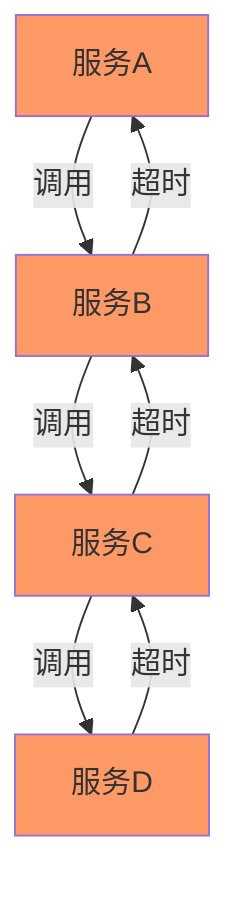
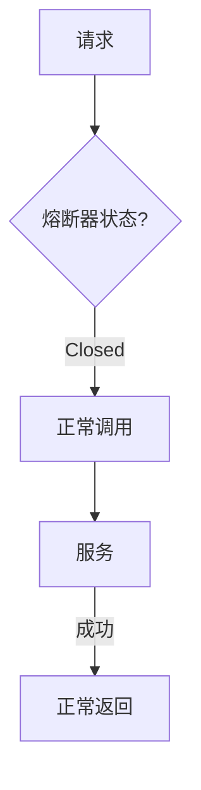
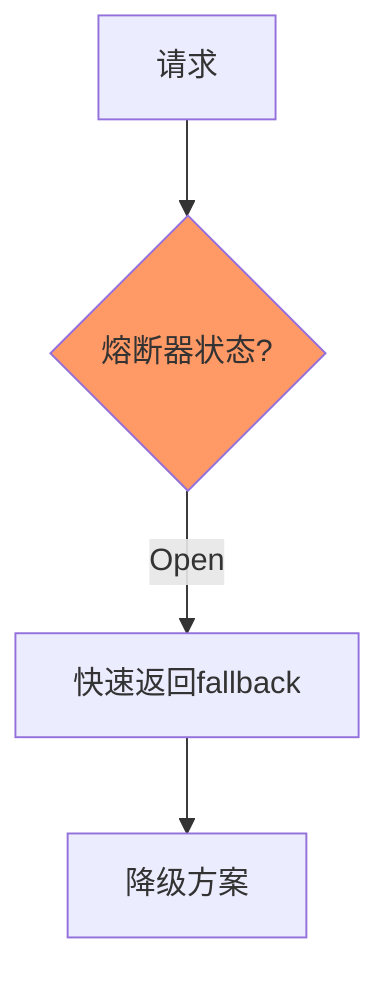
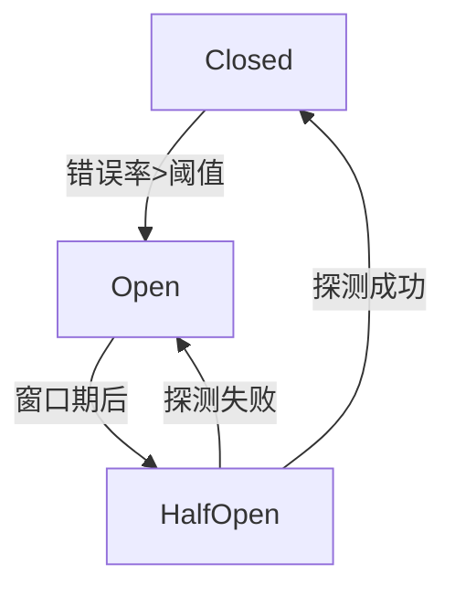
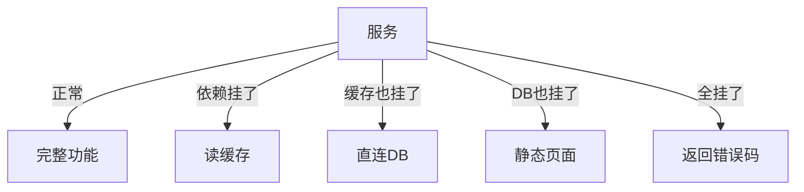

# 熔断机制与降级策略

> **一句话摘要**：熔断是「自动切断故障链」——当下游故障时快速失败，防止级联雪崩；降级是「主动放弃非核心功能」——保住核心链路。
> **本文核心**：**熔断 = 三态切换 + 恢复探测；降级 = 功能取舍 + 兜底方案**。

前置阅读：[限流算法深度解析](./1_限流算法深度解析-特性.md)。熔断是流量治理的另一面——限流控制进入量，熔断切断故障链。

## 1. 背景：为什么需要熔断

微服务调用链中，一个服务故障可能导致连锁反应：



这就是**雪崩效应**——一个服务挂了，所有依赖它的服务都跟着挂。

熔断的作用：当检测到下游故障时，快速切断调用链，让下游有时间恢复。

## 2. 核心机制：熔断三态

### 2.1 关闭状态（Closed）

正常状态，请求正常通过：



### 2.2 打开状态（Open）

故障时快速失败，不调用下游：



**触发条件**：
- 连续 N 次超时/错误
- 错误率超过阈值（如 50%）
- 响应时间超过阈值（如 5s）

### 2.3 半开状态（Half-Open）

恢复探测：允许少量请求通过，验证下游是否恢复：

```mermaid
sequenceDiagram
    Open[熔断器: Open] -->|等待窗口期| Half[熔断器: Half-Open]
    Half -->|允许1个请求| S[下游服务]
    S -->|成功| Close[熔断器: Closed]
    S -->|失败| Open2[熔断器: Open]
```

**窗口期**：通常 30-60 秒后进入半开状态。

### 2.4 三态转换图



## 3. 落地实践：Sentinel 熔断配置

```java
// 熔断配置
@SentinelResource(value = "order", 
    fallback = "orderFallback",        // 熔断/限流降级
    blockHandler = "blockHandler",      // 限流降级
    exceptionsToIgnore = {IllegalArgumentException.class} // 异常不触发熔断
)
public String createOrder() { ... }

public String orderFallback(Throwable ex) {
    return "服务繁忙，请稍后重试"; // 降级方案
}

public String blockHandler(BlockException ex) {
    return "请求过多，请稍后重试"; // 限流降级
}
```

**Sentinel 熔断策略**：

| 策略 | 参数 | 适用场景 |
|---|---|---|
| 慢调用比例 | RT + 比例 | 响应慢但不报错 |
| 异常比例 | 错误率阈值 | 服务异常 |
| 异常数 | 错误数阈值 | 短时间内大量错误 |

## 4. 落地实践：降级方案设计

降级分两种：

### 4.1 主动降级

系统设计时就准备好的降级方案：

| 功能 | 降级方案 | 影响 |
|---|---|---|
| 推荐列表 | 返回缓存列表 | 不精确但可用 |
| 商品详情 | 返回基本信息 | 缺少评价和库存 |
| 搜索 | 返回热门搜索 | 不精确 |
| 个性化 | 返回默认排序 | 不个性化 |

### 4.2 被动降级

运行时临时触发的降级：

- 数据库挂了 → 读缓存
- 缓存挂了 → 直连数据库（降级为降级模式）
- 所有依赖都挂了 → 返回静态页面



## 5. 落地实践：Resilience4j 配置

```java
// Resilience4j 熔断配置
CircuitBreakerConfig config = CircuitBreakerConfig.custom()
    .failureRateThreshold(50)           // 错误率阈值 50%
    .waitDurationInOpenState(Duration.ofMillis(5000))  // 5秒窗口期
    .slidingWindowType(SlidingWindowType.COUNT_BASED)
    .slidingWindowSize(10)              // 10次请求为窗口
    .build();

CircuitBreaker cb = CircuitBreaker.of("orderService", config);

// 使用
Supplier<String> result = CircuitBreaker.decorateSupplier(cb, () -> orderService.create());
String response = Try.ofSupplier(result)
    .recover(ex -> "服务繁忙，请稍后重试")
    .get();
```

## 6. 生产视角：熔断踩坑

- **踩坑 1**：熔断阈值太灵敏——正常波动触发熔断，频繁开关
- **踩坑 2**：窗口期太短——刚恢复又被打断
- **踩坑 3**：熔断后没有降级方案——熔断返回的不是用户可接受的内容
- **踩坑 4**：熔断和重试冲突——重试和熔断互相干扰

**生产最佳实践**：

1. 错误率阈值 = 50%（一半失败就熔断）
2. 窗口期 = 60 秒（足够恢复）
3. 降级方案必须提前设计（不能临时想）
4. 熔断 + 重试配合（重试在熔断关闭后）
5. 监控熔断事件（记录每次熔断）

## 7. 典型场景

| 场景 | 熔断策略 | 降级方案 |
|---|---|---|
| 下游服务超时 | 慢调用熔断 | 返回缓存数据 |
| 下游服务报错 | 异常比例熔断 | 返回默认数据 |
| 大促流量高峰 | 异常数熔断 | 限流 + 排队 |
| 数据库故障 | 异常比例熔断 | 读缓存 |
| 第三方API | 慢调用熔断 | 跳过第三方 |

## 8. 与相邻概念的区别

- **熔断 vs 限流**：限流「控制进入量」，熔断「切断故障链」
- **熔断 vs 超时**：超时是「单次等待时间」，熔断是「连续失败后的策略」
- **熔断 vs 降级**：熔断是「自动止损」，降级是「主动放弃」
- **Sentinel vs Resilience4j**：Sentinel 是流量治理全组件，Resilience4j 是轻量级熔断库

## 9. 你们可能会问

- **熔断和重试能一起用吗？** 能——熔断关闭后允许重试，打开时禁止重试。
- **半开状态探测多少次？** 通常 1 次成功就关闭，1 次失败就继续打开。
- **熔断器能手动控制吗？** 能——Sentinel 支持手动切换状态（全开/关闭）。
- **熔断后如何优雅恢复？** 半开探测 → 少量成功 → 关闭 → 恢复正常流量。

## 10. 一句话总结 + 5W 速记卡 + 自测三问

**一句话总结**：熔断 = 三态切换（关→开→半开）+ 降级方案——快速失败，防止雪崩。

**5W 速记卡**：

| 维度 | 内容 |
|---|---|
| What | 熔断三态：关闭/打开/半开 |
| Why | 防止级联雪崩 |
| When | 下游故障时 |
| Where | 所有依赖调用 |
| How | 错误率阈值 → 打开 → 窗口期 → 半开探测 → 恢复 |

**自测三问**：

1. 你的熔断阈值是多少？为什么？
2. 你的降级方案是什么？用户能接受吗？
3. 熔断恢复时的半开探测策略是什么？

---

**下篇预告**：灰度发布的完整流程——[灰度发布全流程](./3_灰度发布全流程-特性.md)。

**🎯 核心带走**：

- **核心一句话**：熔断三态切换 + 降级方案 = 防止雪崩的双重保险
- **链条复述**：错误累积 → 熔断打开 → 快速失败 → 窗口期 → 半开探测 → 恢复
- **失效点与边界**：阈值过灵敏导致频繁开关；无降级方案则熔断无意义

💡 **实战提示**：先设计降级方案，再配熔断规则——没有降级方案的熔断是空壳。

**开放问题**：熔断和限流同时存在时，哪个优先级更高？答案是：限流是「预防性」的，熔断是「反应性」的——两者互补，限流先触发但不断开，熔断后触发但直接断开。

**决策（何时用）**：所有依赖外部服务的调用必须有熔断；熔断必须有降级方案；窗口期 ≥ 30 秒。
