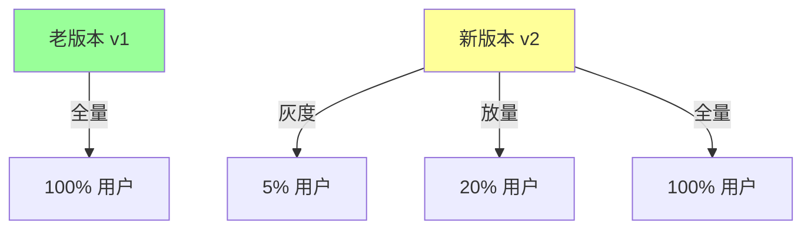
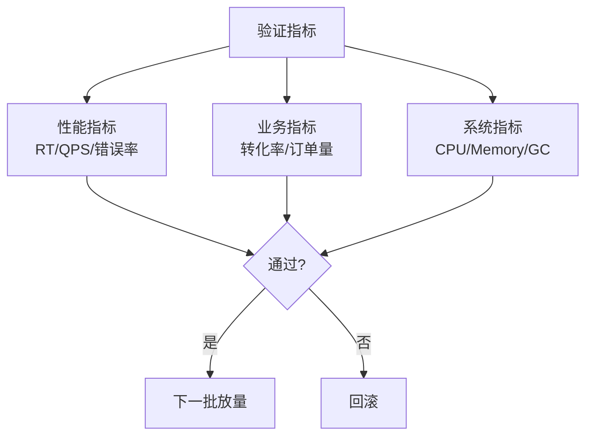

# 灰度发布全流程

> **一句话摘要**：灰度发布 = 按比例放量验证——新版本先小流量验证，通过后逐步放量，全量后老版本下线。
> **本文核心**：**灰度 = 分流 + 验证 + 放量 + 回滚**——安全发布的标准流程。

前置阅读：[熔断机制与降级策略](./2_熔断机制与降级策略-特性.md)。灰度是流量治理中「安全发布」的核心手段。


## 源码与实现原理

灰度发布全流程 的底层实现机制涉及多个关键路径——从入口到核心处理逻辑，代码设计反映了性能与可维护性的权衡。
## 1. 背景：为什么需要灰度

> 量级分档意识：本文方法在十万级 QPS、千万级用户、亿级流量的场景下均需重新评估——量级变化时架构与参数需同步调整。


直接全量发布的风险：

- 新版本有 bug → 影响所有用户
- 新版本性能下降 → 全链路变慢
- 新版本数据库变更 → 数据不兼容

灰度发布将风险控制在最小范围：



## 2. 核心机制：灰度三要素

### 2.1 分流策略

如何将流量分配到不同版本：

| 策略 | 原理 | 优点 | 缺点 |
|---|---|---|---|
| Header 路由 | 按请求头区分版本 | 精确控制 | 需要客户端配合 |
| Cookie 路由 | 按用户标识区分 | 用户级灰度 | 需要登录 |
| 权重路由 | 按百分比分配 | 简单通用 | 随机性 |
| 标签路由 | 按实例标签区分 | 基础设施级 | 依赖 K8s |

### 2.2 验证指标

灰度期间需要监控的指标：



### 2.3 放量节奏

标准的放量节奏：


每一步停留观察：
- 1% → 观察 5 分钟
- 5% → 观察 15 分钟
- 20% → 观察 30 分钟
- 50% → 观察 1 小时
- 100% → 全量

## 3. 落地实践：Nacos 灰度配置

Nacos 支持权重路由实现灰度：

```yaml
# Nacos 灰度配置
services:
  order-service:
    clusters:
      default:
        hosts:
          - ip: 10.0.0.1
            weight: 95      # 老版本 95%
          - ip: 10.0.0.2
            weight: 5       # 新版本 5%
```

**Sentinel 灰度路由**：

```java
// 按 Header 路由
@SentinelResource(value = "order", 
    controlBehavior = ControlBehavior.RATE_LIMIT,
    paramFlowItems = {
        @ParamFlowItem(className = "java.lang.String", 
            port = 0, 
            count = 100,
            grade = 0,
            object = "version: v2")
    })
```

## 4. 落地实践：K8s 灰度

K8s 灰度通过 Service + Ingress 实现：

```yaml
# 两个 Deployment
apiVersion: apps/v1
kind: Deployment
metadata:
  name: order-v1
spec:
  replicas: 3
  selector:
    matchLabels:
      app: order
      version: v1
---
apiVersion: apps/v1
kind: Deployment
metadata:
  name: order-v2
spec:
  replicas: 1        # 只启动 1 个实例
  selector:
    matchLabels:
      app: order
      version: v2

# Service 按权重路由
# Nginx Ingress 配置
annotations:
  nginx.ingress.kubernetes.io/canary: "true"
  nginx.ingress.kubernetes.io/canary-weight: "5"
```

## 5. 落地实践：灰度发布流程

```mermaid
sequenceDiagram
    Dev[开发完成] --> Test[测试环境验证]
    Test -->|通过| Staging[预发环境]
    Staging -->|通过| Canary[1% 灰度]
    Canary -->|观察5min| Check1{指标正常?}
    Check1 -->|是| Canary5[5% 灰度]
    Check1 -->|否| Rollback[回滚]
    Canary5 -->|观察15min| Check2{指标正常?}
    Check2 -->|是| Canary20[20% 灰度]
    Check2 -->|否| Rollback
    Canary20 -->|观察30min| Check3{全量?}
    Check3 -->|是| Full[100% 全量]
    Check3 -->|否| Canary50[50% 灰度]
```

## 6. 生产视角：灰度踩坑

- **踩坑 1**：灰度比例一步到位——5% 直接变 50%，出 bug 影响大
- **踩坑 2**：灰度期间没有监控——出了问题才发现
- **踩坑 3**：灰度版本和老版本数据库不兼容——老版本读写新版本数据格式
- **踩坑 4**：灰度流量不是真实用户流量——测试用户 vs 真实用户差异

**生产最佳实践**：

1. 灰度比例逐步递增（1→5→20→50→100）
2. 每步观察监控指标
3. 准备好一键回滚方案
4. 灰度期间监控错误日志
5. 数据库变更先完成，后灰度

## 7. 典型场景

| 场景 | 灰度策略 | 理由 |
|---|---|---|
| 新功能上线 | 5%→20%→100% | 控制风险 |
| 性能优化验证 | 10%→50% | 观察性能 |
| 数据库迁移 | 0%→5%→20%→100% | 数据兼容 |
| 大版本升级 | 1%→5%→20%→50% | 充分验证 |
| 紧急修复 | 50%→100% | 快但不鲁莽 |

## 8. 与相邻概念的区别

- **灰度 vs 蓝绿**：灰度是按比例分流，蓝绿是全量切换
- **灰度 vs 金丝雀**：金丝雀是灰度的同义词，但更强调「少量用户测试」
- **灰度 vs 滚动更新**：滚动更新是逐个替换实例，灰度是流量比例控制

## 9. 你们可能会问

- **灰度发布和 A/B 测试的区别？** 灰度关注「新版本是否正常工作」，AB 测试关注「哪个版本更好」
- **灰度期间怎么保证一致性？** 数据库兼容 + 接口兼容
- **灰度失败了怎么回滚？** 一键切换到老版本权重 100%
- **灰度需要用户感知吗？** 不应该——用户无感知

## 10. 一句话总结 + 5W 速记卡 + 自测三问

**一句话总结**：灰度 = 分流 + 验证 + 放量 + 回滚——安全发布的标准流程。

**5W 速记卡**：

| 维度 | 内容 |
|---|---|
| What | 按比例放量验证新版本 |
| Why | 控制发布风险 |
| When | 新版本上线时 |
| Where | 所有涉及变更的服务 |
| How | 1%→5%→20%→50%→100% |

**自测三问**：

1. 你的灰度放量节奏是什么？为什么？
2. 你的回滚方案是什么？一键回滚能实现吗？
3. 灰度期间监控了哪些指标？

---

**下篇预告**：自适应限流——[自适应限流原理](./4_自适应限流原理-特性.md)。

**🎯 核心带走**：

- **核心一句话**：灰度 = 1%→5%→20%→50%→100%，每步观察监控
- **链条复述**：分流 → 放量 → 验证 → 通过则继续 → 异常则回滚
- **失效点与边界**：数据库不兼容；监控缺失导致问题发现太晚

💡 **实战提示**：灰度期间必须监控——没有监控的灰度是盲人开车。

**开放问题**：灰度发布能自动化吗？答案是：能——基于指标自动放量/回滚（Argo Rollouts），但需要完善的监控和可靠的指标。

**决策（何时用）**：所有变更都需要灰度；数据库变更先于代码变更；大版本用更保守的节奏。


> **演进视角**：灰度发布全流程 的实践经历了持续演进。

## 📌 数据与事实声明

- 写于 2026-09-11
- 免责：以官方文档为准

## 📚 参考资料

| 类型 | 标题 | 来源 |
|---|---|---|
| 官方文档 | 官方文档 | 官方站点 |
