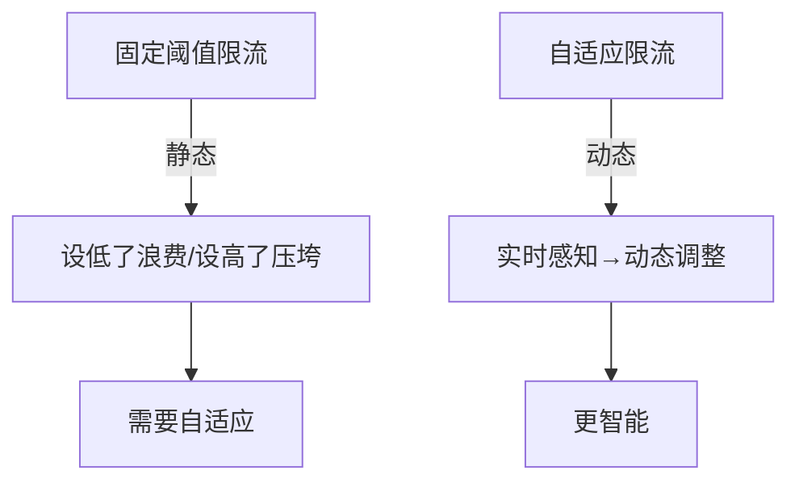
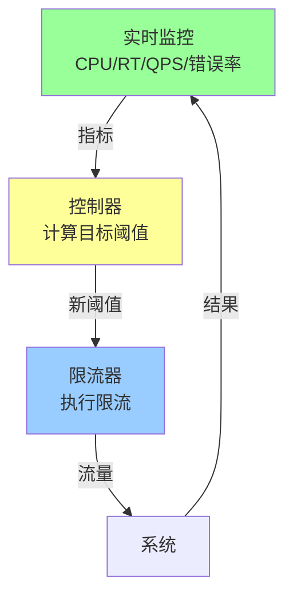
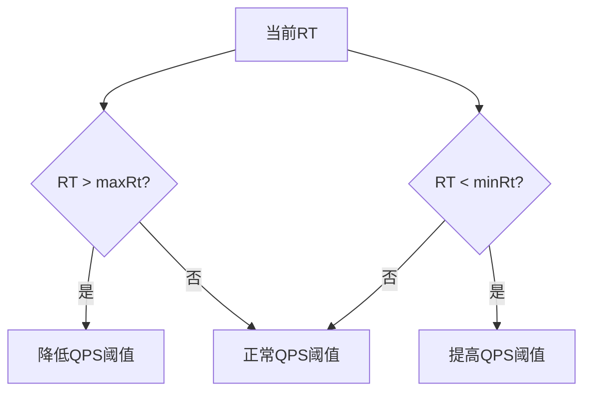
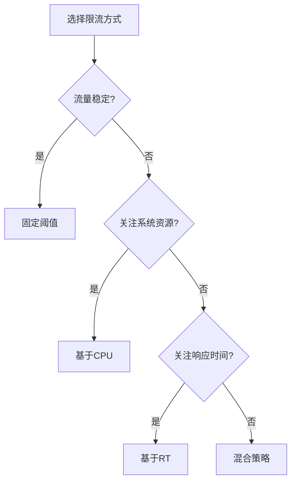

# 自适应限流原理

> **一句话摘要**：自适应限流 = 实时感知系统状态 + 动态调整阈值——与固定阈值限流不同，自适应让系统「自己决定」该限多少。
> **本文核心**：**自适应 = 实时指标 + 反馈控制 + 动态调优**。

前置阅读：[限流算法深度解析](./1_限流算法深度解析-特性.md)。自适应是固定阈值限流的进化——从「静态规则」到「动态调整」。

## 1. 背景：为什么需要自适应

固定阈值限流的问题：

- **阈值设低了**：正常流量被误杀，系统利用率低
- **阈值设高了**：突发流量超过阈值，系统被压垮
- **阈值不变**：流量模式变化时，旧阈值不再适用

自适应限流解决核心矛盾：**预设阈值无法适应动态变化的流量**。



## 2. 核心机制：反馈控制

### 2.1 控制回路

自适应限流的本质是一个反馈控制系统：



**控制回路四要素**：

| 要素 | 作用 | 示例 |
|---|---|---|
| 监控 | 采集指标 | CPU、RT、QPS |
| 控制器 | 计算目标 | PID/启发式 |
| 限流器 | 执行限制 | 令牌桶 |
| 反馈 | 调整参数 | QPS上升→阈值上升 |

### 2.2 自适应算法

常见自适应策略：

| 策略 | 原理 | 适用场景 |
|---|---|---|
| 基于 RT | RT 上升时降低阈值 | 服务变慢 |
| 基于 CPU | CPU 上升时降低阈值 | 系统过载 |
| 基于 QPS | QPS 上升时提高阈值 | 流量增长 |
| 混合 | 多指标综合 | 最复杂但最精确 |

**PID 控制器**：

```
输出 = Kp × 误差 + Ki × 积分 + Kd × 微分
```

- P（比例）：当前误差的比例——即时反应
- I（积分）：历史误差累积——消除稳态误差
- D（微分）：误差变化率——预判趋势

### 2.3 Sentinel 自适应限流

Sentinel 支持基于 RT 的自适应限流：

```java
// Sentinel 自适应配置
@SentinelResource(value = "order")
// 自动根据 RT 调整 QPS 阈值
// 阈值 = maxQps * (1 - (rt - minRt) / (maxRt - minRt))
```

**Sentinel 自适应原理**：



## 3. 落地实践：自适应配置

```yaml
# Sentinel 自适应限流配置
rules:
  - resource: /api/order
    grade: 1                    # QPS 模式
    count: 1000                 # 基础 QPS
    controlBehavior: 1          # 预热模式
    maxQueueingTimeMs: 500      # 最大排队时间
    statIntervalMs: 1000        # 统计窗口 1s
    adaptive:
      enabled: true             # 启用自适应
      targetRt: 200             # 目标 RT(ms)
      minRt: 50                 # 最小 RT
      maxRt: 500                # 最大 RT
```

**自适应 vs 固定阈值对比**：

| 维度 | 固定阈值 | 自适应 |
|---|---|---|
| 阈值 | 固定值 | 动态变化 |
| 适应性 | 差 | 强 |
| 复杂度 | 低 | 高 |
| 适用场景 | 稳定流量 | 变化流量 |
| 配置成本 | 需手动调整 | 自动调整 |

## 4. 落地实践：选择自适应策略



## 5. 生产视角：自适应踩坑

- **踩坑 1**：自适应参数调优不当——Kp 太大导致阈值剧烈波动
- **踩坑 2**：自适应和固定阈值叠加——两者冲突导致不可预期
- **踩坑 3**：监控指标延迟——指标采集有延迟，调整不及时
- **踩坑 4**：自适应导致阈值突降——大促时突然限流，影响用户体验

**生产最佳实践**：

1. 自适应 + 固定阈值上限（自适应不超过安全上限）
2. 监控指标间隔 ≤ 1 秒
3. Kp 调小（避免剧烈波动）
4. 大促时切固定阈值（可预期）
5. 记录自适应历史（用于调优）

## 6. 典型场景

| 场景 | 自适应策略 | 理由 |
|---|---|---|
| 大促流量波动 | 基于 QPS + RT | 流量突变时自适应 |
| 服务性能下降 | 基于 RT | 响应变慢时自动降流 |
| 系统资源紧张 | 基于 CPU | CPU 高时自动限流 |
| 混合负载 | 混合策略 | 最全面但最复杂 |

## 7. 与相邻概念的区别

- **自适应限流 vs 固定阈值**：动态 vs 静态
- **自适应限流 vs 弹性扩缩**：限流控制进入，扩缩增加容量
- **自适应限流 vs PID 控制**：PID 是算法基础，但限流是应用场景

## 8. 常见误区与不适用

- **「自适应一定更好」**：自适应增加复杂度，稳定场景用固定阈值
- **「自适应不需要调参」**：PID 参数需要调优
- **「自适应能完全替代人工」**：大促等极端场景仍需人工干预
- **不适用场景**：流量极稳定的场景

## 9. 你们可能会问

- **自适应限流和多级限流的关系？** 自适应是「动态调整阈值」，多级是「不同层级不同阈值」——可以结合。
- **Sentinel 的自适应是怎么实现的？** 基于 RT 的窗口统计，实时计算目标 QPS。
- **自适应限流能防止雪崩吗？** 能——但更准确的说法是「减轻雪崩」，熔断才是防止雪崩的主要手段。
- **自适应和熔断怎么配合？** 自适应控制正常流量，熔断处理异常——两者互补。

## 10. 一句话总结 + 5W 速记卡 + 自测三问

**一句话总结**：自适应限流 = 实时监控 + 反馈控制 + 动态调整——让系统自己决定该限多少。

**5W 速记卡**：

| 维度 | 内容 |
|---|---|
| What | 基于实时指标动态调整阈值 |
| Why | 固定阈值无法适应变化 |
| When | 流量波动时 |
| Where | 所有服务入口 |
| How | 监控 → 控制器 → 调整限流器 |

**自测三问**：

1. 你的系统用自适应还是固定阈值？
2. 自适应参数（Kp/Ki/Kd）调优过吗？
3. 自适应阈值波动大吗？

---

**下篇预告**：服务降级与容灾——[服务降级与容灾](./5_服务降级与容灾-特性.md)。

**🎯 核心带走**：

- **核心一句话**：自适应 = 实时指标 + PID 控制 + 动态阈值
- **链条复述**：监控 → 计算 → 调整 → 执行 → 再监控
- **失效点与边界**：参数调优不当；极端场景仍需人工

💡 **实战提示**：大促切固定阈值（可预期），日常用自适应（更精确）。

**开放问题**：自适应限流和机器学习的结合会怎样？答案是：ML 可以预测流量趋势，提前调整阈值——但需要大量训练数据。

**决策（何时用）**：流量波动大用自适应；流量稳定用固定阈值；大促用固定阈值 + 上限保护。
