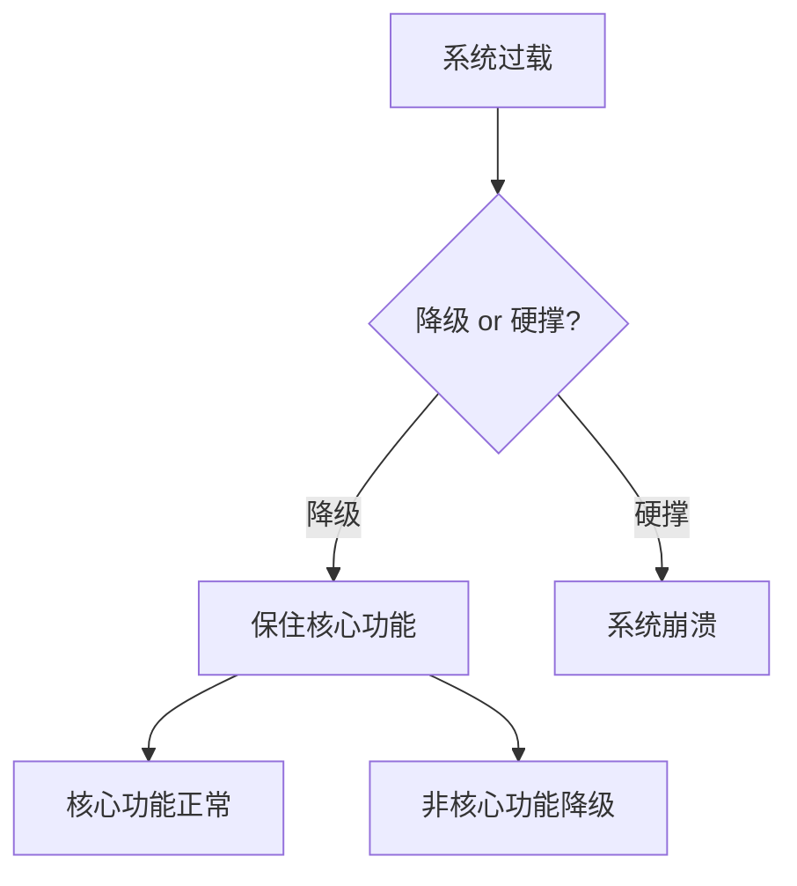
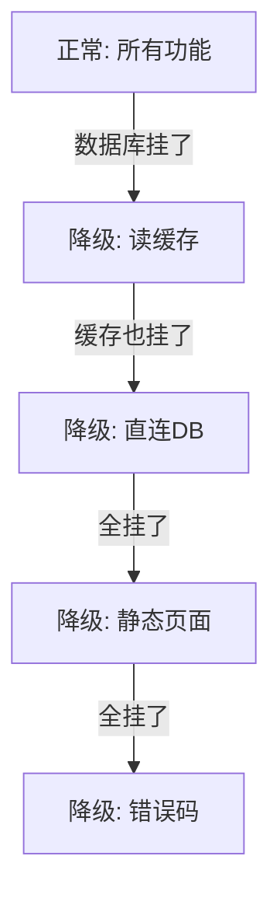
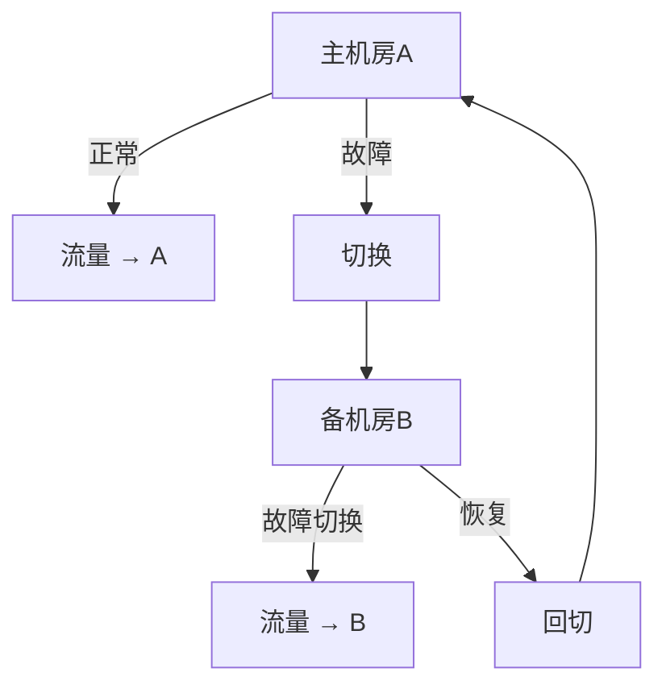

# 服务降级与容灾

> **一句话摘要**：降级是「主动放弃非核心功能」保住核心链路；容灾是「故障时快速切换」保证业务连续性——两者配合让系统从「能用」变成「韧性」。
> **本文核心**：**降级 = 功能取舍；容灾 = 故障切换**。

前置阅读：[自适应限流原理](./4_自适应限流原理-特性.md)。降级是限流熔断之后的最后一道防线。

## 1. 背景：为什么需要降级

> 量级分档意识：本文方法在十万级 QPS、千万级用户、亿级流量的场景下均需重新评估——量级变化时架构与参数需同步调整。


当系统负载超过处理能力时，有两种选择：

- **硬撑**：所有功能都处理 → 可能系统崩溃
- **降级**：放弃非核心功能 → 保住核心链路

降级是一种**有意识的取舍**：



**降级的本质**：用「功能完整性」换「系统可用性」——这是工程上的成熟决策。

## 2. 核心机制：两种降级

### 2.1 主动降级

系统设计时就准备好的降级方案：

| 功能 | 降级方案 | 用户影响 |
|---|---|---|
| 推荐列表 | 返回热门推荐 | 推荐不精准 |
| 商品评价 | 返回默认提示 | 看不到评价 |
| 个性化搜索 | 返回默认排序 | 不个性化 |
| 图片展示 | 返回占位图 | 图片不显示 |
| 实时导航 | 返回静态地图 | 不实时 |

### 2.2 被动降级

运行时临时触发的降级：



**降级层次**：

| 层次 | 降级策略 | 影响 |
|---|---|---|
| 功能级 | 关闭非核心功能 | 用户体验下降 |
| 数据级 | 读缓存代替实时查询 | 数据不及时 |
| 页面级 | 返回静态页面 | 交互丢失 |
| 系统级 | 返回错误码 | 服务不可用 |

### 2.3 容灾切换

当整个机房/区域故障时：



**容灾级别**：

| 级别 | 含义 | RTO | RPO |
|---|---|---|---|
| L1 同城双活 | 2 机房互备 | 分钟级 | 0 |
| L2 异地冷备 | 异地备用 | 小时级 | 分钟级 |
| L3 多地多活 | 3+ 机房互备 | 秒级 | 0 |

## 3. 落地实践：降级方案设计

### 3.1 降级开关

```java
// 降级开关配置
public class DegradeSwitch {
    private static final boolean DEGRADE_RECOMMEND = false;
    private static final boolean DEGRADE_REVIEW = false;
    
    public String getRecommendation() {
        if (DEGRADE_RECOMMEND) {
            return getHotRecommendations(); // 降级方案
        }
        return getPersonalizedRecommendations(); // 正常
    }
}
```

### 3.2 降级配置中心

```yaml
# Nacos 降级配置
degrade:
  recommend:
    enabled: false            # 是否降级
    fallback: "hot-recommendations"  # 降级方案
  review:
    enabled: true             # 降级中
    fallback: "default-review"
```

### 3.3 容灾切换配置

```yaml
# 容灾切换配置
disaster:
  primary: shanghai
  backup: shenzhen
  switch:
    trigger: cpu > 90%        # 触发条件
    method: dns-switch        # 切换方式
    recovery: auto            # 自动回切
```

## 4. 落地实践：Sentinel 降级

```java
// 降级回调
@SentinelResource(value = "order", fallback = "fallback")
public String createOrder() {
    return orderService.create();
}

public String fallback(Throwable ex) {
    return "服务繁忙，请稍后重试";
}

// 异常降级（区分异常类型）
@SentinelResource(value = "order", 
    fallback = "fallback",
    exceptionsToIgnore = {NullPointerException.class}
)
public String createOrder2() {
    return orderService.create();
}

// 快速失败（直接抛异常）
@SentinelResource(value = "order", blockHandler = "block")
public String createOrder3() {
    return orderService.create();
}
```

## 5. 生产视角：降级踩坑

- **踩坑 1**：降级方案没有测试——降级时返回的数据格式不对
- **踩坑 2**：降级开关忘记关闭——降级后忘记恢复，用户体验下降
- **踩坑 3**：降级影响了其他系统——降级导致的数据不一致
- **踩坑 4**：容灾切换后数据不一致——RPO > 0 导致数据丢失

**生产最佳实践**：

1. 降级方案需要测试验证
2. 降级开关放配置中心（动态控制）
3. 降级后监控恢复条件
4. 容灾切换后验证数据一致性
5. 定期演练降级和容灾切换

## 6. 典型场景

| 场景 | 降级方案 | 容灾方案 |
|---|---|---|
| 大促流量高峰 | 推荐/评价降级 | 扩容 |
| 数据库故障 | 读缓存降级 | 切换到备库 |
| 第三方API故障 | 跳过第三方 | 本地兜底 |
| 机房故障 | 全局降级 | 切换机房 |
| 缓存故障 | 直连DB | 多缓存 |

## 7. 与相邻概念的区别

- **降级 vs 熔断**：熔断是「自动切断」，降级是「主动放弃」
- **降级 vs 限流**：限流是「限制流量」，降级是「减少功能」
- **降级 vs 容灾**：降级是「功能取舍」，容灾是「故障切换」
- **RTO vs RPO**：RTO = 恢复时间目标，RPO = 恢复点目标（数据丢失量）

## 8. 常见误区与不适用

- **「降级就是不用」**：降级是「用降级方案」，不是「不用功能」
- **「降级不需要测试」**：降级方案必须测试，否则降级时数据不对
- **「容灾 = 备份」**：容灾需要切换流程，备份只是基础
- **不适用场景**：核心不可中断的功能（不能降级）

## 9. 你们可能会问

- **降级和熔断什么时候触发？** 熔断是错误率触发，降级是人工或预设条件触发
- **降级后如何恢复？** 监控指标恢复 → 手动/自动恢复降级开关
- **容灾切换后数据怎么同步？** 通过 binlog 同步或数据补偿
- **降级会影响数据一致性吗？** 可能——降级时数据可能不是最新的

## 10. 一句话总结 + 5W 速记卡 + 自测三问

**一句话总结**：降级是「放弃非核心保住核心」，容灾是「故障切换保证连续」。

**5W 速记卡**：

| 维度 | 内容 |
|---|---|
| What | 主动降级 + 被动降级 + 容灾切换 |
| Why | 保住核心功能，防止雪崩 |
| When | 系统过载/故障时 |
| Where | 所有非核心功能 |
| How | 降级开关 + 容灾预案 + 定期演练 |

**自测三问**：

1. 你的核心功能有哪些不能降级？
2. 你的降级方案测试过吗？
3. 你的容灾 RTO 和 RPO 是多少？

---

**下篇预告**：热点数据处理——[热点数据处理](./6_热点数据处理-特性.md)。

**🎯 核心带走**：

- **核心一句话**：降级保核心功能，容灾保业务连续性
- **链条复述**：过载 → 降级 → 保住核心 → 恢复 → 取消降级
- **失效点与边界**：降级后数据可能不一致；容灾有 RPO 损失

💡 **实战提示**：降级方案提前设计 + 测试验证 + 配置中心控制——这是降级的三步。

**开放问题**：降级和容灾能自动切换吗？答案是：降级可以自动（基于规则），容灾切换通常需要半自动或人工确认（避免误判）。

**决策（何时用）**：所有非核心功能都应有降级方案；关键系统需有容灾预案；定期演练。

## 📌 数据与事实声明

- 写于 2026-09-11
- 免责：以官方文档为准

## 📚 参考资料

| 类型 | 标题 | 来源 |
|---|---|---|
| 官方文档 | 官方文档 | 官方站点 |
