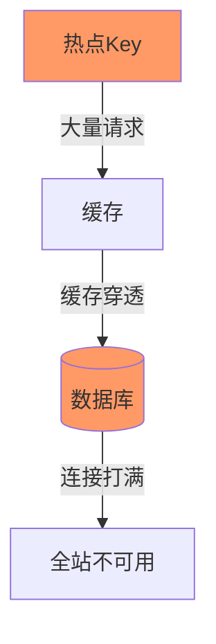

# 热点数据处理

> **一句话摘要**：热点数据 = 少数 Key 被大量访问——热点 Key 击穿缓存、打满数据库，需要特殊处理。
> **本文核心**：**热点 = Key 倾斜 + 解决方案**。

前置阅读：[服务降级与容灾](./5_服务降级与容灾-特性.md)。热点处理是限流之外的保护——限流保护系统整体，热点处理保护特定 Key。

## 1. 背景：什么是热点数据

热点数据是指少数被大量访问的数据：

- 秒杀商品的库存
- 热门新闻的详情页
- 明星用户的个人主页
- 大促活动的商品列表

热点数据的问题：



**热点 vs 正常流量**：

| 维度 | 正常 | 热点 |
|---|---|---|
| 分布 | 均匀 | 集中在少数 Key |
| QPS | 平均 | 集中在某几个 Key |
| 影响 | 系统整体负载 | 特定 Key 所在节点被打满 |

## 2. 核心机制：热点问题分类

### 2.1 热点读

某个 Key 被大量读取：

- **表现**：缓存未命中 → 大量请求打到数据库
- **原因**：热点数据 + 缓存过期同时发生

### 2.2 热点写

某个 Key 被大量更新：

- **表现**：数据库连接打满，锁竞争激烈
- **原因**：热点更新 + 并发写入

### 2.3 热点 Key 击穿

热点 Key 的缓存失效瞬间：

```mermaid
sequenceDiagram
    Cache[热点Key缓存] -->|过期| Miss[缓存未命中]
    Loop[10000请求同时到达]
        Request-->|查询缓存| Miss
        Miss-->|查数据库| DB
    end
    DB -->|连接满| Timeout
```

## 3. 落地实践：热点读解决方案

### 3.1 缓存预热

提前将热点数据加载到缓存：

```java
// 大促前预热
public void preheat() {
    List<String> hotKeys = getHotKeys();  // 获取热点Key列表
    for (String key : hotKeys) {
        cache.put(key, db.get(key));
    }
}
```

### 3.2 互斥锁（Mutex Key）

只有一个线程重建缓存：

```java
public String getData(String key) {
    String value = cache.get(key);
    if (value == null) {
        String lockKey = "lock:" + key;
        if (redis.setIfAbsent(lockKey, "1", 10秒)) {
            value = db.get(key);          // 查询数据库
            cache.put(key, value);          // 回写缓存
            redis.delete(lockKey);          // 释放锁
        } else {
            Thread.sleep(50);              // 等待
            return getData(key);           // 重试
        }
    }
    return value;
}
```

### 3.3 二级缓存

本地缓存 + 分布式缓存：

```mermaid
flowchart TD
    Req[请求] → L1[本地缓存]
    L1 -->|未命中| L2[分布式缓存]
    L2 -->|未命中| DB[数据库]
    L1 -->|命中| Return1[返回]
    L2 -->|命中| Return2[返回]
    
    style L1 fill:#9f9
    style L2 fill:#9cf
    style DB fill:#f99
```

### 3.4 请求合并

将多个请求合并为一个查询：

```java
// 请求合并
public String getData(String key) {
    return CacheLoader.get(key, k -> {
        return db.batchGet(Collections.singletonList(k)); // 批量查询
    });
}
```

## 4. 落地实践：热点写解决方案

### 4.1 异步写入

将同步写改为异步：

```java
public void updateData(String key, String value) {
    asyncExecutor.submit(() -> {
        db.update(key, value);
        cache.put(key, value);
    });
}
```

### 4.2 分片处理

将热点 Key 拆分为多个子 Key：

```java
// 原：key = "hot:product:1001"
// 拆分为：key = "hot:product:1001:shard:0/1/2/3"
// 读取时聚合所有分片
public int getStock(String productId) {
    int total = 0;
    for (int i = 0; i < 4; i++) {
        total += cache.get("hot:product:" + productId + ":shard:" + i);
    }
    return total;
}
```

### 4.3 限流 + 队列

对热点写入限流：

```java
// 热点写入限流
@SentinelResource(value = "hotWrite", blockHandler = "block")
public void write(String key, String value) {
    db.update(key, value);
}
```

## 5. 落地实践：Sentinel 热点参数限流

```java
// 热点参数限流：某个参数值（如商品ID）被限流
@SentinelResource(value = "product", blockHandler = "block")
public String getProduct(@ParamFlow String productId) {
    return productService.get(productId);
}
```

**热点参数限流配置**：

```yaml
# Sentinel 热点参数规则
param-flow:
  - resource: /api/product
    param-index: 0           # 第0个参数（productId）
    count: 100               # 每个热点Key的QPS阈值
    grade: 0                 # QPS模式
    duration: 1              # 统计窗口
```

## 6. 生产视角：热点踩坑

- **踩坑 1**：缓存未预热——大促时热点数据首次访问全部打到数据库
- **踩坑 2**：互斥锁失效——锁过期后多个线程同时重建缓存
- **踩坑 3**：二级缓存不一致——本地缓存和分布式缓存数据不同步
- **踩坑 4**：热点 Key 没有分片——所有流量集中在一个节点

**生产最佳实践**：

1. 大促前预热热点数据
2. 热点读 = 缓存预热 + 互斥锁 + 二级缓存
3. 热点写 = 异步 + 分片 + 限流
4. 监控热点 Key（SkyWalking）
5. 定期 review 热点 Key 列表

## 7. 典型场景

| 场景 | 解决方案 | 理由 |
|---|---|---|
| 秒杀商品 | 缓存预热 + 分片 | 高并发读 |
| 热门新闻 | 缓存预热 + 互斥锁 | 缓存失效时保护DB |
| 明星主页 | 二级缓存 | 分散压力 |
| 大促商品 | 热点参数限流 | 限制单个商品QPS |
| 实时排行榜 | 异步更新 | 写压力 |

## 8. 与相邻概念的区别

- **热点 vs 限流**：限流保护系统整体，热点处理保护特定 Key
- **热点 vs 缓存穿透**：热点是「Key 存在但访问量大」，穿透是「Key 不存在」
- **热点 vs 缓存击穿**：热点是持续高负载，击穿是缓存失效瞬间
- **热点 Key vs 正常 Key**：热点 Key 需要特殊处理策略

## 9. 你们可能会问

- **怎么发现热点 Key？** 监控 QPS 分布 → Top N Key
- **热点 Key 能避免吗？** 某些场景不可避免（秒杀），只能缓解
- **分片后数据一致吗？** 读取时需要聚合，写入时需要同步
- **热点参数限流和普通限流区别？** 按 Key 维度限流，不是全局 QPS

## 10. 一句话总结 + 5W 速记卡 + 自测三问

**一句话总结**：热点 = 少数 Key 承受大量请求——读用预热+锁，写用异步+分片。

**5W 速记卡**：

| 维度 | 内容 |
|---|---|
| What | 热点 Key 的读/写问题及解决方案 |
| Why | 少数 Key 大量访问导致系统瓶颈 |
| When | 大促/热门事件时 |
| Where | 所有高并发系统 |
| How | 预热+锁(读)/异步+分片(写) |

**自测三问**：

1. 你的系统有热点 Key 监控吗？
2. 你的热点读方案是什么？缓存预热了吗？
3. 你的热点写怎么处理的？分片了吗？

---

**下篇预告**：服务治理架构总结——[服务治理架构总结](./7_服务治理架构总结-特性.md)。

**🎯 核心带走**：

- **核心一句话**：热点读用预热+锁，热点写用异步+分片
- **链条复述**：发现热点 → 读/写策略 → 执行 → 监控
- **失效点与边界**：缓存预热不及时；分片后一致性问题

💡 **实战提示**：大促前必须预热热点数据——这是最简单也最有效的手段。

**开放问题**：热点 Key 能提前预测吗？答案是：能——基于历史数据的趋势分析可以预测大促热点。

**决策（何时用）**：读热点用缓存+锁；写热点用异步+分片；大促前必须预热。
