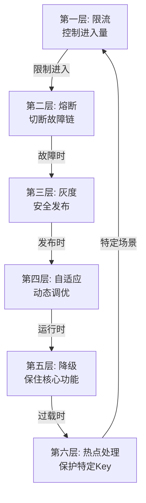
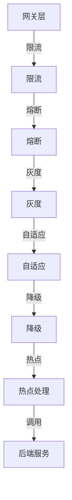
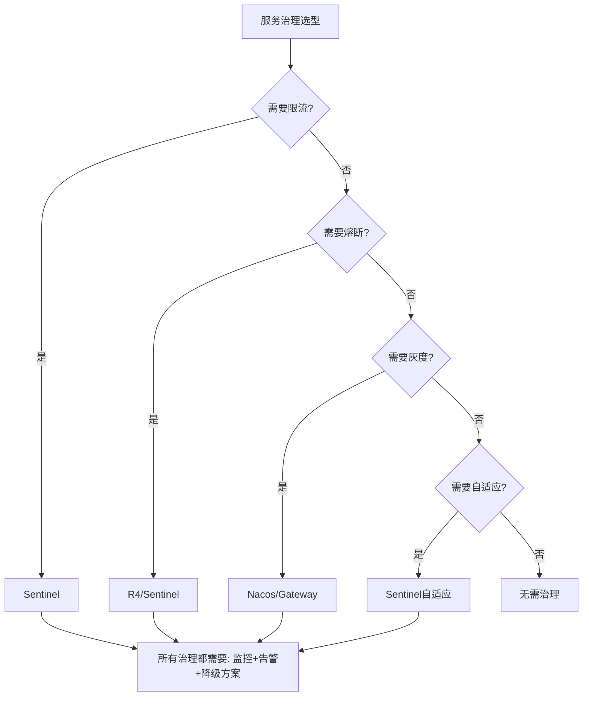

# 服务治理架构总结

> **一句话摘要**：服务治理 = 限流 + 熔断 + 灰度 + 自适应 + 降级 + 热点——六层防护让系统从「能跑」变成「能扛」。
> **本文核心**：**治理 = 管控 + 韧性 + 进化**。

前置阅读：本特性层系列 8 篇文章的收官之作。

## 1. 背景：为什么需要总结

> 量级分档意识：本文方法在十万级 QPS、千万级用户、亿级流量的场景下均需重新评估——量级变化时架构与参数需同步调整。


8 篇文章分别讲了服务治理的各个维度——限流算法、熔断、灰度、自适应、降级、热点。但真正落地时，需要把这些知识串起来：

- 限流保护进入量，熔断切断故障链，灰度安全发布
- 降级保住核心功能，自适应动态调优，热点保护特定 Key

治理的本质是**多层防护**：没有一层能解决所有问题。

## 2. 核心机制：六层防护



| 层级 | 职责 | 核心机制 | 代表组件 |
|---|---|---|---|
| 限流 | 控制进入量 | 令牌桶/漏桶/滑动窗口 | Sentinel |
| 熔断 | 切断故障链 | 三态切换 | Sentinel/R4 |
| 灰度 | 安全发布 | 权重/标签/Header | Nacos/Gateway |
| 自适应 | 动态调优 | PID/实时反馈 | Sentinel |
| 降级 | 保住核心功能 | 功能取舍 | 降级开关 |
| 热点 | 保护特定Key | 预热/锁/分片 | Sentinel |

## 3. 落地实践：治理架构设计

### 3.1 架构组合



### 3.2 配置清单

```yaml
# 完整治理配置
sentinel:
  limits:                       # 限流
    - resource: /api/order
      count: 1000
      controlBehavior: WARM_UP
  circuitBreaker:               # 熔断
    - resource: /api/order
      failureRateThreshold: 50
  degrade:                      # 降级
    - resource: /api/recommend
      fallback: "hot-recommendations"
  hot:                          # 热点
    - resource: /api/product
      param-index: 0
      count: 100
```

## 4. 落地实践：治理选型决策树



## 5. 典型场景完整方案

### 5.1 小团队快速起步

```
方案: Sentinel (限流+熔断+降级+热点) + Nacos (配置中心)
成本: 低
适用: <10 个服务，初创团队
```

### 5.2 中型生产环境

```
方案: Sentinel 集群 + Nacos 3节点 + SkyWalking + Prometheus
成本: 中
适用: 20-100 个服务
```

### 5.3 大型生产环境

```
方案: Sentinel + Service Mesh (Istio) + 多数据中心 + 全链路追踪
成本: 高
适用: 100+ 服务，大型团队
```

## 6. 生产视角：治理评审清单

架构评审时必须回答的问题：

1. **限流**：阈值怎么定的？预热模式吗？
2. **熔断**：错误率阈值？窗口期多长？
3. **灰度**：放量节奏？回滚方案？
4. **自适应**：用自适应还是固定阈值？
5. **降级**：哪些功能能降级？降级方案是什么？
6. **热点**：有热点 Key 监控吗？
7. **可观测**：traceId 传递了吗？监控覆盖了吗？
8. **演练**：降级和容灾演练过吗？

## 7. 与相邻概念的区别

- **服务治理 vs 服务发现**：发现管「在哪」，治理管「怎么管控」
- **服务治理 vs 配置管理**：治理管「运行时管控」，配置管「参数」
- **服务治理 vs 架构设计**：治理是「运行时保护」，设计是「架构层面」
- **Sentinel vs Service Mesh**：Sentinel 是应用层治理，Mesh 是基础设施层治理

## 8. 常见误区与不适用

- **「治理组件越多越好」**：够用就行——Sentinel 一个组件够大部分场景
- **「配置一次终身有效」**：治理规则需要持续调整
- **「降级不需要测试」**：降级方案必须测试
- **不适用场景**：单体系统（不需要复杂治理）

## 9. 你们可能会问

- **治理和架构的关系？** 治理是运行时的保护，架构是设计时的选择
- **Sentinel 和 K8s 的治理冲突吗？** 不冲突——Sentinel 在应用层，K8s 在基础设施层
- **治理能完全自动化吗？** 部分可以——降级和容灾切换可以自动，但策略调整通常需要人工
- **治理会影响性能吗？** 轻微——Sentinel 性能损耗 < 1%

## 10. 一句话总结 + 5W 速记卡 + 自测三问

**一句话总结**：服务治理 = 限流 + 熔断 + 灰度 + 自适应 + 降级 + 热点——六层防护。

**5W 速记卡**：

| 维度 | 内容 |
|---|---|
| What | 六层防护 |
| Why | 从「能跑」到「能扛」 |
| When | 微服务架构全生命周期 |
| Where | 所有微服务 |
| How | Sentinel + Nacos + 监控 |

**自测三问**：

1. 你的架构评审时，治理方案回答了哪几问？
2. 你的降级方案测试过吗？
3. 你的治理规则配置在配置中心吗？

---

**特性层完结**：从限流算法到热点处理的完整治理知识图谱已建立。

**🎯 核心带走**：

- **核心一句话**：六层防护 = 限流+熔断+灰度+自适应+降级+热点
- **链条复述**：限流(进入) → 熔断(故障) → 灰度(发布) → 自适应(调优) → 降级(取舍) → 热点(保护)
- **失效点与边界**：每层都有失效场景，需要多层配合

💡 **实战提示**：Sentinel 一个组件覆盖大部分治理需求——够用就好，不贪多。

**开放问题**：治理规则能基于 AI 自动调整吗？答案是：能——基于历史数据的 ML 模型可以预测和调整阈值，但需要时间和数据积累。

**决策（何时用）**：所有微服务必须有限流；依赖下游必须有熔断；发版必须灰度。

## 📌 数据与事实声明

- 写于 2026-09-11
- 免责：以官方文档为准

## 📚 参考资料

| 类型 | 标题 | 来源 |
|---|---|---|
| 官方文档 | 官方文档 | 官方站点 |
