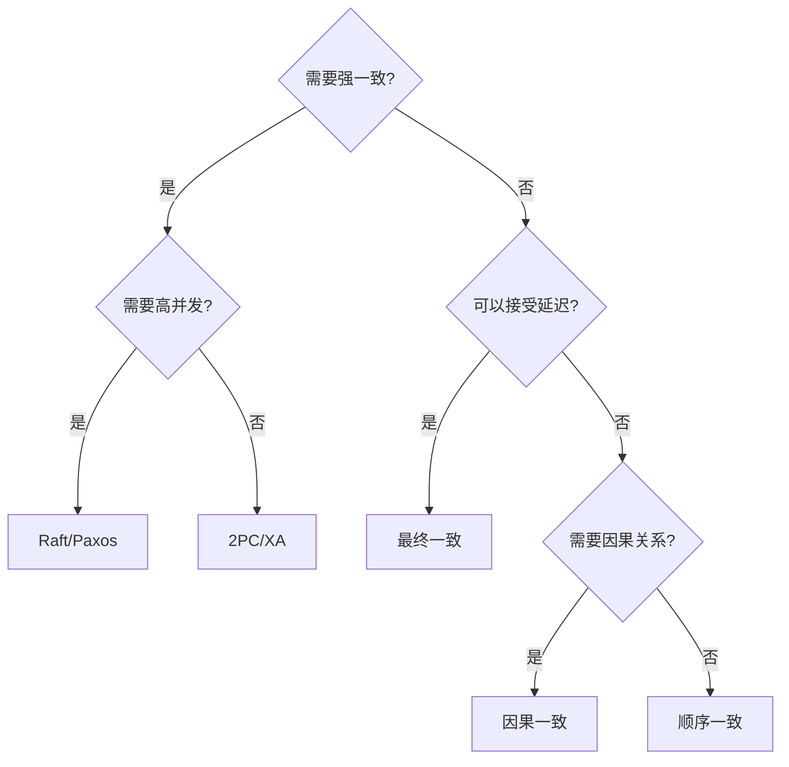
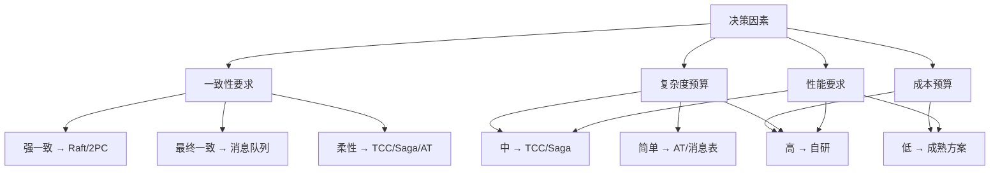
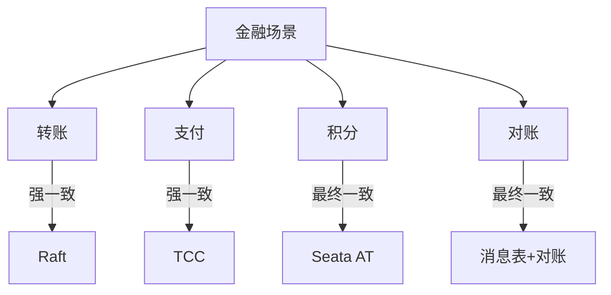

# 一致性方案选型

> **一句话摘要**：选型 = 需求 → 一致性级别 → 实现方案——没有最好的方案，只有最合适的。
> **本文核心**：**选型 = 业务需求 × 技术约束 × 成本**。

前置阅读：[一致性模型深挖](./2_一致性模型深挖-特性.md)。选型是在理解一致性模型后，根据业务需求做出决策。

## 1. 背景：为什么需要选型

> 量级分档意识：本文方法在十万级 QPS、千万级用户、亿级流量的场景下均需重新评估——量级变化时架构与参数需同步调整。

理论懂了，但实际项目中怎么选？

- 银行转账：必须强一致 → 线性一致
- 社交点赞：可以延迟 → 最终一致
- 库存扣减：需要保证顺序 → 顺序一致

选型是理论和实践的桥梁。

## 2. 核心机制：选型决策树

### 2.1 强一致场景

| 场景 | 方案 | 理由 |
|---|---|---|
| 银行转账 | Raft | 实时准确 |
| 分布式锁 | Raft | 锁状态必须实时 |
| 配置中心 | Raft | 配置不能有分歧 |
| 数据库主从 | Raft | 数据一致 |

### 2.2 最终一致场景

| 场景 | 方案 | 理由 |
|---|---|---|
| 社交点赞 | 消息队列+异步 | 允许延迟 |
| 购物车 | 本地缓存+异步同步 | 允许延迟 |
| 推荐列表 | 异步更新 | 允许延迟 |
| CDN 缓存 | 定时同步 | 允许延迟 |

### 2.3 柔性一致场景

| 场景 | 方案 | 理由 |
|---|---|---|
| 电商下单 | Saga | 长流程 |
| 订单支付 | TCC | 短事务 |
| 积分变动 | AT | 非核心 |

## 3. 落地实践：选型清单

### 3.1 决策矩阵

### 3.2 选型检查清单

1. **业务需求**：
   - 数据能容忍多长时间不一致？
   - 并发量多大？
   - 是核心业务还是非核心？

2. **技术约束**：
   - 团队有分布式经验吗？
   - 现有技术栈支持什么？
   - 有运维能力吗？

3. **成本预算**：
   - 开发时间？
   - 运维成本？
   - 学习成本？

## 4. 落地实践：金融场景选型

**金融场景选型原则**：
- 资金类：强一致
- 非资金类：最终一致
- 中间类：TCC/AT

## 5. 生产视角：选型踩坑

- **踩坑 1**：选型过强——用强一致处理最终一致场景，性能差
- **踩坑 2**：选型过弱——用最终一致处理强一致场景，数据错误
- **踩坑 3**：选型不考虑扩展——未来业务变化后无法调整
- **踩坑 4**：选型只看理论——不考虑实际运维能力

**生产最佳实践**：

1. 先评估业务需求的一致性要求
2. 选型要考虑未来 2-3 年的扩展
3. 混合使用多种方案
4. 文档中明确记录选型理由
5. 定期 review 选型是否还适用

## 6. 典型场景

| 场景 | 选型 | 理由 |
|---|---|---|
| 银行核心 | Raft | 资金安全 |
| 电商下单 | Saga | 长流程 |
| 社交应用 | 最终一致 | 允许延迟 |
| 配置管理 | Raft | 配置一致 |
| 订单支付 | TCC | 短事务+强一致 |
| 积分系统 | AT | 非核心+简单 |

## 7. 与相邻概念的区别

- **选型 vs 实现**：选型是决策，实现是编码
- **选型 vs 设计**：选型是设计的一部分
- **选型 vs 架构**：选型影响架构
- **选型 vs 技术债**：选型不当产生技术债

## 8. 常见误区与不适用

- **「强一致最好」**：强一致性能差，不是所有场景都需要
- **「最终一致就够了」**：金融场景不能最终一致
- **「选型一次定终身」**：业务变化后需要重新选型
- **不适用场景**：单一应用不需要选型

## 9. 你们可能会问

- **怎么评估一致性要求？** 问业务：「数据不一致 1 分钟能接受吗？」
- **选型错了怎么办？** 重构，但成本高——选型要慎重
- **能混合使用吗？** 能——不同服务用不同方案
- **选型需要考虑运维吗？** 需要——强一致的运维成本高

## 10. 一句话总结 + 5W 速记卡 + 自测三问

**一句话总结**：选型 = 需求 → 一致性级别 → 方案——没有最好，只有最合适。

**5W 速记卡**：

| 维度 | 内容 |
|---|---|
| What | 根据需求选择一致性方案 |
| Why | 平衡一致性和性能 |
| When | 系统设计阶段 |
| Where | 所有分布式系统 |
| How | 需求评估 → 方案选择 → 验证 |

**自测三问**：

1. 你的业务能容忍多长时间不一致？
2. 你的选型考虑了未来扩展吗？
3. 你的选型理由是什么？

---

**专题层完结**：分布式理论专题层已建立。

**🎯 核心带走**：

- **核心一句话**：选型 = 业务需求 × 技术约束 × 成本
- **链条复述**：评估需求 → 确定一致性级别 → 选择方案 → 验证
- **失效点与边界**：选型过强或过弱都会出问题

💡 **实战提示**：金融核心用强一致，社交用最终一致——选型要看业务本质。

**开放问题**：选型能自动化吗？答案是：部分能——基于业务标注的自动推荐，但需要人工确认。

**决策（何时用）**：所有分布式系统都需要选型；选型后要记录理由；定期 review。

## 📌 数据与事实声明

- 写于 2026-09-11
- 免责：以官方文档为准

## 📚 参考资料

| 类型 | 标题 | 来源 |
|---|---|---|
| 官方文档 | 官方文档 | 官方站点 |
