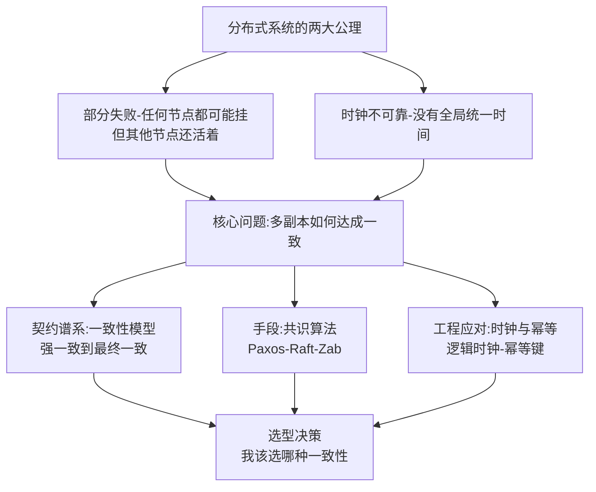
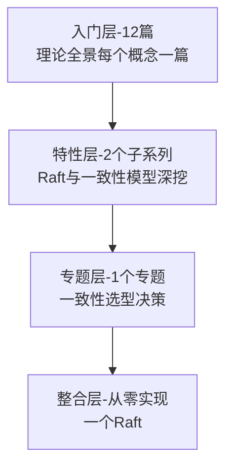

# 分布式理论系列导读 · 一次数据复制的一致性之旅

> 📖 本系列共 12 篇（0_导读 + 11 正文），覆盖分布式理论整个知识面：认知基础、一致性模型、共识算法、分布式时钟与幂等、选型实践。
> 本篇是第 0 篇导读：先建立「部分失败下如何达成一致」的心智模型，再决定读哪条路。

## 一、为什么需要这套系列

分布式理论是分布式系统的「物理学」：微服务、分库分表、多活容灾、注册中心，背后全部站着同一批理论——CAP、一致性模型、共识算法。但学分布式理论常见两种极端：

- **只背名词**：能说出 CAP、能报出 Raft，但回答不了「为什么我的订单服务要选最终一致而不是强一致」——理论没接到地
- **只讲直觉**：「大概同步一下就行」，但排查「为什么两个节点数据不一致」「为什么主库挂了选主要 30 秒」时没有理论抓手，全靠猜

这套系列的设计思路：**先建立「部分失败 + 时钟不可靠」这个公理体系，再逐层铺理论大厦**。主线是「多副本如何在故障下达成一致」，支线是一致性模型（契约谱系）、共识算法（手段）、时钟与幂等（工程应对）。先会「看清问题的本质」，再会「理解每个理论的定位」，最后会「给真实系统做一致性选型」。

## 二、全局心智模型：部分失败下的一致性

理解这个模型的三个要点：

1. **两大公理是一切的起点**：单机世界里「要么全成功要么全失败」「时间就是时间」；分布式世界里这两条都不成立——部分失败意味着「你不知道对面挂没挂」，时钟不可靠意味着「你不知道两件事谁先谁后」。所有分布式理论都是从这两条公理推导出来的。
2. **一致性模型是「契约」不是「算法」**：线性一致性、顺序一致性、最终一致性，是系统对外的「表现承诺」，不是实现手段。承诺越强，代价越大。
3. **共识算法是「实现强契约的手段」**：Paxos/Raft/Zab 是在部分失败下达成「多数派一致」的算法，是实现强一致承诺的主力工具。

> tips：(公理思维) 分布式理论的所有分歧都能追溯到两条公理：部分失败（网络分区时你无法区分「对面挂了」和「网络慢了」）和时钟不可靠（没有全局时钟就没有全局的事件排序）。新的分布式理论出现时，先问它「假设了什么公理、放宽了什么约束」，理解速度会快很多。

## 三、系列导航表（12 篇）

| 序号 | 篇目 | 深度 | 一句话定位 | 对标参考 |
|---|---|---|---|---|
| 0 | 系列导读 | 全景 | 部分失败下的一致性心智模型 + 阅读路径 | - |
| 1 | 分布式系统是什么与为什么难 | 入门 | 网络不可靠/时钟不可靠/8 大谬误/部分失败 | DDIA |
| 2 | CAP 定理 | 入门 | 一致性/可用性/分区容忍，P 是必选项 | 凤凰架构 |
| 3 | BASE 理论 | 入门 | 基本可用/软状态/最终一致，CAP 的工程折中 | 凤凰架构 |
| 4 | 一致性模型全景 | 入门 | 强一致/顺序/因果/最终一致的契约谱系 | DDIA |
| 5 | 线性一致性与顺序一致性 | 入门 | 最强契约长什么样，与顺序一致的区别 | DDIA |
| 6 | 共识问题与 Paxos | 入门 | 共识问题的本质与 Paxos 的推导 | Paxos 论文 |
| 7 | Raft 共识算法 | 入门 | 选主/日志复制/安全性，可理解性设计 | Raft 论文 |
| 8 | Zab 协议与 ZooKeeper | 入门 | Zab 与 Raft 的异同，工程落地视角 | ZK 文档 |
| 9 | 分布式时钟 | 入门 | NTP/逻辑时钟/向量时钟/混合逻辑时钟 | DDIA |
| 10 | 幂等与去重 | 入门 | 重试语义/幂等键/去重表 | DDIA |
| 11 | 一致性方案选型 | 入门 | 强一致 vs 最终一致的决策树 | 综合应用 |

## 四、从点到面：四层进阶路径

| 层级 | 定位 | 规模 | 适合 |
|---|---|---|---|
| 入门层 | 点：每个理论概念一篇，建立完整认知 | 12 篇 | 所有读者必读 |
| 特性层 | 点 × 深：Raft 与一致性模型拆到实现级 | 2 个子系列 | 按兴趣挑重点 |
| 专题层 | 面：一致性方案跨场景的选型决策 | 1 个专题 | 解决实际选型 |
| 整合层 | 体系：从零实现 Raft 理解共识本质 | 1 个 demo | 动手派 |

## 五、入门读者最容易踩的 3 个认知误区

### 误区 1：以为 CAP 是「三选二」的选择题

很多资料把 CAP 讲成「三选二」——容易让人以为「我们选了 AP 所以没有一致性」。实际上 **P（分区容忍）在分布式系统里是必选项**（网络分区一定会发生，你不容忍它就是拒绝分布式），真正的选择只在 C 和 A 之间：分区发生时，是拒绝服务保一致（CP），还是继续服务保可用（AP）。而且这个选择是**逐操作、逐时刻**的，不是系统级非黑即白。

### 误区 2：以为「最终一致」就是「不一致」

「最终一致」容易被理解成「反正最后会一样，中间乱来没关系」。实际上最终一致是一份**严格的契约**：停止写入后，经过有限时间，所有副本必然收敛到相同状态——「有限时间」需要系统认真设计（复制延迟监控、读修复、反熵机制），不是「放着不管自己会好」。中间态的「乱」也有边界（比如因果一致性保证「你看到自己的写入」），不是无序的乱。

### 误区 3：以为共识 = 分布式事务

「Raft 解决了分布式一致性问题，所以也能解决分布式事务」是常见混淆。**共识解决的是「多个节点对同一个值达成一致」（单值/日志层面）**，分布式事务要解决的是「多个节点上的多个操作要么全成功要么全失败」（业务原子性层面）——前者是后者的底层组件之一（比如 Percolator 用共识存事务状态），但共识本身不提供事务语义。两个问题的边界，本系列第 6 篇会专门划清。

> tips：(三问定位) 遇到任何分布式理论名词，先问三个问题：它是「契约」（一致性模型）还是「手段」（共识算法）还是「工程应对」（时钟/幂等）？它假设了部分失败的哪种模式？它放宽了哪条约束换性能？三问答完，名词各归其位。

## 六、怎么读这套系列

- **零基础/刚入行**：从 0 按顺序读到 11，每天 2 篇，一周建立完整理论认知
- **有分布式使用经验**：重点读 4-5（一致性模型）、7（Raft）、11（选型）——这三个直接对应「排查不一致」和「做选型」两类日常场景，其余按需
- **要动手实现/深挖**：读完入门层进特性层（深入理解 Raft 系列 / 深入理解一致性模型系列），最后进整合层「从零实现一个 Raft」

---

下一篇将讲 **1_分布式系统是什么与为什么难**：从「8 大谬误」说起，为什么单机直觉在分布式世界全部失效——待正文落盘后补链接。
