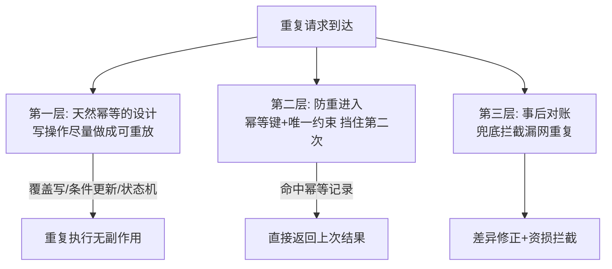
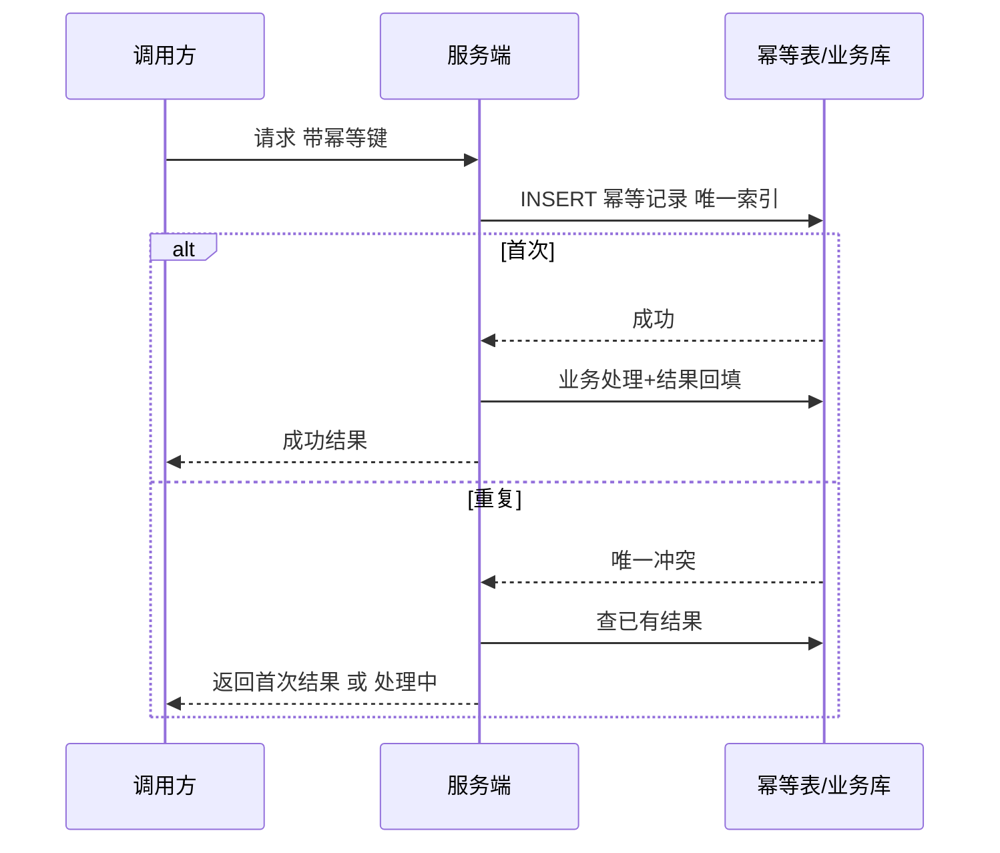

# 幂等与去重

> **一句话摘要**：分布式系统里重试不可避免，重试必然带来重复——幂等（同一操作执行多次与一次效果相同）就是让重复变安全的唯一武器；实现体系三层：天然幂等（按主键覆盖/条件更新）、防重进入（唯一约束/幂等键）、事后兜底（对账），缺一层就有一类资损。
> **本文核心**：重试与重投是机制必然、重复不可根除——幂等用**三层防线**让重复无害：天然幂等设计（覆盖写/条件更新）打底、幂等键 + 唯一约束挡门（保证在持久层）、对账兜底（拦漏网）。

前置阅读：[分布式系统是什么与为什么难](./1_分布式系统是什么与为什么难-入门.md)。重试与消息语义的工程语境见[异步削峰](../../../distributed-system-design/入门层/从零开始认识分布式系统设计系列/5_异步削峰-入门.md)。

## 1. 背景：为什么重复不可避免

> 量级分档意识：本文方法在十万级 QPS、千万级用户、亿级流量的场景下均需重新评估——量级变化时架构与参数需同步调整。


上一章的不确定性直接推导出这一章：请求超时后你不知道对方「没收到」还是「做完了」——安全的选择只有重试（宁重复勿丢失）；消息队列的至少一次投递（防丢的代价）必然投递重复；用户双击提交、网络闪断重发，都是重复的日常来源。

「少重复」路线（最多一次）在异步网络里做不到（FLP 同源的问题：无法可靠区分「没做」和「做了没回话」），所以工程共识是：**接受重复必然发生，用幂等让重复无害**。幂等的定义一句话：同一操作执行一次与执行 N 次，系统的最终状态相同、副作用只发生一次。

## 2. 核心机制：三层防线



- **第一层·天然幂等设计**（最根本）：把写操作设计成「重放安全」——按主键覆盖写（put if absent 或整行 upsert）、条件更新（`update ... set status=paid where status=unpaid`，影响行数为 0 即已处理）、状态机流转（非法流转直接拒绝）。设计阶段就让操作幂等，后续防线都是保险。
- **第二层·幂等键 + 唯一约束**：请求携带全局唯一的幂等键（业务单号/客户端生成的 token），服务端在处理前先「登记」——落地为数据库唯一索引、Redis `SET NX` 占位、或专门的去重表。第二次同键请求直接返回首次结果（或拒绝）。**幂等键的作用域是关键**：粒度过粗（全接口一个键）误伤正常请求，过细（每次生新键）形同虚设——键必须表达「同一笔业务操作」。
- **第三层·对账兜底**：前两层都有漏网场景（幂等键没带上、占位过期后重放、跨系统时钟差）——定时对账比对上下游数据，发现重复/差异修正。金融系统的最后一道牙（BASE 篇的「传播保时效、对账保完整」）。

## 3. 落地实践：幂等键的完整生命周期

```
1. 客户端/上游生成幂等键（业务单号优先——天然表达业务唯一性）
2. 请求携带（Header/消息体字段）
3. 服务端处理前：INSERT 幂等记录（唯一索引）—— 成功则继续；冲突则查已有结果返回
4. 业务处理 + 结果回填幂等记录（状态：处理中→完成）
5. 「处理中」的重复请求：返回「处理中，请稍后查询」（不能返回失败——会触发对方重试风暴）
```

三个工程细节：① **幂等记录的 TTL** 要大于「上游重试窗口 + 消息保留期」，过期太早等于没防；② **结果回填要原子**（与登记同一事务或状态机），避免「登记了但没结果」的悬空态；③ **MQ 消费幂等**的键 = 业务去重键（订单号），不是消息 ID（重发时消息 ID 会变）。

## 4. 生产视角：幂等缺失的事故形态

- **双击下单的两条订单**：接口没有防重 + 前端没防抖——同一用户瞬间两单。初级但常青的事故，修法就是幂等键（收银台场景行业标配 token 机制）。
- **MQ 重投的多发优惠券**：消费逻辑「查没有→发券→记录」，两台消费者并发处理同一条消息（重平衡/重投）——「查」与「发」之间不是原子的，双双通过检查。修法：唯一约束挡并发（数据库唯一索引兜底，Redis 占位只做加速）。**先写唯一约束再发券**的顺序纪律，比分布式锁更可靠。
- **重试风暴叠加非幂等**：下游变慢 → 上游超时重试 → 重复请求放大下游压力 → 更慢——非幂等接口的重试是「雪崩 + 资损」双重引信。重试配置必须与幂等能力成对评审。
- **对账发现的「幽灵充值」**：充值接口超时重试 + 第三方回调重发，同一笔充值入账两次——用户资产多记。复盘时第三层对账兜住了，但根治仍要回到第二层（外部单号的唯一约束）。

## 5. 主流系统怎么做：各层的生态实现

| 层 | 主流实现 | tips |
|---|---|---|
| 数据库天然幂等 | 主键 upsert / 唯一索引 / 乐观锁版本号 | 最可靠的一层——能下沉到数据库约束的防重，别放应用层 |
| 分布式占位 | Redis SET NX EX + 唯一业务键 | 占位是「加速」不是「保证」（Redis 可能丢）——数据库约束才是保证 |
| MQ 消费幂等 | 业务去重表 + 消费端幂等键 | RocketMQ/Kafka 的「幂等生产」只覆盖生产端，消费端必须自己做 |
| 支付/开放平台 | 幂等 token（预领令牌）+ 外部单号唯一 | 行业标配：先领 token → 带 token 提交 → token 一次性消费 |
| 对账体系 | 定时全量/增量比对 + 差异工单 | T+1 全量对账 + 分钟级增量对账的组合是金融惯例 |

规律：**可靠性随层次递减、成本也递减**——设计幂等（零运行成本）、占位防重（小成本）、对账兜底（高成本），三层都用是因为漏网代价不可接受；「只做对账不做幂等」是把最贵的一层当唯一防线。

## 6. 典型场景

- **支付回调**（资金级）：第三方支付的成功回调会重发——按外部流水号做唯一约束入账，重发直接幂等返回成功。
- **消息消费**（链路级）：库存扣减消息至少一次投递——按订单号做扣减幂等（条件更新 `where deducted=0`），重投不再重复扣。
- **开放 API**（平台级）：客户端超时重发同一笔创建请求——幂等键返回首次结果而非报错（报错会引发客户端更激进的重试）。

## 7. 与相邻概念的区别

- **幂等 vs 去重**：幂等是「重复执行无害」的性质（含天然幂等设计）；去重是「识别并拦截重复」的手段（幂等键/去重表）——幂等是目标，去重是常用手段之一。
- **幂等 vs 事务**：事务保证「一组操作全做或全不做」；幂等保证「同一操作重复执行安全」。分布式事务方案（TCC/Saga）内部大量依赖幂等——Cancel/补偿的重试安全性靠它（见[分布式事务系列](../../../distributed-transaction/入门层/从零开始认识分布式事务系列/0_系列导读-全景.md)）。
- **至少一次 vs 幂等消费**：「至少一次投递 + 幂等消费」合起来等效「有效恰好一次」——业界没有真·恰好一次（端到端），都是这两件的组合话术。
- **幂等键 vs 分布式锁**：幂等键防「同一业务操作」的重复（按内容判重）；分布式锁防「并发互斥」（按资源排他）——业务防重首选幂等键（无锁、简单、可持久），锁是并发控制的另一工具（见[分布式锁与选主](./12_分布式锁与选主-入门.md)）。

## 8. 常见误区与不适用

- **「接口加个分布式锁就幂等了」**：锁防的是并发瞬间，防不了时间上错开的重复（重试间隔 30 秒的两次调用）——防重靠「键 + 约束」，锁解决不了幂等问题。
- **「Redis SET NX 就是幂等」**：Redis 占位可能丢（故障、过期早于重试窗口）——它是加速层，持久层唯一约束才是保证。只用 Redis 的防重，故障演练时必穿。
- **「天然幂等的操作不需要幂等键」**：覆盖写确实不需要——但多数业务操作是「累加型」（扣减、积分增加），不是覆盖型；判断自己属于哪类是设计第一步。
- **「幂等记录留着越好」**：无 TTL 的去重表无限膨胀拖慢查询——TTL 按重试窗口上限设定并归档。
- **不适用**：纯读接口天然幂等，无需防重；流式计算里「恰好一次」由框架（checkpoint + 两阶段）封装——应用层不必自造。

## 9. 你们可能会问

- **幂等键谁来生成？** 谁最清楚「什么是一次业务操作」谁生成——跨系统调用由发起方（业务单号）生成；客户端提交用服务端预发的 token（防伪造 + 防重放）。
- **「处理中」状态收到重复请求怎么回？** 返回「处理中 + 单号，请稍后查询」——绝不能返回失败（触发对方重试），也不能阻塞等待（放大压力）；查询接口兜底最终结果。
- **去重表会不会成为性能瓶颈？** 高频场景用「Redis 占位加速 + 库表唯一约束兜底」双层；去重表按月分表 + TTL 归档——量级可控。
- **怎么给存量接口补幂等？** 先加对账（止血漏网资损）→ 加唯一约束（挡并发与重放）→ 接口改造支持幂等键（治本）——顺序不能倒，约束先行。
- **「有效恰好一次」和「恰好一次」的差别？** 后者（端到端只执行一次）在异步网络做不到；前者 = 至少一次投递 × 幂等消费，效果等价、工程可实现——供应商话术里的「exactly-once」都要按这个拆开验证。

## 10. 一句话总结 + 5W 速记卡 + 自测三问

**一句话总结**：重复不可避免（重试/重投/双击），幂等让重复无害——天然幂等设计打底、幂等键+唯一约束挡门、对账兜底三层齐备；防重的保证必须在持久层（数据库约束），缓存占位只是加速。

**5W 速记卡**：

| 维度 | 内容 |
|---|---|
| What | 幂等三层防线：天然设计 / 幂等键+约束 / 对账 |
| Why | 超时重试与至少一次投递是机制必然，重复不可根除 |
| When | 一切写接口、消息消费、回调处理的评审必查项 |
| Where | 数据库约束、占位缓存、去重表、对账系统 |
| How | 定幂等键（业务单号）→ 先约束后业务 → 结果回填 → TTL 归档 |

**自测三问**：

1. 你负责的写接口，重复调用会发生什么？这个答案验证过还是猜的？
2. 你的 MQ 消费者，重投同一条消息两次，下游数据会怎样？
3. 你的对账体系覆盖了哪些上下游？最近一次拦下差异是什么时候？

---

**下篇预告**：机制都学了，怎么选——下一篇[一致性方案选型](./11_一致性方案选型-入门.md)把全系列的机制装进一棵决策树。


**🎯 核心带走**：

- **核心一句话**：幂等 = 同一操作执行 N 次效果同一次；防线三层，保证层在数据库约束。
- **链条复述**：重复来源（超时重试/至少一次投递/双击）→ 幂等键表达「同一笔业务」→ 唯一约束挡并发与重放 → 结果回填 + TTL 归档 → 对账兜底。
- **失效点与边界**：Redis 占位会丢（只是加速层）；累加型操作必须防重（覆盖写才天然幂等）；幂等记录过期早于重试窗口 = 形同虚设。

💡 **实战提示**：先写唯一约束再执行业务（顺序纪律）；「处理中」的重复请求返回处理中而非失败；消费幂等键用业务单号不用消息 ID；对账与幂等双轨都在才算闭环。

**开放问题**：如果幂等记录存储本身是 AP 的（可能旧），防重承诺还剩多少？「保证层」自身的可靠性由谁保证？

**决策（何时用）**：一切写接口/消息消费/回调必配；推荐「约束先行」的补齐顺序——对账止血 → 唯一约束 → 幂等键治本，顺序不能倒。

「有效恰好一次」的话术仍在演进（MQ 事务消息、流处理 exactly-once），拆开看全是「至少一次 + 幂等」的组合——三层防线的骨架长期稳定。



---

## 📌 数据与事实声明

本文重试语义（至少一次/最多一次）与「有效恰好一次」的讨论框架源自 DDIA 与消息系统公开文档；支付 token 机制为行业公开惯例的机制级概括；事故形态为公开运维实践的一般化归纳，不指向具体公司。以官方文档为准。

## 📚 参考资料

| 类型 | 标题 | 来源 |
|---|---|---|
| 图书 | 数据密集型应用系统设计（DDIA）第 7、11 章 | O'Reilly（2017 中译） |
| 文档 | 各 MQ 官方文档：消息投递语义 | rocketmq.apache.org · kafka.apache.org |
| 系列文章 | 异步削峰 / BASE 理论（本仓库） | 本仓库同系列与设计系列 |
