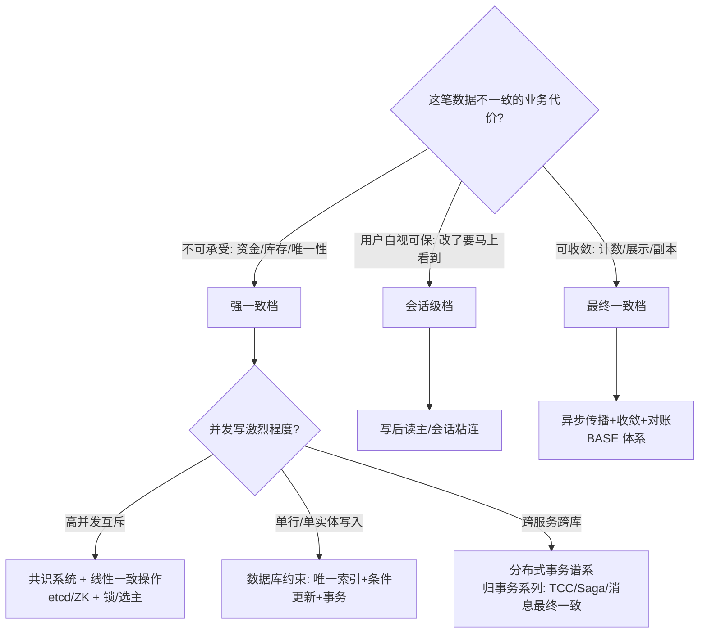
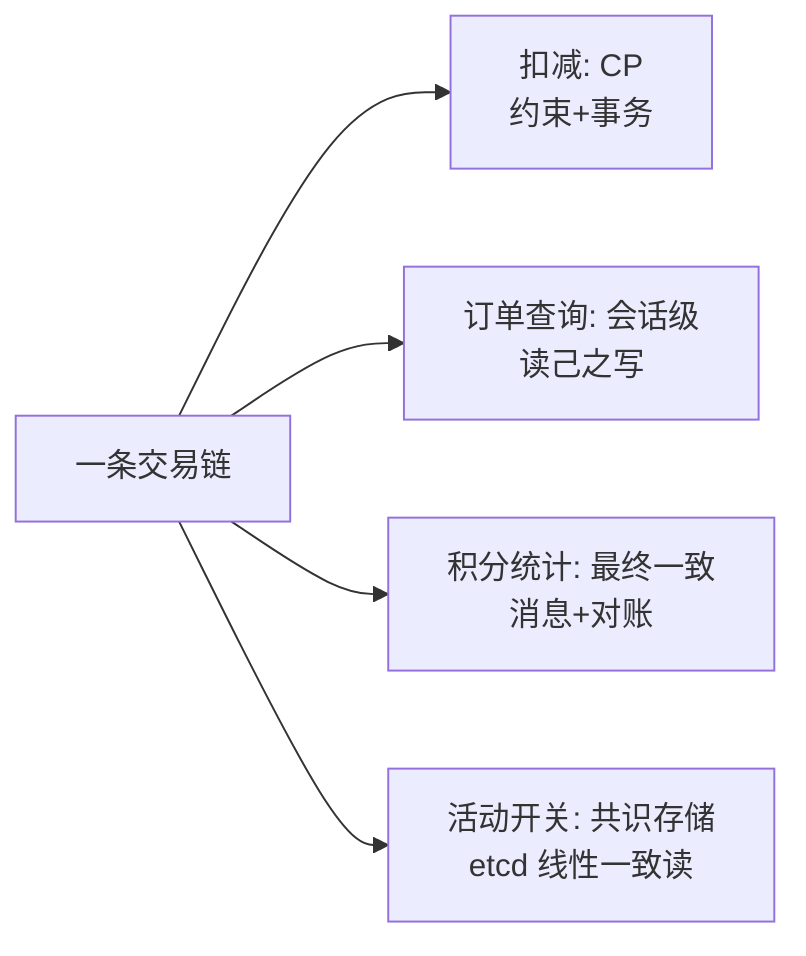

# 一致性方案选型

> **一句话摘要**：本系列前十章的机制装进一棵决策树——选型的起点从来不是「哪个技术先进」，而是两个业务问题：「这笔数据不一致的代价是什么」（定档：强一致/会话级/最终一致）与「并发写同一份数据的激烈程度」（定机制：共识/约束/收敛）；本篇把分级决策、机制匹配、反模式一次性收拢。
> **本文核心**：选型 = 两问决策树——**「不一致的代价」定档（CP/会话/最终一致）、「并发写形态」定机制（约束→事务→共识→分布式事务按需升级）**；产出物是全员使用的数据一致性分级表，并靠演练持续验证。

前置阅读：本系列[1-10 篇](./0_系列导读-全景.md)。工程实现层的手段清单见[分布式系统设计系列](../../../distributed-system-design/入门层/从零开始认识分布式系统设计系列/0_系列导读-全景.md)。

## 1. 背景：选型为什么难

一致性方案的选项清单很长（共识复制、分布式事务、唯一约束、异步收敛、对账兜底……），但选型困难不是选项多，而是**问题没定义**——「我们要不要强一致」这句话无法回答，因为「强一致」未落到模型（见[一致性模型全景](./4_一致性模型全景-入门.md)）、「要」的范围未落到数据与操作。选型的正确起点是业务代价评估，终点才是技术机制匹配；跳过起点直接比选技术，是方案评审里最常见的时间黑洞。

## 2. 核心机制：两问决策树

决策树的使用纪律：

- **第一问按「数据 × 操作」切**，不按系统切——同一条库存数据，「扣减」操作在 CP 档、「展示」操作在最终一致档（[BASE 篇](./3_BASE理论-入门.md)的分档方法）。
- **第二问决定机制重量**：同样是强一致档，单行扣减用数据库条件更新就够（便宜且可靠），跨服务互斥才需要共识与锁——**机制是按需升级的，不是默认顶配**。
- **每一档都要回答「失败了怎么办」**：CP 档分区时服务降级形态（CAP 篇）、最终一致档的收敛窗口（BASE 篇）——没有失败答案的选型是半成品。

## 3. 落地实践：一个数据分类工作坊

给系统做一致性选型的实操步骤（团队协作，半天量级）：

1. **列数据清单**：核心实体与它们的写操作（订单/库存/余额/计数/配置/会话……）。
2. **逐条定档**：按第一问打标签（CP/会话/最终），有争议的标记「待业务确认」——把「不一致的代价」翻译给业务方裁决（「这个数错了会怎样？」）。
3. **按档配机制**：对照决策树第二问，写明每条的具体机制（「库存扣减 = MySQL 条件更新」「配置 = etcd 线性一致读」「积分 = 消息异步 + 对账」）。
4. **声明与评审**：产出「数据一致性分级表」进设计文档——这张表是后续所有接口设计、故障排查的依据（排查不一致问题时先查它的档位约定）。
5. **演练验证**：CP 档做分区演练、最终一致档做收敛窗口度量——选型结论要被验证，不是被相信。

## 4. 生产视角：选型失误的典型形态

- **「默认最弱，出了事加约束」**：全部按最终一致设计，超卖/负余额事故后临时补唯一约束——补上的约束又会和既有的异步逻辑打架（异步路径绕过约束）。选型前置的成本远低于事后打补丁。
- **「默认最强，性能崩了再降」**：全部读走线性一致、全量写走共识——延迟与吞吐双崩。分级才是常态：核心判定强一致、周边展示收敛（线性一致的代价见[线性一致性篇](./5_线性一致性与顺序一致性-入门.md)）。
- **档位漂移无人管理**：分级表写完即死，半年后新代码把「会话级」数据读走了从库三秒旧值、把「CP 档」的判定接到了缓存——一致性假设在代码演进中静默漂移。治理手段：分级表进 code review 检查项、数据访问层的读写路由收敛到统一组件。
- **跨档边界的隐式依赖**：订单（CP 库）写完发消息更新积分（最终一致档）——业务把「积分已到账」当强一致假设用（下单页直接显示积分到账），档位跨界的假设没人声明。**跨档调用必须显式传「这是异步的」语义**（状态展示为处理中）。

## 5. 主流方案怎么做：各档的机制货架

| 档位 | 机制货架（按成本升序） | 典型组合 |
|---|---|---|
| 强一致档 | 条件更新+唯一约束 → 事务 → 共识存储操作 → 分布式事务 | 单库扣减用约束；跨服务用 TCC/消息最终一致（事务系列） |
| 会话级档 | 写后读主 → 会话粘连 → 按位点等待 | 读写分离 + GTID 等待（设计系列读写分离篇） |
| 最终一致档 | 异步消息 → 缓存过期 → 对账兜底 | BASE 三件套（BASE 篇） |
| 互斥/选主 | 租约锁（Redis）→ 共识锁（ZK/etcd）→ fencing token | 按脑裂代价选（下篇专讲） |

规律：**每一档内部按成本升序试**——先用最便宜且可靠的（数据库约束），不够再升级；共识与分布式事务是「机制重武器」，进了货架不等于默认使用。

## 6. 典型场景

- **交易系统**（混合档教科书）：扣减走 CP（约束+事务）、订单查询走会话级（读己之写）、推荐与统计走最终一致、全局活动开关走共识存储——一条业务链上四档并存。
- **配置中心**（强一致读档）：变更经共识全序发布，读取按需（多数场景最终一致 + 版本号比对即可）。
- **跨系统数据同步**（最终一致档）：上下游以消息 + 对账连接，窗口分钟级——选型表里明确「下游数据是衍生的、可重建的」这一前提。

## 7. 与相邻概念的区别

- **选型 vs 实现**：本篇是「定档 + 配机制」的决策方法；各机制的实现细节分布在全系列（共识/锁/租约/幂等）与兄弟系列（事务/设计）——选型错了，实现再精也是南辕北辙。
- **一致性选型 vs 存储选型**：先有数据分级（本篇），再选承载存储（每档选对应能力的存储）——顺序颠倒会变成「拿着存储找需求」。
- **本篇 vs 分布式事务**：跨服务强一致的具体方案（2PC/TCC/Saga/消息最终一致）是独立大主题，本篇只负责把「哪些数据需要跨服务强一致」识别出来——机制展开归[分布式事务系列](../../../distributed-transaction/入门层/从零开始认识分布式事务系列/0_系列导读-全景.md)。

## 8. 常见误区与不适用

- **「一致性选型一次做完终身有效」**：业务变化会改变「不一致的代价」（积分从营销品变成资产）——分级表要随业务评审滚动更新。
- **「CP 档越多越安全」**：CP 是代价不是装饰——分区拒绝服务、延迟上升、运维复杂度全是账。把可收敛数据错划进 CP 档，是反向的过度设计。
- **「选型表是架构师的事」**：分级表的价值在于全员使用——开发、测试、排障都按表对齐假设；只存在于文档里的分级表等于没有。
- **「技术先进性是选型依据」**：NewSQL 不是天然答案、共识不是默认底座——选型的唯一依据是业务代价与并发形态，先进性只是机制的属性不是需求的属性。
- **不适用**：单机单库系统（数据库事务已覆盖，无需分级）；只读系统（无一致性冲突）——分级方法论在「多副本 + 并发写」的世界才生效。

## 9. 你们可能会问

- **业务方说不清「不一致代价」怎么办？** 换问法：「这个数错了、错了 5 分钟，最坏会发生什么、损失多少」——把抽象的「一致性」翻译成具体的「错误 + 窗口 + 后果」，业务方能答。
- **分级表应该多细？** 到「数据 × 操作」粒度（如「库存：扣减=CP、查询=最终」），不到字段级（维护成本爆炸）——表格控制在几十行内才有人用。
- **同一数据两个团队要求不同档位怎么办？** 这正是分级表存在的意义——把冲突显式化，按业务代价裁决（通常「错的代价更高」的一方赢），而不是各自按假设开发。
- **怎么验证选型没做错？** 三道验证：分区演练（CP 档行为符合声明）、收敛度量（最终一致档窗口达标）、故障复盘回查（不一致事故是否落在未分级区域）。
- **本系列学完的下一步？** 纵向深入：Raft 源码（特性层规划中）、分布式事务机制（兄弟系列）；横向扩展：稳定性工程（运行期的一致性保障）——理论篇给了地图，工程域给风景。

## 10. 一句话总结 + 5W 速记卡 + 自测三问

**一句话总结**：一致性选型 = 两问决策树——「不一致的代价」定档（CP/会话/最终一致），「并发写形态」定机制（约束→事务→共识→分布式事务按需升级）；产出物是全员使用的数据一致性分级表，并靠演练与度量持续验证。

**5W 速记卡**：

| 维度 | 内容 |
|---|---|
| What | 两问决策树 + 数据分级表 + 各档机制货架 |
| Why | 机制选项再多，问题不定义就无法选；选错档的代价是资损与性能双杀 |
| When | 系统设计期、新数据上线前、不一致事故复盘后 |
| Where | 设计文档的分级表 + 数据访问层的读写路由 |
| How | 列清单 → 定档 → 配机制 → 全员声明 → 演练验证 |

**自测三问**：

1. 你的系统有多少数据进了分级表？最近一次新数据上线时查了吗？
2. 有没有「本该 CP 的数据被异步逻辑绕过约束」的路径？
3. 上一致性相关的事故复盘，根因落在「没分级」还是「没执行」？

---

## 本系列收官 · 与兄弟系列的地图

| 知识域 | 系列位置 | 关系 |
|---|---|---|
| 工程手段（缓存/异步/容量/部署） | [分布式系统设计系列](../../../distributed-system-design/入门层/从零开始认识分布式系统设计系列/0_系列导读-全景.md) | 理论（本系列）与工程的两翼 |
| 跨服务原子性 | [分布式事务系列](../../../distributed-transaction/入门层/从零开始认识分布式事务系列/0_系列导读-全景.md) | 强一致档的跨服务展开 |
| 全局标识 | [分布式 ID 系列](../../../distributed-id/入门层/从零开始认识分布式ID系列/0_系列导读-全景.md) | 时钟篇的应用（雪花回拨） |
| 互斥与选主机制 | 本系列[篇 12-15](./12_分布式锁与选主-入门.md) | 共识/租约的工程化三篇 |

**🎯 核心带走**：

- **核心一句话**：先定档再配机制——机制按需升级，约束永远优先于重武器。
- **链条复述**：数据 × 操作清单 → 代价定档 → 并发形态配机制 → 分级表全员声明 → 分区演练 + 收敛度量验证。
- **失效点与边界**：分级表随业务演进滚动更新；跨档调用的「异步语义」必须显式传递；CP 档过度扩容是反向过度设计。

💡 **实战提示**：把「错 5 分钟最坏会怎样」翻译给业务方定档；分级表进 code review 检查项；新数据上线必查分级表；数据访问层收口读写路由防档位漂移。

**开放问题**：分级表由谁维护、多久重评一次，才能在业务快速变化时不变成死文档？

**决策（何时用）**：多副本 + 并发写的系统全适用；推荐「工作坊式」半天产出首版分级表，此后随每次架构评审滚动。

一致性方案的重武器（共识/NewSQL）十年间不断下探成本线，但「代价定档」的决策逻辑不随工具演进——工具越强，越需要知道自己为什么用。

---

## 📌 数据与事实声明

本文决策框架为对全系列机制（CAP/BASE/一致性模型/共识/时钟/幂等）的工程化归纳；分级粒度与验证方法为业内通行的设计评审实践。所有机制细节以对应篇章与官方文档为准。

## 📚 参考资料

| 类型 | 标题 | 来源 |
|---|---|---|
| 图书 | 数据密集型应用系统设计（DDIA）第 9 章 | O'Reilly（2017 中译） |
| 图书 | 凤凰架构——冰山之下 | icyfenix.cn（周志明） |
| 系列文章 | 本系列全部篇章 + 分布式事务系列 | 本仓库 docs/architecture/system-design/ |
