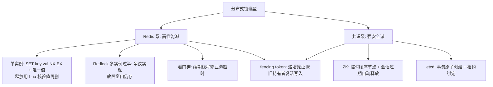
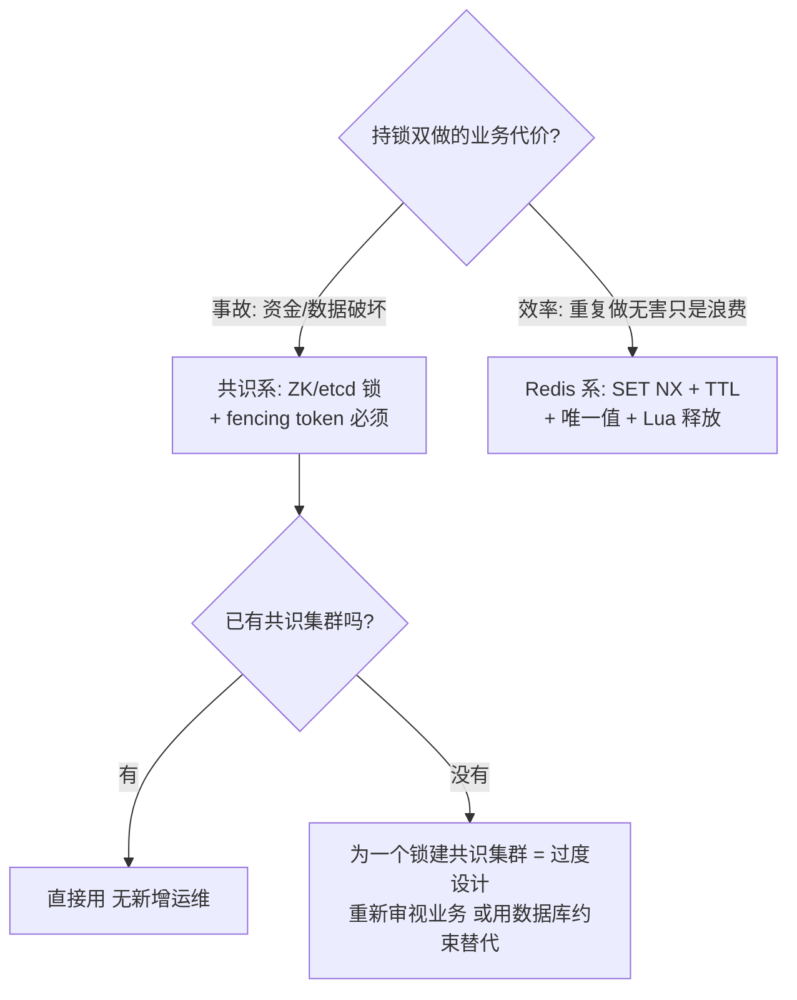
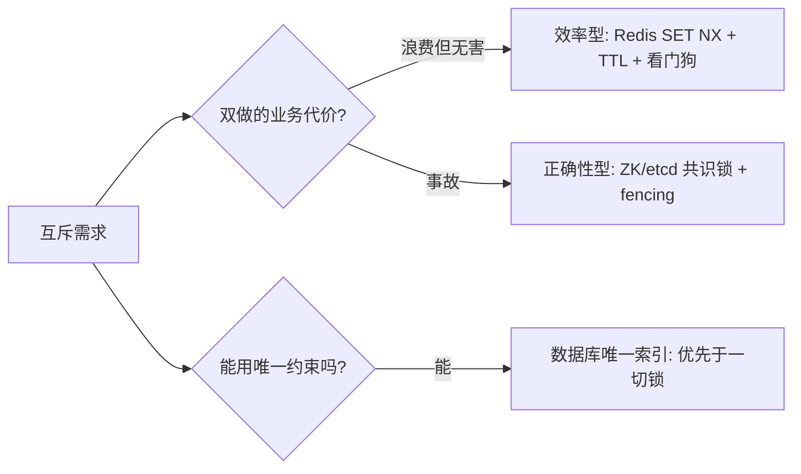

# 分布式锁与选主

> **一句话摘要**：分布式锁 = 跨机器的互斥（同一时刻只有一个客户端持有资源），选主 = 它的特例（互斥的对象是「Leader 身份」）；机制谱系两派——Redis 系（高性能但故障时有脑裂窗口）与共识系（ZK/etcd，强安全但有吞吐与运维成本），两者的差距全部体现在「故障时刻」； fencing token 是任何实现都绕不开的安全补丁。
> **本文核心**：分布式锁 = **原子占用（SET NX/临时节点/事务）+ 自动释放（TTL/会话/租约）+ fencing token（下游拒收旧凭证）**三件套——Redis 系快但故障有脑裂窗口（效率型），共识系慢但多数派背书（正确性型）；能用数据库约束解决的互斥永远优先于锁。

前置阅读：[共识问题与 Paxos](./6_共识问题与Paxos-入门.md)、[租约与心跳](./13_租约与心跳-入门.md)。Redis 实现细节归本仓库 Redis 系列。

## 1. 背景：单机锁为什么在分布式里失效

> 量级分档意识：本文方法在十万级 QPS、千万级用户、亿级流量的场景下均需重新评估——量级变化时架构与参数需同步调整。

单机锁（互斥量/信号量）依赖「共享内存 + 内核调度」——同一进程空间内，加锁与检查是原子的。跨机器后两个前提消失：没有共享内存（锁状态要放某台机器上），没有原子性（「检查有没有人持锁」和「占上锁」是两次网络操作，中间可以插入别人的请求）。

分布式锁要回答的三个问题：**锁状态存哪**（Redis/共识系统/数据库）、**怎么原子地「检查+占用」**（各存储的原子原语）、**持锁人死了锁怎么办**（租约/TTL + 续期）。选主 = 同一套机制互斥「Leader 角色」，多了一个语义：主挂了要自动换人（故障转移），而不只是「等锁释放」。

## 2. 核心机制：两大派谱系

- **Redis 系**：`SET key 唯一值 NX EX ttl` 一条命令原子完成「检查+占用+超时」；释放必须「校验值相等再删」（Lua 保证原子——防止误删别人的锁：自己过期了、别人的锁被自己 del）。看门狗（watchdog）线程定期续期，让 TTL 兜底「客户端崩溃」、续期兜底「业务比 TTL 长」。**安全边界**：Redis 主从异步复制——主上锁成功、还没同步到从就宕机、从升主，锁丢失，第二个客户端再次上锁成功 = **脑裂窗口**；Redlock（多实例过半）试图收窄它，但其正确性在学界（Kleppmann 与 antirez 的公开论战）仍有争议——共识：Redis 锁适合「效率型」场景（防重复做，偶尔双做无害），不适合「正确性型」场景（双做即事故）。
- **共识系（ZK/etcd）**：锁状态在多数派上——ZK 用「临时顺序节点 + 会话过期」（挂了会话过期节点自动删，锁自动释放；顺序节点提供公平排队）；etcd 用「事务原子创建 + 租约绑定」（put with lease，租约过期键自动消失）。**多数派保证**下没有「主从异步复制的丢锁窗口」——安全性由共识机制背书（代价：写吞吐低、集群运维成本、延迟高一个量级）。
- **fencing token（防圈护栏）**：任何实现都需要的安全补丁——锁服务发放**单调递增的凭证**，下游资源（存储/下游服务）校验「凭证必须比已见过的更大」才接受操作。它堵死最后一类事故：持锁人假死（GC/网络停顿）→ 锁过期被他人接手 → 假死人恢复「以为」自己仍持锁继续写。锁本身拦不住这幕（两边都「持锁」过），fencing token 让下游拒绝旧凭证。ZK 的版本号/zxid、etcd 的租约 ID + 事务校验天然可充当。

## 3. 落地实践：选型决策与正确姿势

正确姿势清单：① 锁值用唯一标识（请求 ID），释放校验；② TTL ≥ 业务 P99 × 余量，配看门狗续期（Redis 系）；③ 持锁期间的操作要「短、可重试、可 fencing」——锁内调外部服务是反模式（持锁时间不可控）；④ 数据库约束（唯一索引）能解决的互斥（防重复创建），优先用约束不用锁——**约束是「状态防线」，锁是「动作防线」**，前者更便宜可靠（见[幂等与去重](./10_幂等与去重-入门.md)的区别节）。

## 4. 生产视角：锁出事的样子

- **经典双主**：调度系统两个实例都「当选」Leader——Redis 锁的异步复制窗口、或 ZK 会话超时误判 + 无 fencing，都会演出这幕。现象是定时任务跑两次、数据重复处理。**排查时先问：锁的故障时刻行为（GC 停顿 > TTL？主从切换瞬间？），再问：下游有没有 fencing**——多数事故是「有锁无栏」。
- **锁未释放的死等**：客户端持锁后崩溃，TTL 到期前所有竞争者空等——TTL 定得过长（怕业务没做完）就放大利空。看门狗 + 较短 TTL（秒级）+ 业务幂等三件套是正解，而不是「把 TTL 调到 10 分钟」。
- **选主的「双活瞬间」**：新旧 Leader 交替窗口（旧主假死恢复 + 新主已上位）——调度任务双跑、写入双份。共识系靠「任期检查」（旧主写时发现任期落后自动退位）缓解，业务侧再配 fencing 才闭环。
- **锁粒度失衡**：全局单锁（吞吐为 1）或过细锁（管理开销爆炸）——惯例是按资源 key 分段（如按订单 ID 哈希分段），把锁冲突域缩小到业务天然边界。

## 5. 主流实现怎么做：机制级对照

| 实现 | 原子原语 | 自动释放 | 安全级别 | 适合 |
|---|---|---|---|---|
| Redis 单实例 | SET NX EX（原子检查+占用） | TTL + 看门狗续期 | 效率型（故障窗口） | 防重复执行、缓存重建互斥 |
| Redlock | 多实例过半上锁 | 各实例 TTL | 争议（学派论战） | 谨慎使用，需理解其假设 |
| ZooKeeper | 临时顺序节点（create 自动编号） | 会话过期删节点 | 正确性型（多数派） | 公平锁、选主、强互斥 |
| etcd | 事务（create if not exists）+ 租约 | 租约到期键消失 | 正确性型（多数派） | 选主、K8s 生态内互斥 |
| 数据库 | 唯一索引 / `for update` 行锁 | 事务结束 | 正确性型（持久约束） | 防重复创建类——能用约束就不上锁 |

规律：**原子原语 + 自动释放 + fencing 三件齐了才是一把完整的锁**；安全性差距在「状态存于多数派还是单点副本」，吞吐差距是它的镜像。

## 6. 典型场景

- **定时任务选主**（效率偏上）：多实例部署的定时任务只跑一份——Redis 锁 + 看门狗够用，任务幂等（重跑无害）则安全要求再降一档。
- **缓存击穿重建互斥**（效率级）：热点 key 过期瞬间只放一个请求回源（缓存篇的互斥重建）——Redis 锁的标准场景，失败大不了再查一次库。
- **资金/库存互斥**（正确性级）：跨服务互斥且双做即事故——共识系锁 + fencing token + 数据库约束三重，且优先思考「能不能只用约束」。
- **配置发布 Leader**（选主级）：多节点集群只有一个节点负责拉配置变更并广播——共识系选主（etcd 的 election API/ZK 临时节点），故障自动换人。

## 7. 与相邻概念的区别

- **分布式锁 vs 幂等防重**：锁防「同时」（并发互斥），幂等防「重复」（按业务键判重）——时间上错开的重放锁拦不住，幂等键拦得住；两者互补不可互替（幂等篇的区别节详述）。
- **分布式锁 vs 数据库行锁**：行锁在事务内、依赖数据库（跨服务的长事务持锁是反模式）；分布式锁在事务外、跨服务互斥——能在一个数据库事务里解决的互斥，别引入分布式锁。
- **选主 vs 共识**：选主是「选一个唯一者」的应用语义；共识是底层机制（Paxos/Raft 保证「只有一个人能被选上且不可推翻」）——共识系选主是共识的直接应用，Redis 系选主是租约+互斥的近似实现（脑裂窗口）。
- **锁 vs fencing**：锁是「准入控制」，fencing 是「准入失效后的最后一道校验」——下游资源的凭证校验，挡住一切「过期持锁者」的残留写入。

## 8. 常见误区与不适用

- **「有锁就安全了」**：锁只覆盖「锁可见的窗口」——持锁人假死、锁过期后的残留写入、锁服务的故障窗口都在锁外。完整防线 = 锁 + fencing + 下游幂等。
- **「Redlock 解决了 Redis 锁的安全问题」**：它收窄了部分窗口但依赖时钟假设与故障模型，学界的公开论战（Kleppmann vs antirez, 2016）结论是「正确性场景别用它」——效率场景单实例 + TTL 已经够。
- **「锁过期时间越长越安全」**：TTL 越长，持锁人崩溃后全系统的空等越久——安全靠 fencing 与幂等补，不靠拉长 TTL。
- **「ZK/etcd 锁不需要 fencing」**：会话/租约过期同样可能发生在持锁操作中途（GC 停顿超时）——共识系解决「锁状态可信」，解决不了「持锁人的主观状态」；fencing 仍然必须。
- **不适用**：单机内互斥（本地锁即可）；能用数据库唯一约束表达的「互斥」（约束优先，见幂等篇）；纯防重复且幂等已兜底的场景（锁是多余的性能税）。

## 9. 你们可能会问

- **为什么释放锁要用 Lua？** 「取值比较 + 删除」是两步，中间可能插入「自己的锁已过期、别人已上锁」——Lua 把两步原子化，保证只删自己的锁。
- **看门狗续期的代价？** 每把锁多一个续期线程/定时任务与额外请求——库级实现（Redisson 类）已封装；代价可控，收益是「TTL 可以设短、崩溃自动释放、业务不受 TTL 硬上限」。
- **选主和「配一个调度中心」怎么选？** 低频简单场景用调度中心（外置编排，运维少）；需要进程内 Leader 身份（本地缓存维护、ping 分发）或高频切换时用内嵌选主（etcd election/ZK 临时节点）——按「谁需要感知 Leader」划界。
- **fencing token 谁来校验？** 下游资源方（存储条件写入：`where token > :seen`；下游服务：请求头凭证比对）——校验点必须在「不可绕过的写入路径」上，校验在锁服务自己身上等于没校验。
- **现有系统怎么评估锁的正确性？** 四问：锁值唯一吗？释放原子吗（Lua/事务）？故障时刻（GC> TTL、主从切换）行为分析过吗？下游有 fencing 或幂等吗？——四问全绿才算有锁有栏。

## 10. 一句话总结 + 5W 速记卡 + 自测三问

**一句话总结**：分布式锁/选主 = 原子占用 + 自动释放 + fencing 三件套——Redis 系快但故障有窗口（效率型），共识系慢但多数派背书（正确性型）；能靠数据库约束解决的互斥，永远优先于锁。

**5W 速记卡**：

| 维度 | 内容 |
|---|---|
| What | 两派谱系 + fencing token + 选型决策树 |
| Why | 跨机器无共享内存，「检查+占用」的原子性与故障时刻安全性是新问题 |
| When | 定时任务互斥、选主、缓存重建、资金互斥的方案评审 |
| Where | Redis/ZK/etcd/数据库约束四种载体 |
| How | 按双做代价选派 → 三件套配齐 → 约束优先原则 |

**自测三问**：

1. 你系统的锁，持锁方 GC 停顿超过 TTL 会发生什么？下游拦得住吗？
2. 你的选主，新旧 Leader 交替窗口内双跑过任务吗？靠什么挡的？
3. 哪些「用锁解决」的场景，其实一个唯一索引就够？

---

**下篇预告**：锁与选主都靠「过期自动释放」——下一篇[租约与心跳](./13_租约与心跳-入门.md)把这个贯穿全系列的核心机制单独讲透。

**🎯 核心带走**：

- **核心一句话**：完整的锁 = 原子占用 + 自动释放 + fencing；选型按「双做的业务代价」分派。
- **链条复述**：互斥需求 → 约束优先判定 → 效率型 Redis（SET NX + 唯一值 + Lua 释放 + 看门狗）/ 正确性型共识系（ZK 临时顺序节点 / etcd 事务+租约）→ fencing 收口。
- **失效点与边界**：Redis 主从切换丢锁窗口；会话/租约过期双持窗口；锁防「同时」不防「重复」（幂等键补位）。

💡 **实战提示**：锁值用唯一标识、释放用 Lua 原子校验；TTL 按 P99 定 + 看门狗续期（别拉长 TTL）；持锁操作要短；四问自检——值唯一/释放原子/故障时刻分析过/下游有 fencing。

**开放问题**：如果下游资源无法改造以支持 fencing 校验（外部第三方接口），正确性型互斥还剩哪些替代设计？

**决策（何时用）**：防重复创建推荐唯一索引（约束优先）；缓存重建互斥推荐 Redis 锁；资金互斥推荐共识系 + fencing；推荐每次引入锁前先过「约束优先」一问。

Redis 与共识系的安全边界之争（Redlock 论战）持续演进的结论始终未变：锁的定位是效率工具，正确性靠约束与 fencing 兜底——定位对了，选哪派都安全。

---

## 📌 数据与事实声明

Redlock 争议出自 Kleppmann（"How to do distributed locking"）与 antirez（"Is Redlock safe?"）的公开论战（2016）；ZK 临时节点/etcd 租约与事务为官方文档机制；fencing token 概念源自分布式系统文献（Kleppmann 综述普及）。各实现细节以官方文档与源码为准。

## 📚 参考资料

| 类型 | 标题 | 来源 |
|---|---|---|
| 图书 | 数据密集型应用系统设计（DDIA）第 8、9 章 | O'Reilly（2017 中译） |
| 文章 | How to do distributed locking / Is Redlock safe? | martin.kleppmann.com · redis.io |
| 文档 | etcd: lease & election API / ZooKeeper: recipes | etcd.io · zookeeper.apache.org |
| 系列文章 | 租约与心跳 / 共识问题与 Paxos（本系列） | 本仓库同系列 |
