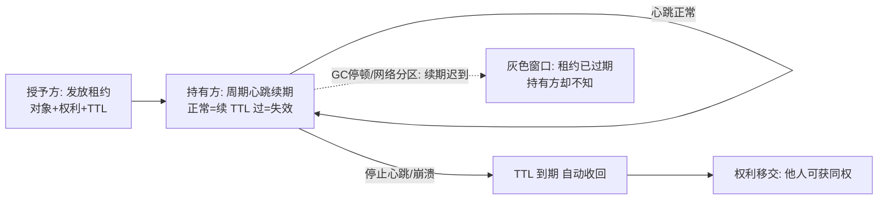
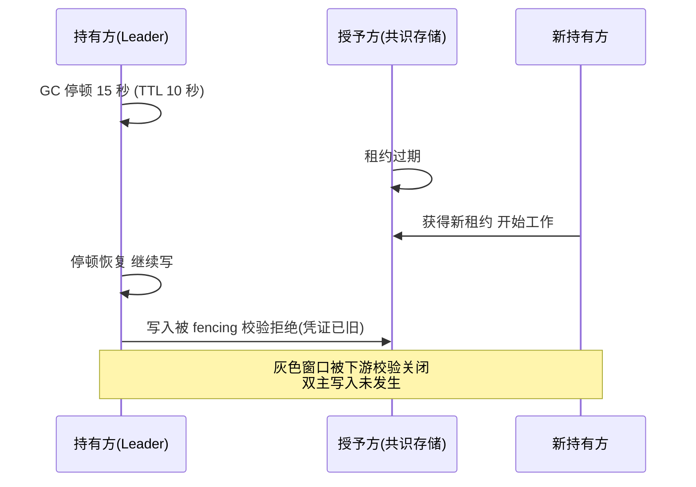

# 租约与心跳

> **一句话摘要**：租约（lease）= 带过期时间的授权契约——「授予你 X 权利，TTL 内有效，续期可延长，过期即收回」；心跳是租约的续期手段。它是分布式系统把「慢与死无法区分」变成「可判定契约」的通用机制——锁、选主、注册发现、配置订阅、缓存一致性，全部踩在租约之上。
> **本文核心**：租约把不可判定的「死没死」变成可判定的「续不续」——**权利 + TTL + 心跳续期 + 到期自动收回**四要素；灰色窗口（过期但持有方不知）是固有风险，fencing 与主动降权补上持有方的自知。

前置阅读：[分布式系统是什么与为什么难](./1_分布式系统是什么与为什么难-入门.md)。租约的两大应用见[分布式锁与选主](./12_分布式锁与选主-入门.md)。

## 1. 背景：为什么「授权」需要过期时间

上一章反复出现的困境：节点 10 秒没回音——死了还是慢了？如果授予是「永久的」（比如「你是 Leader」「你持的锁」「你注册的服务实例」），收回只能靠「确认它死了」——而这无法可靠确认（网络分区下，授予方看它死了，它自己活得好好的）。

租约把「永久授权」改成「限时授权」：**不需要确认死亡，到期自动失效**。授予方不再回答「它死了吗」，只回答「它还续期吗」——不可判定问题变成了可判定的计时问题。这是分布式系统设计里最重要的一次思维转换：**用时间换确定性**。

## 2. 核心机制：租约的四要素与心跳循环

四要素：**权利**（锁/Leader 身份/注册有效性/订阅有效性）、**TTL**（授权时长）、**续期**（心跳，通常 TTL 的 1/3 间隔）、**收回**（到期自动失效，无需协商）。灰色窗口是租约的固有风险：持有一方在「租约已过期」与「自己知晓过期」之间存在延迟（GC 停顿、网络断），窗口内它仍在行使权利——这就是双主/双持锁的机制根源，也是 fencing token（锁篇）与任期检查（选主）存在的原因。**租约解决「授予方的判定」， fencing 解决「持有方的自知」**——两半合起来才闭环。

TTL 的权衡公式：TTL 越长 → 心跳开销越小、网络抖动容忍越大，但故障发现越慢（最坏 TTL 时长才收回）；TTL 越短 → 故障切换快，但抖动误判多（频繁误收回）。主流量级：秒级（2-10s TTL，1/3 心跳），按「可接受的故障切换时间」反推。

## 3. 落地实践：租约机制的使用清单

1. **续期失败立即降权**：持有方心跳失败时，应**主动停止行使权利**（停止当 Leader/停止处理该锁的任务），而不是继续赌「过期能续上」——把灰色窗口压到最短。
2. **权利行使要带「租约校验」**：关键写入前向授予方确认租约仍有效（etcd 事务绑定租约/ZK 版本校验）——或直接用 fencing token 让下游校验（更便宜）。
3. **时钟纪律**：TTL 的测量用**本机单调时钟**（测时长安全），授予与过期的**判定**在授予方单侧完成（它不用猜持有方的钟）——跨机器比时间戳是禁手（见[分布式时钟](./9_分布式时钟-入门.md)）。
4. **心跳与业务隔离**：心跳线程独立于业务线程（业务卡死不影响续期？——这恰是要想清楚的语义：业务死了但心跳还在，租约不回收对不对？**心跳应表达「进程活着」，权利健康度要另有健康检查**）。

## 4. 生产视角：租约故障的形态

- **GC 停顿穿透 TTL**：持 Leader 停顿 15 秒 > TTL 10 秒 → 授予方收回、新 Leader 上位 → 旧 Leader 恢复继续写——双主窗口。防线三选一：租约校验写入（每次写前确认仍有效）、fencing token、暂停时自毁（检测到 STW 超阈值主动自杀进程——重启快于双主事故）。
- **心跳风暴**：实例数 × 心跳频率压垮注册中心（万级实例 × 秒级心跳 = 每秒万级请求）——续期批量化、心跳间隔自适应（稳定期拉长、临界期缩短）、读写分离（Observer 承接心跳）是标准处方。
- **TTL 与任务时长的错配**：批量任务预估 5 分钟，锁 TTL 10 秒——每 10 秒一次续期抖动都可能失锁。解法不是拉长 TTL（崩溃回收变慢），是「任务内部分片 + 每片短锁」或「任务接管协议（新持有者可检测半成品并续做——配合幂等）」。
- **时钟跳变击穿租约**：持有方时钟跳变导致「本地计算的剩余 TTL」错乱——再次呼应：TTL 判定单侧化（授予方判定），持有方只管按时续期不自行判过期（除非用于「主动降权」的保守策略）。

## 5. 主流系统怎么做：租约的实现载体

| 系统 | 租约形态 | 机制要点 |
|---|---|---|
| etcd | Lease 对象（Grant/KeepAlive/Revoke） | 键绑定租约，租约到期键集体消失——K8s Node 心跳即 etcd lease |
| ZooKeeper | 会话（sessionTimeout）+ 临时节点 | 会话即租约，临时节点随会话消亡——锁/成员管理的根基 |
| Redis | TTL + 续期（SET EX / 看门狗） | 无内建租约对象，靠键 TTL 模拟（弱于前两者：判定分散） |
| 注册中心（Nacos/Eureka） | 实例心跳 + 掉线摘除 | AP 系的租约宽松版：不摘除只标记不健康 |
| HTTP 世界 | DHCP/HTTP Lease（如 GitHub App token 过期） | 租约思想早已溢出到基础设施各层 |

规律：**「键/会话/对象 + TTL + 心跳续期」是租约的通用句式**——每个系统的差异只在「判定在谁、过期后东西怎么处理」。

## 6. 典型场景

- **服务注册发现**（注册级）：实例上线租约注册，心跳续期，宕机 TTL 后摘除——调用方拿到的是「带时效的服务列表」（摘除延迟 = TTL，这就是注册中心的一致性窗口）。
- **Leader 租约**（选主级）：Leader 身份 = 一份租约——任期/Term 就是「带编号的租约」，心跳是投票与日志复制本身（Raft 把心跳与复制合一，见[Raft 篇](./7_Raft共识算法-入门.md)）。
- **配置长轮询/订阅**（分发级）：客户端订阅有效期，超时未续则连接重建——配置中心的推送可靠性靠它兜底。
- **K8s 节点与租约对象**（编排级）：Node 的 lease 对象（默认 40s TTL）——kubelet 心跳续期，超时节点被标记 NotReady、Pod 驱逐流程启动。

## 7. 与相邻概念的区别

- **租约 vs 心跳**：心跳是「我还活着」的信号，租约是「权利在 T 秒内有效」的契约——心跳是租约的续期手段；没有租约的裸心跳（收到=活、没收到=死）在分区时会误判，租约把误判的代价限定为「过期后自动失效」。
- **租约 vs 超时重试**：超时是对「单次请求」的时间保护；租约是对「持续权利」的时间保护——一个管调用，一个管授权。
- **租约 vs 共识**：租约解决「授权时效」，不解决「唯一授予」——分区时两个授予方可以各发各的租约（双主）；**共识 + 租约**（Raft 的 Leader 租约）才同时解决唯一性与时效性。Redis 锁 vs 共识锁的差距就在这半环（锁篇的谱系）。
- **租约 vs TTL 缓存**：形态相同（时间失效），语义不同——缓存 TTL 是「性能优化（过期可重算）」，租约是「权利契约（过期必须停权）」。把租约当缓存写，是双主的开始。

## 8. 常见误区与不适用

- **「心跳没断就是健康的」**：心跳表达进程存活，不表达业务健康（线程池全堵但心跳线程还转）——权利健康要另有业务级健康检查（探针分层：liveness 与 readiness 的分工，见[容器系列](../../../../../devops/docker/入门层/从零开始认识Docker系列/0_系列导读-全景.md)）。
- **「TTL 设长一点保险」**：TTL 长了故障切换慢、误判少了——安全网换成了慢响应。正确方向：TTL 按切换目标定，抖动容忍交给续期重试与 jitter。
- **「过期了持有方自然会停」**：过期通知可能迟到（正是灰色窗口）——持有方侧必须有「主动降权 + fencing/租约校验」的自律，授予方单侧的过期不是闭环。
- **「心跳频率越高越可靠」**：高频心跳的收益边际递减（TTL 不变时，发现延迟由 TTL 决定），开销线性涨——心跳间隔 = TTL/3 是惯例平衡点。
- **不适用**：无「权利」语义的普通数据传输（重试/确认机制即可）；一次性任务（完成即结束，无需时效授权）——租约只属于「需要持续持有的权利」。

## 9. 你们可能会问

- **TTL 具体怎么定？** 从「可接受的最长故障切换时间」倒推：TTL = 切换目标时间 − 探测与移交耗时；再用「网络最大抖动 < TTL/3」验证误判风险——两个约束夹出取值区间。
- **续期请求丢了怎么办？** 单次丢失无害（下个周期补上即可，TTL 有余量）；连续丢失 = 网络故障信号，续期客户端要指数退避 + 失败计数主动降权。
- **etcd 租约和 ZK 会话选哪个？** 语义同族；在 K8s 生态内 etcd lease 更自然（K8s 自己就在用），ZK 存量生态用会话——按已有基础设施选，不为租约引入新组件。
- **「租约 + fencing」和「租约 + 每次写前校验」哪个好？** fencing 把校验下沉到下游（存储条件写入），免了每次写前的网络往返，且挡得更死（下游拒收旧凭证）——能 fencing 优先 fencing。
- **租约过期后持有方正在写一半怎么办？** 写操作要设计成可中断可续做（幂等 + 分片），配合下游 fencing 拒绝——「写到一半的权力移交」是分布式系统的常态而非异常，机制要为它设计（幂等篇的三层防线在这里闭环）。

## 10. 一句话总结 + 5W 速记卡 + 自测三问

**一句话总结**：租约 = 用「限时授权 + 到期自动收回」把不可判定的「死没死」变成可判定的「续不续」——TTL 定切换速度、心跳定续期节奏、fencing 补持有方的自知；它是锁/选主/注册/订阅四个场景的公共地基。

**5W 速记卡**：

| 维度 | 内容 |
|---|---|
| What | 权利 + TTL + 续期 + 自动收回四要素，灰色窗口与 fencing |
| Why | 「确认死亡」不可判定，限时授权把问题变成计时问题 |
| When | 锁、选主、服务注册、订阅分发的设计与运维 |
| Where | etcd lease / ZK 会话 / Redis TTL / 注册中心心跳 |
| How | 按切换目标定 TTL → 独立心跳线程 → 持有方主动降权 → 下游 fencing |

**自测三问**：

1. 你系统的锁/Leader 租约 TTL 是多少？怎么定出来的？
2. 持有方在 GC 停顿穿透 TTL 的场景下，恢复后第一件事是检查租约还是继续干活？
3. 你的心跳线程和业务线程隔离吗？业务假死时心跳还在续吗——这个语义是你想要的吗？

---

**下篇预告**：多数派为什么能相交、Gossip 怎么指数收敛——下一篇[Quorum 与 Gossip](./14_Quorum与Gossip-入门.md)讲「靠多数做决定」与「靠流行病传消息」两大基础协议。

**🎯 核心带走**：

- **核心一句话**：租约 = 限时授权 + 到期自动收回，用时间换确定性。
- **链条复述**：授予方发租约 → 持有方心跳续期 → 停止续期 TTL 到期自动失效 → 权利移交；灰色窗口由 fencing/写前校验/主动降权三选一兜底。
- **失效点与边界**：心跳表达进程存活不表达业务健康；TTL 判定必须在授予方单侧；「过期必停」靠持有方自律不是自动发生。

💡 **实战提示**：TTL 从切换目标倒推（心跳 = TTL/3）；心跳线程与业务线程分家的语义要想清楚；持锁/当 Leader 期间 GC 停顿超 TTL 是必演练场景；能 fencing 优先 fencing。

**开放问题**：如果进程可以「检测到自己 STW 超阈值就自毁」，租约的灰色窗口还能在哪些场景漏出来？

**决策（何时用）**：一切「需要持续持有的权利」（锁/Leader/注册/订阅）推荐租约化；推荐 etcd lease / ZK 会话这类内建租约，Redis TTL 模拟版只用于效率型场景。

从 Gray & Cheriton 1989 的租约论文到 K8s Node lease，机制三十多年未变——变的只是 TTL 从秒级演进到可配置策略化。

---

## 📌 数据与事实声明

租约机制的系统实现（etcd lease/ZK 会话/K8s Node lease 默认 40s）为各官方文档公开内容；TTL/心跳 1:3 比例与秒级量级为业内惯例值；GC 停顿穿透场景为公开运维实践的机制级归纳。以官方文档为准。

## 📚 参考资料

| 类型 | 标题 | 来源 |
|---|---|---|
| 文档 | etcd: lease API / K8s: Node lease | etcd.io · kubernetes.io |
| 论文 | Lease: An Efficient Fault-Tolerant Mechanism for Distributed File Cache Consistency | Gray & Cheriton, SOSP（1989） |
| 系列文章 | 分布式锁与选主 / Raft（本系列） | 本仓库同系列 |
