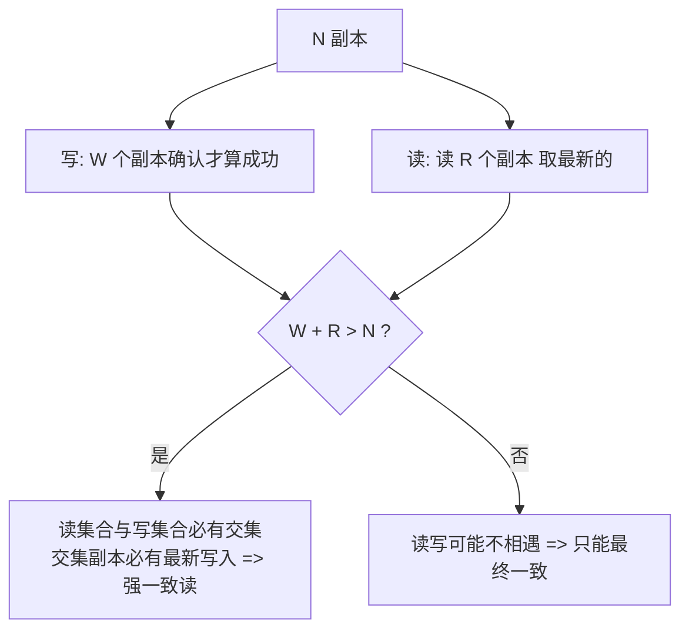

# Quorum 与 Gossip

> **一句话摘要**：两个无中心的分布式基础协议——Quorum（多数派仲裁）：读写的票数满足「读集合 ∩ 写集合 ≠ ∅」即可保证读到最新写入，是共识与强一致读的数学地基；Gossip（流行病协议）：节点随机交换信息、以指数速度收敛全局一致——是集群成员管理、去中心化状态传播的标准载体。
> **本文核心**：Quorum 用「**W+R>N 的票数相交**」保证读写必相遇（无协调方的强一致读地基，但不管并发写唯一性）；Gossip 用「**随机流行病传播**」以 O(log N) 轮收敛集群状态——一个管决定、一个管传播，是去中心化系统的左右手。

前置阅读：[共识问题与 Paxos](./6_共识问题与Paxos-入门.md)（多数派的应用）、[BASE 理论](./3_BASE理论-入门.md)（反熵收敛）。

## 1. 背景：两个协议回答两个不同的问题

去中心化（没有单一协调者）的系统要解决两类基础问题：

- **决策问题**：「这次写入算数吗？这个读能读到最新吗？」——需要一种**票数规则**让多数意见代表全局。Quorum 给出答案：任意多数集合必然相交，相交点保证读写相遇。
- **传播问题**：「新节点加入了、某节点挂了、新数据诞生了——怎么让全集群知道？」——没有总线，消息只能两两交换。Gossip 给出答案：随机流行病式传播，指数收敛。

两者经常同框出现（Cassandra：Quorum 管读写一致性 + Gossip 管集群成员与状态），但职责完全不同——**Quorum 做决定，Gossip 传消息**。

## 2. 核心机制一：Quorum 的数学与 NWR



- **相交定理**：写成功需要 W 个副本确认，读需要收集 R 个副本——只要 **W + R > N**，任意读集合与写集合必有公共副本，读到的一定包含最新写入（版本比较后取新）。这是「无协调方也能强一致读」的数学根基：不需要先问谁，票数规则自己保证相遇。
- **NWR 调参**（Dynamo 系的公开设计语言）：以 N=3 为例——**W=N, R=1**（写全副本，读任一副本即可信：写慢读快）；**W=1, R=N**（写快，读要遍历：写多读少反着用）；**W=R=2（Quorum 中点）**：读写各过半，容错与延迟均衡——「挂 1 个副本仍可读写」。**W + R > N 只是读旧的充分条件的反面（保证相遇），不等于线性一致**——并发写多个值时的冲突（两个写都凑够了 W）需要版本向量/业务合并裁决，这是 Quorum 与共识的本质差距：**Quorum 保证相遇，共识保证唯一**。
- **与共识的关系**：Raft/Paxos 的「多数派提交」就是 W = 过半 的特例，加上「编号定序 + 冲突继承」后才升级为共识。Quorum 是地基，共识是地基上的楼房（Paxos 篇的谱系）。

## 3. 核心机制二：Gossip 的传播与收敛

```mermaid
flowchart TD
    S[节点A 获得新状态] --> P[每周期随机挑 1-3 个节点交换差异]
    P --> P2[收到新信息的节点 继续随机传播]
    P2 --> X[感染数按指数增长: 1 -> 3 -> 9 -> 27...]
    X --> F[log(N) 轮后 全集群收敛<br/>信息冗余传播 天然抗节点故障]
```

- **传播模型**：像流行病——每个周期把「新消息」随机传染给少量邻居，信息量指数扩散；N 节点约 O(log N) 轮收敛（千节点 ≈ 十几轮）。**冗余即可靠**：单点失效、消息丢失都不影响整体收敛（别的路径还会传）。
- **两种工作模式**：**反熵（anti-entropy）**——周期性比对与补齐差异，目标是「最终数据一致」（Cassandra 的副本同步、Redis Cluster 的配置传播）；**谣言传播（rumor mongering）**——新事件爆发式扩散一次，目标是「消息尽快全网知道」（故障通知、成员变更）。两者常组合：谣言管时效、反熵管完整。
- **代价与权衡**：收敛延迟不可精确保证（随机性）+ 冗余消息占用带宽 + 每节点要维护版本/时间戳判新旧（不能靠墙钟，用计数器——[时钟篇](./9_分布式时钟-入门.md)的应用）。参数（交换周期、每轮扇出）是「收敛速度 × 带宽开销」的旋钮。

## 4. 落地实践：两协议的使用场景

- **什么时候用 Quorum 思维**：设计多副本读写时自问「W 和 R 各是多少、加起来大于 N 吗」——即便不用 Cassandra，主从复制场景的「同步副本数」设置（MySQL 半同步的 `after-sync`、Redis WAIT）本质都是 Quorum 调参。
- **什么时候用 Gossip 思维**：集群状态（成员、负载、故障标记）需要去中心化传播时——自研系统的节点状态同步，先想 Gossip（随机 + 周期 + 差异交换三个要素即可起步），再想「中心化推送」（引入协调点的代价）。
- **组合范式**：成员发现用 Gossip（谁在线，最终一致即可）+ 数据读写用 Quorum（强一致需求）+ 元数据用共识（需要唯一决定时）——三层协议各司其职，是去中心化系统的标准分层。

## 5. 生产视角：协议参数引发的故障

- **Quorum 配错 = 假性高可用**：N=3 配 W=1, R=1（W+R=2 ≤ 3）——读写可能不相遇，读到旧值还以为「副本高可用很稳」。AP 存储的性能参数每一项都要按相交定理核对，不能只看「挂几台还能用」。
- **Gossip 风暴**：节点数暴涨（数千）或交换频率过高，冗余消息占满带宽——大集群要调低扇出/拉长周期、或分层 Gossip（集群内 gossip + 集群间汇总）。故障形态是「配置变更传播慢 + 心跳带宽告警」同时出现。
- **成员抖动放大**：Gossip 对「反复上下线」的节点会反复传播其状态（加入/离开消息风暴）——需要**滞回设计**（怀疑状态、多轮确认再定论，如 SWIM 协议的 suspicion 机制）。故障形态：一个网络抖动的节点让全集群状态表翻滚。
- **时钟依赖的隐藏雷**：Gossip 判新旧若用墙钟时间戳，时钟漂移会让新状态被判旧、被旧状态覆盖——版本号/计数器是唯一安全选择（时钟篇纪律的又一次落地）。

## 6. 典型场景

- **Cassandra/DynamoDB 类存储**（Quorum+Gossip 全家桶）：NWR 读写 + Gossip 集群成员 + 反熵修复——两协议的教科书组合。
- **Redis Cluster**（Gossip 为主）：节点间 Gossip 传播槽位映射与存活状态，客户端直连路由——「配置信息最终一致 + 客户端重定向」的去中心化形态。
- **MySQL 半同步复制**（Quorum 思维移植）：`AFTER_SYNC` 半同步 = 「主 + 至少 1 从确认」的 W=2（N=2 特例）——关系型数据库里的 Quorum 简化版。
- **自研集群的成员管理**（Gossip 起步）：服务网格控制面、任务调度集群的节点发现——SWIM 类协议（Gossip + 怀疑机制）是参考蓝本。

## 7. 与相邻概念的区别

- **Quorum vs 共识**：Quorum 是票数规则（保证读写相遇）；共识是决策机制（保证唯一结果不可推翻）——多数派提交是共识对 Quorum 的使用，但 Quorum 读写本身不处理并发写冲突。
- **Gossip vs 消息队列广播**：MQ 广播有中心 broker（可靠、有序、单点）；Gossip 无中心（弹性、最终一致、无序）——可靠性语义与拓扑假设都不同。
- **Gossip vs 心跳**：心跳是「对上级/对等方的存活信号」（1:1 或 1:n 固定关系）；Gossip 是「状态随机的全群传播」——心跳管存活判定（租约篇），Gossip 管状态扩散，常组合（SWIM = Gossip 传播成员表 + 直接探测定生死）。
- **反熵 vs 读修复**：读修复在读路径顺手补齐（Quorum 读时的副产品）；反熵是后台主动对账（周期性全量/增量）——一被动一主动，BASE 收敛机制的两员（BASE 篇的四类收敛）。

## 8. 常见误区与不适用

- **「W+R>N 就是强一致」**：它保证「读到已确认的写入」（相遇性），不解决并发写的唯一性——两个并发写各自凑满 W，谁赢未定（需要版本裁决）。线性一致还要求实时性约束（线性一致篇的判定法）。
- **「Gossip 收敛 = 秒级全网一致」**：收敛是概率性的，轮数是期望值不是上限——网络分区时收敛无限推迟。依赖「必达时限」的需求（配置强一致分发）不适用 Gossip，要用共识。
- **「Gossip 只适合小集群」**：万级节点仍然可行（log 收敛），但带宽与延迟参数要随规模重调 + 分层——「集群规模翻倍参数不动」是故障源。
- **「Quorum 副本越多越可靠」**：N 大则 W+R 门槛水涨船高，写延迟随 W 上升——N/W/R 是「一致性 × 可用性 × 延迟」的三维权衡，没有免费的 N。
- **不适用**：需要全序与唯一决定的位置（用共识）；小规模中心化架构（配置中心推送更简单可控）——两协议是去中心化场景的工具，不是普适默认。

## 9. 你们可能会问

- **为什么是「过半」而不是「三分之一」或「三分之二」？** 过半是「任意两个多数集合必相交」的最小门槛——低于过半两组可能不相交（决策冲突），高于过半徒增确认成本。数学最优恰好是过半。
- **Gossip 消息会无限循环吗？** 不会——每条消息带版本/轮次标记，节点对「已知信息」不再转发；谣言模式还有「传播热情衰减」（概率性停止）。协议自带终止机制。
- **Redis Cluster 为什么不用共识管理槽位？** 槽位映射是「最终一致即可 + 客户端可重试（MOVED 重定向）」的状态——Gossip 够用且去中心化运维简单；共识留给「谁该接管槽位」的故障决策（多数派投票）。
- **怎么给自己的系统定 W 和 R？** 从「读多还是写多」定偏重（读多 R 小 W 大），从「可容忍挂几台」定下限（挂 f 台则 W>R−f 且 W>f 的交集约束），再压测延迟校准。
- **SWIM 协议是什么？** Gossip 成员管理的经典协议（Stanford 论文）：Gossip 传成员表 + 直接/间接探测定生死 + 怀疑机制防误判——自研成员发现从它抄作业即可。

## 10. 一句话总结 + 5W 速记卡 + 自测三问

**一句话总结**：Quorum 用「W+R>N 的票数相交」保证读写相遇（共识的地基，不等于共识），Gossip 用「随机流行病传播」以 O(log N) 轮收敛集群状态（最终一致、冗余抗故障）——一个管决定、一个管传播，是去中心化系统的左右手。

**5W 速记卡**：

| 维度 | 内容 |
|---|---|
| What | 相交定理与 NWR 调参 + Gossip 传播/反熵/收敛轮数 |
| Why | 无中心系统需要「票数规则做决定」与「随机传播达收敛」 |
| When | 多副本读写设计、集群成员管理、状态传播方案评审 |
| Where | Cassandra/Redis Cluster/Dynamo 系、半同步复制、SWIM 类协议 |
| How | NWR 按读写偏重与容错定 → Gossip 按规模定扇出周期 → 版本号判新旧 |

**自测三问**：

1. 你用的 AP 存储，NWR（或等价参数）是多少？W+R 大于 N 吗？
2. 你的集群成员状态靠什么传播？一个反复抖动的节点会引发状态风暴吗？
3. 你的系统里有没有「用墙钟时间戳判新旧」的 Gossip 类逻辑？

---

**下篇预告**：ZK/etcd/Consul 三大协调服务怎么选——下一篇[协调服务选型](./15_协调服务选型-入门.md)用全系列的机制词汇做一次横向对比收尾。


**🎯 核心带走**：

- **核心一句话**：票数相交保相遇，流行病传播保收敛——两协议各管一半的去中心化。
- **链条复述**：多副本读写 → NWR 定参（读偏重 R 小、容错定下限）→ 相交定理核对；集群状态 → Gossip 周期 + 扇出 → 版本号判新旧 → 反熵兜完整。
- **失效点与边界**：W+R>N ≠ 线性一致（并发写唯一性要版本裁决）；Gossip 收敛是概率性（分区时无限推迟）；墙钟判新旧是隐藏雷。

💡 **实战提示**：AP 存储的 NWR 每项按相交定理核对（别只看「挂几台能用」）；Gossip 参数随集群规模重调 + 分层；成员抖动要滞回设计（怀疑多轮再定论）；判新旧只用计数器。

**开放问题**：当集群规模到十万节点级，Gossip 的全表交换会成为瓶颈吗——分层、全量快照+增量、还是换共识？

**决策（何时用）**：多副本读写推荐按 NWR 设计并核对相交；成员/状态传播推荐 Gossip（SWIM 蓝本）；需要唯一决定与强时限的场景推荐换共识——推荐三协议分层组合（Gossip 成员 + Quorum 读写 + 共识元数据）。

从 Dynamo 论文到 SWIM 再到 Redis Cluster 的演化，两协议二十年间只被优化未被替代——「相交」与「流行病」已是去中心化的数学底座。


---

## 📌 数据与事实声明

Quorum 相交定理与 NWR 出自 Dynamo 论文（DeCandia et al., SOSP 2007）；Gossip/SWIM 协议为公开学术成果（Birman 等；SWIM: Das et al., DSN 2002）；Cassandra/Redis Cluster 机制为官方文档内容。收敛轮数量级为协议理论值，实际受网络与参数影响。

## 📚 参考资料

| 类型 | 标题 | 来源 |
|---|---|---|
| 论文 | Dynamo: Amazon's Highly Available Key-value Store | SOSP（2007） |
| 论文 | SWIM: Scalable Weakly-consistent Infection-style Process Group Membership Protocol | DSN（2002） |
| 文档 | Redis Cluster specification / Cassandra architecture | redis.io · cassandra.apache.org |
| 系列文章 | 共识问题与 Paxos / BASE 理论（本系列） | 本仓库同系列 |
