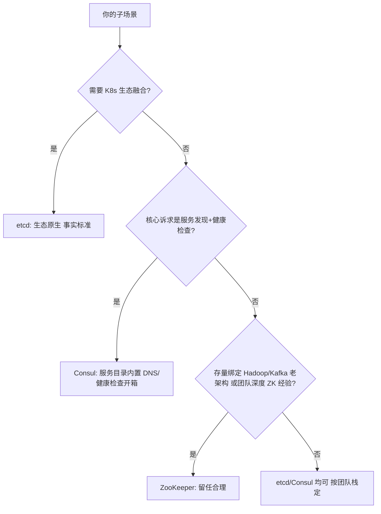
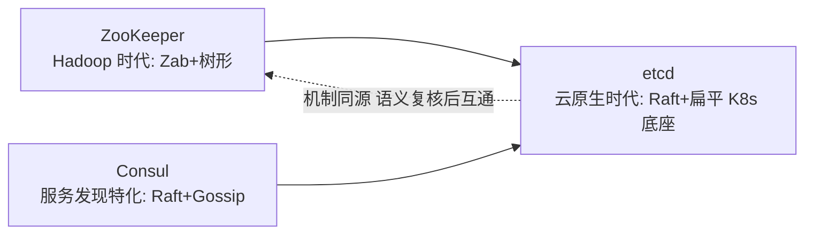

# 协调服务选型：ZooKeeper vs etcd vs Consul

> **一句话摘要**：三大协调服务都是「共识 + 租约 + 高阶原语」的组合体，差异在协议家族（Zab vs Raft）、数据模型（树形 vs 扁平）、生态代际（Hadoop 时代 vs 云原生时代）；选型的第一问不是「哪个强」，是「你要它解决什么场景」——选主/配置/锁/成员管理四类场景的答案并不相同。
> **本文核心**：三大协调服务同属 CP 共识家族，差异在**协议代际（Zab/Raft）、数据模型、生态位**——选型三步：场景定 CP/AP、生态定品牌、存量定留任；它们是「小而关键的控制面」，不是数据库也不是注册中心产品。

前置阅读：本系列[Zab 与 ZooKeeper](./8_Zab协议与ZooKeeper-入门.md)、[Raft](./7_Raft共识算法-入门.md)、[租约与心跳](./13_租约与心跳-入门.md)。

## 1. 背景：为什么需要一张选型对照

协调服务是分布式系统的「公共基础设施」——锁、选主、配置、服务发现、成员管理都指望它。但三巨头（ZooKeeper/etcd/Consul）的资料各说各话，选型常常变成「团队熟悉谁就用谁」。本篇用全系列的机制词汇（共识/租约/Quorum/Gossip/一致性模型）把它们放到一张表里，让选型回到场景与机制，而不是情怀与惯性。

先给结论框架：**三者同源（CP 共识系），差异在边界**——ZK 是 Hadoop 时代的老牌（Zab + 树形 + Watch），etcd 是云原生时代的标准（Raft + 扁平 + 租约/Watch，K8s 底座），Consul 是服务发现特化型（Raft + Gossip 混合 + 服务目录内置）。

## 2. 核心机制：横向对照表

| 维度 | ZooKeeper | etcd | Consul |
|---|---|---|---|
| 协议 | Zab（Paxos 族） | Raft（Paxos 族） | Raft（元数据）+ Gossip（成员/发现） |
| 数据模型 | 树形 ZNode + 临时/顺序节点 | 扁平 KV + 前缀 + 租约绑定 | KV + 服务目录（服务/健康检查一等公民） |
| 一致性读语义 | 默认读 Follower（可能旧），`sync()` 对齐 | **默认线性一致读**（ReadIndex，可降级） | 默认读 Leader（Raft），一致性参数可选 |
| 租约机制 | 会话（sessionTimeout）+ 临时节点 | Lease 对象（Grant/KeepAlive） | 会话（Session）+ TTL 健康检查 |
| Watch | 一次性触发（需重注册） | 持续 Watch + 历史版本回放（revision） | blocking query（阻塞查询 + index） |
| 高阶能力 | 锁/选主 recipes（客户端库实现） | election/lock API（服务端内建） | 服务发现/DNS/健康检查内建 |
| 生态代际 | Hadoop/Kafka(旧)/Dubbo 存量 | K8s/云原生事实标准 | HashiCorp 生态（Nomad/Vault 联动） |

三个最容易被忽视的语义差：① **默认读一致性相反**（etcd 线性一致 vs ZK 读可能旧）——迁移时读写假设全部要复核；② **Watch 语义不同**（ZK 一次性、etcd 持续+可回放）——依赖 Watch 的代码不是改个 SDK 就能迁；③ **服务发现的开箱度**（Consul 内置健康检查/DNS，ZK/etcd 要自建注册语义）——「协调存储」与「服务发现产品」的定位差。

## 3. 落地实践：四类场景的推荐与理由

- **选主/分布式锁**（机制见[锁篇](./12_分布式锁与选主-入门.md)）：三者皆可（CP 共识背书）；K8s 生态内 etcd 的 election API 最顺（服务端内建，少一层客户端库）；ZK 的临时顺序节点是公平锁的经典实现；Consul 的 session 锁亦可。判定项：已有哪个集群 + 客户端库成熟度。
- **配置中心**（发布订阅语义）：**自建强一致配置分发**三者皆可但都要自己补「灰度/回滚/审计」——行业现实是直接用配置中心产品（Nacos/Apollo，见服务治理子域），共识存储只做其底层。etcd 的 revision 回放让「配置变更历史重放」最优雅。
- **服务发现**（注册+健康检查）：**AP 需求（分区可用）三者都不合适**——它们是 CP（分区时少数派不可用），注册中心场景的主流是 AP 产品（Eureka/Nacos AP 模式）；CP 需求（强一致的实例列表，如内部 RPC 精确寻址）Consul/etcd 合适。**CP vs AP 的第一性判断优先于品牌选择**（CAP 篇的注册中心图谱）。
- **K8s/云原生基础设施**：没有选择——etcd 是 K8s 的存储底座，运维能力建设围绕它展开；其他组件「消费」同一套 etcd 运维能力是顺势。

## 4. 生产视角：协调服务的运维共性

- **它们都是「小而关键」**：存元数据不存业务数据（容量与吞吐墙）；挂了全集群「降级但通常不崩」（客户端有本地缓存/快照兜底）——但「重新选主窗口」内的变更全部冻结。监控三件：可用性（多数派存活）、延迟（提交 P99）、磁盘（fsync 延迟与容量）。
- **部署拓扑决定一切**：3/5 副本跨故障域；跨机房部署要算「多数派在哪边」（跨城延迟让提交变慢，主流是同城部署 + 异地备份）——共识集群的容量与延迟规划（Raft 篇的多数派纪律）。
- **版本升级的谨慎**：共识协议的版本兼容有窗口（etcd 3.4→3.5 有 API 变更、ZK 3.x 跨版本选举协议变化）——升级前读 release note 的协议兼容节、灰度升级一节点一验证。
- **客户端容错是使用方责任**：会话过期重连、Watch 断线重注册、请求重试（幂等）——协调服务的客户端库质量参差，封装一层统一的「协调客户端」收口这些纪律，是中大型团队的标准做法。

## 5. 主流方案怎么做：选型的决策要素汇总

| 决策要素 | 权重最高的场景 | 建议 |
|---|---|---|
| 生态位 | K8s/云原生项目 | etcd（事实标准，运维资料最全） |
| 存量绑定 | Hadoop/Kafka 旧版/Dubbo 老注册 | ZooKeeper 留任（迁移收益 < 风险），新模块不新增依赖 |
| 服务发现为核心 | 内部服务目录 + 健康检查 + DNS | Consul（开箱度最高） |
| AP 优先 | 注册中心（分区可用优先） | 三者皆不选——用 AP 产品（Nacos/Eureka 模式） |
| 自建强一致原语 | 锁/选主/配置底层 | etcd/ZK/Consul 任一，按已有集群复用 |

规律：**协调服务选型 = 「场景定 CP/AP → 生态定品牌 → 存量定留任」三步**；最大的坑是用 CP 协调存储硬扛 AP 场景（注册中心），或为「一个锁」引入一个新共识集群（锁篇的过度设计判定）。

## 6. 典型场景

- **K8s 平台团队**（etcd 垂直深耕）：etcd 运维能力（备份/恢复/扩容/慢盘治理）是平台的核心资产，业务选主/锁复用同一集群。
- **Hadoop 存量大厂**（ZK 留任）：老链路稳定运行，ZK 运维经验成熟——新增能力优先复用 ZK，新独立域评估 etcd，避免双栈蔓延。
- **多数据中心服务目录**（Consul 形态）：跨机房服务发现 + 健康检查 + DNS 接入，Consul 的 WAN federation（Gossip 跨域）是对口场景。

## 7. 与相邻概念的区别

- **协调服务 vs 注册中心**：前者是「机制底座」（共识存储 + 原语），后者是「场景产品」（注册语义/健康检查/负载策略内置）——用 etcd 裸做注册中心 = 自己把产品层重写一遍（边界见服务治理子域的注册发现主题）。
- **协调服务 vs 配置中心**：同理——配置中心产品的灰度/回滚/推送可靠性是产品能力，共识存储只是其可选底层。
- **etcd vs Redis（锁场景）**：CP vs 效率型的谱系差（锁篇），不因「都是 KV」而混为一谈。
- **本篇 vs 全系列**：本篇是理论系列的收尾应用——对照表里每个格子都对应前一篇的机制（Raft/Zab/租约/Gossip/CAP），单点记忆不如体系回忆。

## 8. 常见误区与不适用

- **「ZK 过时了，全部换 etcd」**：存量 ZK 的迁移收益要算（客户端改造、语义复核——Watch 与默认读一致性的差异最容易翻车）；「留任存量、新增择优」是工程常态。
- **「Consul/ZK/etcd 可以直接当注册中心用」**：能，但健康检查语义、摘除策略、负载均衡视图都要自建——产品级注册中心的缺口不在存储在语义（Nacos/Eureka 的价值在此）。
- **「协调服务挂了系统就全挂」**：设计良好的使用方（本地缓存 + 快照兜底 + 降级预案）在协调服务不可用时「降级运行」——协调服务是控制面不是数据面，故障演练要覆盖它。
- **「一个集群存万物」**：把业务数据、大配置、高频计数塞进共识存储——容量与吞吐墙立刻到；「小而关键」的定位纪律（Paxos 篇）。
- **不适用**：AP 场景（分区可用的注册发现）当主存储；海量数据（任何共识存储都不合适）——CP 协调服务的适用域是「小数据的唯一决定」。

## 9. 你们可能会问

- **新项目起步，无存量无绑定，选哪个？** K8s 生态内直接 etcd（顺理成章）；纯服务发现诉求 Consul；都不沾边时 etcd（资料与客户端库最多）。
- **从 ZK 迁到 etcd 最大的坑？** 两个语义差：默认读一致性（ZK 旧 → etcd 线性一致，读性能模型变了）与 Watch（一次性 → 持续可回放，事件处理代码要重写去重逻辑）——迁移评审的两个必查项。
- **三者的性能量级？** 同为共识系，单集群写吞吐同量级（千级 ops 受 fsync 与多数派约束）——差异不在性能在语义与生态，性能不是选型主轴。
- **需要多机房部署协调服务吗？** 主流不做跨城共识（延迟杀提交吞吐）——同城多可用区 + 异地异步备份；跨城「各自协调域 + 上层数据同步」是正确形态。
- **协调服务要不要自建 vs 云托管？** 云托管（托管 etcd/ZK 服务）免运维但定制受限；自建能力是大厂标配（K8s 平台团队顺手）——按团队运维成熟度定，别为省小钱扛大风险。

## 10. 一句话总结 + 5W 速记卡 + 自测三问

**一句话总结**：三大协调服务同属 CP 共识家族，差异在协议代际、数据模型与生态位——选型三步走：场景定 CP/AP（注册中心 AP 场景别硬选 CP 品牌 consulting）、生态定品牌（K8s→etcd、HashiCorp→Consul、Hadoop 存量→ZK）、存量定留任；它们是「小而关键的控制面」，不是数据库也不是注册中心产品。

**5W 速记卡**：

| 维度 | 内容 |
|---|---|
| What | 三服务横向对照（协议/模型/读语义/租约/Watch/生态）+ 四场景推荐 |
| Why | 选型混淆品牌与场景，最大的坑是 CP/AP 错位与产品层缺位 |
| When | 新系统选协调组件、存量迁移评估、平台能力规划时 |
| Where | 选主/锁/配置底层/CP 服务发现/K8s 底座 |
| How | 场景定 CP/AP → 生态定品牌 → 存量定留任 → 客户端统一封装 |

**自测三问**：

1. 你现在的锁/选主跑在哪个协调服务上？当初按场景选的还是按熟悉度选的？
2. 你的「注册中心」是 CP 还是 AP？分区时它和调用方的行为定义清楚了吗？
3. 协调服务集群挂 10 分钟，你的系统会全崩还是降级？演练过吗？

---

## 本系列全 15 篇收官

理论地基（1-3）→ 一致性谱系（4-5）→ 共识家族（6-8）→ 时钟与幂等（9-10）→ 选型与新机制（11-15）——工程实现侧的对应展开在[分布式系统设计系列](../../../distributed-system-design/入门层/从零开始认识分布式系统设计系列/0_系列导读-全景.md)、[分布式事务系列](../../../distributed-transaction/入门层/从零开始认识分布式事务系列/0_系列导读-全景.md)与[分布式 ID 系列](../../../distributed-id/入门层/从零开始认识分布式ID系列/0_系列导读-全景.md)。

**🎯 核心带走**：

- **核心一句话**：同族不同代——机制词汇（共识/租约/Watch）相同，语义细节（默认读一致性/Watch 形态）与生态位各异。
- **链条复述**：场景判 CP/AP → 品牌按生态（K8s→etcd、HashiCorp→Consul、Hadoop→ZK）→ 迁移复核两处语义差（默认读、Watch）→ 客户端统一封装。
- **失效点与边界**：AP 场景（注册中心）不选这仨；海量数据不选；「协调服务挂了系统全崩」是使用方设计缺陷不是宿命。

💡 **实战提示**：新项目无绑定选 etcd；ZK 迁移先审「默认读一致性 + Watch」两处；为锁引入新共识集群前先想数据库约束；监控三件（多数派存活/提交 P99/fsync）。

**开放问题**：云托管共识服务普及后，「协调服务运维能力」还会是平台团队的护城河吗，还是只剩下「使用姿势」的纪律？

**决策（何时用）**：锁/选主/配置底层/CP 发现推荐这仨之一；AP 注册发现推荐 Nacos/Eureka 系；推荐「复用已有集群」优先——不为单点需求引入新基础设施。

**Trade-off（代价与反方案）**：每一步选型都是取舍——留任 ZK 换运维熟悉但背上旧协议包袱，迁 etcd 换生态但承担迁移风险与语义复核成本；Consul 的服务发现开箱度换来了 HashiCorp 生态绑定；云托管省运维但失去定制与数据主权。反方案永远存在，选型的成熟标志是把「放弃的那条路的代价」写下来，而不是只论证选中者。

协调服务的代际更替（ZK 时代 → etcd 时代）本质是基础设施向云原生范式演进的一部分——机制内核（共识 + 租约 + 原语）稳定，外壳随生态漂移。

---

## 📌 数据与事实声明

三者机制对照基于各自官方文档（ZooKeeper 3.9.x / etcd v3.7.x / Consul 主线，版本截至 2026-09 经 gh CLI 核实）；「默认读一致性」「Watch 语义」等关键差异点为文档明确内容；场景推荐为业内通行实践的机制级归纳。

## 📚 参考资料

| 类型 | 标题 | 来源 |
|---|---|---|
| 文档 | ZooKeeper / etcd / Consul 官方文档 | zookeeper.apache.org · etcd.io · consul.io |
| 图书 | 数据密集型应用系统设计（DDIA）第 9 章 | O'Reilly（2017 中译） |
| 系列文章 | 本系列 6-8 篇（共识家族）与 12-13 篇（锁与租约） | 本仓库同系列 |
