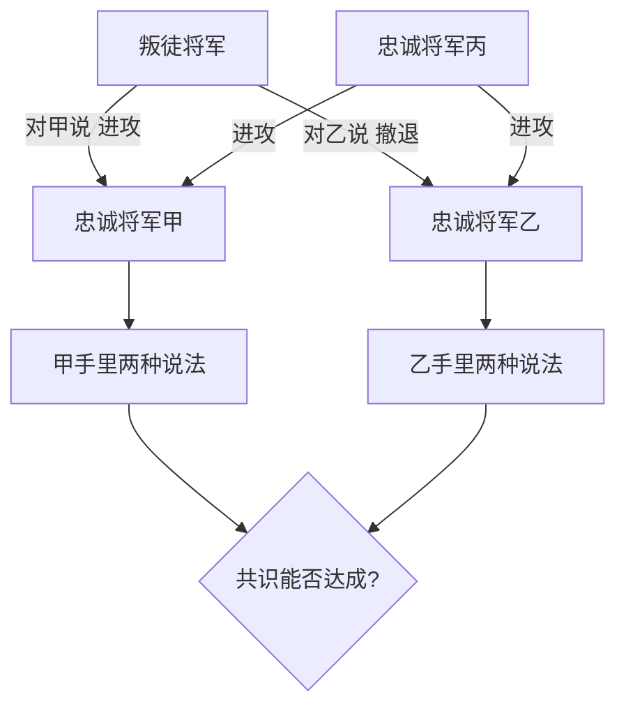
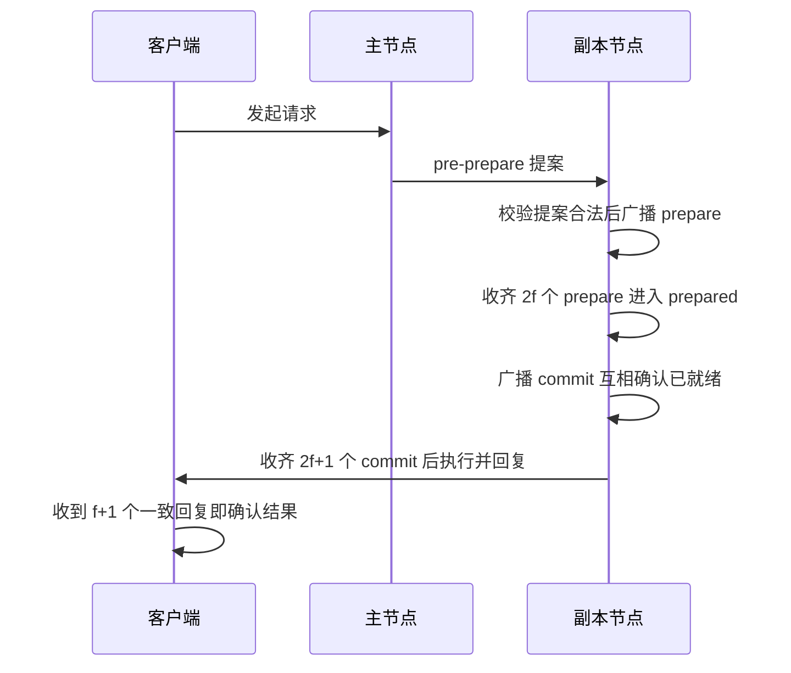

# 拜占庭容错：当节点不只崩溃、还会说谎

> **一句话摘要**：拜占庭容错（BFT）研究的是「节点可能任意作恶」时如何达成共识——作恶不只是停机，还包括说谎、对不同节点发不同消息。这与 Paxos/Raft 防的「崩溃故障」有本质区别：崩溃节点「沉默但诚实」，拜占庭节点「活跃且说谎」。代价也由此而来：容忍 f 个作恶节点至少需要 3f+1 个节点，PBFT 类协议消息复杂度 O(n²)——这套成本只有「节点互不信任」的场景才付得起，所以它在传统分布式系统里沉睡了近二十年，直到区块链把「开放互不信任网络」变成主流需求才大规模落地。
> **本文核心**：故障模型决定协议形态——**「会崩溃」与「会说谎」是两种量级的威胁，前者用多数派压制沉默，后者必须用足够冗余压制谎言；BFT 的一切代价（3f+1、O(n²)）都是「不信任任何节点」这个假设的价格**。

前置阅读：本系列[共识问题与 Paxos](./6_共识问题与Paxos-入门.md)、[Raft 共识算法](./7_Raft共识算法-入门.md)——崩溃容错下的共识是本文的对照面。

## 1. 问题是什么：一支互相怀疑的军队

1982 年，Lamport、Shostak、Pease 三人发表论文提出了这个问题（公开史实），用「拜占庭将军」的比喻命名：几支军队围了一座城，各将军分驻城外，只能靠传令兵通信；他们必须就「进攻还是撤退」达成一致——**要么一起进攻，要么一起撤退**，行动不一致就会被各个击破。麻烦在于：将军中可能有叛徒，叛徒会故意搞破坏——对不同的人说不同的话，让忠诚的将军们产生分歧。

注意这个问题的来源背景：它源于容错计算研究中的真实形态——传感器或子系统发生故障时，可能**向不同接收方发送不一致的数据**（不是安静地停止工作）。这意味着故障模型从「节点消失」扩展到了「节点撒谎」，这不是抬杠，是硬件与通信现实里真实存在的故障形态（航天与高可靠场景的经典假设，公开口径）。

忠诚将军面临两层任务：**一致性**（所有人最终选同一个行动）与**正确性**（叛徒不能强迫忠诚者选错误的行动）。数学结论（公开口径）：用口信传递、无人签名验证的条件下，**容忍 f 个叛徒至少需要 3f+1 个将军**——f=1 时要 4 个节点。为什么是 3f+1 而不是崩溃容错的 2f+1？因为作恶方的破坏力更强：多数派不仅要压制「沉默」（崩溃），还要压制「谎言与矛盾」，冗余必须再加一档。

## 2. 与 Crash 容错的区别：故障模型从「会停」升级到「会说谎」

这是本篇最核心的辨析，也是理解整个共识谱系的钥匙：

| 维度 | Crash 容错（Paxos/Raft/Zab） | 拜占庭容错（PBFT 族） |
|---|---|---|
| 故障形态 | 停机、失联、响应慢——但不说谎 | 任意行为：说谎、发矛盾消息、选择性响应、合谋 |
| 节点假设 | 忠诚（故障只会「少」不会「错」） | 不可信（故障会「错」，甚至故意「害」） |
| 容忍 f 故障所需节点 | 2f+1 | 3f+1 |
| 消息复杂度 | O(n)（主节点广播为主） | O(n²)（prepare/commit 全网互发） |
| 典型协议 | Paxos、Raft、Zab | PBFT、Tendermint、HotStuff |
| 典型场景 | 数据库复制、协调服务、消息队列 | 联盟链、公链、多方对账 |

两条差异的底层逻辑：其一，**为什么多数派还不够**——崩溃场景里多数派里的诚实节点给出的就是真话，简单多数即可裁决；拜占庭场景里作恶节点会积极混入多数派发假话，裁决需要「诚实节点占绝对多数」的冗余（3f+1 里的那个「+1 档」就是给谎言留的余量）。其二，**为什么消息复杂度暴涨**——崩溃容错可以信主节点（主节点坏了重选就是），拜占庭容错连主节点都不能信（主节点自己可能作恶），每个节点必须独立验证足够多的其他节点怎么投票，验证成本随节点数平方增长。

### 追问：能不能给 Raft 打个补丁当 BFT 用？

打破砂锅问一句：既然 Raft 结构清晰，给它的消息加签名验证、给日志加哈希校验，能不能低成本升级成拜占庭容错？反直觉的真相是：不能——问题不在「消息可被伪造」，而在「合法节点可以说谎」。Raft 的投票与日志比较逻辑假设每个节点的反馈是真实的，作恶节点可以完全「合法」地投出矛盾票：签名是真的、格式是对的、内容是假的。补丁式加固防的是外部伪造，防不了内部作恶——必须重构裁决逻辑本身（两轮投票、绝对多数、连主节点都可废黜），这正是 PBFT 从头设计的原因。再深一层：这也解释了为什么 BFT 协议家族没有「渐进迁移路径」——假设变了，协议的每一条裁决规则都要重推，不存在「兼容模式」。

### 一个实践叙事：传感器给出了矛盾数据

高可靠领域的一个经典形态（业内公开案例形态，匿名化处理）：某高可靠系统的三余度传感器中，一路单元发生故障后并未安静下线，而是**向不同控制通道输出了不一致的读数**——控制面收到的不是「少一路数据」，而是「互相矛盾的数据」。如果系统按「故障即沉默」的假设设计，矛盾输入会直接污染决策；正确做法是对多路读数做交叉表决，且表决器自身的冗余度要按「有输入可能撒谎」来设计。这个形态就是拜占庭假设的现实投影：**当「错误的传递」可能发生时，冗余设计的每一档都要重新算账**——3f+1 不是学术洁癖，是故障形态升级后的必然代价。

## 3. BFT 类算法怎么做：PBFT 的三阶段轮次

实用拜占庭容错（PBFT，1999 年公开论文口径）把「互相怀疑」变成可执行的协议轮次。核心机制：主节点提案，但**所有节点独立验证并互发确认**，任何一步都凑不够绝对多数就换主重来：

三个关键设计（公开口径）：其一，**两轮投票**（prepare + commit）——第一轮确认「大家看到了同一个提案」，第二轮确认「大家确认了大家的确认」，把「作恶者插手中间环节」的空间逐轮压缩；其二，**法定人数 2f+1**——即使 f 个作恶节点混入，诚实节点的 f+1 也构成可靠信息来源；其三，**视图切换（view change）**——主节点超时或不轨时，副本们用同样的多数派机制换掉它，把「信任主节点」的假设也消掉了。Raft 的选主是「主挂了换一个」，PBFT 的换主是「主可疑就废掉」——一字之差，成本天壤。

代价清单同样清楚：3f+1 的冗余意味着四分之一的节点配额被「防作恶」吃掉；O(n²) 的消息量让节点数到几十这个量级就逼近通信天花板（业内认知口径）——**PBFT 族适合「几十个互相怀疑的已知节点」，不适合「成千上万个开放节点」**。

## 4. 典型使用场景：什么时候才真的需要 BFT

- **联盟链/多方协作网络**：银行间结算、供应链多方记账、跨机构对账——参与方已知但互不信任，节点数几十级，恰好落在 PBFT 族的适用区间
- **公链基础设施**：节点完全开放、准入全无，作恶假设百分百成立——但十万级、百万级节点的规模超出了确定性 BFT 的通信天花板，于是转向 PoW/PoS 这类「概率性共识 + 经济惩罚」路线（比特币白皮书 2008 年公开，公开口径）：用算力或权益门槛压制女巫攻击，用「最长链/最重链」收敛分歧
- **高可靠嵌入式系统**：航天、飞控的多余度表决——传感器可能给出矛盾数据，拜占庭假设是设计基线

什么时候不需要（这也是最常见的误用）：**自己公司内部系统**。数据库复制、协调服务、消息队列里的节点都是自家资产，作恶前提不成立——「节点说谎」的威胁由安全体系（认证、鉴权、加密、审计）在协议外处置，共识协议只需防「崩溃」。给内部系统上 BFT，等于为不存在的敌人支付 O(n²) 的通信税。上下游协作系统的边界也一样：合作方作恶的防线是接口鉴权与对账，不是把内部共识换成 BFT。

## 5. 为什么区块链才是大规模落地的推手

> 💡 BFT 理论沉睡近二十年的原因不是理论不成熟，是**场景不成立**——传统系统的节点是「自己人」，为一个不存在的威胁付费违背工程理性。
> 💡 区块链第一次让「节点互不信任」成为**默认前提**而非异常——开放网络里每个参与者都可能是攻击者，作恶假设从例外变成常态。
> 💡 落地时注意区分两条技术路线：几十节点用确定性 BFT（PBFT 族），开放大规模节点用概率性共识（PoW/PoS）——「区块链」三个字下面是两套完全不同的机制。

从 1982 年论文提出、1999 年 PBFT 给出可工程化方案，到 2008 年之后区块链爆发、2025 年联盟链在金融结算与多方对账场景规模应用（公开口径），BFT 的落地史是一部「理论等待场景」的演进史——机制早已就绪，等的是那个「互不信任成为默认」的架构形态出现。

## 6. 常见误区

- **「分布式系统都要防拜占庭」**：故障模型要按部署形态选——内部受控环境选崩溃容错就够了，BFT 是「跨信任域」场景的专属工具，默认上 BFT 是严重的过度设计
- **「崩溃容错协议防得住作恶」**：Raft 防不了说谎的节点——它的多数派裁决建立在「节点忠实记录、忠实投票」的前提上，前提被打破时协议的每一条保证都失效
- **「3f+1 是性能参数不是安全参数」**：它是「容忍 f 个作恶者」的数学下限——少于这个数，理论保证直接失效，不是「性能打折」而是「不成立」
- **「PBFT 能无限扩展」**：O(n²) 的消息复杂度决定了它的天花板在几十节点量级（业内认知口径）——指望它扛开放大网络是路线选错，该看概率性共识

## 7. 你们可能会问

- **f 和 3f+1 具体怎么理解？** f 是可容忍的作恶节点数；3f+1 是总节点数下限——保证任何法定人数（2f+1）里诚实节点占绝对多数。f=1 时 4 个节点起步，f=3 时 10 个节点——冗余随威胁档位非线性增长
- **PoW/PoS 也算 BFT 吗？** 它们解决同一个问题（互不信任下的共识），但路线不同：PBFT 是确定性、即时终局、小规模；PoW/PoS 是概率性、最终一致、大规模——工程上算作「拜占庭环境下的共识」大家族，机制上是两个分支
- **内部系统什么情况下会「升级」到 BFT 需求？** 当信任边界外移时：多方共建平台、跨机构数据协作、开放生态的治理链——一旦「参与方可能作恶」成立，共识层的假设就要跟着换；判断标准是信任边界，不是技术时髦度
- **视图切换为什么是 PBFT 的命门？** 它把「主节点可疑」变成可恢复状态——没有它，作恶主节点能持续拖延或分裂数值；有了它，BFT 才从「理论协议」变成「可运维协议」，代价是切换流程本身也要防作恶，复杂度再次上台阶

## 8. 自测三问

1. 拜占庭故障与崩溃故障的本质区别是什么？各自的容错节点下限是多少？
2. PBFT 三阶段各自解决什么问题？为什么消息复杂度是 O(n²)？
3. 为什么传统分布式系统不防作恶，而区块链必须防？判断依据是什么？

## 9. 一句话总结 + 5W 速记卡

**一句话总结**：拜占庭容错把故障模型从「会停机」升级到「会说谎」——代价是 3f+1 冗余与 O(n²) 消息，这套代价只在「节点互不信任」的场景值得支付；内部系统防崩溃（Paxos/Raft），跨信任域防作恶（PBFT/概率性共识），判断的锚点是信任边界而不是技术偏好。

**5W 速记卡**：

| 维度 | 内容 |
|---|---|
| What | 节点可能任意作恶时达成共识的容错理论与协议族 |
| Why | 传感器矛盾数据、开放网络作恶等「说谎型故障」是真实形态，崩溃假设覆盖不了 |
| When | 参与方跨信任边界、互不信任成为默认前提时 |
| Where | 联盟链、公链、高可靠多余度系统、多方对账 |
| How | PBFT 两轮投票 + 2f+1 法定人数 + 视图切换；大规模开放网络转概率性共识 |

## 10. 开放问题

- BFT 与崩溃容错协议的融合边界（同一系统内两种故障模型的分级防御）在学术与工业界长期讨论。
- 大规模委员会抽样（从开放网络随机抽小委员会跑 BFT）能否在安全与性能间给出更优折中，是公链演进的关键变量——机制源头仍是本篇的 3f+1 与消息复杂度。
- 硬件信任根（TEE 类机制）能否把「作恶节点」降维成「可验证的崩溃节点」，从而压缩 BFT 的冗余代价，值得跟踪——若成立，本篇的代价清单会系统性缩水。

## 🎯 核心带走

- **核心一句话**：故障模型决定协议形态——「会崩溃」用 2f+1 多数派压制沉默，「会说谎」用 3f+1 冗余压制谎言；BFT 的所有代价都是「不信任任何节点」这个假设的价格
- **机制链**：拜占庭将军问题（一致性 + 正确性）→ 与崩溃容错的区别（威胁升级、冗余加档、复杂度平方）→ PBFT 三阶段（提案/两轮投票/视图切换）→ 场景分野（跨信任域才值得付费）
- **哪里会坏**：内部系统误上 BFT（过度设计）、跨机构协作误用崩溃容错（防线错位）、把 3f+1 当性能参数、指望 PBFT 扛开放大网络
- **边界**：本篇是概念层——共识问题与 Paxos/Raft 的机制细节见篇 6/7，协调服务选型见篇 15；区块链共识的经济机制（PoW/PoS）属另一个技术域

## 📌 数据与事实声明

- 写于 2026-09-18，理论口径以 1982 年拜占庭将军问题论文与 1999 年 PBFT 论文为准（公开学术文献）
- 3f+1、2f+1、O(n²)、f+1 回复确认等数字为公开协议口径；节点规模天花板为业内认知量级，非精确实测
- 实践叙事为公开案例形态的匿名化重述，不指向任何特定公司或系统

## 📚 参考资料

| 类型 | 标题 | 来源 |
|---|---|---|
| 原始论文 | The Byzantine Generals Problem（1982） | Lamport, Shostak, Pease，公开学术文献 |
| 原始论文 | Practical Byzantine Fault Tolerance（1999） | Castro 与 Liskov，公开学术文献 |
| 系列内 | 本系列篇 6《共识问题与 Paxos》、篇 7《Raft 共识算法》 | 同目录 |
| 原理书 | 《数据密集型应用系统设计》（一致性与共识章） | 公开出版 |
