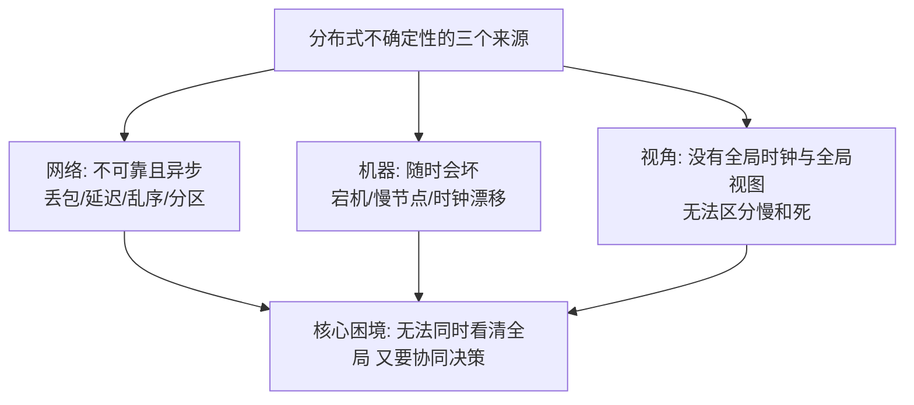
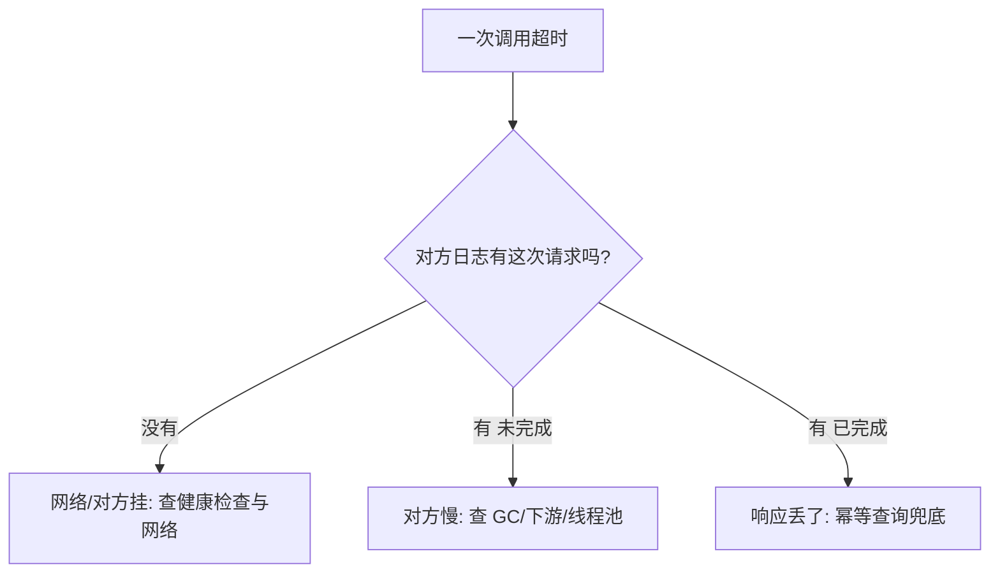

# 分布式系统是什么与为什么难

> **一句话摘要**：分布式系统是多台独立机器通过网络协作、对外表现为一个整体的系统；它难在一个根源——**网络与机器都不可靠，且你无法同时看清全局**。本文建立全系列的地基认知：不确定性的三个来源与工程上的应对总纲。
> **本文核心**：分布式的全部难点源于一句话——**消息传递替代了共享内存**，于是产生三大不确定性（网络不可靠/节点会坏/没有全局视图）→ 每个不确定性对应一类机制（重试幂等/租约/共识与 Gossip）→ 全系列就是这条机制链的展开。

前置阅读：[系列导读](./0_系列导读-全景.md)。本系列与[分布式系统设计系列](../../../distributed-system-design/入门层/从零开始认识分布式系统设计系列/0_系列导读-全景.md)互为理论与工程两翼——理论讲「为什么难」，设计讲「怎么办」。

## 1. 背景：为什么系统会走向分布式

> 量级分档意识：本文方法在十万级 QPS、千万级用户、亿级流量的场景下均需重新评估——量级变化时架构与参数需同步调整。

单机有物理天花板：CPU 核数、内存容量、磁盘 IO、网络带宽都有上限。业务增长推着系统跨过这道墙——垂直扩展买更强的机器很快碰到价格与物理极限，于是**水平扩展**：多台普通机器一起扛。再加上另外两个动机：**容错**（一台机器挂了服务不中断）与**组织协作**（康威定律下多团队需要多系统边界）。

分布式由此成为必然，但它的代价常被低估：多台机器协作引入了一整类单机系统不存在的问题。**理解这些问题，比背任何方案都重要**——后面所有的理论（CAP、共识、一致性模型）都是对「为什么难」的精确回答。

## 2. 核心机制：不确定性的三个来源

- **网络不可靠**：消息会丢、会延迟、会乱序，网络还可能**分区**（一部分节点与另一部分完全失联，各自活着）。最微妙的是「异步性」：你发出请求后，无法区分「对方没收到」「对方还在处理」「对方挂了」——这三种情况的表象完全一样（没回音）。
- **节点不可靠**：机器会宕机、会变慢（GC 停顿、磁盘抖动）、会磁盘损坏。慢节点比死节点更麻烦——它还占着角色，但干不动活。
- **没有全局视图**：分布式系统没有全局时钟——每台机器的时钟都在漂移（NTP 校时也有毫秒级误差），「事件先后的绝对顺序」在跨机器间无法直接判定；也没有全局状态快照——任何节点看到的都只是「过时的局部信息」。

「分布式系统的八大谬误」（业界经典的反直觉清单）是对这些根源的工程化总结：网络可靠、延迟为零、带宽无限、网络安全、拓扑不变、管理员只有一个、传输成本为零、网络同质——**每一条在真实系统里都不成立**。

## 3. 落地实践：工程师的应对总纲

理论根源不可消除，工程上有四条总纲：

1. **超时与重试是默认配置**：所有跨网络调用都要有超时（不做 = 无限等待）；重试要配退避与上限（防止重试风暴）。重试会带来重复，所以幂等是标配（本系列[幂等与去重](./10_幂等与去重-入门.md)专讲）。
2. **为「部分失败」设计**：单机系统要么成要么败，分布式系统的常态是「一部分成了、一部分没成」。每个跨服务操作都要回答「一半成功怎么办」——这正是[分布式事务系列](../../../distributed-transaction/入门层/从零开始认识分布式事务系列/0_系列导读-全景.md)的主题。
3. **不信任本地时钟**：跨机器的时间比较（「谁先发生」「租约是否过期」）要用逻辑时钟或共识序号，不用墙钟（本系列[分布式时钟篇](./9_分布式时钟-入门.md)专讲）。
4. **把「看不清全局」当作设计输入**：监控、选主、配置分发，都要回答「节点拿到的是过时信息时系统行为是否安全」——租约、Quorum、Gossip 都是为这个而生的机制（本系列新机制篇 12-15 展开）。

## 4. 生产视角：不确定性长什么样

- **「慢」与「死」的区分困境**：一次发布后某节点 GC 停顿 30 秒，上游认为它挂了把流量切走；30 秒后它恢复，发现自己在别人眼里「死过一次」——配置中心里它的状态、它本地的内存状态、它正在处理的请求，三方不一致。这类「僵尸节点」问题（租约机制的动机之一）在真实系统里反复出现。
- **网络分区的真实形态**：不只是「光缆被挖断」。交换机重启、防火墙规则变更、K8s 网络插件抖动，都可能造成「节点间互相看不见但各自正常」。分区时的系统行为（拒绝服务还是各干各的）正是 CAP 定理要回答的问题。
- **时钟漂移的实际量级**：虚拟机暂停恢复后时钟可能偏差数秒；NTP 校时的跳变会让「按时间排序的日志」出现倒序。金融与审计场景对「事件真实先后」的执念，必须落在逻辑时钟或全局授时服务上，不能靠机器时钟。
- **部分失败的典型账务形态**：订单服务调用库存服务扣减成功，但响应超时——订单侧按失败重试，库存侧实际已扣。没有幂等与对账兜底，这就是资损的起点（工程闭环见分布式事务系列）。

## 5. 主流系统怎么做：把理论吃进肚子的方式

| 机制 | 代表系统 | 应对的是哪个不确定性 |
|---|---|---|
| 心跳 + 租约 | etcd / ZooKeeper / 配置中心 | 节点「慢还是死」无法区分——用带 TTL 的契约显式表达「我还活着」 |
| 多数派共识 | etcd(Raft) / ZooKeeper(Zab) | 网络分区下两派无法同时说算——少数派停止服务 |
| 逻辑/混合时钟 | CockroachDB / TiDB(TSO) | 墙钟不可信——用逻辑序或集中授时定序 |
| Gossip 成员协议 | Redis Cluster / Consul | 全局视图不可得——让信息在局部交换中收敛 |
| 幂等键 + 去重表 | 支付/订单类系统标配 | 重试必然带来重复——重复执行要安全 |

规律：**主流分布式系统的每一个核心机制，都能对应到某一个不确定性来源**。读源码或文档时带着「它在解决哪个不确定性」的问题，机制立刻可理解（细节在本系列后续篇章逐一展开）。

## 6. 典型场景

- **微服务调用链**（工程级）：一次下单跨 5 个服务——超时、重试、幂等、对账四件套必须齐，任何一个缺席都在攒资损。
- **多机房容灾**（分区级）：机房间网络抖动是常态，数据同步机制必须回答「分区分裂时两边各自怎么工作」（同城双活的边界）。
- **监控与告警**（观测级）：告警系统自己也是分布式系统——「监控确认服务挂了」的判断本身可能因网络误判，需要多探测点交叉验证。

## 7. 与相邻概念的区别

- **分布式系统 vs 集群**：集群强调「同类多实例分担负载」（无状态复制）；分布式系统强调「多节点协作承担一个整体职责」（有协同与一致性问题）。集群是分布式的最简形态。
- **分布式 vs 并发**：并发是单机内多执行流交错（共享内存，可用锁协调）；分布式是多机器协作（无共享内存，只能靠消息）。锁在分布式里变成了另一回事（本系列[分布式锁篇](./12_分布式锁与选主-入门.md)）。
- **不可靠 vs 不安全**：网络不可靠是物理现实（丢包延迟）；不安全是攻击面（伪造篡改）。两者正交——本系列讨论前者，安全归安全工程域。

## 8. 常见误区与不适用

- **「内网很稳定，不用考虑分区」**：分区不只是物理断线——交换机抖动、容器网络抖动、防火墙变更都会造成逻辑分区。按「分区必然发生」设计是底线。
- **「加个超时重试就分布式了」**：超时重试只解决「调不到」这一个表象，带出重复执行、雪崩放大、数据不一致三个新问题——四件套（超时/重试/幂等/对账）少一件都是债。
- **「机器时钟够准了」**：NTP 误差 + 虚拟化暂停 + 跳变校时，跨机器毫秒级到秒级偏差是常态。凡涉及跨机器时序判断，一律不依赖墙钟。
- **「分布式就是微服务」**：微服务只是分布式的一种组织形态；数据库主从、缓存集群、消息队列内部都是分布式系统。理论适用于所有形态。

## 9. 你们可能会问

- **为什么不能把「分布式问题」彻底工程化消灭掉？** 因为根源是物理现实（光速限制下的网络延迟、硬件故障率）——只能管理不确定性，不能消灭它。所有「消除分布式复杂度」的产品（NewSQL 等）本质是把复杂度封装起来，不是消灭。
- **单机够用的系统要学这套吗？** 要——前提认知便宜（知道边界在哪），且系统总会长大；等出了分布式问题再学，学费是事故。
- **八大谬误谁总结的？** 源自 Sun Microsystems 工程实践的经验清单（公开技术史料），是业界共识式的存在，各家表述略有出入但内核一致。
- **怎么判断我的系统「算不算」分布式？** 看两个特征：有没有跨网络的协作决策（两个节点需要交换消息才能完成一件事）、有没有对一致性的要求（两边同时改会怎样）——有，就是。
- **这套理论和 K8s/云原生什么关系？** K8s 本身就是一个大型分布式系统（etcd 选主、调度、节点心跳全是本文机制的落地），学理论再看 K8s 的机制文档，处处能对上号。

## 10. 一句话总结 + 5W 速记卡 + 自测三问

**一句话总结**：分布式难在三个物理根源——网络不可靠、节点会坏、没有全局视图；工程总纲是超时重试幂等对账四件套、不信任时钟、为部分失败设计——后续所有理论都是对这三个根源的精确回应。

**5W 速记卡**：

| 维度 | 内容 |
|---|---|
| What | 多机器网络协作的系统 + 不确定性三根源 + 应对总纲 |
| Why | 单机物理天花板 + 容错 + 组织协作，分布式是必然 |
| When | 任何跨网络协作的设计与排障场景 |
| Where | 微服务、数据库集群、缓存、MQ、K8s——一切分布式形态 |
| How | 识别不确定性来源 → 对应机制（超时/租约/共识/Gossip） |

**自测三问**：

1. 你系统里最近一次「响应超时」，事后查清是「没收到」「处理中」还是「对方挂了」吗？
2. 你的代码里有没有依赖两台机器时钟一致性的判断？
3. 一次跨服务操作「一半成功」，你的系统现在的行为是什么？

---

**下篇预告**：分区时保一致性还是保可用性——下一篇[CAP 定理](./2_CAP定理-入门.md)给出这个选择的理论边界。

**🎯 核心带走**：

- **核心一句话**：分布式 = 用不可靠的消息传递换扩展性，三大不确定性是全部复杂度的根。
- **链条复述**：消息传递替代共享内存 → 网络不可靠/节点会坏/无全局视图 → 超时重试幂等对账（网络）、租约心跳（节点）、共识与 Gossip（视图）。
- **失效点与边界**：单机内不适用；「慢与死不可分」只能限定代价（租约），不能消除。

💡 **实战提示**：所有跨网络调用默认配超时；重试必配幂等；跨机时序判断禁用墙钟；为「一半成功」预先设计答案。

**开放问题**：如果把网络换成「可靠但延迟极高」的介质，三大不确定性里哪一个消失了，哪一个仍在？

**决策（何时用）**：跨网络协作 + 有一致性要求 = 分布式问题，按机制链逐项配齐；推荐在系统设计期就把四件套（超时/重试/幂等/对账）列成清单，而不是故障后补。

机制的工程形态仍在演进（从裸心跳到租约、从中心协调到去中心 Gossip），但三大不确定性自始至终未变——读新系统文档时先问「它在解哪个不确定性」，十年后依然好用。

---

## 📌 数据与事实声明

本文「八大谬误」源自 Sun Microsystems 公开工程史料；时钟漂移量级、GC 停顿形态为业内通用认知；对标机制（etcd/ZooKeeper/Redis Cluster 等）为公开设计的机制级概括，实现细节以官方文档为准。

## 📚 参考资料

| 类型 | 标题 | 来源 |
|---|---|---|
| 图书 | 数据密集型应用系统设计（DDIA）第 8 章 | O'Reilly（2017 中译） |
| 文章 | A Note on Distributed Computing / 八大谬误 | Sun 公开史料 |
| 系列文章 | 分布式系统设计系列（工程侧） | 本仓库 docs/architecture/system-design/ |
