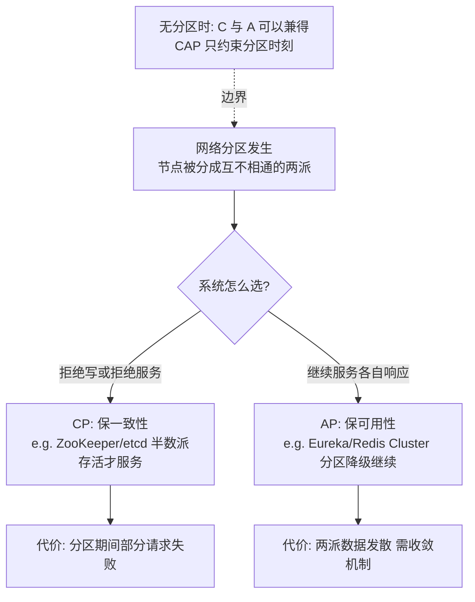
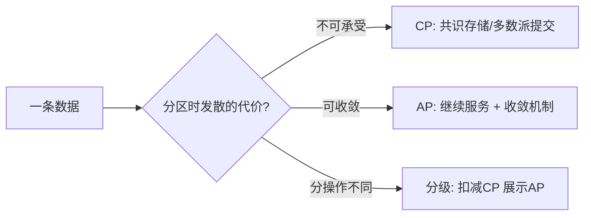

# CAP 定理

> **一句话摘要**：CAP 定理说：网络分区发生时，一致性与可用性**不可兼得**——C 与 A 之间必须选一个，而分区容忍 P 是必选项不是选项；它是分布式系统设计的边界条件，不是每个功能的决策工具——真正的工程判断在于「分区发生的那几秒，你的系统选 C 还是选 A」。
> **本文核心**：CAP 的机制链一句话——**分区把节点切成无法协调的两派 → 协调（C）与各自应答（A）逻辑互斥 → 二选一且只在分区时刻成立**；P 不是选项是现实。

前置阅读：[分布式系统是什么与为什么难](./1_分布式系统是什么与为什么难-入门.md)。工程落点（三大目标权衡）见[系统设计是什么与三大目标](../../../distributed-system-design/入门层/从零开始认识分布式系统设计系列/1_系统设计是什么与三大目标-入门.md)。

## 1. 背景：为什么需要 CAP 这个定理

> 量级分档意识：本文方法在十万级 QPS、千万级用户、亿级流量的场景下均需重新评估——量级变化时架构与参数需同步调整。

分区（网络断裂、节点失联）发生时，系统必须做一个不可能回避的选择：两边还在收请求——**是拒绝服务保数据一致（CP），还是继续服务容忍数据暂时不一致（AP）**？没有 CAP 定理之前，这个问题靠争论；2002 年 Eric Brewer 提出猜想、Gilbert & Lynch 证明之后，它成了边界条件：**你不可能设计出「分区时既完全一致又完全可用」的系统**。定理的价值不是给出答案，而是把「鱼与熊掌」变成显式的工程决策——每个分布式存储都要声明自己在分区时刻站在哪边。

## 2. 核心机制：C、A、P 的精确定义与推导

三个字母的精确含义（常见误读的根源在定义不清）：

- **一致性（C，线性一致性语义）**：分区时刻，任何读请求都要读到「最近写入的值」——这要求节点间协调，分区的两边无法协调，只能有一边服务。
- **可用性（A）**：分区时刻，**每一个**收到请求的节点都必须给出（非错误的）响应——不许拒绝。注意是「每个节点」，这正是与 C 冲突的点：两边各自响应就无法保证读到最新值。
- **分区容忍（P）**：系统在网络分区发生时仍能继续运行。**P 不是可选项**——网络分区是物理现实（上一章的根源一），你不能「选择不容忍分区」，只能选择分区时的行为。所以真实的取舍是 **C 与 A 二选一**，且只在分区发生的时刻成立。

推导一句话说清：分区把节点切成两派 → 写入只能到达其中一派 → 另一派的读要么读到旧值（违背 C）要么该派拒绝服务（违背 A）——两边不可兼得，定理得证（Gilbert & Lynch 2002 的形式化证明更严格，工程理解到此足够）。

## 3. 落地实践：CP/AP 判断三步法

1. **识别数据/操作的分区时刻需求**：问「分区发生的几秒到几分钟里，这个功能继续服务但数据可能发散，代价是什么？」——代价不可承受（资金、库存超卖）走 CP；代价可收敛（注册列表短暂过期、计数偏差）走 AP。
2. **按数据分块，而不是按系统一刀切**：主流系统从不整体选边——订单库 CP、注册中心 AP、缓存 AP+最终收敛。**CAP 是数据/操作级别的决策**，系统级标签（「我们是 CP 系统」）只在核心存储选型时才有意义。
3. **声明分区行为并演练**：CP 系统要回答「少数派分区期间服务什么状态」（拒绝、降级只读）；AP 系统要回答「分区恢复后数据怎么收敛」。这两个答案写进设计文档并在故障演练里验证。

## 4. 生产视角：CAP 决策错误的形态

- **把 AP 存储用在需要 CP 的场景**：用强 AP 的缓存做库存扣减位，分区期间两边库存各扣各的，恢复后超卖——复盘时才发现「选型时没人问过分区行为」。CAP 判断必须在选型评审显式发生。
- **CP 系统的少数派陷阱**：基于 Raft 的服务部署了 3 副本，其中 2 台所在交换机故障——多数派不可用，整个集群拒绝服务（这正是 CP 的正确行为），但业务方以为「3 副本高可用」。副本数与部署拓扑（跨机架/跨可用区）决定多数派的存活概率，CP 系统的容量规划要按「多数派不可用的概率」算。
- **「分区恢复后就好了」的侥幸**：AP 两侧分区期间各自接受了写入，恢复后合并冲突——如果冲突合并策略没设计（last-write-wins 按不可信的墙钟？按业务规则合并？），恢复本身就是二次事故。**选 AP 的同时必须选好收敛机制**，这往往是更难的半边。
- **把延迟当分区的模糊地带**：跨机房延迟飙升（没断但极慢）介于正常与分区之间，系统行为必须对「灰色地带」也有定义——超时阈值就是这条边界的工程表达。

## 5. 主流系统怎么做：选型图谱与 tips

| 系统 | 站位 | 分区时刻的行为 |
|---|---|---|
| ZooKeeper / etcd | CP | 少数派不可用；多数派继续（ZK 恢复后的读保证有细节差异） |
| Redis Cluster | 近似 AP | 分区侧可能丢写（异步复制），恢复后以多数派为准 |
| Eureka | AP | 各节点独立服务，注册列表发散，恢复后自我收敛 |
| MongoDB（默认配置） | 偏 CP | 多数派提交才确认写 |
| Cassandra / Dynamo 系 | AP | 全部节点可写，靠 Quorum 与向量时钟收敛（见[Quorum 与 Gossip](./14_Quorum与Gossip-入门.md)） |

tips 三条：① 同一个系统不同配置可以换位（MongoDB 的 writeConcern、Redis 的 WAIT 命令都在调 C/A 滑块）——**CAP 不是系统基因，是配置谱系**；② 「最终一致」是 AP 的工程后续（见[BASE 理论](./3_BASE理论-入门.md)与[一致性模型全景](./4_一致性模型全景-入门.md)）；③ CP 的可用性上限 = 多数派存活概率，跨机房部署时这决定了同城双活 vs 异地多活的架构代价。

## 6. 典型场景

- **注册中心**（AP 典型）：分区时宁可拿到几秒前的服务列表继续调用（失败重试），也不能全体拒绝服务——可用性优先的教科书场景。
- **分布式锁/选主**（CP 典型）：两个机房各选出一个主 = 脑裂，比不可用可怕得多——一致性优先（机制见[分布式锁与选主](./12_分布式锁与选主-入门.md)）。
- **购物车/收藏夹**（AP + 收敛）：分区期间用户在两个入口各自加购，恢复后合并——业务可容忍、合并规则清晰，AP 收益最大化的场景。

## 7. 与相邻概念的区别

- **CAP 的 C vs ACID 的 C**：CAP 的 C 是线性一致性（多副本读到的序）；ACID 的 C 是事务完整性约束（业务规则不被破坏）。同字母不同义，混用会导致错误推导。
- **CAP vs PACELC**：PACELC 是 CAP 的精细化补丁——「分区时（P）选 A 或 C； Else 正常时（LC）选延迟（L）或一致（C）」。它点出 CAP 常被忽略的半边：**没有分区时，C 与 A 的取舍变成一致性与延迟的取舍**——同步复制就是拿延迟买一致。
- **CAP vs 三大目标（高并发/高可用/高扩展）**：三大目标是工程目标集，CAP 是其中「高可用与数据一致」在分区时刻的理论边界——设计篇给手段，理论篇给边界。

## 8. 常见误区与不适用

- **「CAP 三选二，我们选了 CA」**：P 不可放弃——分区是物理现实。宣称 CA 的系统只是「没想清楚分区时怎么办」。
- **「CAP 要求系统级选边」**：它是分区时刻、数据级别的约束。同一个系统里订单走 CP、购物车走 AP 是主流形态，不矛盾。
- **「选了 CP 就一定一致、选了 AP 就完全可用」**：CP 只保证「多数派可用时的一致」；AP 的 A 也受限于节点自身故障。定理约束的是分区时刻的最坏边界，不是 7×24 行为承诺。
- **「我们网络稳定，CAP 不用考虑」**：分区包括逻辑分区（防火墙、GC 停顿、网络抖动）——不按分区设计，分区来临时系统的行为是「未定义的随机」。
- **不适用场景**：单机系统（无分区概念）、只读服务（无 C/A 冲突）、可接受任意数据丢失的纯缓存（A 无意义）——这些场景不必套 CAP。

## 9. 你们可能会问

- **为什么说 P 必选？** 因为「容忍分区」不是能力而是现实——你无法阻止网络分区发生，只能决定分区时的行为；「不容忍分区」的唯一含义是分区时系统挂掉，那也是 CP 的极端形态。
- **最终一致算 CA 吗？** 不算——最终一致是 AP 路线的后续（放弃强一致换可用），数据在分区期间是发散的，C 已放弃。
- **三副本的 Raft 集群，挂 1 台还能用吗？挂 2 台呢？** 挂 1 台：多数派（2/3）存活，正常服务（CP 且可用）；挂 2 台：失去多数派，拒绝服务——这是 CP 的正确行为，可用性规划要按「多数派存活」算，不是副本数。
- **同一个数据库能又 CP 又 AP 吗？** 能——按配置与请求分级：强一致读（多数派确认）与最终一致读（单副本）并存，读你之所需（一致性模型篇展开）。
- **CAP 定理怎么用于评审？** 两问：「分区时刻这个数据的行为定义了吗？」「AP 的话收敛机制是什么、CP 的话少数派期间服务什么状态？」——答不出就是没设计。

## 10. 一句话总结 + 5W 速记卡 + 自测三问

**一句话总结**：CAP = 分区时刻 C 与 A 不可兼得的边界条件——P 必选、C/A 按数据与操作显式选边、AP 必须配套收敛机制、CP 的可用性按多数派规划；它是设计输入不是标签。

**5W 速记卡**：

| 维度 | 内容 |
|---|---|
| What | 分区时一致性与可用性不可兼得（Gilbert & Lynch 2002 证明） |
| Why | 分区两侧无法协调——协调（C）与都响应（A）逻辑互斥 |
| When | 存储选型、跨机房设计、分区行为评审时 |
| Where | 一切多副本/多节点系统（按数据块分级选边） |
| How | 问分区时刻的代价 → CP 或 AP → AP 配收敛 / CP 配多数派规划 |

**自测三问**：

1. 你核心存储在分区时刻的行为是什么？这个结论写在设计文档里了吗？
2. 你系统里哪些数据走了 AP？恢复后的收敛机制是什么？
3. 你的 CP 集群，多数派不可用的概率算过吗？部署拓扑支撑吗？

---

**下篇预告**：AP 选完之后数据怎么收敛——下一篇[BASE 理论](./3_BASE理论-入门.md)讲可用性优先的工程折中框架。

**🎯 核心带走**：

- **核心一句话**：分区时刻，一致与可用不可兼得；P 必选，C/A 按数据与操作显式选边。
- **链条复述**：分区 → 两派无法协调 → 拒绝服务保一致（CP）或继续服务容发散（AP）→ AP 配收敛机制、CP 配多数派规划。
- **失效点与边界**：无分区时 C/A 可兼得（PACELC 的延迟轴）；CAP 是数据/操作级约束，不是系统标签。

💡 **实战提示**：选型评审必问「分区时刻行为定义了吗」；AP 必答「恢复后怎么收敛」；CP 必答「多数派同时挂的概率」；同一系统按数据分块混合选边是主流形态。

**开放问题**：跨机房双活的系统，两边都认为自己是多数派时——理论上 CAP 保证了什么、工程上还需要补什么？

**决策（何时用）**：资金/库存类选 CP，注册/购物车类选 AP；推荐把选边写进数据一致性分级表并配分区演练，而非停留在「我们是 CP 系统」的口头标签。

从「争论不休」到「定理收口」再到 PACELC 精细化，CAP 二十年演进的启示是：理论给出边界，工程在边界内继续讨价还价。

---

## 📌 数据与事实声明

CAP 猜想（Brewer 2000）与形式化证明（Gilbert & Lynch, 2002, ACM SIGACT News）为公开学术成果；各系统分区行为为公开文档的机制级概括（Redis Cluster/Eureka 等细节以官方文档为准）；「延迟当分区」的灰色地带表述为工程实践归纳。

## 📚 参考资料

| 类型 | 标题 | 来源 |
|---|---|---|
| 论文 | Brewer's Conjecture and the Feasibility of Consistent, Available, Partition-Tolerant Web Services | Gilbert & Lynch, ACM SIGACT News（2002） |
| 文章 | CAP twelve years later（Brewer 回顾） | IEEE Computer（2012） |
| 图书 | 数据密集型应用系统设计（DDIA）第 9 章 | O'Reilly（2017 中译） |
| 系列文章 | BASE 理论 / 一致性模型全景（本系列） | 本仓库同系列 |
