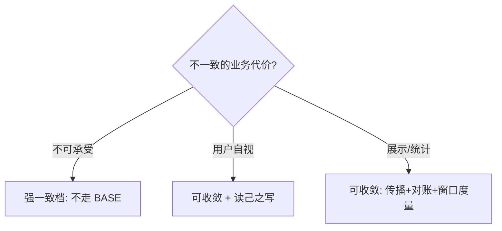

# BASE 理论

> **一句话摘要**：BASE 是 CAP 中 AP 路线的工程化纲领——基本可用（Basically Available）、软状态（Soft State）、最终一致（Eventually Consistent）；它承认「强一致做不到的场合」，把问题改写为「允许短暂发散 + 设计收敛机制」，是大规模互联网系统的主流一致性哲学。
> **本文核心**：BASE 的机制链——**放弃「任何时刻一致」→ 接受软状态（副本发散）→ 用收敛机制（传播/修复/对账/反熵）兑现最终一致**；全部工程含量在「靠什么收敛、多久收敛」两问上。

前置阅读：[CAP 定理](./2_CAP定理-入门.md)。收敛机制的完整谱系见[一致性模型全景](./4_一致性模型全景-入门.md)与[一致性方案选型](./11_一致性方案选型-入门.md)。

## 1. 背景：为什么需要 BASE

> 量级分档意识：本文方法在十万级 QPS、千万级用户、亿级流量的场景下均需重新评估——量级变化时架构与参数需同步调整。


CAP 告诉我们分区时 C 与 A 不可兼得，但没有告诉 AP 路线「接下来怎么办」。BASE 理论（eBay 工程师 Dan Pritchett 2008 年公开总结）补上了这一步：大规模系统在绝大多数场景下，**为强一致付出的代价（协调延迟、分区拒绝服务）远超收益**——用户晚一秒看到新头像无所谓，但系统为了这一秒拒绝一半流量很所谓。于是把目标从「任何时刻都一致」降级为「**不一致只是暂时的，最终会一致**」，用省下来的代价换可用性与规模。

BASE 的三个词是对这个降级的完整描述：**基本可用**——允许降级（响应变慢、部分功能限流、体验打折但服务活着）；**软状态**——允许副本之间存在中间状态（数据暂时不一致）；**最终一致**——停止写入后，经过收敛，所有副本最终到达一致。三者是递进关系：接受软状态才可能基本可用，最终一致是软状态的收口承诺。

## 2. 核心机制：最终一致的收敛从哪来

「最终」不是许愿，是机制——没有收敛机制的不一致叫「发散」，有收敛机制的不一致才叫「软状态」。主流收敛机制四类：

```mermaid
flowchart TD
    S[软状态: 副本间数据发散] --> C1[读时修复<br/>读到旧值时比对补齐]
    S --> C2[写时传播<br/>异步复制/消息广播到副本]
    S --> C3[后台对账<br/>定时全量或增量校验]
    S --> C4[反熵协议<br/>Gossip 增量同步(见Quorum与Gossip篇)]
    C1 & C2 & C3 & C4 --> F[最终一致: 副本收敛]
```

- **读时修复**：读到旧版本时顺手用新版本补齐本地副本（Cassandra/Dynamo 系的 read repair）。
- **写时异步传播**：写入主副本后异步同步到其余副本——快，但传播窗口内不一致（读写分离的复制延迟就是这类软状态，工程应对见[读写分离篇](../../../distributed-system-design/入门层/从零开始认识分布式系统设计系列/7_读写分离-入门.md)）。
- **后台对账**：定时比对副本差异并修复——兜底机制，也是金融系统的标配（对账不是补救，是 BASE 体系的一等公民）。
- **反熵协议（anti-entropy）**：Gossip 类协议让副本间以流行病方式交换差异、指数级收敛（详见[Quorum 与 Gossip 篇](./14_Quorum与Gossip-入门.md)）。

关键认知：**「最终」的时长 = 传播延迟 + 收敛周期**，它不是常量——网络抖动、分区、消息堆积都会拉长窗口。BASE 的工程纪律是：① 估算并监控「不一致窗口」的实际分布；② 业务按窗口上限设计（比如「改头像后多久必须全端一致」）。

## 3. 落地实践：BASE 化改造三步

1. **分类数据**：把数据按「不一致的业务代价」分档——强一致档（资金、库存扣减位：不走 BASE）、可收敛档（计数、评价、推荐）、天然收敛档（缓存、副本、日志）。BASE 化只作用于后两档。
2. **为每档设计收敛机制与窗口目标**：可收敛档明确「用什么收敛（消息/对账）+ 窗口目标多长（秒级/分钟级）+ 窗口内业务怎么表现（降级读旧/提示稍后）」。
3. **给收敛装监控**：不一致窗口的 P99、对账差异数、收敛延迟曲线——没有度量的 BASE 是盲飞。「最终一致」要能回答「最终是多最终」。

## 4. 生产视角：BASE 用错的样子

- **把「最终一致」当免责声明**：出了数据不一致就说「我们是 BASE 设计」——但收敛机制缺失、窗口无度量、对账无兜底，这不是 BASE 是失控。判据一句话：**说得出「靠什么收敛、多久收敛、窗口内什么体验」才算 BASE，说不出就是没设计**。
- **强一致需求误入 BASE 档**：库存超卖、余额负数——业务上不可接受的不一致被放进了可收敛档。判据是「不一致的业务代价」，不是「技术上方便」。库存类通常的折中是「扣减位强一致 + 展示层最终一致」分档处理。
- **窗口内体验没设计**：用户改完昵称刷新看到旧昵称反复出现（读打到不同副本），客诉就来了。会话内读己之写（读写分离篇的机制）是这类场景的标准补丁——BASE 不等于让用户感知到不一致。
- **对账缺位的「侥幸收敛」**：消息丢失、副本磁盘损坏会让「传播式收敛」漏数据——没有后台对账兜底，最终一致的「最终」可能永远不到。金融级惯例：传播保时效、对账保完整，双轨必须都在。

## 5. 主流系统怎么做：BASE 的落地形态

| 系统/模式 | BASE 形态 | 收敛机制 |
|---|---|---|
| Cassandra / Dynamo 系 | 全副本可写，软状态天然存在 | Quorum 读时修复 + Gossip 反熵 + hinted handoff |
| Redis 主从/集群 | 异步复制，分区可能丢写 | 复制传播 + 多数派故障转移兜底 |
| 消息驱动的数据同步 | 上游写完发消息，下游异步更新 | 消息重试 + 幂等消费 + 对账补偿 |
| 缓存 + DB 体系 | 缓存即软状态 | Cache Aside + 过期时间 + binlog 订阅失效（见[缓存架构篇](../../../distributed-system-design/入门层/从零开始认识分布式系统设计系列/4_缓存架构-入门.md)） |
| 跨服务数据同步 | 服务间异步事件同步数据 | 事件溯源 + 定期对账 |

规律：**工业界的 AP 系统全部是「BASE 三词 + 四类收敛机制」的组合**——BASE 的价值不在结论（谁都知道允许不一致）而在框架（强制你回答收敛机制、窗口目标、降级体验三件事）。

## 6. 典型场景

- **社交互动数据**（计数级）：点赞数、转发数——展示层允许误差与延迟，收敛靠消息异步聚合 + 定时校准，用 BASE 换掉高成本的全局同步。
- **电商库存展示**（混合级）：「剩余库存」展示走 BASE（可收敛，偶尔显示偏多），「下单扣减」走强一致——同一条数据不同操作分档，是 BASE 工程化的典型切法。
- **跨机房数据同步**（容灾级）：异步复制 + 对账兜底，窗口目标分钟级——同城双活场景的 BASE 标配。

## 7. 与相邻概念的区别

- **BASE vs CAP**：CAP 是边界定理（分区时不可兼得）；BASE 是选择 AP 之后的工程方法论。CAP 说「不能都要」，BASE 说「那就这样要」。
- **BASE vs ACID**：ACID 是事务语义（原子性/一致性/隔离/持久，单库强一致）；BASE 放弃「任何时刻一致」换可用与规模。主流系统是混合体：核心交易 ACID，周边数据 BASE。
- **最终一致 vs 因果一致**：最终一致只承诺「停止写入后收敛」，不保证任何中间顺序；因果一致额外保证「有因果关系的操作顺序可见」（如「回复」必在「原帖」后可见）——是最终一致的增强档（见[一致性模型全景](./4_一致性模型全景-入门.md)）。

## 8. 常见误区与不适用

- **「BASE = 不用管一致性」**：BASE 的成本恰恰花在一致性上——收敛机制、窗口度量、对账兜底，一样不少。BASE 是换一种方式管理一致性，不是放弃。
- **「最终一致就是秒级」**：窗口时长由机制与故障决定，分区时窗口可到分钟级以上。业务设计按「窗口上限」而非「均值」。
- **「我们全部 BASE 化，性能翻倍」**：强一致档（资金/库存扣减）不可 BASE 化——业务代价说了算。全面 BASE 化的系统在核心链路上是灾难。
- **「对账是失败才需要的」**：对账是 BASE 体系的一等公民（完整性与时效的双保险），常态运行，不是故障应急。
- **不适用**：强一致业务（账务入账、库存扣减、锁与选主——走 CP，见[一致性方案选型](./11_一致性方案选型-入门.md)）；用户强感知且不可合并的数据（配置、权限——窗口要压到极短或走强一致）。

## 9. 你们可能会问

- **不一致窗口一般多长算合理？** 没有通用答案——按业务容忍度倒推：展示类秒级到分钟级，交易关联类毫秒到秒级。要度量实际分布而不是拍一个数字。
- **怎么向业务方解释 BASE？** 用「什么时候会不一致、不一致多久、不一致时用户看到什么」三句话——比讲理论有效得多。
- **BASE 和消息队列什么关系？** MQ 是最常用的「写时传播」载体——上游写完发事件，下游异步消费达成一致；重试与幂等保证传播可靠（见[异步削峰篇](../../../distributed-system-design/入门层/从零开始认识分布式系统设计系列/5_异步削峰-入门.md)）。
- **用户改完数据马上要看到新值，BASE 怎么办？** 读己之写（Read-your-writes）：同一用户的后续读路由到已更新的副本（会话粘连/按位点等待）——全局 BASE、会话内强一致，业界标准折中。
- **BASE 系统怎么测试？** 窗口内行为测试（读写交错用例）+ 收敛测试（停写后必须在目标窗口内收敛）+ 对账演练（人为制造差异验证兜底）。

## 10. 一句话总结 + 5W 速记卡 + 自测三问

**一句话总结**：BASE = 接受软状态换基本可用、承诺最终一致收口——它的全部工程含量在收敛机制（传播/修复/对账/反熵）与窗口度量上；说得出「靠什么收敛、多久收敛、窗口内什么体验」才算真 BASE。

**5W 速记卡**：

| 维度 | 内容 |
|---|---|
| What | 基本可用 + 软状态 + 最终一致（AP 路线的工程纲领） |
| Why | 强一致的协调代价在大规模场景远超业务收益 |
| When | 数据按「不一致代价」分档后，可收敛档的全部设计 |
| Where | 计数/展示/副本/缓存/跨服务同步——一切 AP 数据 |
| How | 分档 → 定收敛机制与窗口目标 → 度量监控 → 对账兜底 |

**自测三问**：

1. 你系统里每类数据的不一致窗口目标是多少？实际 P99 是多少？
2. 你的收敛机制有几层？消息丢了、副本坏了，还能收敛吗？
3. 「最终一致」这四个字，你向业务方讲清过哪三件事？

---

**下篇预告**：「一致」一词被滥用的根源是模型不清——下一篇[一致性模型全景](./4_一致性模型全景-入门.md)把强一致、顺序、因果、最终一致放进一张精确的谱系图。


**🎯 核心带走**：

- **核心一句话**：BASE = 接受暂时不一致，用机制化的收敛换可用与规模。
- **链条复述**：按不一致代价分档 → 可收敛档接受软状态 → 传播/修复/对账/反熵四类收敛 → 度量不一致窗口并监控。
- **失效点与边界**：强一致档（资金/库存扣减）不可 BASE 化；没有收敛机制的「不一致」是发散不是 BASE。

💡 **实战提示**：说得出收敛机制与窗口上限才算设计过；对账是常态运行的一等公民不是故障应急；用户自视数据加读己之写，别让用户感知不一致。

**开放问题**：如果收敛机制全部失效（消息队列宕机 + 对账停跑），你的系统会在多久后暴露数据问题？

**决策（何时用）**：计数/展示/副本/跨服务同步推荐 BASE 化；推荐同时给出窗口目标（秒级/分钟级）与降级体验——「最终」必须回答「多最终」。

BASE 自 2008 年提出至今，收敛机制从「靠复制延迟自愈」演进到「反熵协议 + 独立对账体系」，不变的分档判据始终是：不一致的业务代价。



---

## 📌 数据与事实声明

BASE 理论出自 eBay 工程师 Dan Pritchett 的公开文章（ACM Queue, 2008）；各系统收敛机制为公开文档的机制级概括；窗口时长与分档比例无通用数字，请按业务度量。具体行为以官方文档为准。

## 📚 参考资料

| 类型 | 标题 | 来源 |
|---|---|---|
| 文章 | Eventually Consistent（Dan Pritchett） | ACM Queue（2008） |
| 图书 | 数据密集型应用系统设计（DDIA）第 5、9 章 | O'Reilly（2017 中译） |
| 系列文章 | CAP 定理 / Quorum 与 Gossip（本系列） | 本仓库同系列 |
