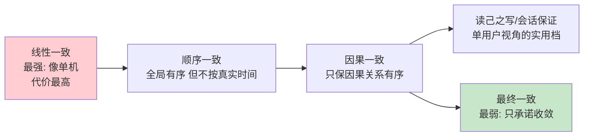
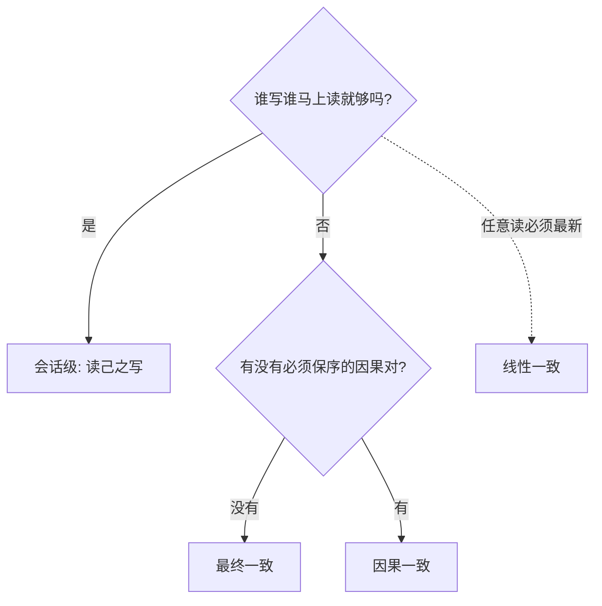

# 一致性模型全景

> **一句话摘要**：「一致性」不是一档开关而是一条谱系——从线性一致（像只有一台机器）到顺序一致、因果一致、最终一致，约束逐级放松、性能逐级上升；一致性模型就是「多副本系统对读写交错结果的承诺清单」，选型 = 按业务挑承诺。
> **本文核心**：一致性模型 = 多副本对「读写交错结果」的承诺清单——**约束越强越像单机、协调成本越高**；选型方法是把业务语言（马上/不能乱/先此后彼）翻译成具体模型条款。

前置阅读：[CAP 定理](./2_CAP定理-入门.md)、[BASE 理论](./3_BASE理论-入门.md)。线性一致的深度剖析见下一篇[线性一致性与顺序一致性](./5_线性一致性与顺序一致性-入门.md)。

## 1. 背景：为什么需要「模型」这个词

> 量级分档意识：本文方法在十万级 QPS、千万级用户、亿级流量的场景下均需重新评估——量级变化时架构与参数需同步调整。

多副本系统中，同一个数据的读写请求会打到不同节点、经历不同延迟——同样的操作序列，副本状态可以有多种「合法」的最终样子。**一致性模型就是规定：哪些样子算合法**。它回答的问题是「并发的、跨节点的读写交错，系统承诺什么样的可见顺序」。

没有模型词汇，团队讨论「我们要强一致」时各说各话（有人指事务隔离、有人指复制延迟、有人指共识）；有了模型谱系，需求可以精确翻译：「用户必须马上看到自己的写入」= 读己之写；「回复必须出现在原帖之后」= 因果一致；「像一台机器」= 线性一致。**模型的本质是把「多严格」变成可谈判的条款**。

## 2. 核心机制：谱系图与各模型的承诺

从强到弱，各模型的核心承诺：

- **线性一致（Linearizability）**：每个操作看起来在「调用与返回之间的某个瞬间」原子生效——整个系统等价于一台机器。任何读都能读到紧邻的最新写。代价：读写都要与多数派协调，延迟最高，分区时可能不可用（CP 的标配语义）。
- **顺序一致（Sequential Consistency）**：所有节点看到的写顺序**全局一致**，但不要求与真实时间对应（晚到的写可以排在早到的写前面，只要大家看法一致）。比线性一致弱在「不保实时性」。
- **因果一致（Causal Consistency）**：只要求「有因果关系的操作」全体按序可见——先发帖后回复，任何人看到回复时必能看到原帖；无因果关系的并行写（两人各发帖）可以乱序。约束大幅放松，性能好，是社交/协作类场景的甜点位。
- **读己之写（Read-your-writes）及会话保证**：不约束全局，只保证「你自己写的，你自己马上能读到」（还有单调读：不看到时间倒流）。这是全局最终一致 + 会话内增强的实用组合，工程上最常用（读写分离的「写后读主」就是它的实现）。
- **最终一致（Eventual Consistency）**：只承诺停止写入后副本会收敛。窗口内什么顺序、读到什么，都不承诺。

## 3. 落地实践：需求到模型的翻译

| 业务需求描述 | 对应模型 | 典型实现 |
|---|---|---|
| 「扣款成功页面必须显示已扣款」 | 读己之写 | 写后读主 / 会话粘连 |
| 「库存不能超卖」 | 线性一致（写路径） | 强一致存储 / 共识复制 |
| 「回复不能出现在原帖前面」 | 因果一致 | 因果键（原帖 ID 作上下文）/ 版本向量 |
| 「所有人看到的消息顺序一样」 | 顺序一致 | 单一有序日志（分区内的 log 序） |
| 「点赞数晚几秒没事」 | 最终一致 | 异步传播 + 对账 |
| 「配置变更全体节点尽快生效」 | 最终一致 + 窗口度量 | 消息广播 + 版本号比对 |

翻译纪律：**拿业务语言记录需求，再用模型词汇回译确认**——「马上」「必须」「不能乱」这些词要逐个落到具体模型，评审时才能对齐。

## 4. 生产视角：模型选错的形态

- **用最终一致承载了因果需求**：论坛用全局异步同步，「回复先于原帖出现」的奇观——根因是需求里藏着因果，选型时没被识别。凡业务里有「先……后……」的叙述，都值得检查因果模型。
- **把「读己之写」做成了「全局强一致」**：为了「用户看到自己的写入」就把所有读升级为多数派读——延迟翻倍，其实只需会话级粘连。**会话保证是性价比最高的常用档**，很多团队直接跳过它去够线性一致。
- **顺序一致的误用**：以为「全局有序」等于「按真实时间有序」——分区内 log 序不保证跨分区的真实时间序（除非配全局授时，见[分布式时钟](./9_分布式时钟-入门.md)）。审计类需求（要真实时间先后）必须指定线性一致或全局授时，顺序一致不够。
- **模型混用无声明**：同一份数据，A 服务按线性一致读写、B 服务按最终一致读——没有文档声明哪个路径是哪个模型，出问题后两边都「按自己的理解」是对的。**模型声明要落到接口/数据源级别**。

## 5. 主流系统怎么做：各模型的实现载体

| 模型 | 主流实现载体 | tips |
|---|---|---|
| 线性一致 | 共识系统（etcd/ZooKeeper 读走多数派）、NewSQL 强一致读 | etcd 默认读是线性一致（ReadIndex/Quorum 读），可配置为更快的串行读 |
| 顺序一致 | 单分区的日志序（Kafka 分区内有序） | 有序性以「分区」为单位，跨分区无序——有序需求要按键路由到同分区 |
| 因果一致 | 版本向量 / 琥珀链路传递上下文 | 实现成本高，业务层常用「因果键」模拟（回复带原帖 ID 做条件校验） |
| 读己之写 | 会话粘连（sticky session）/ 写后短窗读主 | 读写分离场景标配（见[读写分离篇](../../../distributed-system-design/入门层/从零开始认识分布式系统设计系列/7_读写分离-入门.md)） |
| 最终一致 | 异步复制 + 收敛机制全家桶 | BASE 体系的日常形态 |

规律：**越强的模型越依赖协调（共识/多数派/授时），越弱的模型越依赖收敛**——性能与延迟的账，本质上是为「可见性承诺」付的协调费。

## 6. 典型场景

- **交易链路**（线性一致档）：余额、库存的写路径——并发扣减的顺序与结果必须像单机。
- **协作/社交 feed**（因果档）：评论与回复、文档协同编辑——保因果、放并行，性能与正确性双赢。
- **用户自视数据**（会话档）：改头像、改昵称、下单后查单——读己之写 + 全局最终一致。
- **统计与展示**（最终一致档）：计数、排行榜、推荐——窗口内偏差可容忍。

## 7. 与相邻概念的区别

- **一致性模型 vs 事务隔离级别**：隔离级别管「并发事务彼此看见什么」（单库内、以事务为单位）；一致性模型管「多副本间读写可见性」（分布式、以操作为单位）。两者正交，NewSQL 里两者都要答。
- **一致性 vs 共识**：共识是「多个节点对一个值达成一致」的**过程/机制**（Paxos/Raft）；一致性模型是「系统对外呈现的可见性**承诺**」。共识是达成强模型的手段之一（且是最贵的一档）。
- **顺序一致 vs 线性一致**：核心差异是「实时性」——线性一致要求与真实时间对应（写入返回后的读必见），顺序一致只要「大家看法一致」不要求对应真实时间。用「写完立刻读」能否看到来区分。
- **因果一致 vs 读己之写**：读己之写只管「自己」的写可见；因果一致管「所有人的因果链」可见——前者是会话级，后者是全局级，后者强得多。

## 8. 常见误区与不适用

- **「强一致」是个模糊词**：口语的强一致可能指线性一致、也可能指「读己之写够用」——讨论必须落到具体模型名，否则选型与实现必然漂移。
- **「最终一致就是随便读」**：最终一致 + 会话保证是常态组合，纯最终一致（连读己之写都不保）在面向用户的系统里很少直接用——别把「模型最低档」当「默认选型」。
- **「因果一致用时间戳排序就行」**：跨机器墙钟不可信（时钟篇专讲），因果判定要靠逻辑结构（版本向量/上下文传递），不能用物理时间戳伪造。
- **「模型越强越好，全上线性一致」**：协调成本随模型强度线性上涨（延迟、吞吐、分区可用性全部变差）——按场景挑承诺，强模型只给强需求。
- **不适用**：本篇是「可见性承诺」的谱系，不覆盖事务的原子性（全做或全不做）问题——后者归[分布式事务系列](../../../distributed-transaction/入门层/从零开始认识分布式事务系列/0_系列导读-全景.md)。

## 9. 你们可能会问

- **怎么快速判断业务需要哪档？** 两问：①「谁写谁马上读」够不够？（够 → 会话档）②「有没有必须保序的因果对？」（无 → 最终一致；有 → 因果档）——只有「任意读必须最新」才需要线性一致。
- **线性一致到底贵在哪？** 每次读都要与多数派确认（或确认自己的 Leader 身份），一次跨节点往返少不了；分区时少数派直接不可用。是延迟与可用性的双重代价。
- **Kafka 的「分区内有序」是什么模型？** 顺序一致的分区内实例——同一键的消息全局有序（单分区 log），不同键之间无序。
- **因果一致为什么工业实现少？** 版本向量的元数据随副本数与并发增长、GC 困难——工程上常用「因果键校验」在业务层模拟，通用因果一致存储仍以研究系统为主。
- **模型能混用吗？** 能且应该——同一系统按操作分级：写路径线性一致、用户自视读会话级、公共读最终一致（见[一致性方案选型](./11_一致性方案选型-入门.md)的分级决策树）。

## 10. 一句话总结 + 5W 速记卡 + 自测三问

**一句话总结**：一致性模型 = 多副本对读写可见性的承诺谱系（线性 > 顺序 > 因果 > 会话 > 最终）——用业务语言翻译需求、用模型词汇确认条款、按操作分级混合使用，是这一章的全部方法论。

**5W 速记卡**：

| 维度 | 内容 |
|---|---|
| What | 五档模型谱系与各自承诺 |
| Why | 「多严格」要变成可谈判的精确条款，讨论与选型才不漂移 |
| When | 需求评审、存储选型、读写路径设计时 |
| Where | 一切多副本读写路径（按操作分级） |
| How | 业务需求 → 模型回译 → 分级实现 → 接口级声明 |

**自测三问**：

1. 你系统里「读己之写」的场景都实现会话保证了吗？还是全量强一致读硬扛？
2. 你的业务里有哪些「先……后……」的因果对？它们现在被什么机制保证？
3. 同一份数据被几个服务以不同一致性假设在读？声明在哪？

---

**下篇预告**：谱系最强档的精确解剖——下一篇[线性一致性与顺序一致性](./5_线性一致性与顺序一致性-入门.md)用交错历史判定法讲清两者的区别与代价。

**🎯 核心带走**：

- **核心一句话**：一致性是谱系不是开关：线性 > 顺序 > 因果 > 会话 > 最终，按业务挑承诺。
- **链条复述**：业务需求 → 模型回译（读己之写？因果对？实时先后？）→ 按操作分级实现 → 接口级声明。
- **失效点与边界**：模型约束的是可见性，不覆盖事务原子性；口语「强一致」必须落到具体模型名才有意义。

💡 **实战提示**：会话级（读己之写）是性价比最高的常用档，别跳过它直奔线性一致；有「先…后…」叙述的需求检查因果；模型声明落到接口/数据源级别。

**开放问题**：你的产品里有多少「用户从未提出但一旦违反会被投诉」的隐含一致性假设？它们被模型化了吗？

**决策（何时用）**：交易写路径推荐线性一致、用户自视推荐会话级、统计展示推荐最终一致；推荐用「数据一致性分级表」承载全部翻译结果。

一致性模型的工业形态一直在演进（从学术谱系到 NewSQL 的分级读配置），但「约束换性能」的谱系骨架十年未变。

---

## 📌 数据与事实声明

一致性模型的经典定义源自 Lamport（顺序一致 1979 / 线性一致 1990）及分布式系统教材体系（Herlihy & Wing 线性一致性的形式化，1990）；各系统默认行为为公开文档的机制级概括，配置可变，以官方文档为准。

## 📚 参考资料

| 类型 | 标题 | 来源 |
|---|---|---|
| 图书 | 数据密集型应用系统设计（DDIA）第 9 章 | O'Reilly（2017 中译） |
| 论文 | How to Make a Multiprocessor Computer That Correctly Executes Multiprocess Programs（Lamport） | IEEE TC（1979） |
| 系列文章 | 线性一致性与顺序一致性（本系列下一篇） | 本仓库同系列 |
