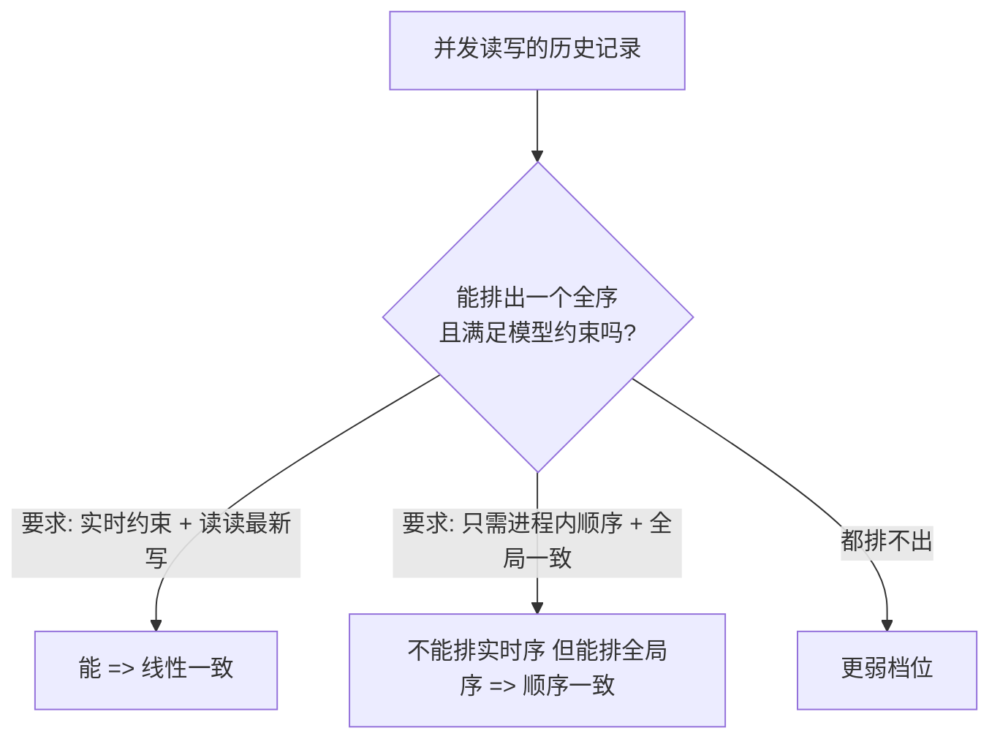
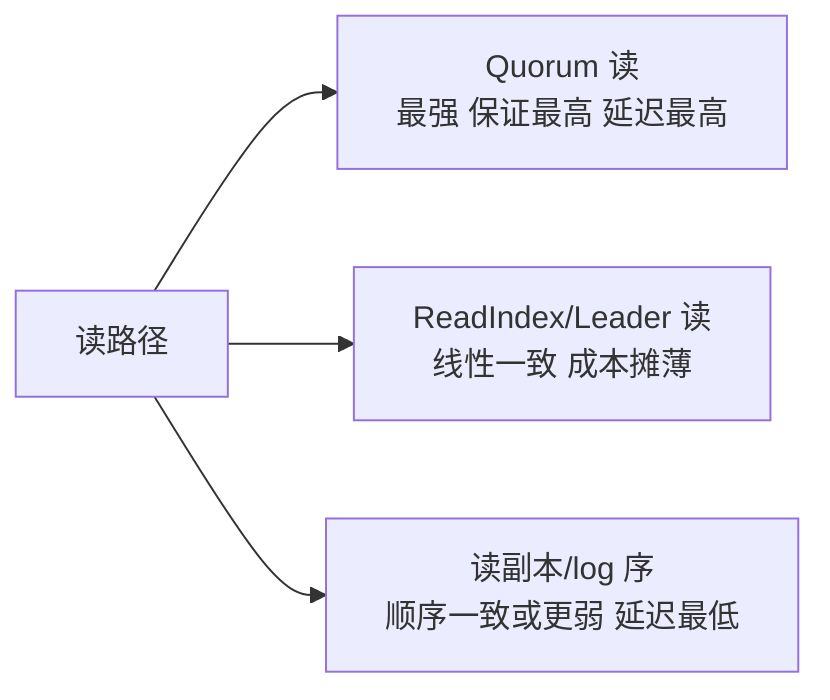

# 线性一致性与顺序一致性

> **一句话摘要**：两者的分界线是「实时性」——线性一致要求操作结果对应真实的全局时刻（整个系统像一台机器），顺序一致只要求「所有节点看到的顺序一致」但不对应真实时间；判定工具是「把并发操作排成全序，看合法全序是否存在」，本篇用交错历史把这条线画清楚。
> **本文核心**：两档的分界线是**实时性**——线性一致要求「写返回后的读必见」（整个系统像一台机器，读写都要协调），顺序一致只要「全体看法一致」（单一 log 序即可，不对应真实时间）；判定尺子是交错历史能否排出满足约束的全序。

前置阅读：[一致性模型全景](./4_一致性模型全景-入门.md)。实现线性一致的机制（共识+ReadIndex）见[Raft 篇](./7_Raft共识算法-入门.md)。

## 1. 背景：为什么要把这两档单独拎出来

> 量级分档意识：本文方法在十万级 QPS、千万级用户、亿级流量的场景下均需重新评估——量级变化时架构与参数需同步调整。

「一致」这个词的混乱，八成发生在这两档之间——它们都产生「全局有序」的直觉，但强度差了一个物理量：**是否与真实时间挂钩**。审计（要真实先后）、锁（要互斥时点）、选主（要唯一时刻）必须线性一致；消息日志分区内有序这类「大家看法一致即可」的场景，顺序一致就够。分清这两档，直接决定你付多少协调成本（线性一致贵得多，见第 5 节）。

## 2. 核心机制：用交错历史判定

判定一个系统属于哪档，方法是看「操作交错的历史」能否排成合法全序：

用三个例子把界线画出来（`W(x)=1` 表示写 x 为 1，`R(x)=1` 表示读 x 得到 1）：

- **例 1**：T1 写 `W(x)=1` 并**返回**；之后 T2 才发起 `R(x)` 读到 0。——读写时间不重叠，读到旧值：**既非线性一致也非顺序一致**（读己之写都不满足）。
- **例 2**：T1 写 `W(x)=1`（未返回），T2 并发地 `R(x)` 读到 0；随后任何人再读都必须读到 1。——写读并发（无实时先后约束），这次读到旧值合法，且之后全局看到「先读 0 后写 1」的一致顺序：**顺序一致、非线性一致**。
- **例 3**：T1 写 `W(x)=1` **返回之后**，T2 的 `R(x)` 必须读到 1（写返回时刻与读发起时刻之间，写必须「已发生」）。——满足实时约束：**线性一致**。

三个关键词：**调用与返回之间的原子时刻**（线性一致的写发生在两点之间）、**实时约束**（写返回后的读必见）、**全局同一顺序**（两档都要求，这是「一致」的底线）。

### 2.2 顺序一致的「合法怪象」

顺序一致允许「时间倒流感」：T1 在真实时间上先写了 x=1 并返回，T2 一毫秒后才写 y=2——其他进程可以先看到 y=2 的生效再看到 x=1（只要全体进程看到的顺序一致）。因为顺序一致的序不必对应真实时间，两个「互不重叠」的操作也可能被排成与真实时间相反的序。这就是为什么**依赖真实先后的需求（审计、因果）不能用顺序一致**——它是「共同幻觉」而不是「真实历史」。

## 3. 落地实践：怎么获得这两档保证

- **线性一致的获得**：读写都走共识系统——写经多数派提交（Raft/Paxos 的 log 序就是全序）；读不能「随便读本地副本」（本地可能落后），标准做法是 **Quorum 读**（读多数派取最新）或 **ReadIndex**（确认当前 Leader 身份与已提交位点后读 Leader 本地，省一次多数派往返）。etcd 的默认读就是线性一致（走 Raft 提交位点确认）。
- **顺序一致的获得**：**单一有序日志**——所有写进同一个全序 log（单分区、单 Leader 复制链），各副本按 log 序应用。Kafka 分区内消息序、主从复制的 binlog 应用序，都是顺序一致的实例。获得成本低（不用每读协调），弱在实时性。
- **工程判据**：需求里出现「写完立刻读必见」「并发互斥的精确时点」「真实先后可审计」→ 线性一致；出现「大家看到的顺序一样就行」→ 顺序一致。

## 4. 生产视角：混淆两档的代价

- **「分区内有序」被当成了「真实时序」**：审计需求用 Kafka 分区序当事件真实先后——同一事件流被路由到不同分区（分区键选了非时间键）后，真实先后与分区内序对不上。修法：审计时序要么线性一致存储、要么配全局授时（见[分布式时钟](./9_分布式时钟-入门.md)），分区序只保证「看法一致」。
- **「读从库副本」破坏线性一致的隐含假设**：应用层以为存储是线性一致的，实际读打到了落后的从库副本——「写后读不到」的 bug 由此而来。存储声明的模型 ≠ 你的读写路径实际获得的模型，**接口级确认读写路由**是必须动作。
- **线性一致读的性能惊吓**：把全量读都切到多数派确认后，读延迟翻倍、存储集群吞吐骤降——线性一致是强承诺，通用批量读不该默认它。主流做法分级：关键判定（锁、幂等判重、选主感知）线性一致读，普通展示读走副本/缓存。
- **单点有序的扩展墙**：顺序一致的「单一 log」有序但吞吐受限——全局 log 是吞吐瓶颈。主流解法是分区化（每分区独立 log，跨分区放弃全局序）或混合授时（HLC/TSO，时钟篇展开）——**有序性与吞吐的权衡**是复制系统的主旋律。

## 5. 主流系统怎么做：实现载体对照

| 系统/机制 | 提供的档位 | 机制要点 |
|---|---|---|
| etcd / ZooKeeper | 线性一致读（可配置降级） | Raft/Zab 提交位点确认 + Leader 读（ReadIndex 类） |
| NewSQL（TiDB/CockroachDB） | 行级线性一致（可选） | Raft 多数派 + 集中授时（TSO/HLC）定序 |
| Kafka（单分区） | 分区内顺序一致 | 单一 log 全序，跨分区无序 |
| 主从复制 DB（读主） | 写路径线性一致近似 | 写返回已多数派/已落盘；读从库则降级 |
| 共享内存多核（对照） | 顺序一致的诞生地 | Lamport 1979 的原始定义场景，缓存一致性协议实现 |

规律：**线性一致 = 共识 + 提交位点确认的读；顺序一致 = 单一全序 log**——两句话覆盖主流实现，配置降级（串行读、读副本）都是在「往弱档换性能」。

## 6. 典型场景

- **分布式锁的获取校验**（线性一致档）：锁状态判断必须线性一致——读到「旧主还活着」的过期状态就会双主（机制见[分布式锁与选主](./12_分布式锁与选主-入门.md)）。
- **配置/元数据变更**（线性一致档）：全局配置的发布与读取要「改完即全局可见且序一致」，协调服务标配。
- **事件日志/消息流**（顺序一致档）：订单事件流、binlog 消费——同实体事件有序即可，吞吐优先。
- **审计与因果分析**（线性一致或全局授时档）：「到底谁先操作的」要真实时序——顺序一致不够。

## 7. 与相邻概念的区别

- **线性一致 vs 串行化（Serializability）**：串行化是**事务**隔离级别（多对象事务等价于某个串行执行）；线性一致是**单对象操作**的实时全序。NewSQL 同时提供两者（严格串行化 = 串行化 + 线性一致），词近义远。
- **顺序一致 vs 因果一致**：因果一致只保「有因果关系的对」有序，无因果的并发写可以各看各的序（不要求全局同一顺序）——比顺序一致更弱、并发度更高。
- **线性一致 vs 强一致（口语）**：口语「强一致」多数指线性一致，也可能指「读己之写就够」——评审时用本篇的判定法把词落成具体档位。

## 8. 常见误区与不适用

- **「全局有序 = 线性一致」**：顺序一致也是全局有序——差在实时约束。判定口诀：「写返回后的读必见吗？」必见才是线性。
- **「读 Leader 本地副本就是线性一致」**：不一定——你以为是 Leader 的节点可能已被罢免（网络分区下旧 Leader 未自知），读它就是读到过期数据。所以要 ReadIndex/epoch 校验「Leader 身份仍然有效」，这一步省不得。
- **「顺序一致没有用，直接上最强」**：消息日志、复制应用序这些高吞吐场景，顺序一致就是正解——实时性不存在需求时，为它付协调费是浪费。
- **「加个时间戳就是线性一致」**：跨机器时间戳不可信（时钟篇），本地打的时间戳排不出真实全序——线性一致必须靠共识/授时机制，不是靠标记。
- **不适用**：无并发写、无实时需求的数据（纯离线分析）——不必用这两档的词汇困扰自己。

## 9. 你们可能会问

- **为什么读也要协调？写协调不就够了吗？** 因为副本异步追赶存在滞后——不协调的读可能打到旧副本；线性一致的承诺在「读」这一侧，读不打折。
- **ReadIndex 比全 Quorum 读快在哪？** Quorum 读要多数派各回一次；ReadIndex 只需 Leader 向多数派确认一次「我还是 Leader、我的位点已提交」，然后读本地——多数派往返从「每读一次」变「每确认一次」。
- **线性一致和事务里的「严格串行化」什么关系？** 严格串行化 = 事务串行化 + 事务序与实时序一致——可以理解为「事务版的线性一致」；单操作场景谈线性一致，多对象事务场景谈串行化。
- **怎么测试我的系统是不是线性一致？** 用线性一致性检查器（Jepsen 的 Knossos 一类）：录制并发读写历史、穷举合法全序判定——比人眼可靠，比「感觉」有用。
- **「写后立刻读」没读到，是不是一定坏了？** 若存储承诺线性一致且读写走同一承诺路径，是故障；若读走了副本/缓存路径，是路由问题——先查「这次读走的是哪条路径」，再谈一致性。

## 10. 一句话总结 + 5W 速记卡 + 自测三问

**一句话总结**：线性一致 = 共识全序 + 实时约束（像一台机器，读写都要协调）；顺序一致 = 单一全序 log（看法一致，不保真实时间）——判定的尺子是「写返回后的读必见吗」，选型的依据是「真实先后值多少钱」。

**5W 速记卡**：

| 维度 | 内容 |
|---|---|
| What | 两档模型的精确差异与交错历史判定法 |
| Why | 两档都产生「全局有序」直觉，混淆会付错协调成本 |
| When | 锁/选主/审计/日志/复制场景的模型选型时 |
| Where | 共识系统读路径、消息分区、主从复制 |
| How | 需求翻译 → 判定法定档 → 按档选实现（ReadIndex/log 序） |

**自测三问**：

1. 你系统里「写后立刻读」的路径，实际走的是哪条？读主还是读副本？
2. 你的事件流分区内有序——有没有需求偷偷假设了「真实时序」？
3. 上一次线性一致读的性能压测，延迟涨了多少、给了哪些读路径？

---

**下篇预告**：线性一致的机制地基是共识——下一篇[共识问题与 Paxos](./6_共识问题与Paxos-入门.md)讲「多个节点如何对一个值达成一致」的祖师爷算法。

**🎯 核心带走**：

- **核心一句话**：线性一致 = 共识全序 + 实时约束；顺序一致 = 单一 log 全序（无实时性）。
- **链条复述**：判定（写返回后的读必见吗）→ 定档 → 选实现（Quorum/ReadIndex 读 vs 单分区 log）→ 按读路径核对实际获得的保证。
- **失效点与边界**：读走副本/缓存时保证按路径打折；顺序一致不保真实先后（审计需求不够）。

💡 **实战提示**：存储声明的模型 ≠ 你的读写路径实际获得的——接口级确认读写路由；线性一致读给关键判定（锁/判重），批量展示读别默认它；「写后立读」bug 先查路由再谈一致性。

**开放问题**：你的系统里「看起来全局有序」的路径，哪些其实只是分区内有序？跨分区的先后谁在保证？

**决策（何时用）**：锁/选主感知/审计推荐线性一致；消息流/复制应用序推荐顺序一致；推荐用「写返回后的读必见吗」一句话在评审里定档。

从单核共享内存（Lamport 1979）到分布式共识系统，两档模型的判定方法没变过——变的是实现它们的协调成本在不断下降（ReadIndex 一类优化）。

---

## 📌 数据与事实声明

顺序一致性定义出自 Lamport（1979）、线性一致性的形式化出自 Herlihy & Wing（1990）；etcd 默认线性一致读、Kafka 分区内有序、ReadIndex 机制为各官方文档公开内容；交错历史判定法为分布式系统教材通用方法。以官方文档为准。

## 📚 参考资料

| 类型 | 标题 | 来源 |
|---|---|---|
| 图书 | 数据密集型应用系统设计（DDIA）第 9 章 | O'Reilly（2017 中译） |
| 论文 | Linearizability: A Correctness Condition for Concurrent Objects | Herlihy & Wing, ACM TOPLAS（1990） |
| 文档 | etcd: linearizable read / ReadIndex | github.com/etcd-io/etcd |
| 系列文章 | 一致性模型全景 / Raft（本系列） | 本仓库同系列 |
