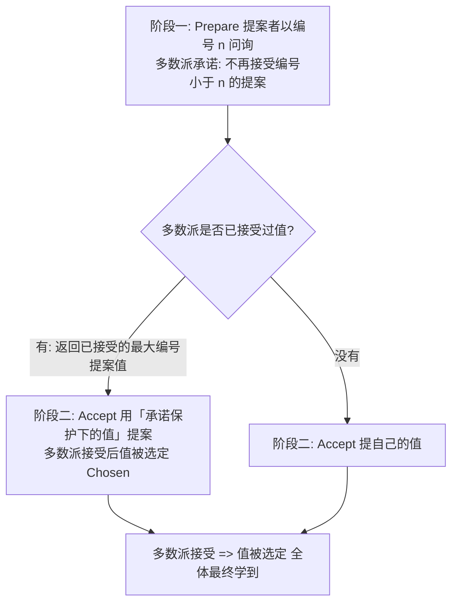
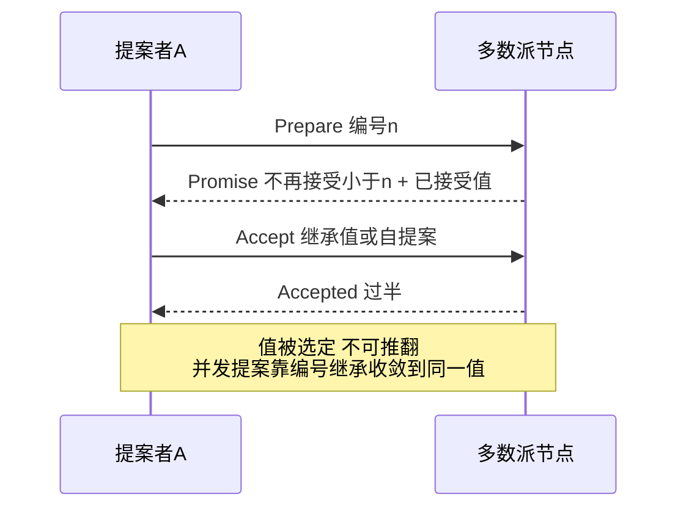

# 共识问题与 Paxos

> **一句话摘要**：共识问题 = 一组节点在「消息会丢、节点会挂、还有故意捣乱缺席者」的环境下，对一个值达成不可推翻的一致——它是线性一致、选主、锁的机制地基；Paxos 是第一个被证明正确的通用解，其「两阶段 + 多数派 + 提案编号」的骨架是一切共识系统的公共语法。
> **本文核心**：共识 = 不可靠环境下对一个值达成**不可推翻的一致**——Paxos 用「两阶段 + 多数派相交 + 提案编号继承」三件工具解决它；FLP 定理证明纯异步下做不到，工程全靠超时假设绕行。

前置阅读：[分布式系统是什么与为什么难](./1_分布式系统是什么与为什么难-入门.md)、[线性一致性与顺序一致性](./5_线性一致性与顺序一致性-入门.md)。Raft/Zab 两个工程化后裔见后两篇。

## 1. 背景：共识为什么是个「问题」

> 量级分档意识：本文方法在十万级 QPS、千万级用户、亿级流量的场景下均需重新评估——量级变化时架构与参数需同步调整。

直觉上「对一个值达成一致」很简单——投票呗。但在异步网络 + 节点故障的环境里，简单投票会踩进两个深坑：

- **信息不等价**：A 收到了提案，B 没收到（网络丢包）——此刻两人「已知的真相」不同，谁说了算？
- **无法区分故障**：主节点 10 秒没回音，是死了还是慢了？（上一章的「慢与死」困境）——贸然换主，旧主回来了就双主（脑裂）。

**共识问题**的正式表述：一组节点，各自可以提议值，最终满足三性——**一致**（所有正常节点决定的值相同）、**有效性**（决定的值必须是某人提议的）、**终止**（正常节点最终都会做出决定）。它的难度由 FLP 不可能定理（Fischer-Lynch-Paterson, 1985）背书：**在纯异步系统中，只要有一个节点可能故障，就不存在保证终止的确定性共识算法**。工程解法都是「绕开 FLP」：引入超时（部分同步假设）或随机化——Paxos 选了超时路线，这也解释了为什么所有共识系统都离不开「超时选主」。

## 2. 核心机制：Paxos 的两阶段骨架

三个设计选择撑起正确性（每个都值得背下来）：

- **多数派（Quorum）相交**：任何两个多数派必有交集——「承诺不重复接受旧编号」的约束在交集节点上生效，使两个值不可能同时被选定。多数派是共识的数学地基（详见[Quorum 与 Gossip](./14_Quorum与Gossip-入门.md)）。
- **提案编号全序**：编号（如「轮次 + 节点 ID」）给提案排序，让「后到的提案」能识别并继承「已接受的值」——这正是阶段一 Prepare 的目的：探查有没有前人值，有就**继承**而不是覆盖。这个「保前人值」的细节是 Paxos 正确性的灵魂，也是它最难懂的地方。
- **两阶段 = 先问后定**：Prepare（占位 + 探查）与 Accept（提交）分离，让「并发提案」能够收敛到一个值而不是打架。

**Basic Paxos 只对一个值达成共识**；对一系列值（日志条目流）反复跑 Basic Paxos 开销过大——**Multi-Paxos** 的优化是「选定一个稳定的 Leader，省掉阶段一」（Leader 任期内它的提案编号最大、无需再问），把两阶段退化为「一阶段 + 日志」，成为工程可用的状态机复制骨架。

## 3. 落地实践：共识能力的使用姿势

应用工程师通常**不实现**共识，而是**消费**共识系统（etcd/ZooKeeper）的三种能力：

1. **线性一致读写**：把关键状态（锁、选主结果、全局配置）放进共识存储，读写获得全序与实时保证（上一章的两档模型由此落地）。
2. **选主与租约**：用共识选出唯一 Leader 并发放租约（TTL），业务侧凭「我是 Leader」凭证干活（机制见[租约与心跳](./13_租约与心跳-入门.md)、[分布式锁与选主](./12_分布式锁与选主-入门.md)）。
3. **状态机复制**：把「对状态的每次变更」作为日志条目由共识排序，各副本按同一 log 应用——这就是 etcd/ZooKeeper 自身的工作原理，也是 NewSQL、K8s 控制面的通用架构。

使用纪律：共识系统是**强一致的小数据面**，不是大数据存储——单集群规模、写入吞吐都有限，把高频业务数据塞进 etcd 是经典误用。

## 4. 生产视角：共识系统的运行形态

- **脑裂被机制消灭，不是被运气消灭**：分区时少数派选不出主（凑不齐多数派）自动停止服务——多数派相交的数学保证让「两派同时成功」不可能。运维要点是**部署拓扑**：3/5 副本跨机架/可用区分布，让「多数派同时挂」的概率足够低（CAP 篇的多数派可用性规划）。
- **Leader 切换的窗口期**：旧 Leader 失联（真死或假死）→ 新 Leader 当选需要一轮超时与投票——期间写入不可用。这就是共识系统的「不可用窗口」来源，调小选举超时可以缩短窗口，但过小会把网络抖动误判为故障、引发频繁切换（抖动 = 切换风暴）。超时值是可用性的关键旋钮。
- **Paxos 的「难」不是数学是工程**：Basic Paxos 论文可读性差 + 工程化要补的细节巨多（成员变更、日志压缩、快照、磁盘恢复）——这就是 Raft 诞生（2014）的动机：同样的多数派共识，按「可理解性优先」重新设计。生产系统选 Raft 系（etcd/TiDB/CockroachDB/Consul）已成主流，ZooKeeper（Zab）是老牌存量。
- **磁盘与恢复的暗坑**：共识的正确性依赖「已接受的承诺不丢失」——节点磁盘损坏后恢复，若丢失了已 accept 的状态，可能破坏一致性。生产共识系统都要配 fsync 策略与恢复协议，这也是「共识系统不要自己造」的核心理由之一。

## 5. 主流系统怎么做：共识的家族谱系

| 系统 | 共识算法 | 与 Paxos 的关系 |
|---|---|---|
| ZooKeeper | Zab | 独立设计但同族（两阶段 + 多数派 + Leader），细节差异见[下一篇](./8_Zab协议与ZooKeeper-入门.md) |
| etcd / TiKV / CockroachDB | Raft | 「可理解性重设计」的 Multi-Paxos——选主/日志复制/安全性三问题分解 |
| Google Chubby | Multi-Paxos | Paxos 工程化的祖师级实现（锁服务形态） |
| Consul | Raft | Raft 系的注册中心形态 |
| Kafka（KRaft 模式） | Raft | 元数据面用 Raft 替代 ZooKeeper 的迁移 |

规律：**工程界的共识系统几乎全部是 Paxos 家族**（Zab 是近亲、Raft 是重构）——学透 Paxos 骨架（两阶段/多数派/编号），所有实现文档都能秒懂。

## 6. 典型场景

- **配置与元数据中心**（强一致档）：K8s 的全部集群状态放 etcd——所有变更经 Raft 全序，控制面才不会因「两套真相」而打架。
- **选主与互斥**（CP 典型）：任务调度器的 Leader 选举、分布式锁——用共识系统而不是自研心跳（后两篇专讲）。
- **数据库复制**（状态机复制）：NewSQL 的每个数据分片是一个 Raft 组——共识从「元数据」下沉到「数据面」。

## 7. 与相邻概念的区别

- **共识 vs 一致性模型**：共识是机制（达成一致的过程），一致性模型是承诺（对外可见性）。共识用于实现线性一致等强模型——手段与目标的关系（详见[一致性模型全景](./4_一致性模型全景-入门.md)）。
- **共识 vs 广播/发布订阅**：广播不保证「全体以同一顺序收到且不遗漏」（消息可能丢、序可能乱）；共识保证全序且不可推翻——广播是通信，共识是决策。
- **Basic Paxos vs Multi-Paxos**：单值 vs 日志流；后者以「稳定 Leader 省阶段一」换取工程可用性——Raft 本质是一个把 Multi-Paxos 的隐含优化显式化的设计。
- **Paxos vs 拜占庭共识（PBFT）**：Paxos 处理「故障停机」（crash fault）；PBFT 处理「节点作恶」（拜占庭故障，需 3f+1 副本）——联盟链/多方协作场景才需要，成本高一个量级。

## 8. 常见误区与不适用

- **「三个节点投票就是共识」**：简单投票不处理「提案冲突时的继承」「节点恢复后的状态对齐」——共识算法的复杂度全在这些边界。拿「多数投票」当共识实现，是自研分布式锁出脑裂事故的标准剧本。
- **「共识保证所有节点实时一致」**：共识保证「决定一致且不可推翻」，但「学到决定」有先后（learner 异步学习）——线性一致的读才需要额外确认，别把共识等同于实时可见。
- **「FLP 说共识不可能，所以这套理论是空中楼阁」**：FLP 说的是「纯异步 + 确定性」下的不可能——工程上引入超时/随机化即绕开。理论与实践不矛盾，前提是懂定理的适用边界。
- **「共识系统可以当数据库用」**：它为「小而关键的状态」设计（吞吐、容量都有限）——海量业务数据请放数据库，共识系统放「谁说了算」的问题。
- **不适用**：可容忍发散的数据（BASE 场景无需共识，见[BASE 理论](./3_BASE理论-入门.md)）——共识的钱只花在「不可发散」的地方。

## 9. 你们可能会问

- **为什么不直接用 Raft，还要学 Paxos？** Paxos 是「共识为什么必须这样设计」的最小证明骨架；Raft 是它的可理解性重构——懂 Paxos 骨架，读 Raft 论文与 etcd 源码处处是「原来这就是 Paxos 的第 X 条」。
- **Paxos 为什么难懂？** 论文以议会比喻写成、正确性证明与机制叙述交织、工程细节全缺——后两点才是重点，「难」更多是文档问题而非算法问题。
- **选举超时一般设多大？** 数百毫秒到秒级（etcd/ZK 默认在此量级），按「网络 RTT × 抖动余量 + 探测次数」定——调小的收益（快切主）与代价（抖动误判）要一起评。
- **共识系统挂了一半节点还能读吗？** 线性一致读不能（需多数派确认 Leader/位点）；多数派存活的系统整体可用，少数派分区侧不可用——这是 CP 行为（CAP 篇）。
- **业务代码怎么「用」共识？** 通过客户端 SDK 对 etcd/ZK 的 API（选举/锁/KV）——正确姿势是消费而不是集成内部；更正确的是用高阶封装（选主框架、配置中心）把共识细节藏起来。

## 10. 一句话总结 + 5W 速记卡 + 自测三问

**一句话总结**：共识 = 不可靠环境下对一个值达成不可推翻的一致（FLP 证明其难、超时假设绕其难）；Paxos 骨架 = 两阶段 + 多数派相交 + 提案编号继承——一切工程共识系统（Zab/Raft）都是这套语法的方言。

**5W 速记卡**：

| 维度 | 内容 |
|---|---|
| What | 共识三性（一致/有效/终止）+ Paxos 两阶段骨架 |
| Why | 选主/锁/强一致读写/状态机复制都需要「不可推翻的一致」 |
| When | 强一致存储选型、选主方案评审、共识系统运维时 |
| Where | etcd/ZooKeeper/Consul 内部、NewSQL 数据面、K8s 控制面 |
| How | 消费共识系统的高阶能力，不自研共识内核 |

**自测三问**：

1. 你的选主/锁，现在建立在什么机制上？它经得起分区吗？
2. 你的共识集群副本怎么跨故障域分布？「多数派同时不可用」的概率评估过吗？
3. 上一章的「线性一致读」，在这章你找到它的实现载体了吗？

---

**下篇预告**：把 Paxos 重写成「能看懂、能实现」的教科书——下一篇[Raft 共识算法](./7_Raft共识算法-入门.md)讲选主、日志复制与安全性三大子问题。

**🎯 核心带走**：

- **核心一句话**：多数派相交 + 编号继承 = 不可推翻的一致；两阶段是它的执行形态。
- **链条复述**：一致性需求 → 共识机制（Paxos 骨架）→ 工程化（Multi-Paxos/Raft/Zab）→ 消费形态（etcd/ZK 的高阶原语）。
- **失效点与边界**：少数派分区不可用（CP）；FLP 决定了选举必依赖超时；共识系统是「小而关键」的控制面，不是数据库。

💡 **实战提示**：不自研共识内核，消费 etcd/ZK 的高阶 API；部署拓扑按多数派存活概率规划；盯 fsync 延迟（共识提交的地基）；选举超时按网络抖动校准。

**开放问题**：如果节点故障不再「停机」而是「返回错误答案」（拜占庭），多数派相交还够吗？（引出 PBFT 的 3f+1 世界）

**决策（何时用）**：需要「不可推翻的一致」才上共识（锁/选主/元数据）；推荐直接消费成熟实现——「多数投票」不是共识，是事故剧本。

Paxos 家族三十年的演进史（Paxos → Multi-Paxos → Zab/Raft）是同一数学骨架的工程化折衷史——骨架没变，变的是可理解性与可运维性。

---

## 📌 数据与事实声明

Paxos 出处为 Lamport《The Part-Time Parliament》（1998）与《Paxos Made Simple》（2001）；FLP 不可能定理为 Fischer-Lynch-Paterson（1985）；Chubby/Raft 论文与各系统机制为公开资料。etcd v3.7.x / ZooKeeper 3.9.x 为主线版本（截至 2026-09，gh CLI 已核实）。

## 📚 参考资料

| 类型 | 标题 | 来源 |
|---|---|---|
| 论文 | Paxos Made Simple | Lamport（2001） |
| 论文 | The Part-Time Parliament | ACM TOCS（1998） |
| 论文 | Impossibility of Distributed Consensus with One Faulty Process（FLP） | JACM（1985） |
| 图书 | 数据密集型应用系统设计（DDIA）第 9 章 | O'Reilly（2017 中译） |
