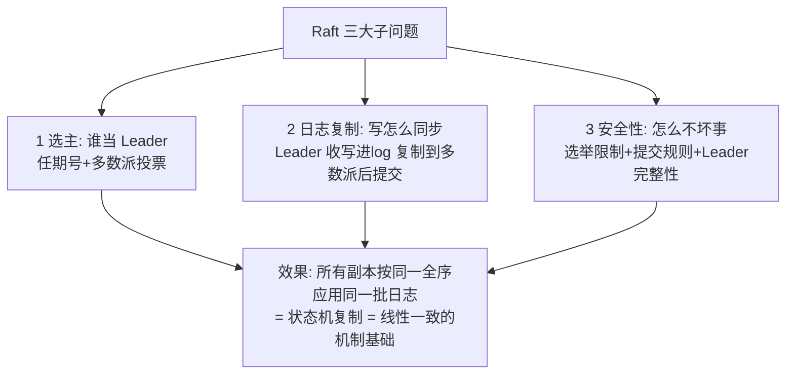
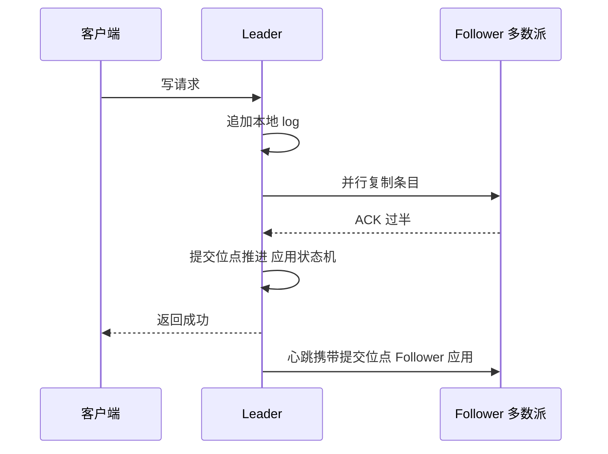

# Raft 共识算法

> **一句话摘要**：Raft 把 Multi-Paxos 的共识骨架重构成三个可独立理解的子问题——选主（Leader election）、日志复制（Log replication）、安全性（Safety），用「强 Leader + 任期Term + 提交位点」三件工具保证日志全序一致；它是当前工业界事实标准的共识实现（etcd/TiKV/Consul/K8s 控制面）。
> **本文核心**：Raft = 把共识拆成选主/日志复制/安全性三个子问题，用**强 Leader + 任期 Term + 提交位点**三件工具保证「所有副本按同一全序应用同一批日志」——选举限制保完整、提交规则防推翻。

前置阅读：[共识问题与 Paxos](./6_共识问题与Paxos-入门.md)。etcd 源码级的 Raft 深挖规划在本系列特性层（待铺）。

## 1. 背景：为什么有了 Paxos 还要发明 Raft

Paxos 证明了正确性，但工程界用它时一直头疼：论文难懂、直接实现要补的细节巨多、两阶段结构在日志复制场景别扭。Diego Ongaro 与 John Ousterhout 在 2014 年发表《In Search of an Understandable Consensus》（Raft 原论文），目标只有一条：**在保证与 Multi-Paxos 等价的安全性的前提下，把共识设计成「能教、能懂、能实现」**。做法是把整团问题拆成三个边界清晰的子问题，并显式引入「强 Leader」模型——所有写入经 Leader 中转，算法的大部分复杂度消失在「Leader 说的话就是全序」这条直觉里。

工业结果：etcd（K8s 的存储底座）、TiKV（TiDB 的存储层）、Consul、CockroachDB 等主流系统全部选了 Raft——「可理解性」直接转化为「可实现、可调试、可运维」。

## 2. 核心机制：三个子问题与三件工具

三件核心工具：

- **任期（Term）**：一个单调递增的逻辑时钟——每次选举开一个新任期，任期号贯穿投票与日志比较。它的本质是「用逻辑时序替代不可信的墙钟」（呼应[分布式时钟篇](./9_分布式时钟-入门.md)）：任何节点看到更高任期，立刻承认自己过时。
- **强 Leader**：写入全部经 Leader 流转——客户端写 → Leader 追加本地 log → 并行复制给 Follower → 多数派确认 → 提交 → 应用到状态机 → 响应客户端。全序由 log 位置天然表达，不需要 Paxos 的编号继承推理。
- **提交位点（CommitIndex）**：log 条目被多数派复制后才「提交」，提交位点之前的条目才允许应用到状态机——「已提交的不会丢、也不会被推翻」的承诺由提交规则保证。

**选主规则**：节点启动/超时未闻 Leader 心跳 → 自增任期、投自己、拉票 → 拿到多数派票成为 Leader（每任期每人只投一票保证唯一性）→ 此后周期性心跳维持权威。

**安全性三规则**（Raft 正确性的全部）：① **选举限制**——投票前比较候选人的 log「至少和我一样新」（先比最后条目任期，再比索引），保证选出的 Leader 拥有全部已提交条目；② **提交规则**——只提交「当前任期」的条目（旧任期的条目随新条目一起被提交，避免旧 Leader 的条目被覆盖）；③ **Leader 完整性**——由①②推出：已提交的条目必然出现在所有后续任期的 Leader log 中，不可推翻。

## 3. 落地实践：消费 Raft 的三种姿势

1. **直接用共识存储**（最常见）：etcd 的读写就是与 Raft 组交互——线性一致读走 ReadIndex（确认 Leader 身份与提交位点后读本地），写走 Raft 复制。
2. **嵌入式 Raft 库**：自研系统要「多副本强一致状态」时，嵌入 etcd/raft 一类库（如 TiKV 之于 TiDB）——自己实现状态机应用与存储层，Raft 复杂度被库封装。
3. **理解平台行为**：K8s 的 etcd 运维（3/5 副本、多数派不可用行为、慢盘告警）、Kafka KRaft 模式的控制器行为——懂 Raft 三子问题，运维文档的每个警告都能对上机制。

调参常识：选举超时（数百 ms~秒级，太小抖动误判、太大切换慢）、心跳间隔（选举超时的 1/5 量级）、快照与日志压缩（log 无限增长，定期快照截断）——三个旋钮覆盖九成调优。

## 4. 生产视角：Raft 系统的故障形态

- **网络分区的标准行为**：少数派区凑不齐多数派选票与提交确认——自动降级不可用（CP）；旧 Leader 若在少数派，接受写入永远无法提交、超时自愈或被高任期罢免。分区恢复后，少数派的 log 由新 Leader 补齐——「已提交不丢、未提交可覆盖」的边界要清楚（未提交的写入对客户端是失败，可安全重试）。
- **慢盘是头号杀手**：Raft 提交要求 log 落盘（fsync）后才能确认——一块慢盘拖慢整组提交吞吐。运维信号：fsync 延迟指标、提交延迟 P99 与磁盘 IO 排队。etcd 生产事故的高频根因就是「共享磁盘/虚机 IO 抖动」。
- **成员变更的谨慎**：增减副本不能一步到位（新旧配置可能各成多数派、双主）——Raft 用联合共识或单步变更（每次只加/减一个节点）保证变更期间安全性。运维纪律：扩缩容一次一个节点，变更窗口避开高峰。
- **脑裂演练是必修课**：Raft 保证的是「协议层面的安全」，部署层面的错误（副本全放同一机架、磁盘共享、时钟乱配）照样出事。定期做分区注入演练（拔分区、杀 Leader、慢盘注入），验证「少数派降级、多数派接管、数据无丢失」的三段行为。

## 5. 主流系统怎么做：Raft 的工业谱系

| 系统 | Raft 的角色 | tips |
|---|---|---|
| etcd | 全部状态走单 Raft 组 | K8s 的存储底座；v3.7.x 主线（截至 2026-09，gh CLI 已核实），5 万+ star 的 CNCF 项目 |
| TiKV / CockroachDB | 每个数据分片一个 Raft 组（Multi-Raft） | 共识下沉到数据面：万级分片 = 万级 Raft 组 |
| Consul | 服务目录与 KV | Raft 系注册中心 |
| Kafka KRaft | 元数据控制面 | 用内置 Raft 替代 ZooKeeper 的架构简化 |
| Redis（选主场景对比） | 不用 Raft | 主从 + 哨兵是「尽力而为的选主」，脑裂窗口存在——与 CP 共识的边界（见[分布式锁与选主](./12_分布式锁与选主-入门.md)） |

规律：**Raft 从「元数据强一致」下沉到「数据分片强一致」**——Multi-Raft 是 NewSQL 时代的标准架构，代价是大量小 Raft 组的心跳与调度开销（批量化优化由此而生）。

## 6. 典型场景

- **控制面/元数据**（最经典）：K8s etcd、各平台配置中心——小数据、强一致、变更频繁。
- **分布式锁与选主服务**（CP 场景）：调度器 Leader、任务唯一执行——基于 Raft 的租约发放（机制见后两篇）。
- **NewSQL 数据分片**（数据面）：交易库的水平扩展——每个 Range/Region 独立 Raft，Paxos 家族在数据面的全面胜利。

## 7. 与相邻概念的区别

- **Raft vs Multi-Paxos**：同一安全性、不同可理解性——Raft 显式化 Leader、任期、提交位点，砍掉 Paxos 的编号继承推理；工程选择几乎一边倒向 Raft，但 Paxos 骨架仍是读懂所有变体的地基。
- **Raft vs Zab**：同为「Leader + 多数派」家族，Zab 有独立的同步阶段设计（见[下一篇](./8_Zab协议与ZooKeeper-入门.md)）——语义等价处多，细节差异值得对照着学。
- **Raft vs Gossip**：Raft 是强一致的「决策协议」（全序、多数派、不可推翻）；Gossip 是最终一致的「传播协议」（指数收敛、无全序）——一个管决定、一个管扩散（详见[Quorum 与 Gossip](./14_Quorum与Gossip-入门.md)）。

## 8. 常见误区与不适用

- **「3 副本 Raft = 3 台都能挂 2 台」**：挂 2 台 = 失去多数派 = 拒绝服务。副本数 N 允许挂 floor((N-1)/2) 台——3 副本容忍 1 台、5 副本容忍 2 台，可用性按此规划（CAP 篇的多数派纪律）。
- **「Raft 保证数据不丢」是无条件的**：它保证「已提交（多数派确认）的不丢」；客户端收到「提交成功」前的数据本就可能失败——重试语义要与「是否已提交」的判定（幂等键）配合，不要把 Raft 当「绝对不丢」的银弹。
- **「Raft 是万能强一致」**：它只保证「共识 log 的全序」——应用层读路径不走提交位点确认（如串行读配置）时，得到的保证按读方式打折。保证强度 = 协议强度 × 读路径强度。
- **「自研一个简化版 Raft 没多难」**：三个子问题中的安全细节（选举限制、提交规则、成员变更、快照恢复、日志截断对齐）每一个都踩过前人的坑——消费成熟实现，把创新花在应用层。
- **不适用**：弱一致场景（BASE 数据不需要 Raft）；超大规模高频写入（单 Raft 组吞吐墙——靠 Multi-Raft 分片架构化解）。

## 9. 你们可能会问

- **Raft 的选举限制为什么比「票多者胜」多一条 log 新旧比较？** 只比票数可能选出 log 落后的 Leader——它一上任就会用短 log 覆盖长 log，已提交条目丢失。log 新旧比较把「有资格者」先筛出来，票数只在有资格者中决出。
- **为什么「只提交当前任期条目」？** 旧任期条目可能在多数派复制成功前 Leader 就挂了——直接提交旧条目时，新 Leader（log 更新）可能覆盖它。跟随新条目一起提交，保证提交动作总是「当前权威任期」作出的。
- **etcd 的线性一致读为什么不走 Raft log？** 每次读都记 log 太贵——ReadIndex 只向多数派确认「我的任期还是最新、我的提交位点已确认」，然后读本地状态机；一次性确认覆盖一段时间的读（成本摊薄）。
- **Raft 组扩容到 5 副本，写延迟会变吗？** 会——提交确认从 2/3 变 3/5，多数派往返集合更大、跨故障域更远。副本数是「容错 × 延迟」的权衡，不是越多越好。
- **KRaft 是什么？** Kafka 用内嵌 Raft 管理元数据的架构演进（替代 ZooKeeper 外置依赖）——「共识机制收敛到 Raft」趋势的标志性事件。

## 10. 一句话总结 + 5W 速记卡 + 自测三问

**一句话总结**：Raft = 用「强 Leader + 任期 + 提交位点」把共识拆成选主/日志复制/安全性三个可懂子问题——多数派提交给全序、选举限制保完整、提交规则防推翻；工业界的共识事实标准。

**5W 速记卡**：

| 维度 | 内容 |
|---|---|
| What | 三子问题（选主/复制/安全）+ Term/Leader/CommitIndex 三工具 |
| Why | Paxos 正确但难懂难实现，可理解性 = 可运维 |
| When | 强一致存储选型、etcd/K8s 运维、自研多副本系统时 |
| Where | etcd/TiKV/Consul/KRaft——元数据到数据面的全谱系 |
| How | 消费成熟实现 → 按拓扑规划多数派 → 盯 fsync/提交延迟 → 演练分区 |

**自测三问**：

1. 你在用的共识系统（etcd/ZK/Consul），副本跨故障域怎么分布的？多数派同时挂的概率评估过吗？
2. 它的 fsync 延迟和提交 P99 有监控吗？慢盘告警接在哪？
3. 上一次分区演练，你的 Raft 集群「少数派降级、多数派接管」三段行为验证过吗？

---

**下篇预告**：ZooKeeper 的自研协议与 Raft 有何异同——下一篇[Zab 协议与 ZooKeeper](./8_Zab协议与ZooKeeper-入门.md)对照着讲清楚。

**🎯 核心带走**：

- **核心一句话**：强 Leader 的全序 log + 多数派提交 + 选举限制 = 可理解且正确的共识。
- **链条复述**：写 → Leader 追加 log → 复制多数派 → 提交位点推进 → 全副本应用；Leader 挂 → 任期递增 → log 最新者当选。
- **失效点与边界**：挂过半拒服务（CP）；未提交的写入可被覆盖（对客户端是失败）；慢盘拖垮整组提交。

💡 **实战提示**：3/5 副本跨故障域；副本数 = 容错 × 延迟的权衡（挂 floor((N-1)/2) 台）；盯 fsync 与提交 P99；分区演练验证「少数派降级、多数派接管、数据无丢失」。

**开放问题**：Multi-Raft（万级分片组）的心跳与调度开销，会随着规模演进到什么形态？（批量化/共享组的边界在哪）

**决策（何时用）**：元数据/控制面/数据分片强一致推荐 Raft 系实现（etcd/TiKV）；推荐消费成熟库或系统，自研只做「嵌入式 Raft + 自有状态机」。

Raft 用六年时间从论文走向事实标准（etcd → K8s → NewSQL 数据面 → Kafka KRaft），印证了「可理解性就是工程生产力」。

---

## 📌 数据与事实声明

Raft 出处为 Ongaro & Ousterhout《In Search of an Understandable Consensus Algorithm》（USENIX ATC 2014）；etcd v3.7.1（2026-07-23 发布，5 万+ stars）经 gh CLI 核实（截至 2026-09-09）；Multi-Raft、KRaft 为各项目公开架构文档。行为细节以官方文档与源码为准。

## 📚 参考资料

| 类型 | 标题 | 来源 |
|---|---|---|
| 论文 | In Search of an Understandable Consensus Algorithm | USENIX ATC（2014） |
| 文档 | raft.github.io（可视化与论文索引） | raft.github.io |
| 文档 | etcd docs: raft protocol / tuning | github.com/etcd-io/etcd |
| 图书 | 数据密集型应用系统设计（DDIA）第 9 章 | O'Reilly（2017 中译） |
