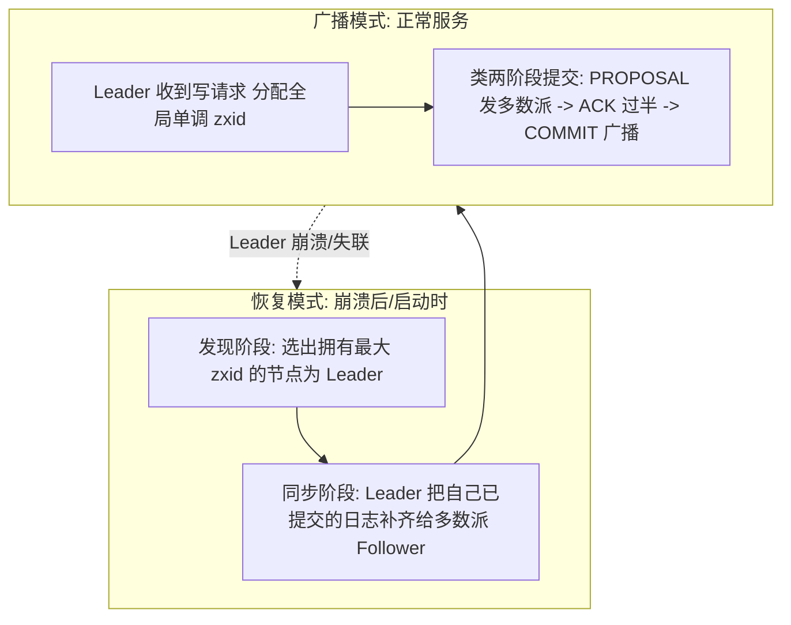
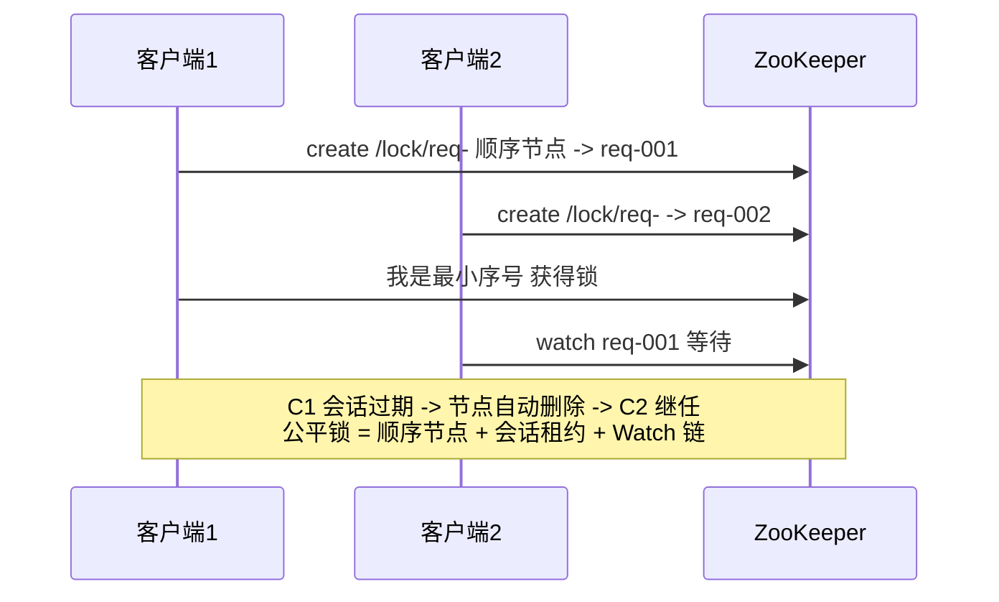

# Zab 协议与 ZooKeeper

> **一句话摘要**：Zab 是 ZooKeeper 的自研共识协议——与 Raft 同族（强 Leader + 多数派 + 全序日志），用「崩溃前恢复（选主+同步）+ 崩溃后消息广播」两大模式运转；理解 Zab 的关键不在「又学一个协议」，在对照 Raft 看同一骨架的另一种工程化选择。
> **本文核心**：Zab 用**恢复（发现选主 + 同步补齐）+ 广播（zxid 全序 + 多数派提交）**两模式提供全序广播——与 Raft 同族等价；ZooKeeper 的锁/选主/配置能力全部由「临时节点 + 会话过期 + Watch」三个原语组合而来。

前置阅读：[共识问题与 Paxos](./6_共识问题与Paxos-入门.md)、[Raft 共识算法](./7_Raft共识算法-入门.md)。

## 1. 背景：ZooKeeper 为什么自研协议

ZooKeeper（Yahoo 研发、后入 Apache）诞生于 2006-2008 年，目标是做「分布式协调服务」（锁/选主/配置/命名）——对底层协议的要求是「全序广播：所有节点以完全相同的顺序看到所有写」。当时 Paxos 论文可读性差、Multi-Paxos 工程细节缺失，团队选择了按需自研——这就是 Zab（ZooKeeper Atomic Broadcast）。它与 Raft 是同一问题的两份独立解（Raft 晚六年，明确引用 Zab 为对照），语义等价度高、术语与细节各成体系。

理解 Zab 的另一个价值：ZooKeeper 至今仍是大量系统的基础依赖（Kafka 老架构、Dubbo、Hadoop 生态），生产 ZooKeeper 的运维问题（选举风暴、会话超时、数据不一致疑云）全部要回到 Zab 机制解释。

## 2. 核心机制：两大模式与三种角色

**三种角色**：Leader（唯一处理写请求）、Follower（处理读 + 参与投票）、Observer（只转发读写、不投票——扩读能力不加投票开销）。

**关键机制逐条**（对照 Raft 看异同）：

- **zxid 全序**：64 位 = 高 32 位 epoch（任期）+ 低 32 位计数器——与 Raft 的 Term+索引异曲同工，用逻辑时序给全部写排序（又一次不信任墙钟）。
- **恢复模式两阶段**：**发现**（保证「新 Leader 必须拥有所有已被多数派提交的事务」——比较 zxid 选主，与 Raft 选举限制同义）+ **同步**（Leader 把已提交日志补齐给 Follower，丢弃未提交的残留——对应 Raft 的日志对齐）。
- **广播模式类两阶段提交**：PROPOSAL → 过半 ACK → COMMIT——但它不是标准 2PC（不需要全员确认、多数派即可，且没有阻塞回滚语义），本质与 Raft 的「复制多数派后提交」等价。
- **崩溃恢复的承诺**：已被提交的事务在任何恢复后必须保留（不丢），未被多数派确认的事务必须被丢弃（不脏复活）——「不丢不脏」两条是 Zab 安全性的全部。

## 3. 落地实践：ZooKeeper 的使用姿势

1. **四大高阶原语**：ZNode（分层 KV）、Watch（变更通知，一次性触发）、版本号（CAS 乐观锁）、临时节点（会话绑定生命周期）——分布式锁（临时顺序节点）、选主（最小编号当选）、配置中心（Watch）、集群成员管理（临时节点）全部由它们组合出来。
2. **会话与超时**：客户端与集群维持会话（sessionTimeout 内有心跳）；会话过期 = 临时节点全部删除——**锁自动释放、成员自动摘除的机制根基就是会话过期**（与[租约与心跳](./13_租约与心跳-入门.md)的机制同源）。
3. **运维纪律**：3/5 副本跨故障域；写吞吐有限（全量写走 Leader + 多数派落盘）——高频写不要压给它；快照 + 事务日志双持久化的磁盘要独享；JVM 堆与日志目录分离。经典调优：`autopurge` 清理快照、electionAlg 与超时按网络抖动校准。

## 4. 生产视角：ZooKeeper 的经典故障形态

- **选举风暴**：网络抖动导致反复选主（服务中断窗口反复出现）——根因多为超时阈值与网络 RTT 不匹配，或 Follower 负载过重心跳延迟。调大超时 + 减轻 Follower 读负载是常规处方。
- **「Watch 丢失」的误用**：Watch 是一次性触发（触发后需重新注册）——老版本客户端在「触发与重注册的间隙」错过变更。正确姿势：Watch 回调里先读当前值再重注册（把 Watch 当「提示去看」而不是「数据本身」）。
- **会话超时引发的锁双持**：客户端 GC 停顿超过 sessionTimeout → 会话过期、临时节点被删、别人拿到锁 → 停顿结束原客户端「以为」自己还持锁——这就是为什么持锁操作仍需**防圈护栏（fencing token）**（机制细节见[分布式锁与选主](./12_分布式锁与选主-入门.md)）。ZooKeeper 给了正确机制，误用仍会翻车。
- **容量与延迟的失控**：把 ZK 当数据库（百万级 ZNode、高频写）→ 快照巨大、恢复缓慢、广播延迟上升——ZK 定位是「小而关键的协调元数据」，越界使用的一切症状都指向这一个根因。

## 5. 主流系统怎么做：Zab 与 Raft 对照表

| 维度 | Zab（ZooKeeper） | Raft（etcd 等） |
|---|---|---|
| 全序工具 | zxid（epoch + 计数器） | Term + log 索引 |
| 选主依据 | 最大已提交 zxid（发现阶段确认） | 选举限制（log 至少一样新） |
| 正常写路径 | PROPOSAL → 过半 ACK → COMMIT | 复制多数派 → 提交位点推进 |
| 恢复动作 | 发现（选主）+ 同步（补日志） | 选举限制 + 日志对齐 |
| 读语义 | 读本地 Follower（默认），写线性一致 | 默认线性一致读（可降级） |
| 工程生态 | 老牌（Hadoop/Kafka/Dubbo 存量） | 新主流（K8s/NewSQL/Consul） |

规律：**同族协议的语义集合相同（全序广播 + 多数派 + 崩溃恢复），差异在术语与细节取舍**——学第二个协议的效率来自第一个：Zab 的每个机制都能在 Raft 里找到对应物，反之亦然。

## 6. 典型场景

- **老架构的协调底座**（存量级）：Kafka 老版本的元数据、Dubbo 老版注册中心、Hadoop 生态——理解 Zab 是维护这些系统的必修课。
- **分布式锁与选主的教科书实现**（机制级）：临时顺序节点的公平锁是「锁 + 会话过期 + 顺序」三机制的组合示范（对比篇 12 的实现谱系）。
- **配置发布与成员管理**（协调级）：配置 Watch 推送、集群成员上下线感知——临时节点 + 会话过期的标准应用。

## 7. 与相邻概念的区别

- **Zab vs Paxos**：Zab 面向「全序广播」（主broadcast 全部写），Paxos 面向「单值共识」；Zab 的两阶段恢复对应 Multi-Paxos 的 Leader 选举与日志补齐——同族不同门。
- **ZooKeeper vs etcd（服务视角）**：协议家族不同（Zab vs Raft）+ 数据模型不同（树形 ZNode/Watch vs 扁平 KV/Watch+租约）+ 生态代际不同——服务级选型对照见[协调服务选型](./15_协调服务选型-入门.md)。
- **ZooKeeper vs 注册中心（Eureka 类）**：ZK 是 CP（写走多数派），Eureka 类是 AP（各自服务、最终收敛）——CAP 两侧的代表（详见[CAP 定理](./2_CAP定理-入门.md)的服务图谱）。

## 8. 常见误区与不适用

- **「ZK 的读是线性一致的」**：默认读 Follower 本地（可能落后于最新提交）——线性一致要用 `sync()` 先对齐。与 etcd「默认线性一致」相反，迁移时最易踩的语义差。
- **「临时节点删了 = 锁一定安全释放」**：释放是保证了，但「新持有者开始工作」与「旧持有者停顿恢复」可能并存——fencing token（版本号递增校验）补上这一环，只靠临时节点是半套方案。
- **「Watch 保证不丢变更」**：一次性触发 + 间隙漏报的可能——Watch 语义是「提示 + 兜底重读」，不是可靠消息通道（可靠变更分发要用消息队列或 etcd 的 revision 机制）。
- **「ZK 集群越大越稳」**：投票规模越大写越慢——3 或 5 副本是主流；Observer 才是扩读的正解，扩投票者不是。
- **不适用**：海量业务数据存储（是协调服务不是数据库）；AP 场景（要分区可用的注册中心请选 AP 系）；高频写（广播多数派落盘的吞吐墙）。

## 9. 你们可能会问

- **zxid 的高 32 位 epoch 是干什么的？** 任期号——Leader 更替 epoch 递增，防止旧 Leader 的残留事务与新纪元混淆（与 Raft Term 完全同义）；低 32 位是纪元内计数。
- **Zab 的「同步阶段」删掉行不行？** 不行——新 Leader 若不把已提交日志补齐给多数派就开广播，部分 Follower 的日志会出现「缺口」，破坏全序。同步是「不丢不脏」承诺的执行动作。
- **ZooKeeper 怎么做公平锁？** 临时顺序节点：每个竞争者创建带序号的节点，序号最小者持锁，其余 Watch 前一个节点——释放（会话过期或主动删）后链式继任。
- **Kafka 为什么从 ZK 迁到 KRaft？** 元数据管理与控制器逻辑内聚（少一个外部依赖）、扩展性更好、运维简化——共识机制收敛到 Raft 家族的又一例。
- **新项目还选 ZooKeeper 吗？** 多数场景选 etcd/Consul（Raft 系、云原生生态、容器化友好）；存量生态绑定（Hadoop 系）或团队深度运维经验是 ZK 的留任理由。

## 10. 一句话总结 + 5W 速记卡 + 自测三问

**一句话总结**：Zab = 恢复（发现选主 + 同步补齐）+ 广播（zxid 全序 + 多数派提交）两模式，给 ZooKeeper 提供全序广播——与 Raft 同族等价，读懂一个即读懂另一个；运维 ZooKeeper 的所有问题最终都回到「会话/超时/容量」三个机制旋钮。

**5W 速记卡**：

| 维度 | 内容 |
|---|---|
| What | Zab 两模式 + zxid/临时节点/Watch/会话四机制 |
| Why | ZooKeeper 是大规模存量的协调底座，锁/选主/配置的教科书实现 |
| When | 维护 ZK 依赖的系统、实现锁与选主、协议对照学习时 |
| Where | Hadoop/Kafka 老架构/Dubbo 等生态 |
| How | 用高阶原语组合业务语义 → 钉住会话与超时 → 守住容量边界 |

**自测三问**：

1. 你维护的系统里谁还依赖 ZooKeeper？它挂了的影响路径画得出来吗？
2. ZK 上的锁，持锁方 GC 停顿超过 sessionTimeout 会发生什么？下游有防护吗？
3. ZK 的默认读语义与 etcd 有什么差别？你的代码有隐性假设吗？

---

**下篇预告**：跨机器连「现在几点」都说不准——下一篇[分布式时钟](./9_分布式时钟-入门.md)讲物理时钟为何不可信、逻辑时钟如何为事件排序。

**🎯 核心带走**：

- **核心一句话**：zxid 全序 + 多数派提交 + 崩溃恢复的「不丢不脏」承诺 = ZooKeeper 的全部。
- **链条复述**：写 → Leader 分配 zxid → PROPOSAL/ACK/COMMIT → 崩溃 → 按 zxid 选主 → 同步补齐 → 恢复广播；高阶语义 = 临时节点（会话租约）+ Watch + 版本号。
- **失效点与边界**：默认读 Follower 可能旧（与 etcd 相反）；Watch 一次性需重注册；容量定位是小而关键的元数据。

💡 **实战提示**：锁要配 fencing（会话过期双持窗口）；Watch 回调先重读再重注册；高频写别压给它；迁移到 etcd 先复核读一致性与 Watch 两处语义差。

**开放问题**：Kafka 从 ZK 迁往 KRaft 的趋势下，存量 ZK 的长期归宿是「永久留任」还是「逐步收缩到 Hadoop 系」？

**决策（何时用）**：Hadoop 系存量留任 ZK，新域推荐 etcd/Consul；推荐把「会话超时语义」写进所有依赖 ZK 的组件文档——锁双持事故多源于此。

ZK 十余年的运维经验沉淀（选举风暴/会话/容量三大主题）本身就是一份分布式系统的实践教材——协议在演进，运维主题的根子都在 Zab 机制上。

---

## 📌 数据与事实声明

Zab 协议出处为 Junqueira/Reed/Serafini 的 Zab 论文（2011）与 ZooKeeper 官方文档；ZooKeeper 3.9.x 为主线（截至 2026-09，gh CLI 已核实）；Kafka KRaft 迁移为 Kafka 公开架构文档（KIP-500 系列）。行为细节以官方文档为准。

## 📚 参考资料

| 类型 | 标题 | 来源 |
|---|---|---|
| 论文 | ZooKeeper's atomic broadcast protocol: Theory and practice | Junqueira et al., ACM TOSC（2011） |
| 文档 | ZooKeeper 官方文档（zookeeper Internals） | zookeeper.apache.org |
| 论文 | In Search of an Understandable Consensus Algorithm（对照） | USENIX ATC（2014） |
| 图书 | 数据密集型应用系统设计（DDIA）第 9 章 | O'Reilly（2017 中译） |
