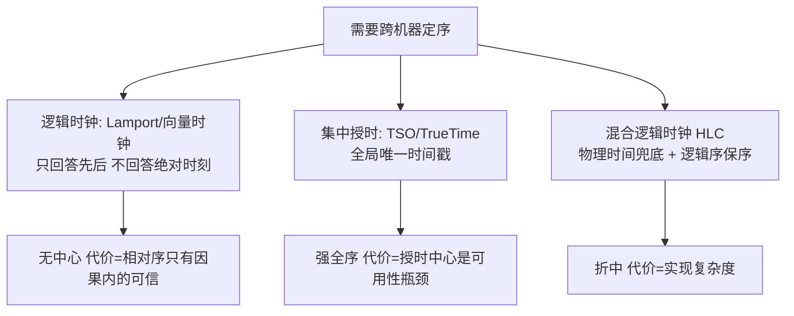
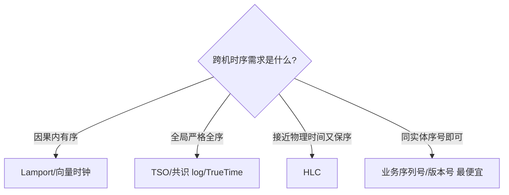

# 分布式时钟

> **一句话摘要**：分布式系统的机器时钟各自漂移、且可能被回拨——「两台机器上谁的事件先发生」无法用墙钟回答；解法分三派：逻辑时钟（只定序不看时刻）、集中授时（全局唯一时间戳）、混合逻辑时钟（两者折中）——本系列反复出现的「term/zxid/log 序」都是逻辑时钟思想的具体化。
> **本文核心**：跨机器的「先后」不能靠墙钟（漂移 + 跳变 + 物理精度极限）——**逻辑时钟定因果序、集中授时定全局序、HLC 折中两者**；本系列的 Term/zxid/log 序全是「不信任时钟」思想的具体化。

前置阅读：[分布式系统是什么与为什么难](./1_分布式系统是什么与为什么难-入门.md)。Term/zxid 的应用见[Raft](./7_Raft共识算法-入门.md)、[Zab](./8_Zab协议与ZooKeeper-入门.md)。

## 1. 背景：墙钟为什么不可信

> 量级分档意识：本文方法在十万级 QPS、千万级用户、亿级流量的场景下均需重新评估——量级变化时架构与参数需同步调整。

单机程序里「时间」理所当然——`now()` 排序即可。多机之后，「时间」碎成三个问题：

- **漂移**：每台机器的晶振频率略有差异，时钟每天漂移毫秒到秒级不等——不校时的话差异持续累积。
- **校时的两难**：NTP 校时是唯一抓手，但校时有两种方式——「缓调」（让时钟走慢一点追上）需要时间长，「跳变」（直接拨过去）瞬间完成但**会让时间倒流**。虚拟机暂停/恢复、宿主机休眠，同样产生秒级跳变。
- **物理极限**：即使完美同步，两台机器的时钟差也有微秒级下限——而现代系统的操作间隔（一次 RPC 只要毫秒）远小于这个差异所需的精度要求。

结论：**跨机器的事件先后（happened-before）不能用墙钟判定**。但「先后」又是分布式系统的刚需：谁先抢到锁、哪条日志在前、这个读能不能看到那个写——于是有了三类时钟方案。

## 2. 核心机制：三派方案

- **Lamport 逻辑时钟**：规则极简——每个事件本地计数 +1；发消息时把计数随消息带上；收方取 `max(本地, 消息带值) + 1`。由此得到「若 A 因果先于 B，则时间戳 A < B」。局限：**反向不成立**（时间戳小不代表因果在前，并发事件可能拿到相同或乱序的时间戳）——它只保证因果序的单向可信。
- **向量时钟**：每个节点维护「全员计数向量」，能精确判定**并发**（两个事件互不因果）与因果——代价是向量随节点数增长、元数据开销大。工业实现少（因果一致存储用），教学价值大。
- **集中授时（TSO）**：一个全局授时中心发单调递增时间戳（TiDB 的 Placement Driver、早期 Spanner 的思路）——简单、全序严格，代价是授时中心成为可用性与性能瓶颈（每次写都要先领号）。
- **TrueTime（Spanner）**：硬件原子钟 + GPS 给出「带误差区间的时间」——通过**等待误差区间过去**（commit wait）换取线性一致的绝对时刻。它证明「硬件可以买到时间精度」，代价是专属硬件，只有全球级基建玩得起。
- **混合逻辑时钟（HLC）**：时间戳 = 物理时间部分 + 逻辑部分——物理部分跟随本地墙钟（保持在真实时间附近），冲突时逻辑部分 +1 保序。CockroachDB 采用：既保因果序，又让时间戳「长得像」真实时间（便于 TTL、日志对齐、人类可读）。

## 3. 落地实践：按需求选时钟

1. **只要「同一实体的事件有序」**：不用时钟——用序列号/版本号（业务 ID 内嵌序号、乐观锁 version）。这是最便宜最可靠的方案（本系列的 Term/zxid 属于此类的协议版）。
2. **要「因果可判定」**：Lamport 时间戳标记 + 业务上避免依赖「并发事件的全序」——或直接上共识（log 序就是最可靠的全序，见[Raft](./7_Raft共识算法-入门.md)）。
3. **要「跨系统的全局时间线」**（审计、跨库事务读）：集中授时（TSO）或 NewSQL 的内置方案——接受授时中心可用性代价。
4. **任何情况下**：不要用「两台机器的墙钟差」做业务判断（超时阈值里的时间测量除外——单机测量是安全的）。

## 4. 生产视角：时钟问题的真实形态

- **「回拨」引发的重复**：雪花算法（见[分布式 ID 系列](../../../distributed-id/入门层/从零开始认识分布式ID系列/0_系列导读-全景.md)）的时间戳部分依赖机器时钟——NTP 跳变回拨后，生成的 ID 可能与历史重复。工程对策：检测回拨则等待/告警/切换备用位，或改用「逻辑部分兜底」的 HLC 思路。
- **日志排序的误导**：跨机器排查故障时按墙钟排日志，得出「响应先于请求」的荒谬结论——实际是两台机器时钟差了几十毫秒。排障纪律：跨机时序用「同一节点的日志」或「请求 ID 链路追踪」判定，墙钟只做粗参考。
- **TTL 与租约的边界**：租约过期判定用墙钟（本机测量，安全）——但「比较两台机器的租约时间戳」不安全。这就是为什么共识系统的租约用 epoch/term 判定，而不是时间戳比对（见[租约与心跳](./13_租约与心跳-入门.md)）。
- **缓存过期与分布式锁的微妙**：锁超时判定用本机时钟是安全的；但「业务数据按对方声称的时间戳取最新」（last-write-wins）在时钟漂移下会丢更新——AP 系统的冲突合并若依赖墙钟，就埋着静默丢数据的雷。

## 5. 主流系统怎么做：时钟方案谱系

| 系统 | 方案 | 机制要点 |
|---|---|---|
| ZooKeeper / etcd | 逻辑时钟（zxid/term+索引） | 协议内建，节点间无墙钟依赖 |
| TiDB | 集中授时 TSO（PD 组件批量发号） | 批量预取缓解授时瓶颈 |
| CockroachDB | 混合逻辑时钟 HLC | 物理兜底 + 逻辑保序，去中心化 |
| Google Spanner | TrueTime 硬件授时 + commit wait | 误差区间等待换取全局线性一致 |
| Kafka（对照） | 不解决跨分区时序 | 分区内 log 序；跨分区交给业务（时钟篇的边界感） |

规律：**去中心化系统偏爱逻辑时钟/HLC，强全局序的系统接受集中授时，有钱有硬件的用 TrueTime**——三条路线没有优劣，只有与架构假设的匹配度。

## 6. 典型场景

- **分布式 ID 生成**（序号级）：雪花算法的时间戳部分 + 回拨防护——ID 的时间有序性诉求与时钟可靠性的权衡。
- **事件溯源与审计**（时序级）：「这批操作的真实先后」——要么共识 log 序、要么集中授时，不能用各机墙钟。
- **跨机房主从切换**（容灾级）：切换决策里的「数据新旧比较」用 binlog 位点/GTID（逻辑序），不用时间戳——时钟篇纪律的典型案例。

## 7. 与相邻概念的区别

- **逻辑时钟 vs 物理时钟**：逻辑时钟度量「因果序」（相对关系），物理时钟度量「绝对时刻」——需要前者时用后者是错的，反之亦然。
- **Lamport 时钟 vs 向量时钟**：Lamport 只能判「因果则序对」，向量时钟能判「并发还是因果」——判别力换元数据开销。
- **HLC vs TSO**：HLC 去中心化（无授时瓶颈）但只有因果序保证；TSO 中心化（全局强全序）但有单点瓶颈——Spanner 路线（硬件）是第三条路，成本最高。
- **时钟同步 vs 事件定序**：NTP 解决「时钟尽量准」（仍然不够用于定序）；事件定序靠逻辑机制——两者解决不同问题，前者不能替代后者。

## 8. 常见误区与不适用

- **「我们 NTP 配好了，时钟够准」**：NTP 保证毫秒级偏差 + 校时跳变的可能——毫秒级偏差对「毫秒间隔的操作」定序仍然不够。NTP 是缓解，不是解决。
- **「用时间戳做 last-write-wins 很自然」**：跨机器时间戳不可比——后发生的写入可能带着更小的时间戳，合并规则静默丢更新。AP 系统冲突合并要版本向量/业务规则，不能靠墙钟。
- **「云服务器时间肯定同步」**：虚机暂停恢复、宿主机迁移都产生跳变——云厂商文档明确时钟无 SLA 保证（个别专属主机的原子钟服务除外）。
- **「单调时钟（monotonic clock）能跨机器吗」**：单调时钟只在本机内单调（测时长安全），跨机器没有可比性——`System.nanoTime` 跨机比较是经典错误。
- **不适用**：单机内的时间测量（本机时钟完全够用）；粗粒度的日志展示（人类可读的时间无妨）——时钟纪律只在「跨机器时序判定」处生效。

## 9. 你们可能会问

- **happened-before 到底定义了什么？** 「A 的结果影响了 B」（同线程先后、消息发送先于接收、传递性）——因果关系的形式化；Lamport 时钟是它的数值化。它是分布式系统「先后」的唯一可靠语义。
- **雪花算法的回拨防护怎么做？** 检测到时钟回拨：小回拨等待追平、大回拨拒绝服务告警、或预留位用逻辑序列兜底——各家实现不同，选 ID 生成器时这是必查项。
- **HLC 的时间戳还像时间吗？** 像——物理部分始终跟随墙钟（不偏离真实时间太远），逻辑部分只在事件并发冲突时递增——所以 TTL、日志、人类阅读都兼容。
- **TiDB 为什么敢用中心化 TSO？** PD 批量发号（一次领一批）摊薄往返，且 TSO 只在「取号」路径上，不承载流量——中心化的可用性代价被架构设计压缩到可接受。
- **怎么排查一次「时间倒流」事故？** 三步：对比涉事机器的时钟漂移记录（监控系统）→ 用请求 ID/链路追踪重建真实顺序 → 把排序逻辑改成逻辑序（位点/版本号）——墙钟排序的结论永远存疑。

## 10. 一句话总结 + 5W 速记卡 + 自测三问

**一句话总结**：跨机器的事件先后不能靠墙钟——逻辑时钟给因果序、集中授时给全局序、HLC 给两者折中；本系列的 term/zxid/log 序全部是「不信任时钟」思想的落地，工程纪律一句话：跨机定序用逻辑，本机测量用墙钟。

**5W 速记卡**：

| 维度 | 内容 |
|---|---|
| What | 漂移/跳变两大问题 + Lamport/向量/TSO/TrueTime/HLC 三派方案 |
| Why | 墙钟跨机不可比，而「先后」是分布式刚需 |
| When | 事件定序、ID 生成、冲突合并、租约判定设计时 |
| Where | 共识协议、NewSQL、分布式 ID、审计系统 |
| How | 需求翻译（因果序/全局序/物理感）→ 选派 → 不跨机比墙钟 |

**自测三问**：

1. 你的系统里有没有「比较两台机器产生的时间戳」的逻辑？它在时钟跳变时会怎样？
2. 你用的 ID 生成器，回拨防护机制是什么？触发过吗？
3. 上一次跨机排障，你按墙钟排的日志结论可靠吗？

---

**下篇预告**：重试必然带来重复——下一篇[幂等与去重](./10_幂等与去重-入门.md)讲「同一操作执行多次结果不变」的完整工程体系。

**🎯 核心带走**：

- **核心一句话**：跨机定序用逻辑机制，本机测量才用墙钟——happened-before 是唯一可靠的先后语义。
- **链条复述**：墙钟不可信 → 按需求选派（因果序=Lamport/向量、全局序=TSO/共识、物理感=HLC、硬件=TrueTime）→ ID/审计/租约判定各自落地。
- **失效点与边界**：Lamport 时钟反向不成立（并发事件不可判）；TSO 有授时中心瓶颈；NTP 只是缓解不是解决。

💡 **实战提示**：禁写「比较两台机器时间戳」的代码；ID 生成器查回拨防护；跨机排障用请求 ID 链路不用墙钟排序；last-write-wins 合并规则禁用墙钟。

**开放问题**：如果硬件时钟精度未来便宜到 TrueTime 普及，逻辑时钟的哪些用武之地会被收回，哪些永远收不回？

**决策（何时用）**：事件定序推荐逻辑序/共识 log 序，全局时间线推荐 TSO/授时服务，ID 有序性推荐带回拨防护的雪花或 HLC 思路；推荐把「跨机时序判定」列入 code review 检查项。

从 Lamport 1978 到 HLC（2014）再到各 NewSQL 的授时实践，时钟方案在「去中心化 × 精度」的两轴上演进——「物理不可信」的前提四十六年未变。

---

## 📌 数据与事实声明

Lamport 逻辑时钟出自《Time, Clocks, and the Ordering of Events in a Distributed System》（CACM 1978）；HLC 出自 Kulkarni 等论文（2014）；TrueTime/TSO 机制为 Spanner/TiDB/CockroachDB 公开文档。时钟漂移量级为业内通用认知。以各系统官方文档为准。

## 📚 参考资料

| 类型 | 标题 | 来源 |
|---|---|---|
| 论文 | Time, Clocks, and the Ordering of Events in a Distributed System | Lamport, CACM（1978） |
| 图书 | 数据密集型应用系统设计（DDIA）第 9 章 | O'Reilly（2017 中译） |
| 文档 | CockroachDB: hybrid logical clocks / TiDB: TSO | 各官方文档 |
| 系列文章 | 分布式 ID 系列（雪花回拨） | 本仓库 docs/architecture/system-design/distributed-id/ |
