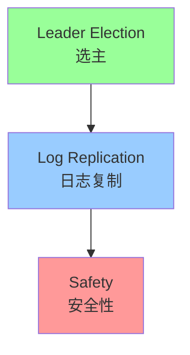
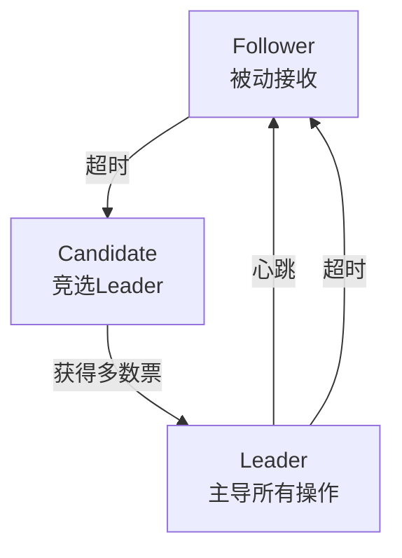
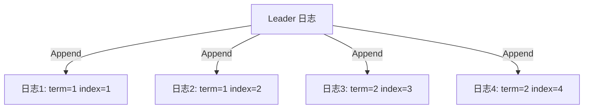
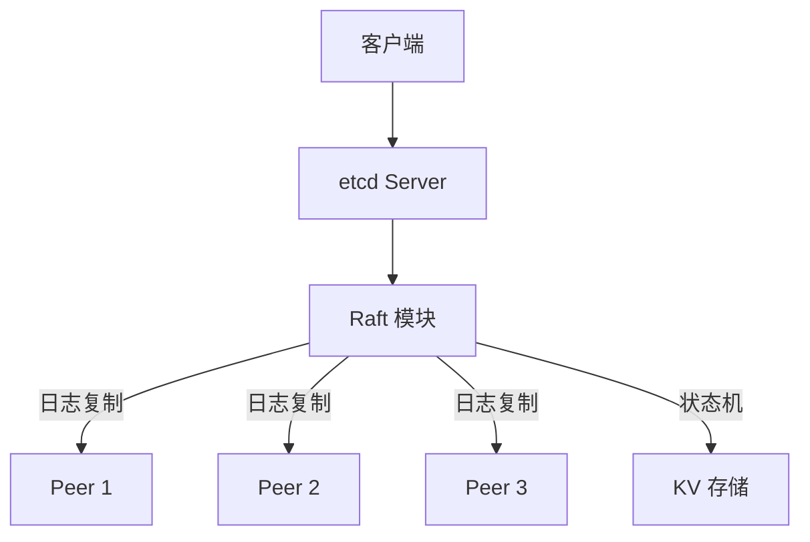

# Raft 共识算法深度解析

> **一句话摘要**：Raft = 可理解的共识算法——通过 Leader 选举 + 日志复制 + 安全性保证，让分布式节点对数据达成一致。
> **本文核心**：**Raft = 选主 + 日志复制 + 安全**。

前置阅读：[Raft 共识算法](../分布式理论/入门层/从零开始认识分布式理论系列/7_Raft共识算法-入门.md)。本篇深入 Raft 的实现细节。

## 1. 背景：为什么需要 Raft

> 量级分档意识：本文方法在十万级 QPS、千万级用户、亿级流量的场景下均需重新评估——量级变化时架构与参数需同步调整。


Paxos 难理解。Raft 的目标：**让共识算法可被理解**。

Raft 将共识问题拆为三个子问题：



**Raft 的核心贡献**：用清晰的术语和状态机，让工程师理解共识的本质。

## 2. 核心机制：Leader 选举

### 2.1 三种角色



- **Follower**：被动接收 Leader 的指令
- **Candidate**：竞选 Leader
- **Leader**：处理所有客户端请求

### 2.2 选举流程

```mermaid
sequenceDiagram
    F[Follower] -->|选举超时| C[Candidate]
    C -->|投自己+请求投票| Others[其他节点]
    Others -->|投票| C
    C -->|获得多数票| L[Leader]
    L -->|发心跳| F
    
    Note over F,C,L: 选举: 超时→竞选→投票→Leader
```

**选举参数**：
- **选举超时**：150-300ms（随机）
- **心跳间隔**：10-20ms
- **任期（Term）**：每次选举递增

### 2.3 安全性保证

- **选举安全**：每个任期最多一个 Leader
- **Leader 完整性**：Leader 一定包含所有已提交的日志
- **状态机安全**：如果节点已应用某日志，后续不会覆盖

## 3. 核心机制：日志复制

### 3.1 日志结构



**日志属性**：
- `term`：创建时的任期号
- `index`：日志在日志序列中的位置

### 3.2 复制流程

```mermaid
sequenceDiagram
    Client[客户端] -->|请求| Leader[Leader]
    Leader -->|Append Entry| Follower1[Follower 1]
    Leader -->|Append Entry| Follower2[Follower 2]
    Leader -->|Append Entry| Follower3[Follower 3]
    
    Follower1 -->|确认| Leader
    Follower2 -->|确认| Leader
    Follower3 -->|确认| Leader
    
    Leader -->|提交| Apply[应用到状态机]
    Apply -->|响应| Client
```

**复制规则**：
- Leader 收到请求 → Append 到本地日志 → 发给 Followers
- Follower 收到 → 追加到本地日志 → 返回确认
- Leader 收到多数确认 → 提交日志 → 应用到状态机

### 3.3 提交规则

```mermaid
flowchart TD
    Log[日志] -->|复制到多数| Majority[多数节点]
    Majority -->|当前任期| Current[当前任期]
    Current -->|提交| Apply[应用到状态机]
    
    Note over Log,Apply: 只有当前任期的日志才能被提交
```

**关键规则**：只有当前 Leader 任期的日志才能被提交（防止旧日志被提交）。

## 4. 落地实践：etcd Raft

etcd 使用 Raft 作为一致性算法：

```yaml
# etcd 集群配置
etcd:
  name: node1
  initial-advertise-peer-urls: http://node1:2380
  listen-peer-urls: http://0.0.0.0:2380
  listen-client-urls: http://0.0.0.0:2379
  initial-cluster: node1=http://node1:2380,node2=http://node2:2380,node3=http://node3:2380
```

**Raft 在 etcd 中的角色**：



## 5. 落地实践：Raft 实践要点

### 5.1 Leader 选举优化

```java
// 预投票（Pre-Vote）防止不必要的选举
public boolean requestPreVote(long term) {
    // 检查是否应该发起选举
    if (lastHeartbeat + electionTimeout < now) {
        return requestVote(term); // 发起正式投票
    }
    return false; // 不需要选举
}
```

### 5.2 日志压缩

```mermaid
flowchart TD
    Log[完整日志] -->|快照| Snapshot[快照]
    Snapshot -->|截断| Compact[压缩后的日志]
    
    Note over Log,Compact: 日志压缩防止无限增长
```

**日志压缩方式**：
- 快照（Snapshot）：保存完整状态，截断旧日志
- 增量压缩：只保留差异

### 5.3 成员变更

```mermaid
sequenceDiagram
    Old[旧集群: 3节点] -->|加入新节点| New[新集群: 5节点]
    New -->|移除旧节点| Final[最终集群: 5节点]
    
    Note over Old,Final: 联合共识（Joint Consensus）
```

## 6. 生产视角：Raft 踩坑

- **踩坑 1**：网络分区导致 Leader 频繁切换——脑裂
- **踩坑 2**：日志复制延迟高——Follower 性能不足
- **踩坑 3**：快照恢复慢——快照过大
- **踩坑 4**：成员变更过程中集群不可用——联合共识的复杂性

**生产最佳实践**：

1. 3/5 节点集群（奇数）
2. 选举超时设置合理（150-300ms）
3. 快照定期触发
4. 监控 Leader 切换频率
5. 成员变更使用联合共识

## 7. 典型场景

| 场景 | 方案 | 理由 |
|---|---|---|
| 配置中心 | etcd(Raft) | 强一致配置 |
| 分布式锁 | etcd(Raft) | 锁服务 |
| 数据库主从 | Raft | 数据一致性 |
| 服务注册 | Raft | 注册中心 |
| 元数据管理 | Raft | 元数据一致性 |

## 8. 与相邻概念的区别

- **Raft vs Paxos**：Raft 可理解性更强，Paxos 更灵活
- **Raft vs Zab**：Raft 通用，Zab 专为 ZooKeeper 设计
- **Raft vs Gossip**：Raft 强一致，Gossip 最终一致
- **Raft vs Multi-Raft**：单组 Raft vs 多组 Raft（分片）

## 9. 你们可能会问

- **Raft 一定能选出 Leader 吗？** 只要多数节点可达就能
- **Leader 挂了怎么办？** 选举超时后重新选举
- **网络分区时会发生什么？** 少数分区无法选举，多数分区继续工作
- **Raft 能扩展吗？** 单组有性能瓶颈 → Multi-Raft（分片）

## 10. 一句话总结 + 5W 速记卡 + 自测三问

**一句话总结**：Raft = 选主 + 日志复制 + 安全性——可理解的共识算法。

**5W 速记卡**：

| 维度 | 内容 |
|---|---|
| What | Leader 选举 + 日志复制 + 安全性 |
| Why | Paxos 难理解，Raft 可理解 |
| When | 需要强一致的场景 |
| Where | etcd/分布式锁/配置中心 |
| How | 三角色 + 三子问题 |

**自测三问**：

1. Raft 的 Leader 选举如何保证安全？
2. 日志提交的条件是什么？
3. 快照的作用是什么？

---

**下篇预告**：一致性模型深挖——[一致性模型深挖](./2_一致性模型深挖-特性.md)。

**🎯 核心带走**：

- **核心一句话**：Raft = 可理解的共识 = 选主 + 日志复制 + 安全
- **链条复述**：选举 → 日志复制 → 提交 → 应用
- **失效点与边界**：网络分区导致不可用；快照恢复慢

💡 **实战提示**：3/5 节点 + 合理选举超时 = 生产可用 Raft。

**开放问题**：Raft 能用于公链吗？答案是：有限——公链需要拜占庭容错（BFT），Raft 只解决非拜占庭故障。

**决策（何时用）**：需要强一致选主用 Raft；最终一致用 Gossip；金融级用 BFT。

## 📌 数据与事实声明

- 写于 2026-09-11
- 免责：以官方文档为准

## 📚 参考资料

| 类型 | 标题 | 来源 |
|---|---|---|
| 官方文档 | 官方文档 | 官方站点 |
