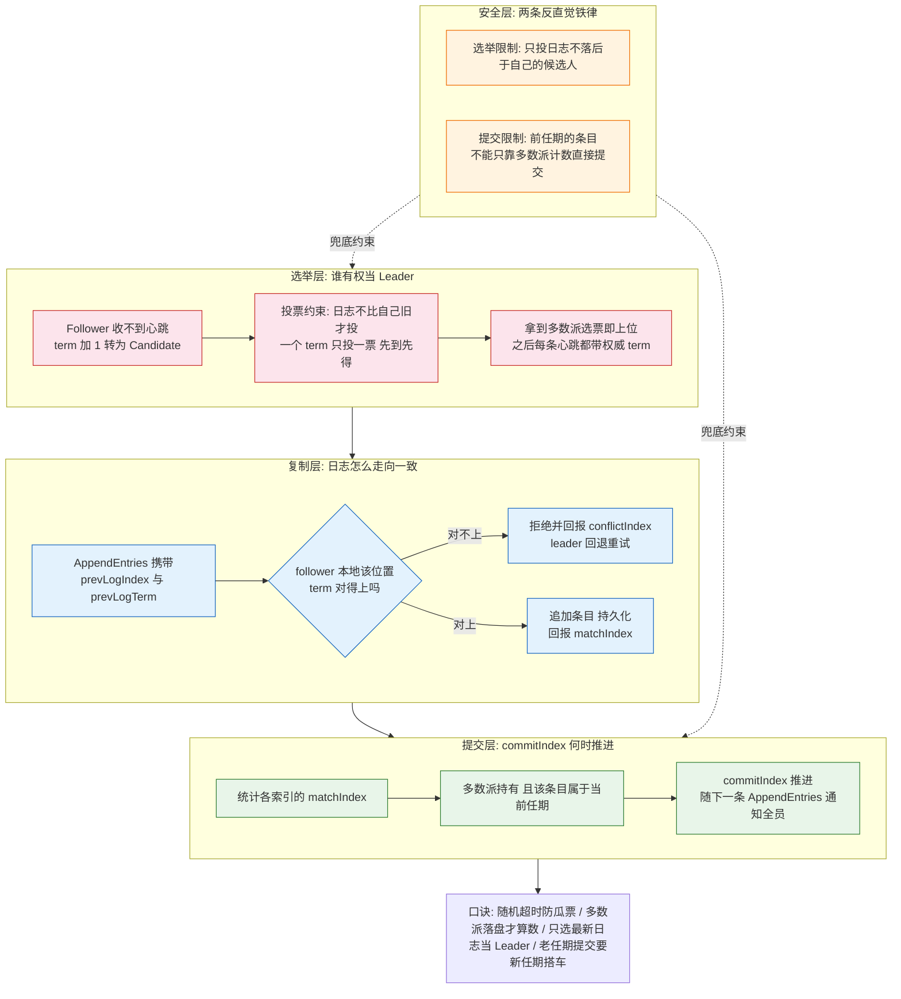
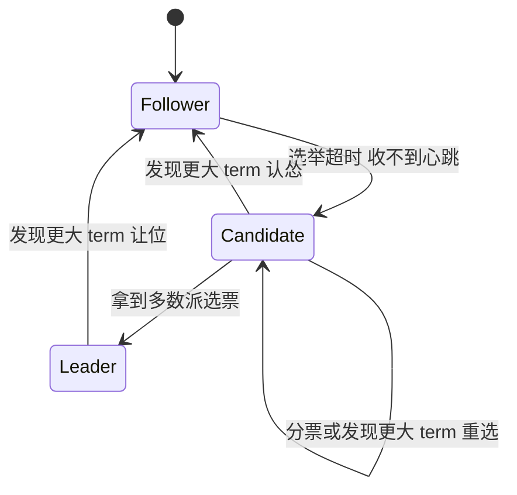
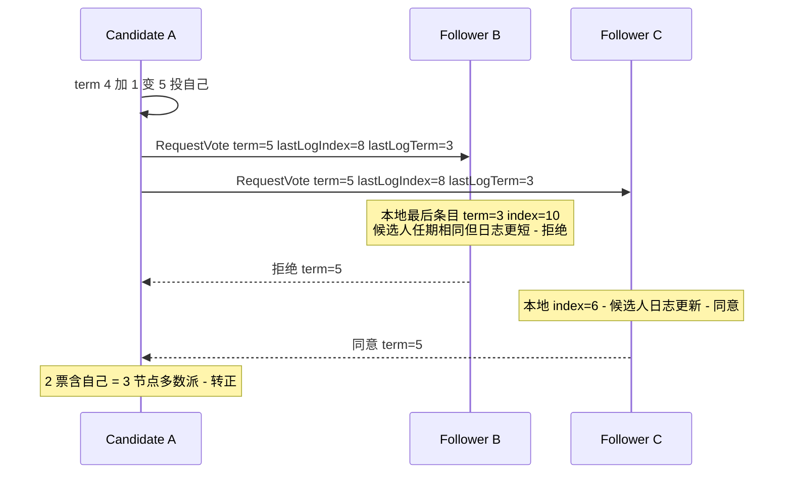
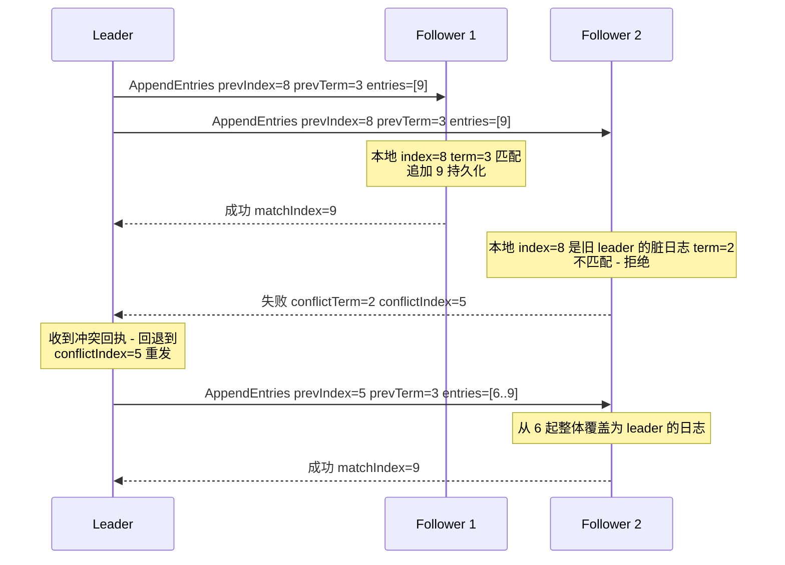
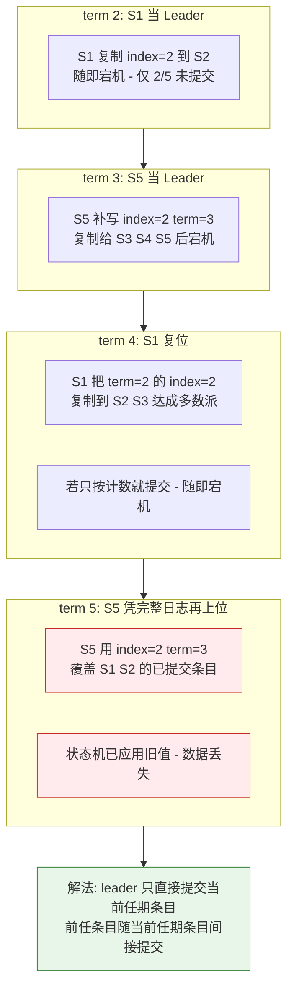

# Raft 选举与日志复制：从心跳超时到 commitIndex 推进的完整链路

> **本文核心**：Raft 的全部正确性都压在一条机制链上——**心跳超时触发随机化竞选 → 多数派投票选出日志最新的 Leader → AppendEntries 用 prevLogIndex/Term 逐条对齐日志 → 多数派确认后推进 commitIndex → 只提交当前任期的条目（前任条目搭车提交）**。选举管「谁来写」，复制管「写得一致」，安全性约束管「无论怎么宕机切换，已提交的数据绝不被覆盖」。这三层各自独立成规则，又互相咬合：选举限制是复制安全的前置条件，当前任期提交规则是状态机不被污染的最后防线。

## 一图看懂



这张图是全文的地图：选举层决定「谁来写」，复制层决定「怎么写一致」，提交层决定「什么时候算数」，安全层是横跨三层的两条铁律——后面每一节都在展开图中的一个分区。

## 一句话摘要

Raft 用「随机化选举超时 + 多数派投票 + 日志对新旧的投票约束」解决可用性切换，用「prevLogIndex/Term 逐条对齐 + 多数派 matchIndex + 当前任期才能提交」解决复制一致；理解了「为什么前任任期的条目不能只靠计数提交」（Figure 8 问题），才算真正读懂 Raft 的安全性。

## 前置阅读

- [Raft 共识算法深度解析](1_Raft共识算法深度解析-特性.md)：本系列第 1 篇，三种角色与整体流程
- [Raft 共识算法（入门层）](../../入门层/从零开始认识分布式理论系列/7_Raft共识算法-入门.md)：CAP 与共识问题的入门视角
- [一致性方案选型](../../专题层/一致性方案选型/1_一致性方案选型-专题.md)：什么时候该上共识，什么时候不必

## 5W 速记卡

| 维度 | 一句话 |
|---|---|
| What | Leader 选举 + 日志复制 + 安全性约束，三套机制咬合成共识算法 |
| Why | 多数派写入保证分区下只有一个权威写入口，日志序保证副本状态机一致 |
| How | 随机超时竞选 → 投票校验日志新旧 → prevLog 对齐复制 → 多数派推进 commitIndex |
| When | 任期末心跳与选举超时、Leader 切换、副本日志追赶、提交卡住的排查 |
| Where | etcd/TiKV/Consul/Nacos（Raft 协议）等一切强一致元数据与存储底座 |

## 一、问题起点：心跳超时与「任期」这把全局逻辑时钟

Raft 把时间切成一格格 term（任期）：每个 term 至多一个 Leader，term 是单调递增的逻辑时钟，所有消息都携带 term，**比较 term 就是比较消息的新旧**。



正常态下 Leader 以远小于选举超时的间隔发心跳（条目为空的 AppendEntries）；Follower 只要收到合法 term 的心跳就重置计时器。**任期末心跳**指的就是这个细节：哪怕 Leader 没有新数据要写，心跳也要持续发——心跳的作用不是「同步数据」而是「同步权威」：告诉所有 Follower「我这个 term 还活着，你们别选」。

**追问：心跳间隔和选举超时为什么差着数量级？** Raft 论文给出的时序要求是一条不等式：广播时间 << 选举超时 << 节点间平均故障间隔。前半段保证心跳在正常网络下总能先于超时到达；后半段保证选举切换造成的不可写窗口相对系统的正常运行可以忽略。业内认知中常引的参考值是广播毫秒级、选举超时几百毫秒到秒级——比如 etcd 默认心跳 100ms、选举超时 1s（公开口径），具体数值要按网络 RTT 实测校准，而不是抄默认值。

**追问：为什么选举超时必须是随机的？** 把超时设成固定值，节点几乎同时超时就会同时发起竞选：每个 Candidate 先投自己，互相拒绝对方的 RequestVote，没人能凑齐多数派，term 一路上涨直到有人「恰好」错开——这就是瓜票（split vote）。随机化把「同时」打散成「几乎总有一个节点先醒」：超时区间取 150-300ms 这类范围（业内认知，论文建议量级），先醒的节点在自己的超时窗口内就能拉到多数派。

**为什么不选固定超时 + 冲突后再随机退避？** 可以做，但退化路径难看：一旦进入瓜票循环，要靠多轮失败才能恢复，每轮 term 都在涨，恢复时间不可预期；预随机化让绝大多数选举一轮结束，把「恢复时间」从概率问题变成工程常量。这也是为什么 etcd 的 raft 库里超时扰动默认开启、由库而不是业务代码负责。

**打破砂锅：随机数种子会不会让两个节点总选出一个？** 概率上存在但随 term 递增迅速收敛：每轮竞选瓜票的概率是独立事件，连续 k 轮瓜票的概率指数衰减；而且 RequestVote 是 RPC，网络延迟本身就在给时序加随机性。工程上真正要防的是**伪随机种子相同**（比如嵌入式设备用固定种子）——这类案例在 IoT 场景出现过，解法是把节点 ID 混入种子。

## 二、投票的输入约束：RequestVote 里藏着什么

一条 RequestVote 只带四个关键字段：candidate 的 term、candidateId、**lastLogIndex、lastLogTerm**。后两个字段是安全性的关键——投票规则有两条：

1. **每节点在一个 term 内只投一票，先到先得**——这保证一个 term 至多选出一个 Leader（多数派不可分割）。
2. **候选人的日志必须「不旧于」投票者**——先比 lastLogTerm（最后一条的任期），任期大者新；相等再比 lastLogIndex，更长者为新。不满足就拒绝。



**为什么不选「谁先到谁当」而不校验日志新旧？** 因为选举安全性和复制安全性是绑死的：设想某条日志已经在 3 节点中的 2 个上提交（进了状态机），随后 Leader 宕机，一个**日志落后**的节点当选且不持有那条日志——它成为 Leader 后会用自己短的日志把 follower 上那条已提交的条目覆盖掉。**已提交 = 已被状态机应用 = 对外可见且不可撤销**，覆盖它就是数据丢失。投票时的日志新旧校验，把「持有全部已提交条目的节点才有资格当选」变成了选举阶段的硬约束——这是 Raft 论文里 Election Safety 性质的实现载体。

**追问：多数派交集为什么能保证这一点？** 任何两个多数派集合必然相交。第 t 任已提交条目时，多数派持有它；新 Leader 当选也需要另一个多数派——两个多数派的交集节点既持有该条目、又投过新 Leader 的票，而它在投票前已经用日志新旧规则把候选人筛过一遍。链条闭合：**新 Leader 必然至少持有所有已提交条目**（Leader Completeness 的直观版）。

## 三、日志复制：AppendEntries 的对齐协议

Leader 上位后不「夺取」数据，而是**把自己当主、把 follower 的日志往自己的形状上修**。一致性检查的载体是每条 AppendEntries 里的 prevLogIndex/prevLogTerm：leader 说「我这条新日志的前一条，在 index=X 处，term 是 Y」——follower 必须本地该位置真有一条 term=Y 的日志才接受，否则拒绝。



两个细节值得穿透：

- **脏日志用覆盖解决**：follower 上与 leader 冲突的尾部日志（前任 Leader 写了一半没提交的）会被 leader 的日志整体覆盖——覆盖的前提是那些日志**从未被提交**，而提交过的条目不可能冲突（第二节的安全约束保证了新 Leader 持有全部已提交条目）。
- **回退可以做快**：朴素实现是 leader 每次回退一条（nextIndex--），follower 落后很远时要退很多轮。优化是拒绝时回带 conflictTerm/conflictIndex，leader 一次跳过整个冲突任期段——etcd 的 raft 库就采用这种批量回退（公开源码可查），把日志差距 O(差异长度) 的追赶从 O(长度) 轮 RPC 压到 O(冲突任期数) 轮。

### commitIndex 怎么推进

Leader 为每个 follower 维护 matchIndex（已确认对齐到的位置）。收到多数派的复制成功回执后：

1. 取每个索引 N 的持有节点数，找到**最大的、被多数派持有**的 N；
2. 校验 N 处条目的 term 等于**当前任期**；
3. 通过则 commitIndex = N，随后把日志应用到状态机，并借助下一条 AppendEntries 的 commitIndex 字段让 follower 也推进。

**关键路径**上真正贵的是第 2 步——这就是下一节的主角。至于日常吞吐，读路径完全不走日志（follower 直接读自己的状态机，代价是可能读到旧数据；强一致读要另外的 ReadIndex/Lease 机制，本系列第 3 篇展开）。

## 四、安全性约束：为什么前任任期的条目不能直接提交

这是 Raft 最反直觉的一条规则，也是无数自研 Raft 踩坑的地方——**论文 Figure 8 的原始问题**。

场景：日志只复制到少数派时 Leader 宕机（条目未提交），新 Leader 上位后补写了新条目；此时如果新 Leader「只看多数派计数」就提交前任留下的旧条目，随后再宕机，**下一个 Leader 可能把这条已应用的条目覆盖掉**——状态机无法回滚，数据丢失。



所以规则是：**commitIndex 的推进只认当前任期的条目**；前任的条目通过「当前任期有条目被提交」间接变安全——一旦某条当前任期日志被提交，它前面的所有日志（无论哪个任期）都随之提交。这就是口诀「老任期提交要新任期搭车」。

代价是明显的：**Leader 刚上位、还没有新写入时，前任遗留的多数派复制条目处于「看着能提交但不敢提交」的悬置态**。为此 Raft 允许新 Leader 上位后立刻补一条 no-op 空条目——不写业务数据，只为尽快制造一条「当前任期」日志把前任遗留全部搭车提交。etcd 与各类生产实现都在选举完成时补 no-op（公开源码可查）。

**追问：为什么不能放宽成「term >= 我的上一条 term 就能提交」？** 放宽后的判定必须回答「哪些前任条目可以搭哪些车」——而复制进度是按位置（index）统计的，任期交错时同一位置在 follower 上的 term 可能不同，「term 只差一届」的安全边界证明会失效。Raft 的选择是直接一刀切：只信当前任期，把证明压到最短——**规则更笨，但正确性证明更硬**，这是刻意的设计取舍。

## 五、源码与关键路径：以 etcd raft 库为锚

etcd 的 raft 库是事实上的参考实现（TiKV 等项目直接 fork 或移植），关键路径值得读一遍（以下为简化骨架，`go`）：

```go
// raft.go: 驱动循环的两个入口
// tick 驱动时间, Step 处理消息 - 两者都只改内存状态, 落盘由上层 Ready 驱动
func (r *raft) tick() {
    switch r.state {
    case StateFollower, StateCandidate:
        r.electionElapsed++
        if r.promotable() && r.electionTimeoutReached() {
            r.electionElapsed = 0
            r.campaign(campaignElection) // 超时: 发起竞选
        }
    case StateLeader:
        r.heartbeatElapsed++
        if r.heartbeatTimeoutReached() {
            r.heartbeatElapsed = 0
            r.bcastAppend() // 心跳 = 空 AppendEntries, 顺带推进日志
        }
    }
}

func (r *raft) Step(m pb.Message) {
    if m.Term > r.Term { // 见到更大 term - 无论自己是谁 立即让位
        r.becomeFollower(m.Term, None)
    }
    // ... 按 state 分发: handleVote / appendEntries / 推进 commitIndex
}
```

读源码时抓三条主线：**tick 线**（超时与竞选）、**Step 线**（消息与状态迁移）、**Ready 线**（entries/messages 需要持久化与网络发出的边界）。理解「库只管内存状态机、WAL 与网络都在外面」的分层，就知道自研时的正确嵌入点在哪。另一个工程要点是**预投票（PreVote）**：节点先发一轮不带 term 自增的探测，确认多数派可达且愿意投才真正自增 term 竞选——防止一个被分区的落后节点反复自增 term 回来把健康 Leader 顶下线（业内惯例，etcd 默认可开启）。

## 六、不同量级的思考：选举与复制随规模的换挡

- **十万级（QPS 或元数据条目量）**：约束来源是单组多数派 RPC 的往返时延——每次写入都要至少一次多数派确认，3 节点集群单点写吞吐上限明确。这一档的核心问题是**把共识延迟压进业务预算**，而不是急着扩展集群：调优心跳/选举超时、批量提交、分组复用就够。思考方式：**时延预算驱动**。
- **百万级**：约束来源是单 Raft 组的日志序串行化——所有写入过同一个 Leader，单组吞吐天花板开始挡路。这一档的核心问题是**水平拆分共识域**（multi-raft：按 key range/shard 分成多个独立 Raft 组并行复制），而不是继续垂直优化单组参数。思考方式：**分片分治驱动**。
- **千万级**：约束来源是故障半径与日志回放的恢复时长——单组日志越大、成员越多，重选与追赶的代价越高。这一档的核心问题是**控制故障爆炸半径**（Region 化调度、副本再均衡、Learner 只读副本分担追赶），而不是无脑加副本数。思考方式：**爆炸半径驱动**。
- **亿级**：约束来源是机房与地域级故障——同机房多数派扛不住整机房失联。这一档的核心问题是**跨地域多数派的时延与容灾权衡**（同地域 3 副本 + 异地异步容灾，还是跨地域 5 副本承担跨城 RTT），而不是在单机房里继续堆副本。思考方式：**容灾拓扑驱动**。

自下而上看，每一档都是在上一档的解法撞墙后倒逼出新的约束来源：时延预算 → 分片分治 → 爆炸半径 → 容灾拓扑。触发升级的信号也很清晰：单组写入延迟 P99 贴近业务上限 → 拆分组；故障恢复时长超过 SLA → 调度与 Learner；跨机房部署 → 重估多数派摆放。

## 七、业内惯例与生产实践

- **超时参数按实测定**：心跳 ≈ 一次 RTT 量级、选举超时 ≈ 10 倍心跳是常见起点（业内认知），跨机房部署时按跨城 RTT 重算，绝不能直接抄同机房的默认值。
- **checkQuorum 与 PreVote 是标配开关**：生产环境普遍开启预投票与「Leader 定期检查多数派存活，否则主动让位」，避免脑裂边缘的僵尸 Leader（公开口径，etcd/TiKV 均支持）。
- **成员变更走单步变更**：一次只增删一个节点（joint consensus 的工程简化），把配置切换期间的两个多数派配置错开到不同阶段，避免新旧配置各自选出 Leader。
- **日志压缩与快照必须配额管理**：follower 落后超过快照点就要走「发快照 + 追日志」的重路径，生产上要监控日志积压量与追赶速率。

## 八、事故与实践叙事（匿名化）

**事故一：网络抖动引发的选举风暴。** 某存储服务在机房网络抖动期间反复切换 Leader，客户端超时雪崩。排查发现选举超时配置为默认的秒级下限，而该机房跨交换机 RTT 长尾接近心跳间隔——Follower 频繁误判 Leader 失联，term 短时间内涨了几百。复盘后的修复：按 P99 RTT 重算心跳与超时比例、开启 PreVote、给客户端加 Leader 切换退避。教训是**超时参数是部署拓扑的函数**，不是论文常量。

**事故二：慢磁盘拖住全组提交。** 某集群一条写入在 Leader 上落盘 200ms，多数派等待把所有写入的 P99 拖到半秒级。排查最初怀疑网络，后用每个 follower 的 matchIndex 落后量定位到单块慢盘节点。复盘动作：把「matchIndex 持续落后」做成监控项、替换磁盘、并评估用 Learner 语义承接弱节点。这类案例说明 commitIndex 是多数派的木桶——**最慢的多数派成员决定提交延迟**。

**实践复盘：no-op 缺失导致的提交悬置。** 一个自研实现选主后不补空条目，前任遗留的多数派复制日志迟迟无法提交，上层把「提交卡住」误判为脑裂反复告警。补上 no-op 机制后悬置窗口从「直到下一次业务写入」收敛为毫秒级。这印证了第四节的规则：新 Leader 的第一件事不是等数据，而是造一条当前任期日志。

## 九、设计思想

**强领导者是简化之锚。** 所有写入经 Leader、日志单向流动、冲突一律以 Leader 为准——把「多写者一致」降维成「单写者广播 + 少数派服从」。对比无 Leader 的多数派表决式设计，Raft 换来了可推演的状态空间：任何时刻只需回答「Leader 认为什么」。这是「以复杂度换可理解性」的典范设计取舍。

**随机化对确定性的让步。** 工程界普遍偏好确定性，但瓜票问题在确定性框架内无解（对称节点必然同时行动）。Raft 用一枚随机数把对称性打破在时间维度上——**当对称性问题无解时，给系统注入不对称性**，这个思路在负载均衡的抖动重试、缓存过期加随机 TTL 里反复复用。

**规则按「可独立证明的最小集」拆分。** 选举限制、单票约束、当前任期提交规则，每条都可单独陈述与证明，合起来覆盖 Leader Completeness 与 State Machine Safety。这种「不变式切片」的设计思想让后来者能逐条审计，而不是面对一坨不可分解的协议。

## 十、追问链

- **追问：提交过的条目真不可能被覆盖吗？极端网络分区下呢？** 再追问：分区把旧 Leader 关在一个少数派里，它会不会继续对外服务旧数据？——会写本地日志，但写不进多数派就永远提交不了；等它重新入网，见到更大 term 立即让位，本地未提交日志被新 Leader 覆盖。打破砂锅：那客户端在旧 Leader 上收到的「成功」响应算什么？——算未提交写入，这正是**线性一致读需要 ReadIndex/Lease 或读走多数派**的原因：Raft 只保证日志一致，不自动保证读的一致性，读路径的正确性要单独设计（第 3 篇展开）。
- **追问：commitIndex 推进后 follower 什么时候应用？** 再追问：如果 Leader 通知 commitIndex 的消息丢了呢？——follower 会在下一条 AppendEntries 里拿到更新后的 commitIndex，心跳本身就是通知载体，最终一致地追上。打破砂锅：应用状态机与持久化 WAL 的顺序搞反会怎样？——先应用后落盘，宕机窗口里会出现「状态机有、日志无」的幽灵状态，重启后无法向其他副本解释——正确顺序是 WAL 落盘 → 更新 commitIndex → 应用，etcd 的 Ready 机制就是把这条顺序暴露给调用者。

## 十一、你们可能会问

**Q1：3 节点和 5 节点怎么选？** 多数派 = floor(n/2)+1，3 节点容忍 1 个故障、5 节点容忍 2 个；写入延迟随副本数上升（确认份数变多）。生产惯例是业务关键元数据 3 或 5，除非有跨机房双活硬需求才上 7——节点数换的是容错等级，付的是写延迟，不是性能。

**Q2：Leader 宕机到新 Leader 服务，中间不可写多久？** 量级 = 选举超时 + 一轮多数派 RPC。按几百毫秒超时配置就是亚秒级恢复（业内认知量级）；期间提交会失败但已提交数据不丢。应用层要做的是**对超时写入做幂等重试**，而不是假设「超时 = 失败」——请求可能已被旧 Leader 落盘多数派。

**Q3：follower 落后很远怎么办，一直追日志吗？** 追得上就追（复制是幂等的覆盖语义）；落后超过 leader 的快照点，直接发安装快照，再从快照后的日志继续追。所以生产要盯「日志积压水位」——它决定追赶走快路径还是慢路径。

**Q4：Raft 能当消息队列或任务调度用吗？** 能扛「需要强一致元数据」的部分（索引、调度决策），不适合扛高吞吐数据面——每条数据都付多数派落盘的成本不经济。惯例是共识层管元数据、数据面走异步复制的分层设计。

## 什么时候用 / 不用

| 场景 | 推荐度 | 说明 |
|---|---|---|
| 配置中心 / 元数据存储 / 分布式锁底座 | 推荐 | 强一致小数据量，Raft 的甜点区 |
| 业务数据库复制（单组强一致） | 推荐 | 如 TiKV 的 Region Raft，配合分片扩吞吐 |
| 日志与监控等可容忍丢失的数据流 | 不推荐 | 最终一致复制更便宜，多数派落盘是浪费 |
| 多写冲突高的协同编辑类场景 | 慎用 | 共识只管顺序不管合并语义，还需要 CRDT 等上层方案 |

## Trade-off

Raft 的每个工程友好特性都有账单：强 Leader 换来可理解性，但 Leader 成为写入瓶颈与故障切换窗口；多数派落盘换来不丢数据，但写延迟下限被「一轮多数派 RPC + 最慢多数派成员」钉死；随机超时换来瓜票免疫，但超时参数必须随拓扑重估。反方向同样成立：为了吞吐引入批量与流水线（pipeline），就会放大故障时的日志分歧量；为了跨地域部署降低确认份数（如仅同地域多数派），就要接受异地灾备的 RPO 大于零。**没有免费的强一致，只有按场景定价的强一致。**

## 💡 实战提示

- 💡 心跳与选举超时不要抄默认值：按目标环境的 RTT P99 实测标定，跨机房部署必须重算，比例失衡是选举风暴的头号成因。
- 💡 监控三件套要常备：term 增长速率（异常上涨 = 切换频繁）、matchIndex 落后量（定位慢副本）、日志积压水位（决定追赶路径）。
- 💡 客户端把「写超时」当「未知态」处理：用幂等重试收敛，不要当「失败」清理，否则会出现重复提交与状态漂移。
- 💡 自研 Raft 前先读 etcd raft 库的分层：库内内存状态机 + 外部 WAL/网络的边界划清楚，能少踩一半的坑。

## 自测三问

1. 为什么「一个 term 只投一票」与「日志新旧校验」两条投票规则缺一不可？
2. 新 Leader 上位后为什么先补 no-op 条目？
3. 前任任期条目「不能只按计数提交」防的是哪一类数据丢失？

## 开放问题

- 跨地域部署下，多数派摆放有没有比「地域内多数派 + 异地异步」更优的通用解？ QUORUM 跨城延迟与灾备 RPO 的折中是否已被探索到头，值得持续关注（业内仍在演进，如 fog/边缘场景的新共识变体）。
- 共识组的自动分裂合并（按负载动态拆并 Region）目前依赖调度器外部决策，把「组拓扑」本身纳入共识协议会带来什么新问题，尚无定论。

## 📎 核心带走

- **一句话**：Raft = 随机化选举选出日志最新的 Leader + prevLog 对齐的日志复制 + 「多数派 + 当前任期」的提交规则，三条机制链咬合出「已提交绝不丢失」。
- **链条复述**：心跳超时 → 随机超时防瓜票 → 多数派投票（term 单票 + 日志校验）→ AppendEntries 对齐复制 → matchIndex 多数派 + 当前任期 → commitIndex 推进 → 前任条目搭车提交。
- **哪里会坏**：超时参数与拓扑不匹配（选举风暴）、慢副本拖住多数派（提交长尾）、缺 no-op（提交悬置）、读路径没走 ReadIndex（脏读）。
- **失效边界**：Raft 保证的是日志一致与已提交不丢；读一致性、成员变更安全、跨地域 RPO 都需要额外的机制与配置纪律。

## 📌 数据与事实声明

- 文中协议规则与 Figure 8 问题源自 Raft 论文（Ongaro & Ousterhout，2014 公开发表），超时量级建议为论文原文口径。
- etcd 默认心跳与选举超时数值、PreVote/checkQuorum 等工程开关为 etcd 官方文档与开源代码公开口径；TiKV、Consul 等对 Raft 的使用为各自公开文档口径。
- 事故叙事为跨团队公开经验的匿名化改写，不含任何真实系统名、公司名与内部数据；「业内认知」标注处为工程社区普遍接受的量级，非精确统计。

## 📚 参考资料

| 资料 | 说明 |
|---|---|
| In Search of an Understandable Consensus Algorithm (Raft) | Raft 原始论文，选举安全性推导与 Figure 8 问题的出处 |
| Raft 官网（raft.github.io） | 论文、可视化演示与各语言实现列表 |
| etcd raft 库文档与源码（github.com/etcd-io/raft） | 参考实现：tick/Step/Ready 分层、PreVote、批量回退 |
| TiKV 文档：Raft in TiKV | multi-raft 与 Region 化的生产级实践 |
| 本系列第 1 篇与第 3 篇 | 角色与流程总览、线性一致读与成员变更（规划中） |
