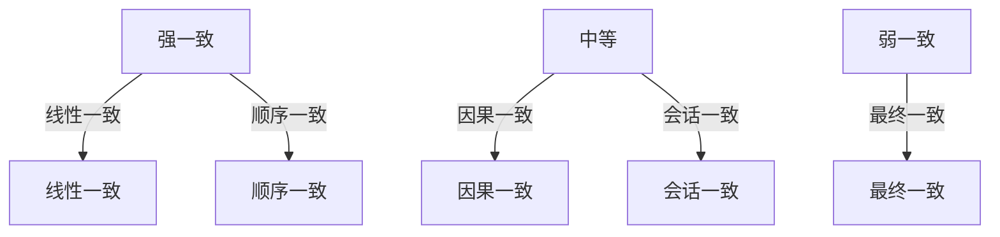
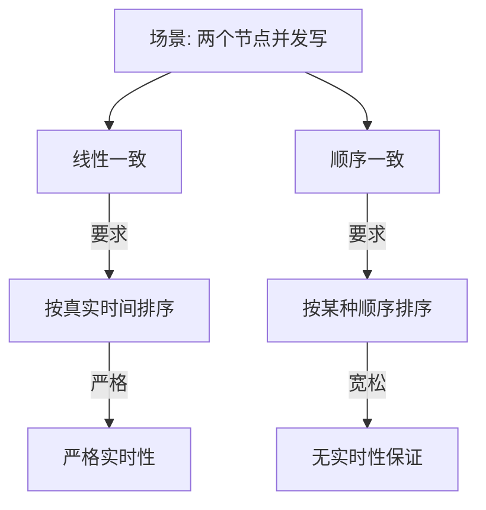
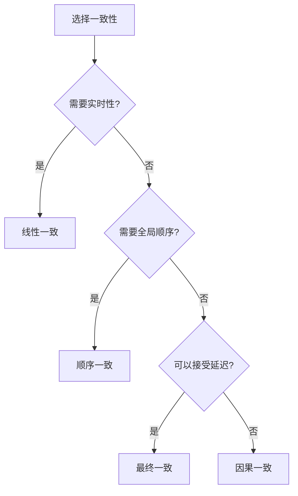

# 一致性模型深挖

> **一句话摘要**：一致性 = 定义「读到的数据是什么版本」——从弱到强，线性一致最强、最终一致最弱。
> **本文核心**：**一致性 = 读的语义 + 写的语义**。

前置阅读：[一致性模型全景](../分布式理论/入门层/从零开始认识分布式理论系列/4_一致性模型全景-入门.md)。本篇深入一致性模型的技术细节。

## 1. 背景：为什么需要深挖

> 量级分档意识：本文方法在十万级 QPS、千万级用户、亿级流量的场景下均需重新评估——量级变化时架构与参数需同步调整。


入门层讲了「有哪些一致性模型」，本篇回答「线性一致和顺序一致到底差在哪」：



**关键问题**：线性一致和顺序一致的区别在于「是否考虑并发顺序」。

## 2. 核心机制：线性一致 vs 顺序一致

### 2.1 线性一致性（Linearizability）

**定义**：所有操作看起来像是在一个时间点原子执行的——每个操作有一个真实的「发生时间」。

```mermaid
sequenceDiagram
    Client1[客户端1] -->|写A=1| System[系统]
    System -->|确认| Client1
    Client2[客户端2] -->|读A| System
    System -->|返回1| Client2
    
    Note over Client1,Client2: 写后读一定读到最新值
```

**线性一致的特点**：
- 每个操作有真实发生时间
- 实时性保证：写完立刻能读到
- 并发操作的顺序与实际时间一致

### 2.2 顺序一致性（Sequential Consistency）

**定义**：所有操作看起来是按照某种全局顺序执行的——但不要求与实际时间一致。

```mermaid
sequenceDiagram
    Client1[客户端1] -->|写A=1| System[系统]
    Client2[客户端2] -->|写A=2| System
    
    Note over System: 顺序一致: A=2 或 A=1 都可以
    Note over System: 但顺序必须一致
```

**顺序一致的特点**：
- 不要求与实际时间一致
- 只要求所有节点看到的顺序一致
- 不保证实时性

### 2.3 核心区别



**一句话总结**：
- 线性一致 = 「按真实时间顺序」
- 顺序一致 = 「按某种顺序，但不一定是真实时间」

### 2.4 对比表

| 维度 | 线性一致 | 顺序一致 | 最终一致 |
|---|---|---|---|
| 实时性 | 强 | 无 | 无 |
| 并发顺序 | 按真实时间 | 按全局顺序 | 无要求 |
| 性能 | 差 | 中 | 好 |
| 实现 | 复杂 | 中等 | 简单 |
| 适用 | 金融/锁 | 协作应用 | 社交/缓存 |

## 3. 落地实践：一致性选择

### 3.1 选择策略



### 3.2 生产中的选择

| 场景 | 一致性 | 理由 |
|---|---|---|
| 银行转账 | 线性一致 | 金额必须实时准确 |
| 分布式锁 | 线性一致 | 锁的状态必须实时 |
| 协作编辑 | 顺序一致 | 操作顺序需要一致 |
| 社交动态 | 最终一致 | 允许延迟 |
| 商品浏览 | 最终一致 | 允许缓存延迟 |
| 消息队列 | 因果一致 | 保证因果关系 |

## 4. 落地实践：实现线性一致

### 4.1 分布式锁实现线性一致

```java
// 基于etcd的分布式锁 = 线性一致
// etcd使用Raft保证线性一致
Lock lock = new Lock(client, "my-lock");
lock.lock(); // 获取锁（线性一致）
try {
    // 临界区
} finally {
    lock.unlock(); // 释放锁
}
```

### 4.2 读写一致性

```mermaid
flowchart TD
    Write[写操作] -->|同步到多数| Majority[(多数节点)]
    Read[读操作] -->|从Leader读| Leader[(Leader)]
    
    Write -->|确认| Client[客户端确认]
    Leader -->|返回| Client
    
    Note over Write,Read: 从Leader读保证线性一致
```

**实现线性一致读的关键**：从 Leader 读（Leader 一定是最新的）。

## 5. 落地实践：最终一致实现

### 5.1 异步复制

```mermaid
flowchart TD
    Leader[Leader 写] -->|同步| A[节点A]
    Leader -->|异步| B[节点B]
    Leader -->|异步| C[节点C]
    
    Client[客户端] -->|确认| Leader
    
    Note over Leader,Client: 写确认不需要等所有节点
```

### 5.2 读修复

```mermaid
sequenceDiagram
    Client[客户端] -->|读旧数据| Node1[节点1]
    Client -->|读新数据| Node2[节点2]
    
    Node1 -->|返回旧| Client
    Node2 -->|返回新| Client
    
    Note over Node1,Node2: 读写不一致
    Client -->|读修复| Repair[将新数据同步到旧节点]
```

## 6. 生产视角：一致性踩坑

- **踩坑 1**：以为用了 Raft 就是线性一致——Raft 保证日志一致，但读可能需要配置
- **踩坑 2**：从 Follower 读导致不一致——必须从 Leader 读
- **踩坑 3**：最终一致的延迟超出预期——同步延迟可能很长
- **踩坑 4**：因果一致不保证顺序——A和B有因果关系，但C和D可能乱序

**生产最佳实践**：

1. 金融数据用线性一致（从 Leader 读）
2. 非关键数据用最终一致
3. 明确业务需求的一致性级别
4. 监控一致性延迟
5. 文档中明确声明一致性级别

## 7. 典型场景

| 场景 | 一致性 | 理由 |
|---|---|---|
| 银行账户 | 线性一致 | 金额必须准确 |
| 分布式锁 | 线性一致 | 锁状态必须实时 |
| 电商库存 | 顺序一致 | 库存顺序重要 |
| 社交媒体 | 最终一致 | 允许延迟 |
| 消息系统 | 因果一致 | 因果关系重要 |
| CDN 缓存 | 最终一致 | 允许延迟 |

## 8. 与相邻概念的区别

- **线性一致 vs 顺序一致**：实时性 vs 全局顺序
- **线性一致 vs 因果一致**：线性一致要求实时，因果一致只要求因果
- **一致性 vs 共识**：一致性是「读的语义」，共识是「写的一致」
- **一致性 vs 事务隔离**：事务隔离是数据库级别，一致性是分布式级别

## 9. 你们可能会问

- **线性一致的性能代价多大？** 比最终一致高 2-10 倍（网络往返）
- **最终一致能自动升级为线性一致吗？** 不能——需要重新设计
- **因果一致和最终一致的区别？** 因果一致保持因果关系，最终一致不保证
- **如何向用户解释一致性级别？** 用「读到的数据是否是最新」来比喻

## 10. 一句话总结 + 5W 速记卡 + 自测三问

**一句话总结**：一致性 = 定义「读到什么版本」——线性一致最强，最终一致最弱。

**5W 速记卡**：

| 维度 | 内容 |
|---|---|
| What | 线性/顺序/因果/最终四种 |
| Why | 定义读的语义 |
| When | 读写数据时 |
| Where | 所有分布式系统 |
| How | 同步复制/异步复制/读修复 |

**自测三问**：

1. 你的系统需要哪种一致性？
2. 你从 Leader 读还是 Follower 读？
3. 你能接受多长的不一致窗口？

---

**下篇预告**：Raft 选主 + 日志复制实践（etcd 实现）。

**🎯 核心带走**：

- **核心一句话**：线性一致 = 实时性保证，顺序一致 = 全局顺序，最终一致 = 允许延迟
- **链条复述**：确定需求 → 选择级别 → 实现机制 → 验证
- **失效点与边界**：从 Follower 读导致不一致

💡 **实战提示**：金融用线性一致，社交用最终一致——选错级别是最大的坑。

**开放问题**：一致性级别能动态调整吗？答案是：能——但需要系统支持（如 etcd 的 consistency 模式切换）。

**决策（何时用）**：金融/锁用线性一致；协作用顺序一致；社交用最终一致。

## 📌 数据与事实声明

- 写于 2026-09-11
- 免责：以官方文档为准

## 📚 参考资料

| 类型 | 标题 | 来源 |
|---|---|---|
| 官方文档 | 官方文档 | 官方站点 |
