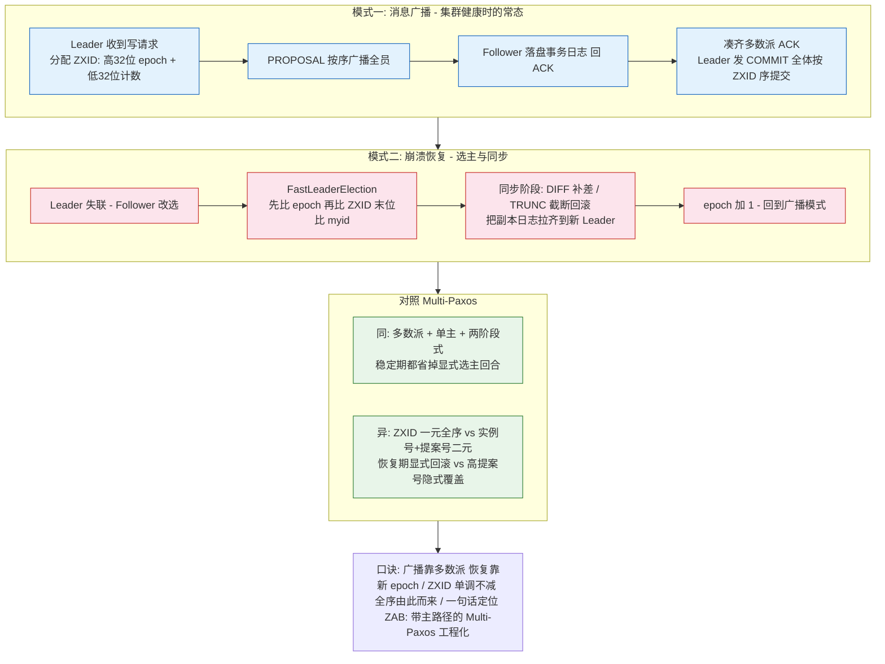
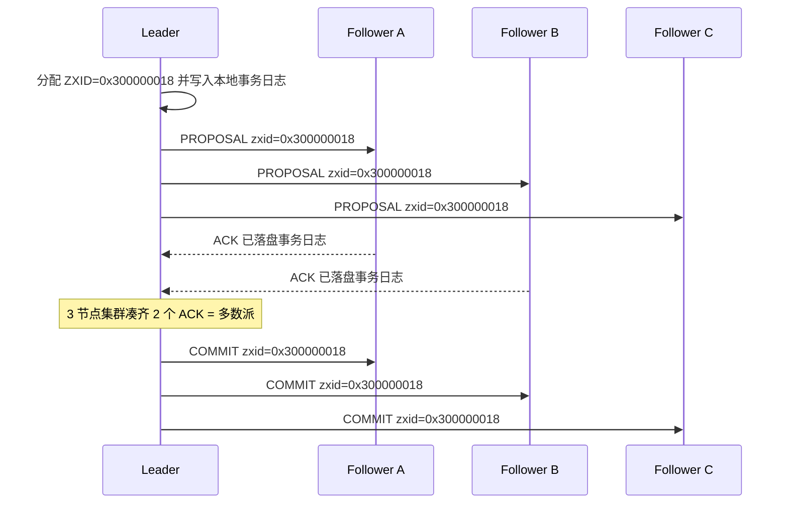
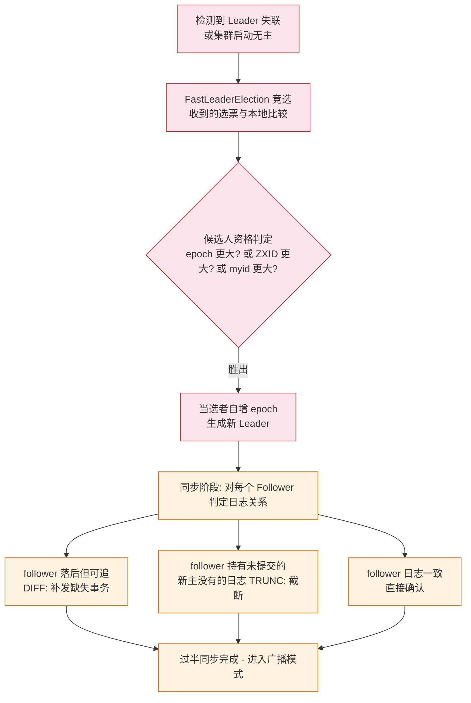

# ZAB 与 Paxos 的异同一页讲透

> **本文核心**：ZAB（ZooKeeper Atomic Broadcast）不是「另一种 Paxos」，而是**主路径化的 Multi-Paxos 工程化变体**——内核同为「Leader + 多数派 + 两阶段式广播」，差异收在三个工程决策上：**① 事务编号用 ZXID（高 32 位 epoch + 低 32 位计数器）替代 Paxos 的「实例号 + 提案号」二元组，一条 64 位整数同时解决全序与新主安全；② 崩溃恢复是显式状态机（选主 → 同步 → 广播），同步阶段用 DIFF/TRUNC 把副本日志对齐到新 Leader，而不是靠 Paxos 那样「用更高提案号覆盖」隐式完成；③ 提交全序严格按 ZXID 单调推进，天然产出全局有序的事件流**。ZooKeeper 够用的原因也在这条机制链里：读写特征（读多写少、读本地副本）与 ZAB 的成本结构刚好匹配。

## 一图看懂



## 一句话摘要

把 ZAB 讲透只需要一张对照表：与 Multi-Paxos 同内核（Leader + 多数派 + 类两阶段广播），但在「事务怎么编号、崩溃后怎么恢复、提交顺序给什么保证」三处做了不同的工程选择——读懂这三处差异，ZooKeeper 的行为（顺序一致性、sync 读、恢复语义）全部可推导。

## 前置阅读

- [Raft 选举与日志复制](../深入理解Raft系列/2_Raft选举与日志复制-特性.md)：同为 Leader-based 共识，对照阅读收益最大
- [一致性模型深挖](../深入理解一致性模型系列/2_一致性模型深挖-特性.md)：顺序一致性与线性一致性的精确区分
- [一致性方案选型](../../专题层/一致性方案选型/1_一致性方案选型-专题.md)：协议选型的场景视角

## 5W 速记卡

| 维度 | 一句话 |
|---|---|
| What | ZAB 是 ZooKeeper 的原子广播协议：崩溃恢复 + 消息广播两个模式循环切换 |
| Why | 协调服务的核心诉求是「写全局有序 + 读高可用」，Multi-Paxos 原型缺工程化的恢复状态机与全序编号 |
| How | 正常态 PROPOSAL-ACK-COMMIT；崩溃后按 epoch/ZXID/myid 选主，DIFF/TRUNC 同步对齐 |
| When | 需要理解 ZooKeeper 顺序性保证、恢复行为、以及选型对比 Raft 时 |
| Where | ZooKeeper 全部写路径；对照物是 Raft（etcd/TiKV）与 Multi-Paxos（部分存储引擎） |

## 一、从问题出发：复制状态机缺的三块拼图

复制状态机的要求只有一句话：**所有副本以相同顺序执行相同日志**。Paxos 解决了「单个值如何被多数派认定」，但直接落地还缺三块拼图——ZAB 与 Multi-Paxos 本质上就是三块拼图的两种拼法：

1. **连续值怎么串起来**——Paxos 一次定一个值，连续写要复制成连续实例；
2. **Leader 怎么选、选出来凭什么安全**——多数派协议需要主路径来降时延，主挂了怎么换；
3. **恢复时新旧日志怎么对齐**——宕机前各副本日志参差，新主上任要对齐。

**追问：为什么不直接说「ZAB 就是 Multi-Paxos 的实现」？** 因为 ZAB 论文自己给出了差异点（公开文献口径）：Multi-Paxos 是一族协议的统称，教科书上的描述省略了恢复细节；ZAB 把恢复做成了**显式的、可测试的状态机**，并且用 ZXID 把「实例号 + 提案号」折叠成一个单调递增的整数。形式化验证的结论是两者可实现等价的全序广播（业内认知，ZAB 论文与后续形式化验证工作均支持）——**等价在数学上，不同在工程上**，这才是本篇要讲透的层次。

## 二、模式一：消息广播——像 2PC，但砍掉了 2PC 的两大死穴

ZAB 的广播流程长得像两阶段提交：Leader 发 PROPOSAL（第一阶段），Follower 落盘后回 ACK，Leader 凑齐多数派发 COMMIT（第二阶段）。但它不是 2PC：

| 维度 | 经典 2PC | ZAB 广播 |
|---|---|---|
| 投票者 | 全体参与者 | 多数派即可 |
| 单点阻塞 | 协调者挂则全员卡在prepared | Leader 挂则**改选**，日志不丢 |
| 回滚 | 有回滚分支 | 无回滚，只有前滚（对齐后提交） |

砍掉「全员同意」靠多数派交集；砍掉「单点阻塞」靠崩溃恢复模式。广播的消息时序本身不长这样：



**类比 2PC 是为了好记，判定安全要回到多数派**：任何 COMMIT 都意味着多数派已落盘，任何两个多数派有交集——这是全篇唯一需要记住的不变式。Follower C 的 COMMIT 是异步补送的，它晚到只会让自己晚提交，不阻塞集群——底层原理是「多数派状态即可推进全局状态」，这正是 ZAB 与 2PC 在容错架构上的分野。

**追问：Follower 收到 PROPOSAL 后、COMMIT 前宕机了怎么办？** 事务日志已写但未提交，处于「半提交」态。答案在恢复模式：新 Leader 上任后的同步阶段要么把它 DIFF 补齐提交，要么 TRUNC 截断回滚——**半提交事务不允许悬置存在**，这是 ZAB 与「真 2PC」在语义上的分水岭。

## 三、模式二：崩溃恢复——显式状态机的两步走



选主比较次序是恢复安全的全部：**epoch 优先 → ZXID 次之 → myid 兜底**。epoch 大说明任期新；同任期比 ZXID 保证**持有最新已提交事务的节点胜出**（已提交必然在多数派手上，而胜出者与多数派有交集）；myid 只是同日志时的确定性打破器。这与 Raft「日志不旧于投票者」的选举限制完全同构——只是把「日志新旧」编码进了 ZXID 的字典序。

同步阶段三种形态用具体值推一遍：新 Leader 日志到 ZXID=0x300000018，follower A 只到 0x300000010 → DIFF 补发 0x18 之前的缺失段；follower B 曾从旧主收到过 ZXID=0x300000020 的半提交提案（旧主未凑齐多数派就宕机）→ B 的 0x20 段是新主没有的脏尾，TRUNC 截断；follower C 与新主一致 → 立即 ACK。对齐完成后 epoch +1，从此新提案的 ZXID 高 32 位变为新 epoch——**任何旧任期消息的 ZXID 天然小于新任期，混乱在编号层面就被排除了**。

**为什么不选「新主不回滚、靠更高提案号重新覆盖脏日志」的 Paxos 式做法？** 那是合法路线（Multi-Paxos 的经典处理），但覆盖语义是隐式的：哪些日志会被覆盖、覆盖发生在哪个提案回合，都要推演提案号交叉才能知道。ZAB 选择在恢复阶段就把脏尾显式截断，让「进入广播模式的瞬间集群日志严格一致」成为一个可断言的不变式——**把隐式收敛换成显式对齐，换来的是实现可测试**。代价是恢复状态机更复杂（DIFF/TRUNC 分支都要实现），这是一次典型的设计取舍。

## 四、ZXID：一个 64 位整数解决两件事

| 位段 | 高 32 位 | 低 32 位 |
|---|---|---|
| 语义 | epoch（任期） | 计数器（任期内事务序号） |
| 变化时机 | 每次成功选主 +1 | 每个事务 +1，跨任期归零重计 |
| 对照 Paxos | 提案号（ballot）的高位 | 实例号（instance）的近似物 |

Paxos 需要三元组（instance, ballot, value）才能讲清「第几个值、第几轮提案」；ZAB 折叠成一个 64 位整数，**字典序 = 提交序 = 全局全序**。这带来两个工程红利：

- **比较一次完成**：选主、同步、提交判定全都退化成整数比较；
- **全序事件流免费送**：ZooKeeper 的事务日志天然是全序流，watch 通知、acl 变更都直接消费这个序。

红利背后有代价，历史上也真的栽过跟头：低 32 位计数器**回绕**（跑满 2^32）必须强制 epoch 进位，否则 ZXID 出现「新事务反而更小」的倒挂；早期版本还出现过快照恢复后 ZXID 回退、导致已提交事务被覆盖的公开缺陷（公开可查的 ZooKeeper 历史缺陷，后续版本加入恢复时单调性防护）。**一个编号方案的价值 = 它的序保证 - 它的边界条件数量**，ZXID 是「简单序 + 显式边界防护」的组合。

## 五、与 Multi-Paxos 的本质异同：一张对照表讲完

| 维度 | ZAB | Multi-Paxos（工程形态） |
|---|---|---|
| 内核 | 多数派 + Leader + 两阶段式广播 | 多数派 + Leader + 两阶段式 |
| 提案编号 | ZXID 一元全序（epoch+计数器） | 实例号 + 提案号二元组 |
| 稳定期开销 | PROPOSAL-ACK-COMMIT | 同样可省到两消息一往返 |
| 恢复语义 | 显式状态机：选主 + DIFF/TRUNC 同步 | 隐式收敛：新提案以更高号覆盖 |
| 提交顺序 | 严格按 ZXID 全序 | 按实例各定各的，无跨实例全序承诺 |
| 提交约束 | 旧任期事务随新任期提交（no-op 搭车思想同 Raft） | 实例独立，乱序完成 |
| 全局有序流 | 天然产出（ZXID 序） | 需要上层按实例号重组 |

表格里最值得展开的是**提交顺序**一行。Multi-Paxos 各实例独立决定，实例 100 可能比实例 99 先提交；ZAB 的 COMMIT 严格按 ZXID 单调推进——Leader 不能跳过 0x18 去提交 0x1A。为什么这个差异对 ZooKeeper 是刚需？因为 ZNode 树的写操作（create/delete/setData）相互有顺序依赖与 watch 触发链：**如果全局写序不确定，watch 回调的触发序都无法定义**。这不是 ZAB「更高级」，而是**协调架构的业务要全序，存储引擎往往只要每键序**——需求决定形态，和谁「更先进」无关。

**追问：既然等价，为什么 etcd 用 Raft 而不是 ZAB？** 历史与工程生态因素大于理论因素：Raft 与 ZAB 在「强 Leader + 随机化选举 + 日志对齐复制」上高度同构（上篇已述），Raft 胜在论文以可理解为设计目标、开源库生态成熟（etcd raft 库被大量项目复用）；ZAB 深度绑定 ZooKeeper 的内存数据树与快照机制，剥离成本高。**协议选型的分叉点常常不是正确性，而是可复用性与人才密度**——这也是协议演进史反复出现的模式。

## 六、源码与关键路径：ZooKeeper 的三处锚点

读 ZooKeeper 源码（`java`，以下为逻辑骨架）抓三个锚点即可，不必陷进消息细节：

```java
// 锚点一: FastLeaderElection 的比较器 - 选主安全的全部逻辑
// totalOrderPredicate(newId, newZxid, newEpoch, curId, curZxid, curEpoch)
protected boolean totalOrderPredicate(long newId, long newZxid, long newEpoch,
                                      long curId, long curZxid, long curEpoch) {
    return ((newEpoch > curEpoch)                              // 1. 任期新者胜
         || (newEpoch == curEpoch && newZxid > curZxid)        // 2. 同任期 ZXID 大者胜
         || (newEpoch == curEpoch && newZxid == curZxid        // 3. 同日志 myid 大者胜
                                   && newId > curId));
}

// 锚点二: ZXID 的拆装 - epoch 与计数器的折叠
static long makeZxid(long epoch, long counter) {
    return (epoch << 32L) | (counter & 0xffffffffL);  // 高 32 epoch | 低 32 计数
}

// 锚点三: 广播路径 ProposalRequestProcessor -> CommitProcessor
// Leader: sendProposal(落盘) -> 统计 ACK 过半 -> sendCommit
// Follower: 落盘 + 回 ACK -> 收 COMMIT -> 按序应用内存数据树
```

三条关键路径串起来：选举线程跑比较器定胜负 → 同步线程执行 DIFF/TRUNC → 广播路径按 ZXID 序推进 COMMIT。看懂这三个锚点，ZooKeeper 的日志里 epoch 跳变、TRUNC 告警、COMMIT 积压就全部有了对应物。

## 七、ZooKeeper 为什么够用：协议成本与读写特征的匹配

ZAB 的成本结构：**写要跨多数派两阶段（贵），读走本地副本（便宜但非线性一致）**。ZooKeeper 的负载特征恰好偏科：协调元数据的读写比常见在 10:1 到 100:1（业内认知量级），写少 → 多数派成本摊得起；读多 → 本地读线性扩展。再看数据面：全内存数据树 + 快照 + 事务日志，单集群数据量天然受内存约束（公开文档建议在 GB 量级以内）——小数据量让「全序提交」的串行化成本可控。

两个常被误解的点借此讲清：

- **读是顺序一致而非线性一致**：follower 上的读可能读到旧值，但同一客户端的读写序有 FIFO 保证（客户端 sessionId 绑定）。需要线性一致读时显式 `sync()` 再读——把该读拉到 Leader 的最新序上。这不是缺陷，是**把读一致性做成可选项**的定价设计。
- **「写少」不是巧合是筛选**：把 ZAB 用于高频写场景（比如当队列用）属于协议错配——协调服务就该只放「慢变、小体量、强一致」的数据，大流量数据面有自己的存储。

## 八、不同量级的思考：协调层协议随规模的换挡

- **十万级（QPS 或 ZNode 操作量）**：约束来源是单集群内存数据树与快照恢复时长。这一档的核心问题是**把元数据量压在快照可恢复的体量内**，而不是扩展集群：session 过期清理、大 ZNode 拆分就够了。思考方式：**数据体量驱动**。
- **百万级**：约束来源是单主写吞吐与多数派时延——写全部过 Leader，纵向无解。这一档的核心问题是**读写分离**（Observer 副本横向扩读、写仍走多数派），而不是盲目加投票成员（成员越多写越慢）。思考方式：**角色分层驱动**。
- **千万级**：约束来源是故障半径——协调服务抖动会放大到全链路（配置、锁、注册全挂在上面）。这一档的核心问题是**按业务域拆 ensemble**（多个独立小集群隔离故障），而不是把一个集群做大做强。思考方式：**故障隔离驱动**。
- **亿级**：约束来源是跨机房网络分区成为常态。这一档的核心问题是**多数派摆放与客户端容灾语义**（同机房多数派 + 客户端感知分区降级），而不是追求跨机房强一致全覆盖。思考方式：**分区常态化驱动**。

自下而上串起来：体量约束 → 角色分层 → 故障隔离 → 分区常态化，每一档都是上一档解法失效后的新约束来源。触发升级的信号同样清晰：快照恢复超时窗口 → 上 Observer；协调抖动引发连锁故障 → 拆集群；跨机房部署 → 重算多数派摆放。

## 九、业内惯例与生产实践

- **部署 3 或 5 个投票成员**，5 是多数生产选择的下限冗余（公开文档口径）；再多的投票成员只降写性能，读扩展交给 Observer。
- **监控盯三样**：epoch 跳变频率（频繁 = 网络不稳或选举参数失衡）、事务日志落盘延迟（ZAB 的 COMMIT 受最慢多数派成员拖累，机制同 Raft 的 matchIndex）、快照恢复时长（决定故障恢复 SLA）。
- **JVM 侧给事务日志独立磁盘**：日志落盘与快照写盘分离，避免快照 GC 式大写把事务日志的 fsync 挤出长尾（业内惯例）。

## 十、事故与实践叙事（匿名化）

**事故一：epoch 跳变引发的会话雪崩。** 某协调集群在网络设备闪断期间 epoch 短时间跳变多次，会话大量过期、业务锁集体释放，恢复后出现并发抢锁互踩。排查路径：先看 epoch 跳变时间线与会话过期日志对齐，再定位到选举超时参数与跨交换机 RTT 长尾不匹配。复盘动作：按实 RTT 重标超时、给锁客户端加「重连后先 validate 再动作」的护栏。教训同 Raft 篇一致：**选举参数是拓扑的函数**。

**事故二：半提交日志未对齐导致的数据回退错觉。** 某集群 follower 在旧主任期收到提案未及 ACK 就分区，恢复后该 follower 日志尾巴是新主没有的「脏段」，业务监控看到该节点数据「倒退」。排查确认这恰是设计内行为：TRUNC 截断的是从未提交的事务，多数派视角无数据丢失；但客户端曾从旧主读到过该未提交值——暴露的是**读路径给了「未提交可见」的错觉**。复盘后把该告警降噪、并在文档里固化「 follower 脏尾 = 正常恢复现象」的判读口径。

**实践复盘：把协调服务当存储用的反例。** 一个团队把高频计数器塞进 ZNode，每秒数万次写把单主广播打满，全局写延迟抬升殃及配置下发。复盘归因是协议错配：ZAB 的全序广播是给「慢变小数据」定价的，计数器应该走本地聚合 + 批量落盘。这条反例的价值在于反向验证第五节的结论——**协议形态由读写特征筛选，错配的代价是全局性的**。

## 十一、设计思想

**把恢复做成显式状态机。** Paxos 家族的恢复靠「更高提案号覆盖」隐式收敛，正确但难测试；ZAB 把恢复拆成「选主 → 同步（DIFF/TRUNC/一致）→ 广播」的显式状态迁移，每个分支可单测、日志可观测。**隐式收敛换显式对齐**是用实现复杂度换可验证性——与 Raft 的设计哲学殊途同归，这正说明它是分布式协议工程化的共同演进方向。这套机制的底层只有一条：让「集群日志一致」成为每次恢复结束时可断言的不变式，而不是随着后续提案推进才渐渐逼近的性质。

**用编号折叠降低不变式数量。** 「实例号 + 提案号」的两个维度折叠成一个单调 64 位整数后，「新值是否可能小于旧值」的判定从分布式推演变成整数比较。**当不变式能用一个全序键表达时，正确性论证的成本指数下降**——雪花 ID 的单调性设计、时钟回拨防护，都是同一思想在不同层的复用。

## 十二、追问链

- **追问：ZAB 保证的是顺序一致还是线性一致？** 再追问：写完立刻读自己的写，能读到吗？——同一客户端 sessionId 的读写有 FIFO 序保证，读己之写成立；但跨客户端只有顺序一致。打破砂锅：为什么 ZooKeeper 不直接给线性一致读？——线性一致读要把每次读都拉到全局最新序上（走 Leader 或 ReadIndex），读多写少的负载下成本不可接受；给 `sync()` 当显式开关，是把一致性与吞吐的定价权交给调用方。
- **追问：同步阶段的 TRUNC 会不会截掉已提交事务？** 再追问：什么条件下才可能？——已提交事务必然存在于多数派，而新 Leader 的选举资格（ZXID 最大）保证它持有全部已提交事务，TRUNC 只会截「新主没有的旧主半提交段」；唯一的例外路径是编号方案自身出边界（计数器回绕未进位、快照恢复后 ZXID 回退），这就是历史上那类公开缺陷的成因，防护补丁都打在编号单调性上。打破砂锅：那自研类 ZAB 协议最该先测什么？——**编号边界的全序单调性**：回绕、恢复、并发选主三个场景下 ZXID 严格递增，这条断言立住，协议骨架就立住了。

## 十三、你们可能会问

**Q1：一句话总结 ZAB 与 Raft 的关系？** 同构度极高：强 Leader、随机化选举、日志对齐、任期号防旧消息。主要差异是编号方案（ZXID 折叠 vs term+index 二元）、恢复阶段显式同步、以及 ZAB 深度绑定内存数据树。理解 Raft 之后读 ZAB，几乎是「换个编号方案重讲一遍」。

**Q2：ZooKeeper 的 watch 为什么可靠而不会乱序？** 因为 watch 回调按事务提交序（ZXID 序）触发——全序广播免费送的又一个消费者。代价是 watch 是一次性触发需重设，且不保证拿到「当前值」只保证「变更事件不丢不乱」。

**Q3：什么时候不该用 ZooKeeper 这类协调服务？** 高频写、大数据量、需要跨机房强一致全覆盖的场景都不合适；它该放的是「慢变、小体量、强一致」的协调元数据。需要 Raft 底座自建存储时，etcd raft 库是比重新实现 ZAB 更省的路。

## 什么时候用 / 不用

| 场景 | 推荐度 | 说明 |
|---|---|---|
| 配置 / 命名 / 分布式锁等协调元数据 | 推荐 | ZAB + 内存数据树的甜点区 |
| 需要 Raft 生态自建强一致存储 | 推荐（改用 Raft） | 协议同构，库生态成熟，无需复刻 ZAB |
| 高频写入的计数 / 排行 / 队列 | 不推荐 | 单主全序广播扛不住高频写，协议错配 |
| 跨机房强一致全覆盖 | 慎用 | 多数派跨城时延直接进写路径，先重估摆放 |

## Trade-off

ZAB 的每处工程选择都有对价：ZXID 折叠换来一次比较定全序，账单是回绕与恢复单调性这类边界防护；显式恢复状态机换来可测试性，账单是 DIFF/TRUNC 分支的实现复杂度；读走本地副本换来读扩展，账单是一致性降级为顺序一致并要求调用方理解 `sync()`。Multi-Paxos 的隐式收敛同理反向成立：实现省了状态机，代价是覆盖语义不可观测。**协议没有高下，只有「成本结构」与「负载特征」的匹配度**——这一判断对 Raft、ZAB、Paxos 一并适用。

## 💡 实战提示

- 💡 判断 ZooKeeper 行为异常时先看 epoch 时间线：epoch 跳变 = 发生过选主，把「变更类故障」归因到选主窗口，比直接看业务报错快得多。
- 💡 客户端护栏两条：重连后先 validate 再动作（防会话过期后操作互踩）；强一致读显式 sync()，不要拿 follower 读当强一致用。
- 💡 自研多数派协议前先写三条断言测试：ZXID/term 单调性（含恢复路径）、多数派交集下的提交不可覆盖、半提交事务在恢复后的确定性归宿（提交或截断二选一）。

## 自测三问

1. ZXID 的高低 32 位各承担什么语义，对应 Multi-Paxos 的哪两个概念？
2. 同步阶段 DIFF 与 TRUNC 分别处理什么状态的 follower 日志？
3. ZooKeeper 的读是一致性谱系里的哪一级，怎么补强到更高一级？

## 开放问题

- 形式化验证已证明 ZAB 与 Multi-Paxos 可实现等价的全序广播（公开文献口径），但「显式恢复状态机」这类工程形态能否被自动推导而非人工设计，仍是协议工程化的开放方向。
- 协调服务在云原生环境下的形态持续演进（ lease 化、嵌入化如 etcd/KRaft 的趋势），ZAB 的「绑定单系统」路线与 Raft 的「库化通用」路线孰优，取决于下一代表达需求，尚无定论。

## 📎 核心带走

- **一句话**：ZAB = 带显式恢复状态机的 Multi-Paxos 工程化——ZXID 折叠全序、恢复显式对齐、广播多数派推进；与 Paxos 的差异全在工程决策层，不在正确性内核层。
- **链条复述**：健康态 PROPOSAL→ACK→COMMIT 按 ZXID 全序提交；崩溃态选主（epoch→ZXID→myid）→ 同步（DIFF/TRUNC）→ epoch+1 回到广播。
- **哪里会坏**：选举参数与拓扑错配（epoch 跳变）、follower 脏尾误读为数据丢失（实为 TRUNC 正常行为）、协议错配高频写（单主打满）。
- **失效边界**：读默认顺序一致；「写少读多、小体量」是协议成立的隐含前提；编号单调性是全部安全的锚，边界防护不可省。

## 📌 数据与事实声明

- ZAB 协议语义、与 Multi-Paxos 的关系及形式化验证结论，源自 ZAB 论文（Junqueira 等，公开发表）与 ZooKeeper 论文（ATC'10 公开论文）；文中标注「业内认知」的量级为工程社区普遍接受范围。
- ZooKeeper 历史上与 ZXID 单调性相关的公开缺陷为开源社区公开可查信息，本文不引具体编号，不指涉任何生产系统。
- 事故叙事为公开工程经验的匿名化改写，不含真实公司名、系统名与内部数据。

## 📚 参考资料

| 资料 | 说明 |
|---|---|
| ZooKeeper's atomic broadcast protocol: Theory and practice | ZAB 协议论文，恢复状态机与 ZXID 设计的权威出处 |
| ZooKeeper: Wait-free coordination for Internet-scale Systems (ATC'10) | ZooKeeper 系统论文，读一致性语义与负载特征 |
| Paxos Made Simple / Paxos Made Live | Paxos 原理与工程化形态（Google Spanner 系论文前的实践口径） |
| ZooKeeper 官方文档（zookeeper.apache.org） | 部署建议、Observer、一致性语义的用户侧口径 |
| 本系列 Raft 选举与日志复制篇 | 同构协议对照阅读，选举限制与日志对齐的 Raft 侧表述 |
