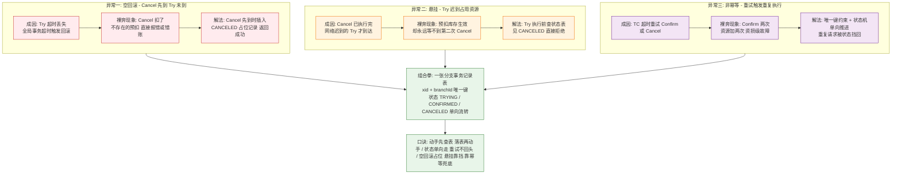
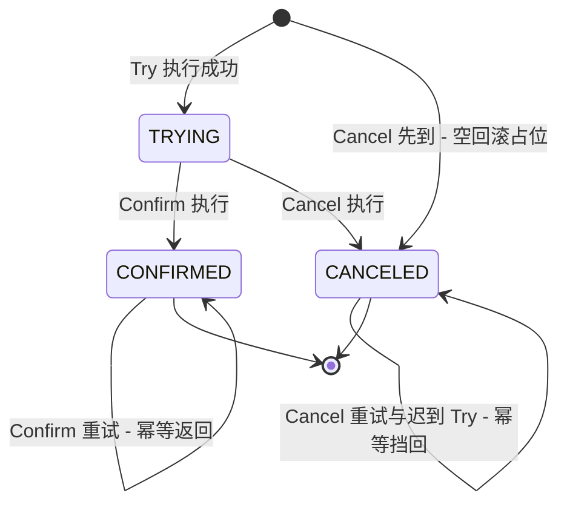
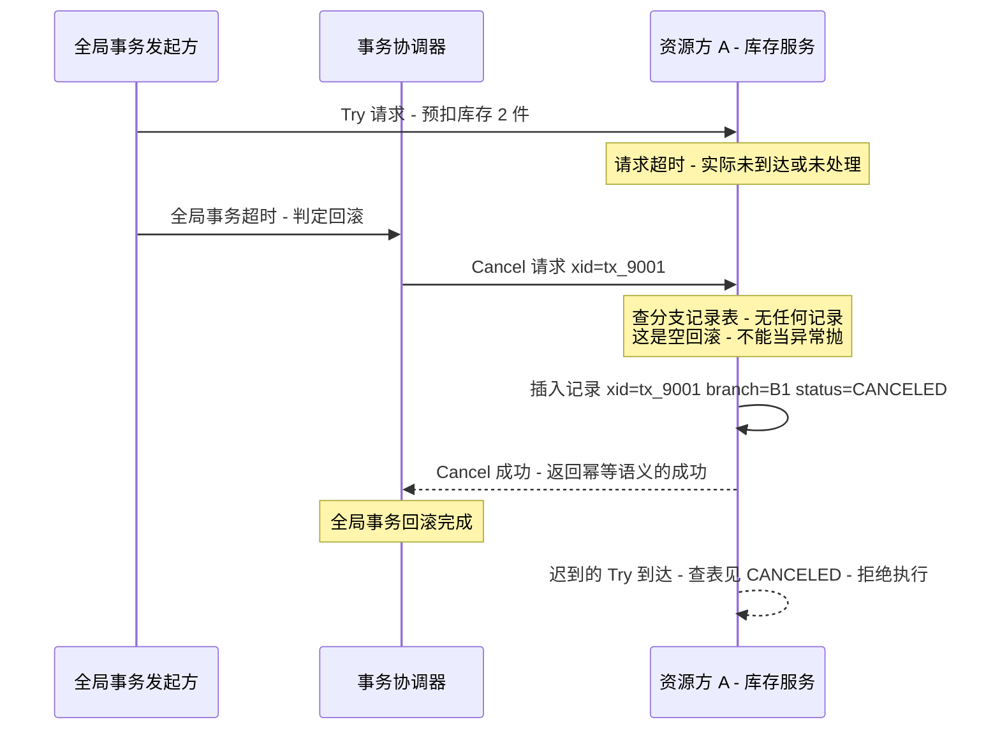
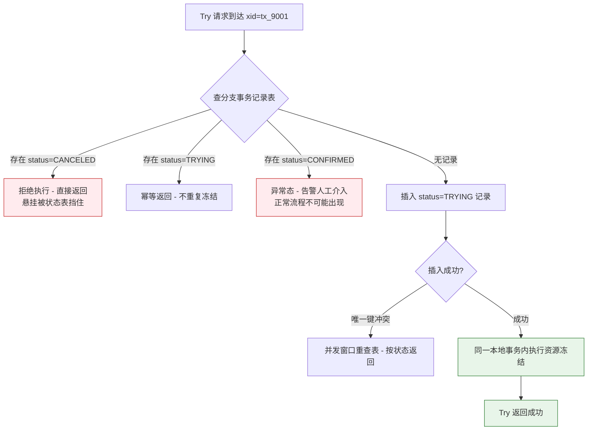

# TCC 空回滚、悬挂与幂等治理深度

> **本文核心**：TCC 的正确性从来不在 Try/Confirm/Cancel 三个方法本身，而在**网络重试与乱序下三个异常的治理组合**——空回滚（Cancel 先于 Try 到达）、悬挂（Cancel 执行完，迟到的 Try 才到）、非幂等（Confirm/Cancel 被重试多次）。三者共享同一个解法内核：**一张事务状态表（分支事务记录）+ 单向状态机**。一句话机制链：**任何分支动作动手前先查状态表 → 动手即落状态记录 → 状态只能单向流转（TRYING→CONFIRMED 或 TRYING→CANCELED）**。空回滚靠「Cancel 先到时落一条 CANCELED 占位记录」化解，悬挂靠「Try 查到 CANCELED 就拒绝执行」化解，幂等靠「状态唯一约束 + CAS 式状态推进」化解——一个状态表挡住三个异常，这是 TCC 工程化的全部秘密。

## 一图看懂



## 一句话摘要

TCC 三个异常（空回滚/悬挂/非幂等）都是「网络不可靠 + 重试机制」的必然产物，不是实现 bug；治理方案收敛为一张分支事务记录表加单向状态机——**先查表再动手、落表再返回、状态不逆行**，三个异常在同一个数据结构上被同时消解。

## 前置阅读

- [TCC 补偿事务深度解析](../../特性层/深入理解TCC系列/1_TCC补偿事务深度解析-特性.md)：TCC 模型与 Try/Confirm/Cancel 的基础语义
- [幂等设计全景](../幂等设计深度/1_幂等设计全景-深度.md)：幂等的通用手段（唯一键/状态机/去重表）
- [方案选型决策](../方案选型/1_方案选型决策-专题.md)：TCC 与 Saga/消息最终一致的选择边界

## 5W 速记卡

| 维度 | 一句话 |
|---|---|
| What | TCC 落地必治理的三异常：空回滚、悬挂、非幂等，共用「状态表 + 状态机」解法 |
| Why | Try/Cancel 的到达顺序不可控，TC 重试不可控，分支方法必须对「不可能的顺序」免疫 |
| How | 分支事务记录表（xid+branchId 唯一）+ TRYING/CONFIRMED/CANCELED 单向状态机 |
| When | 自研或接入任何 TCC 框架（Seata TCC 模式等）时逐条对照；账务/库存类资源必须全配 |
| Where | 分支资源方的接入层；状态表与业务库同库同事务写入 |

## 一、问题起点：三个异常是协议的必然，不是实现的偶然

TCC 把 2PC 的「资源锁」换成了「业务预留」（Try 冻结资源），代价是**第二阶段完全建立在业务方法可重入的假设上**。但分布式链路上有两个物理事实打破了天真假设：

1. **消息必迟、可能丢**：Try 与 Cancel 是两条独立链路，Try 超时不代表 Cancel 不会到，Cancel 执行完也不代表 Try 已死——网络重试会把「迟到」变成「必然发生」；
2. **TC 必重试**：全局事务协调器对 Confirm/Cancel 的失败只能重试（放弃就前功尽弃），重试次数与到达次数无法约束到「恰好一次」。

于是三个异常不是「边界情况」，而是**在足够大的流量下必然以稳定频率出现的常态**。这也是分布式事务底层机制在多年生产实践中的演进共识：治理思路因此确定——不追求让异常不发生，而是让分支方法在任意到达顺序、任意执行次数下都收敛到正确状态；上下游之间的全部约定，最终都折叠到这张状态机的语义上。



这张状态机是全篇的锚：**起点可以是 TRYING 或 CANCELED（空回滚），但终点确定，且不存在任何逆向边**。下面三节分别讲三个异常如何映射到这张状态机上。

## 二、空回滚：Cancel 先到，扣一个不存在的预留

### 时序与成因



成因链很清楚：Try 网络超时或处理慢 → 全局事务按超时判定回滚 → Cancel 抢在 Try 之前到达。此时资源方**根本没有做过预留**，若 Cancel 按正常逻辑「释放预扣」就会出错：轻则抛异常让 TC 无限重试，重则把不存在的预留扣成负数、产生错账。

### 解法：事务状态表的占位语义

Cancel 先到时**不执行任何释放动作**，而是落一条 `status=CANCELED` 的分支记录，并向 TC 返回成功——这不是「谎报」，而是把「该分支已终结于回滚」这件事**显式记录下来**，作为后续 Try 的判断依据。表结构是全部方案的地基（`sql`）：

```sql
CREATE TABLE tcc_branch_tx (
    id           BIGINT       PRIMARY KEY AUTO_INCREMENT,
    xid          VARCHAR(64)  NOT NULL COMMENT '全局事务号',
    branch_id    VARCHAR(64)  NOT NULL COMMENT '分支事务号',
    state        TINYINT      NOT NULL COMMENT '1=TRYING 2=CONFIRMED 3=CANCELED',
    biz_key      VARCHAR(128) DEFAULT NULL COMMENT '业务键 - 用于业务幂等核对',
    gmt_create   DATETIME     NOT NULL DEFAULT CURRENT_TIMESTAMP,
    gmt_modified DATETIME     NOT NULL DEFAULT CURRENT_TIMESTAMP ON UPDATE CURRENT_TIMESTAMP,
    UNIQUE KEY uk_xid_branch (xid, branch_id)
) COMMENT 'TCC 分支事务记录 - 与业务资源同库';
```

两个工程铁律值得穿透：**同库**——状态表必须与被冻结的业务资源在同一个数据库，让「落状态 + 改资源」在同一个本地事务里原子完成，拆库则状态表自己先变成分布式一致性问题；**唯一键**——`uk_xid_branch` 是幂等的最后一道防线，应用层判断失效（并发窗口）时靠数据库约束兜底。

**为什么不选「Cancel 发现无记录就抛异常让 TC 重试」？** 因为重试解决不了顺序问题：Try 永远不会比这次 Cancel 更早到达（它可能根本没发生），TC 重试只会把同一异常重复 N 次后把全局事务卡死在回滚中——这是空回滚治理反面案例里最常见的形态。占位记录把「未发生的预留」显式化为「已终结的分支」，用一次写入换取整条链路的确定性。

## 三、悬挂：迟到的 Try 占住资源不放

### 时序与危害

Cancel 已执行完（全局事务已终结），网络重试的 Try 这时才到达。如果 Try 正常执行「冻结库存」，这笔冻结的**释放方（第二次 Cancel）永远不会来**——资源被永久占用。库存被占死、额度被占死、账户冻结额堆积：悬挂是三个异常里**资损形态最安静**的，它不报错，只让资源慢性泄漏，往往在容量告警时才被倒查出来。

### 解法：Try 的「先查后动」



注意判定顺序里的一个细节：**Try 的查表与冻结必须和「插入 TRYING 记录」在同一个本地事务**，否则「查表说无记录 → 插入前 Cancel 恰好执行」的并发窗口仍会漏悬挂。数据库唯一键冲突分支处理的是这个窗口的并发形态：两个同 xid 的 Try 同时到达，一个插入成功执行冻结，另一个靠冲突重查表返回幂等结果。

**追问：为什么 Cancel 执行完不能顺手把分支记录删掉，让表轻一点？** 再追问：删了之后迟到的 Try 查表查到「无记录」会怎样？——会当作全新分支执行冻结，悬挂原样复发。打破砂锅：那状态表的膨胀怎么办？——记录只能归档不能即时删除，删除窗口必须晚于「最大可能的重试迟到时间」（结合 TC 重试上限与消息积压时长定，业内认知常取天级），归档任务按 `gmt_modified` 分批搬冷库。**用存储换确定性**，这笔账是 TCC 的固定成本。

## 四、幂等与并发控制：状态机单向推进的组合拳

TC 的重试让 Confirm/Cancel 的执行次数是「至少一次」，分支方法必须把「至少一次」收敛成「效果上恰好一次」。手段是三层组合：

```java
// 确认分支的幂等骨架（java 伪代码，生产中以框架注解/切面承载同样逻辑）
public boolean confirm(BusinessActionContext ctx) {
    String xid = ctx.getXid(); String branchId = ctx.getBranchId();
    // 第 1 层: 状态机 CAS 推进 - 只有 TRYING 可转 CONFIRMED
    int updated = jdbc.update(
        "UPDATE tcc_branch_tx SET state = 2 WHERE xid = ? AND branch_id = ? AND state = 1",
        xid, branchId);
    if (updated == 1) {
        // 首次 Confirm: 在同一本地事务内执行真正的业务确认
        doBusinessConfirm(ctx);            // 例: 冻结库存扣减为真实扣减
        return true;
    }
    // 第 2 层: 转不动说明不是 TRYING - 读状态分流
    int state = queryState(xid, branchId);
    if (state == 2) return true;           // 已确认过 - 幂等成功
    if (state == 3) throw new IllegalState("CONFIRM after CANCELED, xid=" + xid);
    if (state == 0) {                      // 无记录: 允许空提交与否是框架决策点
        return tryConfirmAbsent(ctx);      // 见第五节参数表 - 默认拒绝并告警
    }
    return false;
}
```

三层防线各管一段：**CAS 推进**（`WHERE state = 1`）保证并发重试只有一个赢家执行业务确认；**状态分流**把重复请求按当前状态快速返回；**唯一键兜底**（建表约束）在应用层全部失手时保证不出重复分支记录。并发控制的本质是把「多线程互斥」升级成「数据库行级状态互斥」——不依赖应用锁，重启、扩容、多实例都天然安全。

**为什么不选「分布式锁 + 先查后执行」替代状态机？** 锁方案在单次调用内是对的，但 TCC 的重复执行隔着网络与时间（重试可能晚几分钟），没有任何锁的持有期能覆盖这个窗口；而状态机的判定材料（分支记录）持久存在，与调用时机解耦。**锁管瞬时并发，状态管跨时间幂等**，两者不在一个层面，TCC 需要的是后者。

## 五、参数级配置清单（ADR-0012 工程级）

| 配置项 | 默认值（常见口径） | 分档推荐 | 为什么 |
|---|---|---|---|
| 全局事务超时（tm 默认超时） | 60s（Seata 默认 60 秒档） | 高峰期放宽至 2-3 倍平均链路耗时 | 超时太短会放大空回滚与悬挂的发生频率 |
| 分支 Confirm/Cancel 重试间隔 | 5s 起、指数退避 | 退避上限封顶 1-5 分钟 | 防 TC 重试风暴打爆资源方 |
| 分支重试上限 | 无限重试（直至成功） | 必须保留无限重试，另配最大告警阈值 | 中断重试 = 双向不一致，只能告警人工 |
| 防悬挂检查（try 前查表） | 框架开关默认开 | 强制开 | 关闭即裸奔，占死资源不可自愈 |
| 允许空回滚（cancel 先到返回成功） | Seata 等默认支持 | 强制开 | 关闭则全局事务卡死在回滚中 |
| 空提交/空回滚告警阈值 | 无默认 | 每分钟 >0 即告警 | 空回滚激增是链路超时恶化的先导指标 |
| 状态表归档延迟 | 无默认 | ≥ 重试迟到上限（天级起步） | 早于迟到上限删记录会让悬挂复发 |
| 状态表容量水位 | 无默认 | 按日事务量 × 归档延迟估算，预留 50% | 唯一键表打满 = 全部分支失败 |

## 六、步骤级操作：从零接入的验收清单

**前置条件**：业务资源可拆出 Try 冻结语义；状态表与业务资源同库；TC（或框架）已部署。

- **第 1 步 建表**：执行第五节的 `tcc_branch_tx` 建表语句，验证 `uk_xid_branch` 唯一键存在（`SHOW INDEX` 确认）。
- **第 2 步 接入分支方法**：Try/Confirm/Cancel 三方法挂接框架注解；Try 与状态表写入放同一本地事务（代码评审点：事务边界覆盖两者）。
- **第 3 步 故障注入验收**：测试环境用延迟代理把 Try 延迟 30s，触发全局超时回滚——验证空回滚占位记录落表、迟到 Try 被拒（预期：库存预扣为 0，状态表出现一条 CANCELED）。
- **第 4 步 重试验收**：人工对 Confirm 注入异常，观察 TC 按退避重试——验证第二次重试走幂等返回、业务确认只执行一次（对账流水核对）。
- **第 5 步 监控接入**：空回滚计数、分支状态分布、状态表水位三块看板上线并设阈值。
- **回退预案**：框架开关切回「关闭重试 + 告警人工」模式；状态表只增不改，回退不涉及数据订正。

## 七、不同量级的思考：三大异常治理随规模的换挡

- **十万级（日事务量）**：约束来源是状态表与业务库共库的写入放大——每个分支动作多一两次行级写。这一档的核心问题是**把状态表写入压进同库事务的预算**（合并索引、精简字段），而不是先考虑分库分表。思考方式：**写入预算驱动**。
- **百万级**：约束来源是重试流量与正常流量的叠加峰值——TC 重试风暴与业务高峰共振时，资源方要同时扛两类流量。这一档的核心问题是**重试退避与隔离**（退避封顶、重试流量打独立线程池与限流阈值），而不是无脑扩容资源方。思考方式：**流量隔离驱动**。
- **千万级**：约束来源是状态表体量与归档窗口的矛盾——记录不能早删，量又持续堆积。这一档的核心问题是**归档与冷热分层**（按 gmt_modified 分批搬冷库、唯一键约束改为「热表 + 布隆前置过滤」的混合形态），而不是让表无限膨胀。思考方式：**存储生命周期驱动**。
- **亿级**：约束来源是异常处理路径的组织级成本——任何一次全局事务卡死都需要跨团队对账定位。这一档的核心问题是**对账体系常态化**（分支流水与业务流水准实时核对、差异自动补偿），而不是追求异常率归零。思考方式：**对账兜底驱动**。

自下而上串起这条演进线：写入预算 → 流量隔离 → 存储生命周期 → 对账兜底，每档都是上一档手段触顶后出现的新约束来源；触发升级的信号依次是：同库事务耗时超预算 → 重试流量占比抬头 → 状态表水位告警 → 人工对账频次超标。

## 八、业内惯例与生产实践

- **框架不豁免理解**：Seata TCC 模式等主流框架已内建防悬挂与空回滚支持（公开文档口径），但**是否生效取决于 Try 里是否真的先查表**——框架挡的是框架感知的路径，业务自写路径仍会裸奔，接入后必须用第六节的故障注入实测。
- **架构上把分支动作收敛到独立接入层**：Try/Confirm/Cancel 三方法的查表、落表骨架由统一的接入模块承载，业务方法只写资源语义——骨架收口，治理机制才不会随人员轮换腐化。
- **账务类资源加第三道对账**：业内惯例是状态机之外再配准实时对账（分支流水 vs 账务流水），把小概率的状态表异常在分钟级发现，而不是等日终轧账（公开口径）。
- **Try 的冻结语义设计先于异常治理**：余额冻结列、库存预扣表这类「预留资产」建模做得干净，三大异常的治理才有抓手；预留资产与正数资产分开建模是通用前置（业内惯例）。

## 九、事故与实践叙事（匿名化）

**事故一：空回滚当异常抛，全局事务卡死雪崩。** 某交易链路上游超时回滚触发 Cancel，资源方对「无预留可释放」一律抛业务异常，TC 无限重试，全局事务海量悬挂在回滚中，最终把事务协调器的重试队列打满，波及新事务创建。排查从 TC 侧的重试日志入手，定位到资源方对空回滚无占位语义。复盘动作：落状态表占位、加空回滚监控、把「空回滚激增」做成上游超时恶化的先导指标。教训：**空回滚是正常态不是异常态，返回成功才是正确语义**。

**事故二：悬挂占死库存，容量告警才暴露。** 某库存服务的 Try 无防悬挂检查，一次网络抖动后数百笔迟到的 Try 全部执行了预扣，对应全局事务早已回滚终结。这些预扣没有释放方，库存可用量缓慢走低，直到容量水位告警才倒查出来。排查用「预扣流水无对应终态记录」的口径捞出全部悬挂单，逐笔人工释放；复盘后补齐状态表与 Try 先查后动，并把悬挂检测脚本固化为日巡检。教训：**悬挂安静但不可自愈，必须有检测口径而不只是事前防护**。

**事故三：Confirm 非幂等，重试造成重复入账。** 某账户服务的 Confirm 直接执行「加余额」，未走状态机。一次 TC 与资源方之间的网络闪断让 Confirm 重试两次，重复入账，被下游对账在小时级发现，人工冲正。复盘后统一改成 CAS 状态推进骨架（第四节代码形态），并把「重放同一 Confirm 请求返回幂等成功」列入上线必测用例。教训：**TC 的重试是协议义务，分支方法的幂等是接入义务，两者缺一必出账**。

## 十、设计思想

**把一致性问题翻译成状态机问题。** 分布式事务的不可控在「消息顺序与次数」，可控在「本地事务」。TCC 治理的本质是**把不可控的时序问题全部折叠进一张可本地事务化维护的状态表**：任何外部乱序，落到状态机上都变成一次合法或被拒绝的状态迁移。这套底层原理同样支撑着订单状态机、支付单状态机——凡是「外界不可控、本地可控」的场景，答案都是状态机；这套架构在过去数年的交易系统演进里被反复验证，模块边界也随之清晰：状态机管判定，业务方法管资源。

**用记录代替推断（write-ahead 的业务版）。** 空回滚占位、悬挂挡回、幂等判定，材料全部是「已落库的记录」而不是「运行时推断」。WAL 让数据库崩溃后可重放，分支记录让业务在任意时序后可判定——**先写意图再做动作**，是把不可逆系统变可恢复系统的通用底层模式。

## 十一、追问链

- **追问：状态表与业务资源同库，那 TCC 还算分布式事务吗？** 再追问：单库本地事务 + 多分支协调，一致性边界到底在哪？——每个分支内部是原子的，分支之间靠 TC 的二阶段编排收敛；TCC 解决的是「跨分支」的一致，不消解分支内部的事务性，两者是互补层。打破砂锅：状态表能不能放独立库做集中服务？——能跑但别做：跨库写状态 = 引入新的分布式一致问题，状态表自己先需要 TCC；同库同事务是这条链上唯一不引入新问题的落点。
- **追问：三个异常的治理顺序，先做哪个？** 再追问：能不能只做一个？——幂等是其他一切的地基（重试不幂等则状态机自身都会被污染），所以幂等（唯一键 + CAS 状态推进）必须先落；空回滚与悬挂是同一张状态表的两面，占位记录一落，两者同时消解。打破砂锅：有没有「都不做也不出事」的 TCC？——只在「Cancel 与 Try 不可能乱序、TC 不重试」的假想环境成立；真实网络下三个异常是概率问题，量级一大必然兑现，业内没有反例。

## 十二、你们可能会问

**Q1：用消息最终一致（本地消息表 + 补偿）替代 TCC，还需要管这三件事吗？** 方向不同：消息方案没有 Cancel，悬挂与空回滚形态消失，但幂等消费与对账补偿的义务原样保留——**异常不会消失，只会换形态**，选型对比见本仓库方案选型篇。

**Q2：状态表压测该关注什么指标？** 三条：同库事务的 P99 增幅（状态表写入占用的时间）、唯一键冲突率（并发幂等的正常损耗，异常升高说明上游在重复发）、状态滞留量（TRYING 长期不流转 = 分支卡住，需联动 TC 告警）。

**Q3：业务侵入太重，有没有轻一点的路？** 有，但代价要认清：注解式框架降低的是样板代码，不是治理义务——防悬挂开关、同库状态表、幂等验证一样不能少。更轻的路是直接换 Saga/消息最终一致，把 Cancel 的语义交给补偿动作，取舍见选型篇。

## 什么时候用 / 不用

| 场景 | 推荐度 | 说明 |
|---|---|---|
| 账务 / 库存等强一致资金资源，链路短 | 推荐 | TCC + 本篇三异常全治理，是它的甜点区 |
| 长流程、参与方可补偿的编排 | 不推荐 | Saga 更合适，无需业务预留 |
| 参与方无法改造出 Try 语义 | 不推荐 | 选消息最终一致 + 对账兜底 |
| 高频低价值操作（浏览、计数） | 不推荐 | 事务成本大于业务价值，根本不该进 TCC |

## Trade-off

TCC 三异常治理的账单清晰可见：状态表同库写入，买的是任意乱序下的确定性判定，付的是每分支一两次行级写与一张需要归档的表；状态机单向流转，买的是幂等与并发安全，付的是每次业务变更都要维护状态迁移的纪律；TC 无限重试，买的是最终收敛，付的是「分支方法必须永久幂等」的承诺——**上线那一刻起，幂等就是资源方的终身义务**。反方向的代价同样真实：省掉状态表，空回滚与悬挂立刻以资损形态回归；限制重试次数，一致性缺口从「延迟收敛」恶化成「永不收敛」。这条链上没有可省略项，只有可优化项。

## 💡 实战提示

- 💡 上线前必做三个故障注入：Try 延迟触发空回滚、Cancel 后补发 Try 验证悬挂挡回、重放 Confirm 验证幂等——三个用例不过，任何 TCC 接入都不算完成。
- 💡 把「空回滚次数 / 分支状态滞留 / 状态表水位」三个指标做成看板，异常治理从救火变成前置观测。
- 💡 状态表归档策略先于容量问题上线：归档延迟必须覆盖最大重试迟到窗口，宁可多存不可早删。
- 💡 Confirm/Cancel 里永不抛「业务失败」之外的异常：第二阶段只有成功与重试，任何「放弃」语义都会把全局事务推入无解状态。

## 自测三问

1. 空回滚占位记录为什么必须返回成功而不是抛异常？
2. Try 的「先查后动」为什么必须与插入 TRYING 记录同事务？
3. 分布式锁方案为什么覆盖不了 TCC 的幂等窗口？

## 开放问题

- 状态表的「热表 + 前置过滤」混合形态在亿级分支量下的唯一键退化行为，业内尚无统一结论，值得结合各自存储栈实测。
- TC 无限重试与资源方限流的相互作用（重试风暴被限流放大为更慢收敛）如何建模定参，公开资料多为止损口径，缺乏量化模型。

## 📎 核心带走

- **一句话**：TCC 三异常（空回滚/悬挂/非幂等）共用一个解法内核——分支事务记录表 + 单向状态机；动手先查表，落表再动手，状态不逆行。
- **链条复述**：Cancel 先到 → 占位 CANCELED 返回成功（空回滚）；Try 见 CANCELED → 拒绝（悬挂）；重试见非 TRYING → 幂等分流（非幂等）；全部判定材料来自同库同事务落下的分支记录。
- **哪里会坏**：状态表拆库（自造分布式问题）、先删记录后归档（悬挂复发）、Cancel 抛异常（全局事务卡死）、Confirm 直写业务（重复入账）。
- **失效边界**：治理覆盖的是分支间时序，分支内部仍靠本地事务；异常率不会归零，对账兜底是终局防线。

## 📌 数据与事实声明

- Seata 等框架的默认参数与开关为官方公开文档口径，具体数值以所用版本官方文档为准；「业内认知」标注处为工程社区普遍接受的量级经验。
- 事故叙事为公开工程经验的匿名化改写，情节要素保留、数值与主体全部泛化，不指向任何真实公司、系统与内部数据。
- 表结构与代码为教学骨架，生产使用需按所选框架与存储栈适配。

## 📚 参考资料

| 资料 | 说明 |
|---|---|
| Seata 官方文档（TCC 模式） | 防悬挂/空回滚的框架级实现与默认开关口径 |
| 本仓库 TCC 特性层篇 | Try/Confirm/Cancel 模型基础语义 |
| 本仓库幂等设计全景篇 | 唯一键/状态机/去重表的通用幂等手段 |
| 本仓库分布式事务方案选型篇 | TCC 与 Saga/消息最终一致的选型边界 |
|微服务架构与设计模式相关公开教材 | TCC 三异常治理的通用工程表述来源 |
