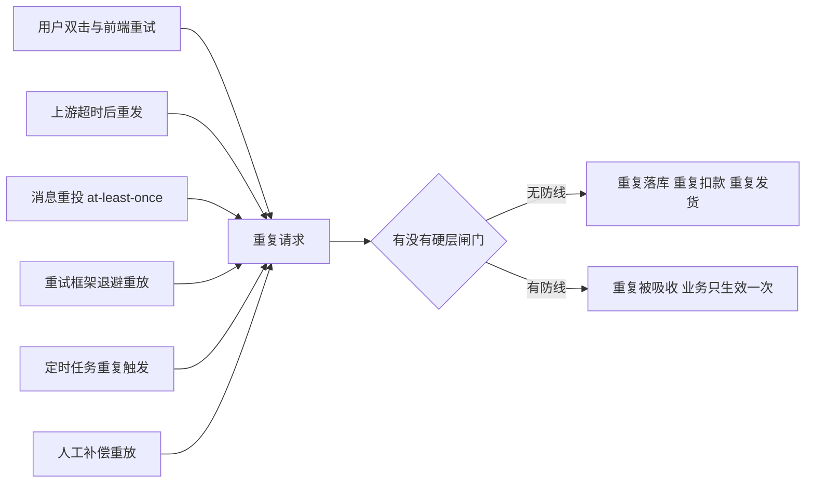
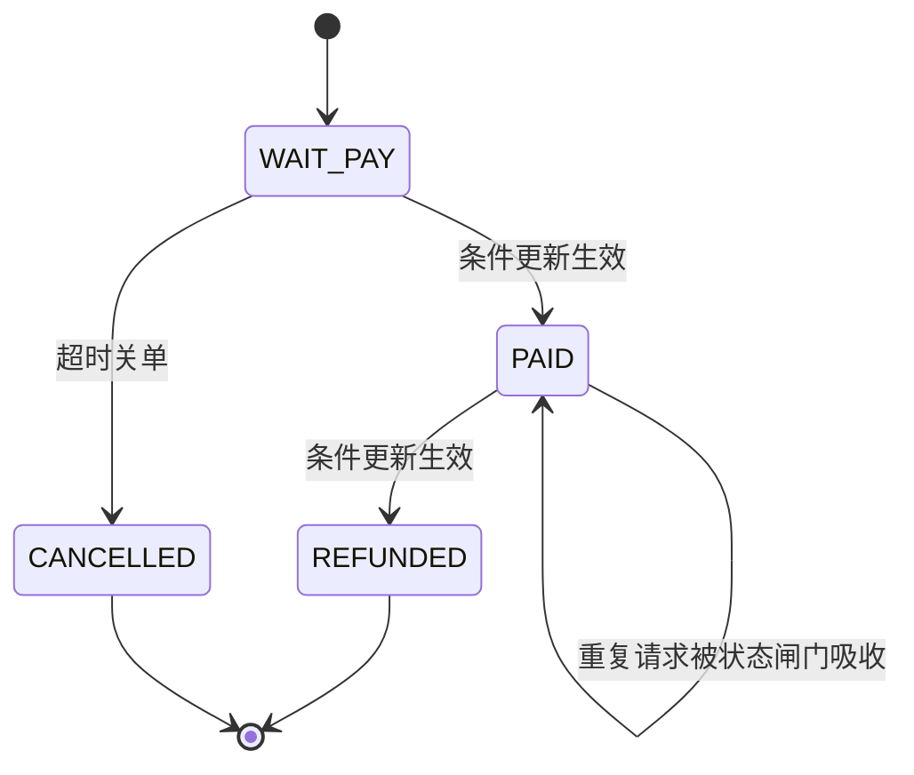
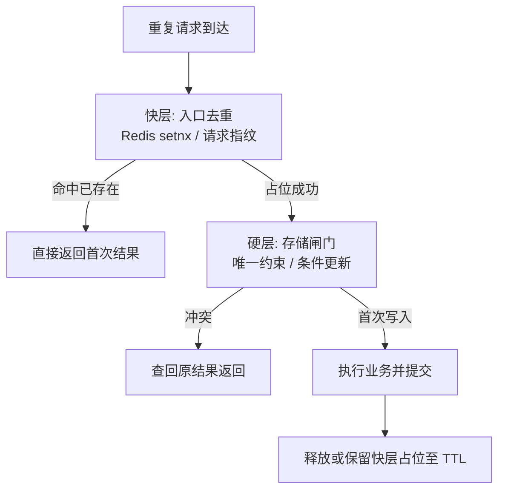
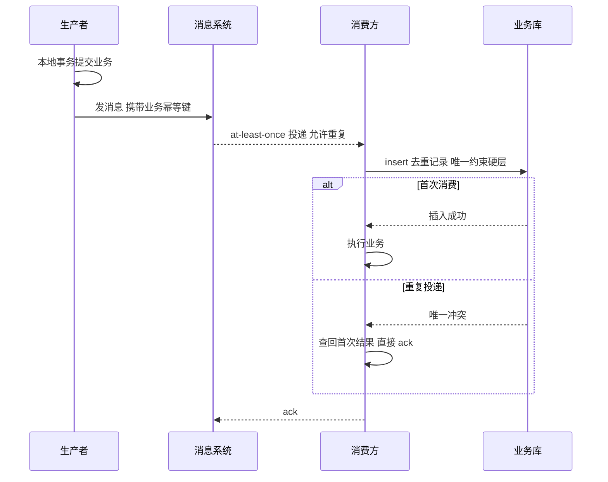

# 幂等设计全景：四种实现、防御纵深与量级选型

> 重复请求不是异常，是分布式系统的常态——超时重发、消息重投、用户双击、补偿重放，每一条链路都在制造重复。幂等设计要回答的不是「怎么挡住重复」，而是**「重复到达之后，业务结果为什么仍然正确」**。本篇把四种实现（唯一约束/去重表/状态机/幂等令牌）的机制边界拆开对比，再给出快层+硬层的防御纵深结构，最后落到与事务消息、重试机制的配合纪律。

## 一句话摘要

幂等的本质是**给业务操作定义一个可重复执行的身份（幂等键），并让「执行」与「记录执行结果」在同一个硬约束里原子发生**——唯一约束用 insert 冲突当闸门，去重表把闸门独立成表，状态机用前置状态当闸门，幂等令牌用缓存挡流量；四者不是互斥选项，而是从快到硬的纵深层次：快层（缓存/令牌）吸收 99% 的重复流量，硬层（约束/状态机）兜住最后 1% 的一致性底线。

## 🎯 本文核心

**核心一句话：幂等 = 幂等键纪律 × 硬约束闸门——键的生成规则（业务唯一键，而非随机 UUID）决定这条防线能不能对准业务语义，硬约束（唯一索引/状态机条件更新）决定重复最终能不能被数据库层拦截；缓存级快防线永远只是减压器，不是兜底者。**

机制链（本篇结构挂这条链上）：重复的物理起源 → 幂等键怎么生成 → 四种硬实现的机制与失效边界 → 快层+硬层的防御纵深 → 与事务消息/重试的配合 → 参数清单与落地步骤 → 量级选型。

## 一、重复从哪里来：幂等问题的物理起源

先破一个误区：重复不是「用户手抖」这种小概率事件，而是分布式链路的**结构性产物**。网络超时后你只有两个选择——不重试（可用性受损）或重试（可能重复），没有第三个选项。任何一次跨网络调用，请求「成功但响应丢失」的窗口永远存在，重试机制就是为这个窗口设计的，而重复就是重试的影子。



消息队列的投递语义是理解重复的关键追问点。追问一层：**为什么消息队列不干脆做成 exactly-once？** 因为「恰好一次」在跨网络的分布式环境里要靠「至少一次投递 + 消费端去重」合成——队列侧无法替消费方判断「这条消息的业务效果是否已生效」，所以主流消息系统公开口径都是 at-least-once 投递 + 建议消费端幂等。追问再一层：**那重试策略调保守一点行不行？** 不行——重试是可用性的生命线，把重试关掉换来的「不重复」是用「丢失」换的，比重复更贵。结论：**重复无法消灭，只能吸收；幂等设计是重试机制的前置契约**。

**事故叙事一（公开复盘形态，业内认知）**：某电商营销系统用消息驱动发货，消费逻辑是「收到消息 → 查订单没发过货 → 发货」。一次 broker 端网络抖动触发重投，两条相同消息间隔 200ms 被两个消费线程拿到，两个「查订单」都返回未发货，结果同一订单发出两箱货。复盘结论不是「消息队列有问题」，而是**「查一次再写」的防重逻辑本身就是错的**——它假设了检查与写入之间没有并发窗口，这个假设在第 2.1 节被正面击穿。

## 二、四种实现：机制、边界与选型

### 2.1 数据库唯一约束：把闸门下沉到存储层

最硬的实现：给业务唯一键建唯一索引，用 insert 冲突当闸门。

```sql
-- 业务表直接带唯一键：订单号 + 操作类型
ALTER TABLE payment_order
  ADD UNIQUE KEY uk_biz (biz_no, operation_type);
-- 插入冲突即视为重复，捕获 DuplicateKeyException 走查询返回原结果
```

追问链第一层：**为什么不能「先查再插」？** 因为查与插之间存在并发窗口——两个请求同时查到「不存在」，然后同时插入，双写成功。唯一索引的判断发生在存储引擎内部，带行锁语义，判断与写入是原子的，这个窗口不存在。追问第二层：**为什么键必须是业务唯一键而不是随机数？** 随机 UUID 在重试场景下每次都变，闸门形同虚设；幂等键必须从业务语义推导（订单号+操作类型、外部请求号、消息业务 ID），**键的稳定性决定防线的对准程度**。追问第三层：**冲突之后返回什么？** 必须查回原记录返回「首次结果」，而不是笼统报错——调用方拿到「重复」和拿到「失败」是两种语义，前者该继续后续流程，后者该重试。

### 2.2 去重表：把闸门独立出来，换灵活性

去重表是一张独立的表：业务执行前先向去重表 insert 幂等键，与业务操作在**同一个本地事务**里提交。

```sql
CREATE TABLE idempotent_record (
  idem_key   VARCHAR(128) NOT NULL COMMENT '业务幂等键',
  biz_status TINYINT NOT NULL DEFAULT 0 COMMENT '0处理中 1成功',
  created_at DATETIME NOT NULL DEFAULT CURRENT_TIMESTAMP,
  UNIQUE KEY uk_idem (idem_key)
) ENGINE=InnoDB;
-- 事务内: 先 insert 去重记录, 再执行业务 update, 一并提交
```

它比唯一约束多换来的东西：解耦（业务表可以没有合适的唯一键）、可扩展（去重记录可以带状态、过期时间、回调上下文）。追问：**去重记录和业务操作为什么必须在同一个事务？** 事故叙事二（业内公开的常见复盘形态）：某系统把去重插入和业务更新放在两个事务，去重提交成功后业务事务因锁超时回滚——结果键被占、业务没做，后续所有重试都被自己的去重表挡死，人工清数据才恢复。**闸门与业务不同事务，等于把「防重复」变成「制造卡死」**。

### 2.3 状态机：天然幂等的条件更新

带状态流转的业务（订单、工单、支付单）可以用「前置状态检查」做幂等：更新时带上预期前置状态，影响行数为 0 即视为重复或非法。

```java
// 条件更新: 只有 WAIT_PAY 状态才允许推进到 PAID
int rows = jdbc.update(
    "UPDATE payment_order SET status = 'PAID', paid_at = ? " +
    "WHERE biz_no = ? AND status = 'WAIT_PAY'",
    now, bizNo);
if (rows == 0) {
    // 要么已支付(幂等命中, 查回结果), 要么状态非法(拒绝)
}
```

状态机的幂等性来自**「终态不可再流转」**：重复请求到达时，状态已经推进，条件更新匹配不到行，天然被拒绝。它的边界也很清楚：只覆盖「状态推进」型操作，对「每次执行都有增量效果」的操作（加余额、加库存）无能为力。追问：**为什么不用 `WHERE status != 'PAID'` 这种否定式条件？** 否定式把「非法推进」和「幂等命中」混在一起，无法区分；显式前置状态让语义可判定，也为后续补偿提供了明确的回退起点。



### 2.4 幂等令牌与去重缓存：快层减压器

用 Redis 等缓存的 set-if-absent 语义在入口挡重复：键不存在则占位继续，存在则直接拒绝/返回。

```java
// 快层: Redis 占位, TTL 与业务窗口对齐
Boolean acquired = redis.setIfAbsent("idem:" + idemKey, "1",
        Duration.ofMinutes(10));
if (Boolean.FALSE.equals(acquired)) {
    return queryResult(bizNo);  // 重复: 返回首次结果
}
try {
    doBusiness(bizNo);           // 硬层: 唯一约束仍在兜底
} catch (DuplicateKeyException e) {
    return queryResult(bizNo);   // 快层漏掉的由硬层接住
}
```

追问链：**既然有 Redis 挡，为什么硬约束还不能省？** 因为缓存与数据库之间没有原子性——Redis 占位成功后进程崩溃、Redis 主从切换丢键、TTL 到期后重复再临，这些窗口里唯一约束是最后一道闸。追问再一层：**TTL 设多长？** 必须覆盖「重复可能到达的最大时间窗」（重试上限 × 退避倍数的总和，再留余量），TTL 比重复窗口短等于主动开门；但也不能无限长，占位键会阻塞合法的后续轮次操作（比如按月允许重复的场景），TTL 是「防重窗口」的表达，不是随手写的过期时间。

**事故叙事三（公开口径的典型形态）**：某支付接入层把去重键 TTL 配成 60 秒，而上游的重试策略是 1s/10s/60s/300s 四次退避——第五次重试（5 分钟后）到达时占位键已过期，快层放行，恰好赶上前几次重试中有一个「已受理但响应超时」的慢请求刚提交完，双扣。复盘结论：**TTL 与重试预算错配，快层等于帮重复请求「排了个队」**。

### 2.5 选型对比与 Trade-off

| 维度 | 唯一约束 | 去重表 | 状态机 | 幂等令牌 |
|---|---|---|---|---|
| 拦截强度 | 硬（存储层原子） | 硬（事务内原子） | 硬（条件更新原子） | 软（缓存层可失效） |
| 侵入性 | 低（建索引） | 中（多一张表+事务编排） | 中（业务要可建模为状态） | 低（入口加逻辑） |
| 适用操作 | insert 型 | insert/混合型 | 状态推进型 | 高频入口流量 |
| 主要代价 | 冲突后需查回结果 | 表膨胀需归档 | 只覆盖状态型业务 | 与库非原子、TTL 管理 |
| 什么时候用 | 一切有业务唯一键的写入 | 业务键分散/需要记录过程 | 订单工单支付类流转 | 秒杀/高频读改前的减压 |

Trade-off 的主线是**强度与成本的兑换**：唯一约束几乎免费但要求你能提炼出业务唯一键——提炼不出来往往说明业务身份定义有歧义，这本身就是设计信号；去重表灵活但多一次写放大与归档负担；状态机最优雅但要求业务建模干净，烂状态机反而引入新的非法流转；令牌最快但可靠性最弱。**四者的关系不是选一个，而是分层叠加**。

## 三、防御纵深：快层与硬层

单层防线的问题在上面的事故里都露过脸：只有快层，缓存失效即穿透；只有硬层，所有重复都打到数据库（锁冲突 + 空转查询）。生产形态是两层叠加：



快层与硬层的分工纪律：**快层负责吞吐（吸收 99% 的已知重复），硬层负责正确性（兜住 1% 的漏网与快层自身故障）**。上线验证时反过来测——把快层手动关掉打重复流量，硬层必须独立扛住且业务结果正确；快层恢复后硬层冲突率应回落。只验证「开了快层不重复」是不够的，那证明不了硬层存在。

## 四、与事务消息、重试的配合

幂等不是孤立开关，它嵌在两个更大的机制里：事务消息（保证「本地事务 + 发消息」的原子性）与重试（保证最终到达）。三者拼在一起才是完整链路：



这条链上有两个配合纪律。其一，**幂等键必须在生产侧就确定**（从业务实体推导），而不是消费侧现造——消费侧现造意味着两次投递可能造出两个键，链路断在源头。其二，**消费失败的重试要区分「可重试错误」与「幂等冲突」**：唯一约束冲突不是失败，是成功的一种形态，捕获后直接 ack，不能把它当异常扔回重试队列——否则同一条消息会在「重试→冲突→再重试」里空转到重试上限，白白制造一轮重试风暴。追问：**为什么不干脆用队列提供的「顺序消费 + 单线程」来防重？** 顺序消费缩小但不消除重复（重投仍会发生），且把吞吐锁死在单线程，用吞吐换防重不划算——防重归幂等机制管，顺序只解决业务次序问题。

## 五、参数级配置清单

幂等机制涉及的关键参数（默认值为 MySQL/Redis/主流框架的公开默认口径，分档推荐为业内认知）：

| 配置项 | 默认值 | 分档推荐 | 为什么 |
|---|---|---|---|
| 幂等键 TTL（Redis 占位） | 无默认（自定） | 十万级 5min / 百万级 15min / 千万级以上对齐上游重试总预算+1 | TTL 必须覆盖重复最大到达窗，短了开门，长了阻塞合法轮次 |
| 去重表唯一索引 | 无 | 每业务一条 `uk(idem_key)`，禁联合业务列冗余 | 单列键稳定可归档；复合键易随业务演进失效 |
| 上游重试次数 | 框架各异（常见 3 次） | 2-3 次 + 指数退避（1s/4s/16s） | 次数越多重复窗口越长，幂等成本随重试预算线性涨 |
| 消费端重试上限 | 常见 16 次（消息系统公开默认） | 降到 3-5 次后进死信+人工 | 无限重试对幂等未命中的系统是灾难放大器 |
| 去重表归档周期 | 无默认 | 保留 30-90 天，滚动归档 | 幂等窗口过了的记录只值审计价值，不值在线写放大 |
| `allow-circular-references` 式幂等总开关 | 框架默认关 | 全局默认关、按接口白名单开 | 幂等有成本，按需开比全局开更可控 |

## 六、步骤级操作：给存量接口补幂等

以「给一个已在运行的支付回调接口补防线」为例的落地步骤（命令以 MySQL/Redis 为例）：

1. **前置**：梳理该接口的全部调用方与重试策略（谁会重发、几次、间隔多少），推导业务唯一键（回调单号 or 订单号+操作类型）；在测试库确认 `SELECT COUNT(*) FROM payment_order GROUP BY biz_no HAVING COUNT(*) > 1` 当前无存量重复——有重复先清数据，否则唯一索引建不起来。
2. **命令**：低峰期执行 `ALTER TABLE payment_order ADD UNIQUE KEY uk_biz (biz_no, operation_type), ALGORITHM=INPLACE, LOCK=NONE;`；应用侧同步发布条件更新/冲突捕获逻辑。
3. **验证**：用并发工具对同一 `biz_no` 打 50 个并发请求，断言业务表只落一行、响应全部为同一结果（首次结果或等价结果）；再单独验证冲突分支——人工预插一条记录后重放请求，断言返回「已受理」而非异常。
4. **回退**：应用侧回滚到上一版本（幂等逻辑是增量代码，可独立回退）；索引回退用 `ALTER TABLE payment_order DROP INDEX uk_biz;`（注意回退期间防线归零，需评估窗口内重复风险）。

## 七、不同量级的思考

- **十万级（日请求十万量级）**：约束来源是**团队带宽**——这个量级重复率低、种类少，一套「唯一约束 + 冲突捕获」就覆盖九成场景。思考方式是**关键路径驱动**：只给钱相关的写接口做幂等，其余靠日志兜底排查。这一档的核心问题是「键对准业务没有」，而不是「机制上得多全」。
- **百万级（日请求百万量级）**：约束来源是**数据库承受力**——重复流量开始成规模打到存储层，每次空转冲突都是锁与连接的开销。思考方式是**分层防御驱动**：Redis 快层前置吸收，硬层退居兜底；去重表开始需要归档策略。这一档的核心问题是「快层替数据库挡了多少」，而不是「约束建得够不够硬」。
- **千万级（日请求千万量级）**：约束来源是**故障传染半径**——任何一层防线的误判（把合法请求当重复、把重复放行为双扣）都会以批量事故形态出现。思考方式是**预案演练驱动**：快层故障注入、硬层独立压测、冲突率监控进大盘，幂等从代码问题升格为运维问题。这一档的核心问题是「防线失效时业务为什么还站得住」，而不是「正常流量下挡没挡住」。
- **亿级（日请求亿量级/跨单元）**：约束来源是**地理与单元边界**——跨机房延迟让「同一个键的全局判定」不再廉价，幂等必须单元化：键按用户/订单分片路由到所属单元，单元内做硬判定，跨单元只做异步对账。思考方式是**对账兜底驱动**：实时防线覆盖 99.99%，剩下靠离线对账发现资损。这一档的核心问题是「对账能不能兜住残余」，而不是「防线还能不能再加厚」。

思考方式总结：十万级靠**关键路径驱动**，百万级靠**分层防御驱动**，千万级靠**预案演练驱动**，亿级靠**对账兜底驱动**——每一档的约束来源不同（团队带宽/数据库承受力/故障半径/地理边界），思考方式必须匹配约束来源，解法是约束的产物而不是参数的堆砌。

**自下而上与触发升级**：先用实测定位档位——重复率、冲突率、上游重试预算三个指标决定你实际站在哪一档，不预支上一档的复杂度（十万级上单元化是过度设计），也不滞留在下一档的侥幸里（千万级还只有单层快层是在裸奔）。触发升级的信号：冲突率持续抬升、快层组件故障引发过一次穿透、或上游重试预算扩大——任一出现，思考方式必须随档升级。锚点始终是约束来源：约束迁移了，解法才跟着迁移。

## 💡 实战提示

💡 实战提示一：评审新接口时先问一句「这条链路谁会重试、重试几次、间隔多少」——上游重试预算直接决定幂等 TTL 与去重表保留窗口，这道题答不出来，幂等设计就是凭感觉配参数。

💡 实战提示二：把「唯一约束冲突」的异常日志级别降为 INFO 并打上幂等键字段——冲突是幂等生效的正常形态，打成 ERROR 会污染告警大盘，真实的防线失效反而被淹没；上下游架构上约定「冲突即成功」的响应语义，避免调用方把冲突当故障再发明一层重试。

💡 实战提示三：给幂等冲突率（冲突次数/总请求）和快层占位命中率建监控基线——冲突率突涨通常意味着上游重试行为变化或快层失效，这是防线迁移的演进信号，比事后翻日志定位快一个量级。

💡 实战提示四：新服务接入消息消费时，把「去重表 + 唯一约束」做成脚手架默认项（starter/模板代码），让幂等成为默认姿势而不是每个消费者自己发明——团队内两套以上自创防重写法，几乎必然出现事故叙事二那种事务拆分的翻车变体。

## 你们可能会问

**Q1：接口天然只读（查询），需要幂等吗？** 不需要——查询天然幂等（执行 N 次与 1 次结果一致），给只读接口加去重是纯开销。真正要防的是「读后写」的复合操作，比如「查余额→扣减」必须整体幂等，而不是只防其中的读。

**Q2：为什么幂等键不能让前端生成随机数上送？** 前端生成的键在重试链路里不稳定（刷新页面/换设备后键变了），而且无法覆盖服务间重试。前端防抖只是体验优化；可靠的幂等键要么从业务实体推导（订单号+操作类型），要么由第一次请求的服务端签发（令牌模式），键的权威性必须落在服务端。

**Q3：去重表越来越大了怎么办，能不能直接删旧数据？** 不能直接删——幂等窗口内（上游还可能重试的时间范围）的记录删了等于开门；窗口外的记录可以滚动归档到离线存储，在线表只保留窗口内数据。归档是去重表方案从一开始就要写进设计的能力，不是事后补丁。

**Q4：分布式锁能不能替代幂等设计？** 不能——分布式锁解决「同一时刻只有一个执行者」，幂等解决「执行多次效果等于一次」。锁超时自动释放后，持有者以为自己还在执行，第二个执行者已经进来，重复照样发生；「锁 + 幂等键」是常见组合，但锁永远替代不了硬约束闸门。

## 留两个开放问题

其一，跨库跨服务的幂等键一致性——业务唯一键分散在不同系统时（订单系统用订单号、支付系统用支付单号），键的映射与传递纪律怎么标准化，目前业内没有统一答案，值得结合自家链路讨论。其二，「幂等窗口」的经济学——窗口越长防线越厚但成本越高，窗口的最优长度是否可以由上游重试预算反推成公式，是个值得用真实数据验证的开放问题。

## 🎯 核心带走

**幂等 = 稳定的业务幂等键 × 硬约束闸门 × 快慢分层**。三句话复述全链条：键从业务语义推导，键不稳则全线失效；唯一约束/条件更新是正确性底线，缓存占位只是吞吐减压器；快层关掉系统必须依然正确，这是验证防御纵深是否成立的唯一标准。失效边界记两条：TTL 与重试预算错配是快层最常见事故形态；闸门与业务不同事务是去重表最常见事故形态。

## 📌 数据与事实声明

- 文中「默认值」（如消息系统重试上限、Redis setnx 语义、MySQL 索引行为）来自各组件公开文档口径；「分档推荐」「事故形态」为业内认知与公开复盘的常见形态总结，已在正文标注，非特定公司内部数据。
- 事故叙事均为匿名化的公开复盘常见形态，用于机制说明，不指向任何特定公司或真实项目。
- 消息投递语义（at-least-once）与「不承诺 exactly-once、建议消费端幂等」为公开文档口径，具体以所用消息系统官方文档为准。

## 📚 参考资料

| 资料 | 说明 |
|---|---|
| [MySQL Reference Manual - CREATE TABLE / InnoDB Constraints](https://dev.mysql.com/doc/refman/8.0/en/create-table.html) | 唯一索引与冲突行为权威口径 |
| [Redis Documentation - SET with NX option](https://redis.io/docs/latest/commands/set/) | set-if-absent 语义权威口径 |
| [Apache RocketMQ 官方文档 - 消息重试与投递语义](https://rocketmq.apache.org/docs/) | at-least-once 投递与消费重试机制 |
| [Spring AMQP Reference - Duplicate Message Detection](https://docs.spring.io/spring-amqp/reference/) | 消费端幂等的框架侧支持 |
| [Martin Fowler - Idempotence 与重试模式（Microsoft Azure Architecture Center）](https://learn.microsoft.com/azure/architecture/patterns/retry) | 重试与幂等关系的经典论述 |
