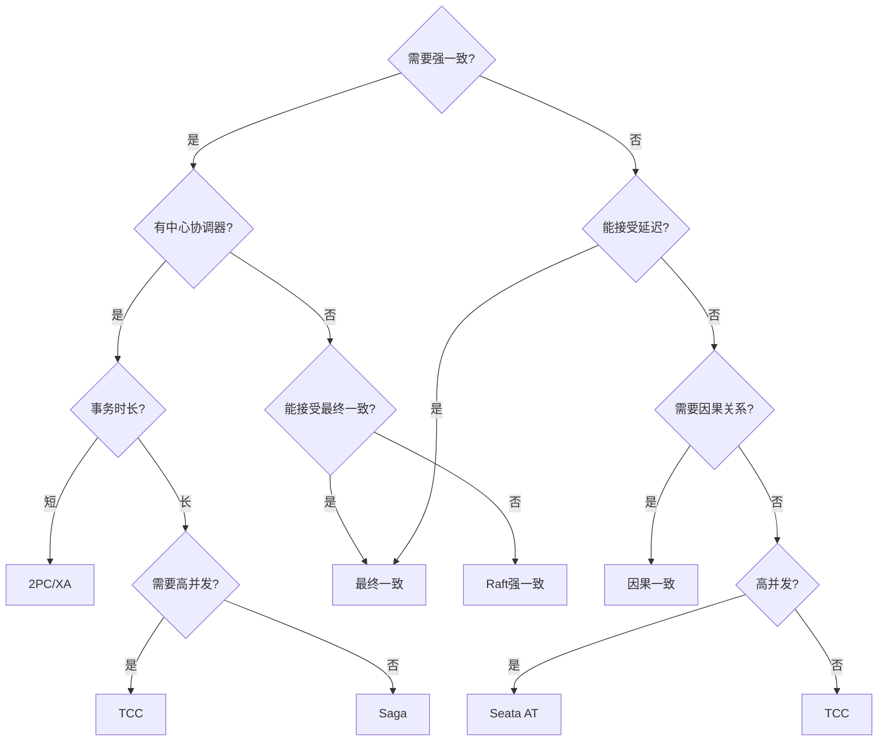
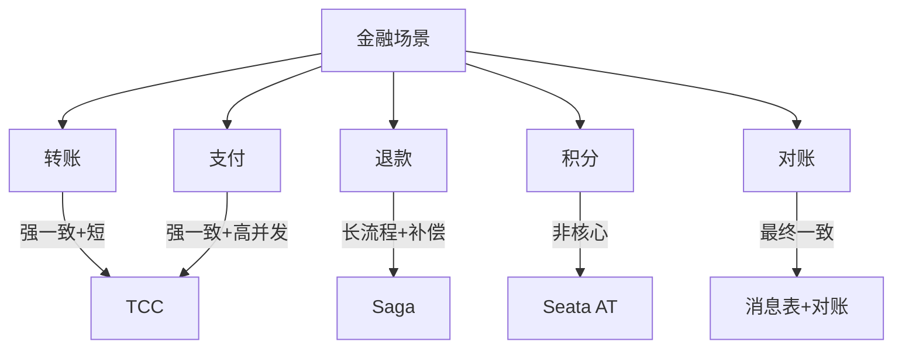
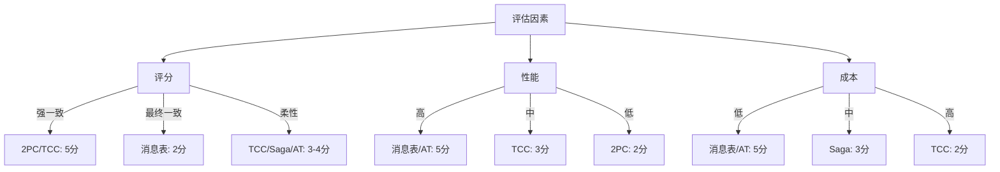
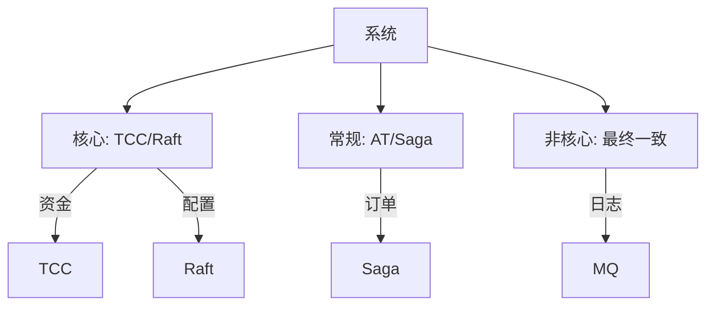

# 分布式事务方案选型决策

> **一句话摘要**：选型 = 一致性需求 × 性能要求 × 复杂度——从强一致到最终一致的完整决策树。
> **本文核心**：**选型 = 业务场景 → 一致性级别 → 具体方案**。

前置阅读：[分布式事务选型决策](../分布式事务/入门层/从零开始认识分布式事务系列/12_分布式事务选型决策-入门.md)。本篇深入选型的具体决策过程。

## 1. 背景：为什么需要选型决策

分布式事务方案很多，但选型是核心决策——选错方案代价巨大：

- 选强一致 → 性能差，系统吞吐受限
- 选最终一致 → 资金可能出错
- 选 TCC → 改造成本高
- 选 Saga → 长事务状态管理复杂

选型决策是分布式事务落地的关键一步。

## 2. 核心机制：选型决策树

## 3. 落地实践：金融场景选型

**金融选型原则**：
1. 资金类：强一致（TCC/Raft）
2. 非资金类：最终一致（消息表/AT）
3. 长流程：Saga
4. 中间态：AT

## 4. 落地实践：选型检查清单

### 4.1 评估维度

| 维度 | 问题 | 权重 |
|---|---|---|
| 一致性 | 能容忍多久不一致？ | 高 |
| 性能 | QPS 要求多少？ | 高 |
| 复杂度 | 团队能驾驭吗？ | 中 |
| 成本 | 开发+运维成本？ | 中 |
| 扩展 | 未来会变吗？ | 低 |

### 4.2 评分矩阵

## 5. 落地实践：混合选型

实际系统中，不同场景用不同方案：

**混合选型的优势**：
- 核心业务强一致保障
- 常规业务灵活性
- 非核心业务高性能

## 6. 生产视角：选型踩坑

- **踩坑 1**：选型过强——用 2PC 处理非核心场景，性能差
- **踩坑 2**：选型过弱——用最终一致处理资金场景，数据错误
- **踩坑 3**：选型不考虑扩展——业务变化后无法调整
- **踩坑 4**：只看理论不考虑实际——方案太复杂无法落地

**生产最佳实践**：

1. 先评估业务需求（最重要）
2. 混合使用不同方案
3. 文档记录选型理由
4. 预留调整空间
5. 定期 review 选型

## 7. 典型场景

| 场景 | 选型 | 理由 |
|---|---|---|
| 银行转账 | TCC | 强一致+短事务 |
| 电商下单 | Saga | 长流程 |
| 积分变动 | AT | 非核心+简单 |
| 配置管理 | Raft | 强一致 |
| 消息通知 | 消息表 | 最终一致 |
| 金融清算 | Raft | 金融级 |
| 跨行支付 | Saga+TCC | 混合方案 |

## 8. 与相邻概念的区别

- **选型 vs 实现**：选型是决策，实现是编码
- **选型 vs 架构**：选型影响架构设计
- **选型 vs 技术债**：选型不当 = 技术债
- **选型 vs 规范**：选型是个案决策，规范是通用规则

## 9. 你们可能会问

- **选型能改吗？** 能——但成本高，需要评估影响
- **选型错了怎么办？** 重构——但要评估业务影响
- **能混合使用吗？** 能——推荐混合使用
- **选型需要团队共识吗？** 需要——架构师/开发/运维都要同意

## 10. 一句话总结 + 5W 速记卡 + 自测三问

**一句话总结**：选型 = 业务需求 → 一致性级别 → 具体方案。

**5W 速记卡**：

| 维度 | 内容 |
|---|---|
| What | 根据业务需求选择方案 |
| Why | 平衡一致性和性能 |
| When | 系统设计阶段 |
| Where | 所有分布式事务 |
| How | 需求评估 → 方案选择 → 验证 |

**自测三问**：

1. 你的业务能容忍多久不一致？
2. 你的选型理由是什么？
3. 你的方案考虑了未来扩展吗？

---

**专题层完结**：分布式事务方案选型决策已建立。

**🎯 核心带走**：

- **核心一句话**：选型 = 业务需求 × 一致性 × 性能 × 复杂度
- **链条复述**：评估需求 → 确定级别 → 选择方案 → 验证
- **失效点与边界**：选型过强/过弱都会出问题

💡 **实战提示**：金融核心用 TCC/Raft，非核心用消息表/AT——混合选型是常态。

**开放问题**：选型能自动化吗？答案是：部分能——基于业务标注的自动推荐，但需要人工确认。

**决策（何时用）**：所有分布式事务都需要选型；选型后记录理由；定期 review。
