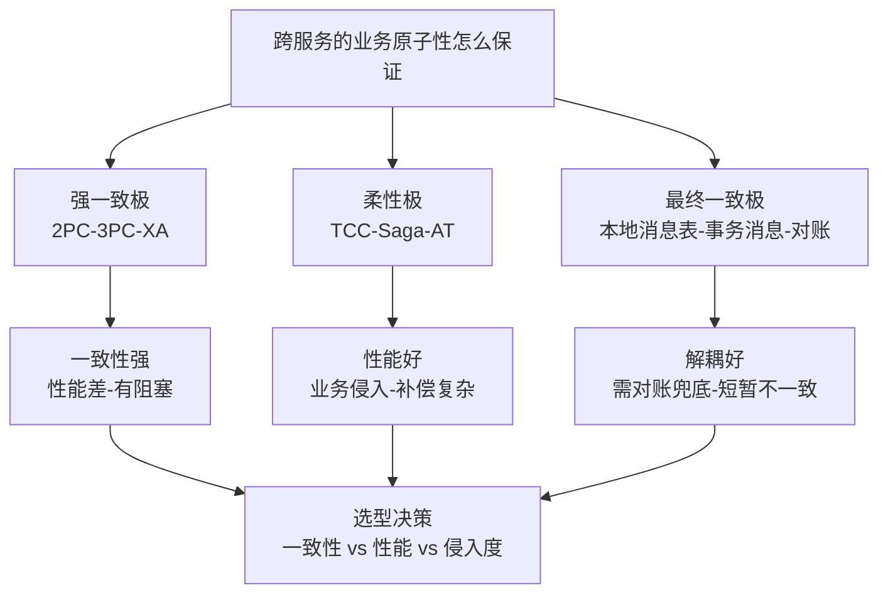
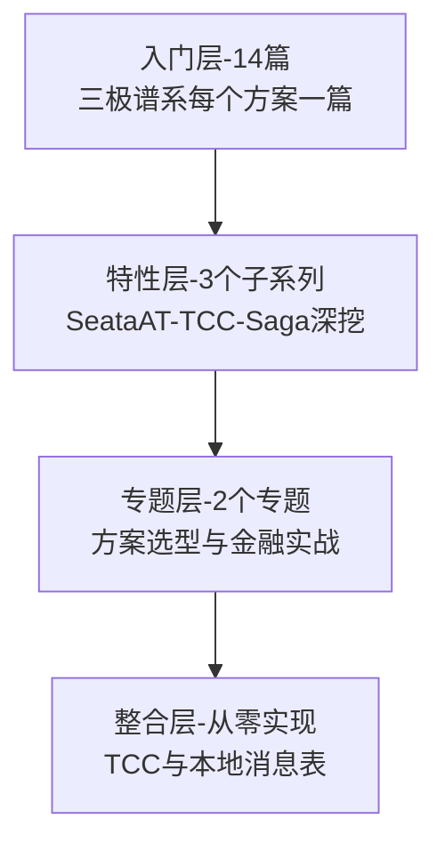

# 分布式事务系列导读 · 一致性与性能的三极谱系

> 📖 本系列共 14 篇（0_导读 + 13 正文），覆盖分布式事务整个知识面：认知与问题域、强一致方案（XA 系）、柔性事务（TCC/Saga/AT）、消息驱动最终一致、选型与金融实战。
> 本篇是第 0 篇导读：先建立「三极谱系」的心智模型，再决定读哪条路。

## 一、为什么需要这套系列

分布式事务是微服务落地后绕不开的坎：拆了服务，一个业务操作横跨多个库多个服务，「要么全成功要么全失败」的旧承诺失效了。但学分布式事务常见两种极端：

- **只背方案名**：能说出 2PC、TCC、Saga、本地消息表，但回答不了「我这个场景该用哪个、为什么」——方案没有接到问题
- **只用框架**：会引 Seata 加注解，但不知道 AT 模式在全局锁下到底发生了什么，出问题时完全没抓手

这套系列的设计思路：**先建立「强一致 / 柔性 / 最终一致」三极谱系，再逐个方案填进去**。主线是「一致性 vs 性能的权衡」，支线是每极下的具体方案（XA 系 / TCC/Saga/AT / 消息驱动）。先会「看清权衡」，再会「选对方案」，最后会「在金融场景把一致性兜底做完整」。

## 二、全局心智模型：三极谱系

理解这个模型的三个要点：

1. **三极是「一致性 vs 性能」光谱上的三个锚点**：强一致极用「锁 + 两阶段」换最强承诺，代价是阻塞与吞吐；柔性极把「一步事务」改成「预留-确认/补偿」两步换性能，代价是业务侵入；最终一致极干脆允许短暂不一致、用异步消息追赶，代价是要做对账兜底。
2. **没有最好的方案，只有匹配业务代价的方案**：转账强一致必要（钱不能错）、订单-库存柔性够用（TCC 预扣）、积分/通知最终一致即可（晚几秒无所谓）。选型 = 给「不一致的代价」定价。
3. **对账是最终一致的底座**：只要选了柔性或最终一致极，「对账 + 补偿」就不是可选项而是必选项——消息会丢、补偿会失败，对账是最后的安全网。

> tips：(三极自检) 看到任何分布式事务方案，先定位它在哪一极：它承诺什么等级的一致性？性能代价是什么（锁/阻塞/侵入）？失败靠什么恢复（回滚/补偿/对账）？三问定位完，方案之间就不会混淆。

## 三、系列导航表（14 篇）

| 序号 | 篇目 | 深度 | 一句话定位 | 对标参考 |
|---|---|---|---|---|
| 0 | 系列导读 | 全景 | 三极谱系心智模型 + 阅读路径 | - |
| 1 | 分布式事务是什么与为什么难 | 入门 | 本地 ACID 失效 → 分布式挑战 | 深入理解分布式事务 |
| 2 | 分布式事务方案全景 | 入门 | 强一致/柔性/最终一致全谱系 | 深入理解分布式事务 |
| 3 | 2PC 两阶段提交 | 入门 | 准备/提交两阶段、阻塞问题 | DDIA |
| 4 | 3PC 三阶段提交 | 入门 | 为什么引入第三阶段、超时处理 | DDIA |
| 5 | XA 规范与数据库支持 | 入门 | X/Open DTP、MySQL/Oracle XA | 数据库文档 |
| 6 | TCC 补偿事务 | 入门 | Try-Confirm-Cancel、幂等/空回滚/悬挂 | 深入理解分布式事务 |
| 7 | Saga 长事务 | 入门 | 正向+补偿、编排式 vs 协调式 | 深入理解分布式事务 |
| 8 | AT 自动补偿模式 | 入门 | 全局锁、undo log 自动回滚机制 | Seata 官方文档 |
| 9 | 本地消息表 | 入门 | 消息表+轮询、可靠消息投递 | 凤凰架构 |
| 10 | 事务消息 | 入门 | Half 消息、回查机制 | RocketMQ 文档 |
| 11 | 最终一致性与对账 | 入门 | 幂等消费、对账补偿兜底 | 凤凰架构 |
| 12 | 分布式事务选型决策 | 入门 | 一致性 vs 性能 vs 复杂度决策树 | 综合应用 |
| 13 | 金融场景实战 | 入门 | 跨行转账、退款补偿、对账闭环 | 综合应用 |

## 四、从点到面：四层进阶路径

| 层级 | 定位 | 规模 | 适合 |
|---|---|---|---|
| 入门层 | 点：每个方案一篇，建立完整认知 | 14 篇 | 所有读者必读 |
| 特性层 | 点 × 深：TCC/Saga/AT 拆到机制细节 | 3 个子系列 | 按使用方案挑 |
| 专题层 | 面：选型决策矩阵 + 金融资金一致性 | 2 个专题 | 解决实际选型 |
| 整合层 | 体系：从零实现 TCC + 本地消息表闭环 | 1 个 demo | 动手派 |

## 五、入门读者最容易踩的 3 个认知误区

### 误区 1：以为分布式事务 = Seata

「用了 Seata 就有分布式事务了」是把实现当成了机制本身。Seata 的 AT 模式只是柔性极的一种实现（自动补偿 + 全局锁），它不提供 2PC 的强一致、也不解决消息可靠性。**先懂机制再选框架**：知道 TCC 要处理空回滚和悬挂、知道 AT 靠 undo log 反解析回滚，框架出问题时才有抓手；只会加注解，异常时只能重启碰运气。

### 误区 2：以为 TCC 三个方法是「一个接口拆三份」

把 TCC 理解成「把 update 拆成 tryUpdate/confirmUpdate/cancelUpdate」是最常见的实现事故来源。TCC 的本质是**资源预留**：Try 阶段「冻结额度」而不是「扣减额度」，Confirm 用冻结额度真正扣减，Cancel 释放冻结。直接把业务操作拆三份，Try 阶段就把资源真扣了，Cancel 时没法「补偿」只能「再写回去」——并发下必然错账。幂等、空回滚、悬挂三个经典问题全部源于 Try/Confirm/Cancel 的乱序与重试，第 6 篇专门拆。

### 误区 3：以为选了最终一致就不用管一致性

「用了事务消息就是最终一致，稳了」是危险的放松。最终一致只是把「实时的强一致」放宽成「有限时间内的收敛」，收敛依赖三件事都做对：**本地消息表/半消息保证消息不丢、消费端幂等保证不重复、对账兜底保证漏网之鱼最终被修**。三件少一件，「最终」就没有兑现时间——资金场景里的「不对账的最终一致」等于「不知道什么时候会发现算错」。

> tips：(代价定价) 分布式事务选型的本质是给「不一致」定价：一笔不一致损失多少（资金 vs 积分 vs 通知）、不一致窗口可接受多久（实时 vs 分钟 vs 天）。价格定出来，方案就定了——高代价强一致极，中代价柔性极，低代价最终一致极加对账。

## 六、怎么读这套系列

- **零基础/刚入行**：从 0 按顺序读到 13，每天 2 篇，一周建立完整方案认知
- **微服务实战派**：重点读 6-8（TCC/Saga/AT 柔性三篇）、9-11（消息驱动三篇）、12（选型）——柔性 + 最终一致是绝大多数业务场景的答案
- **金融/资金场景**：读完入门层直接进专题层「金融资金一致性实战」，把对账、补偿、幂等、审计串成闭环；动手派进整合层「从零实现一个分布式事务框架」

---

下一篇将讲 **1_分布式事务是什么与为什么难**：从单机 ACID 说起，为什么「begin; commit;」跨了两个库就失效——待正文落盘后补链接。
