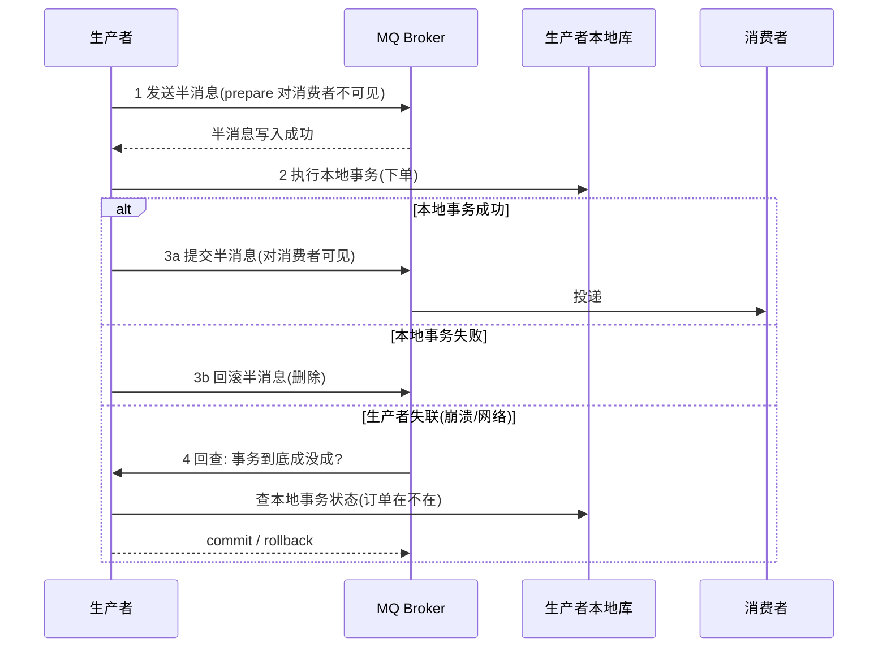
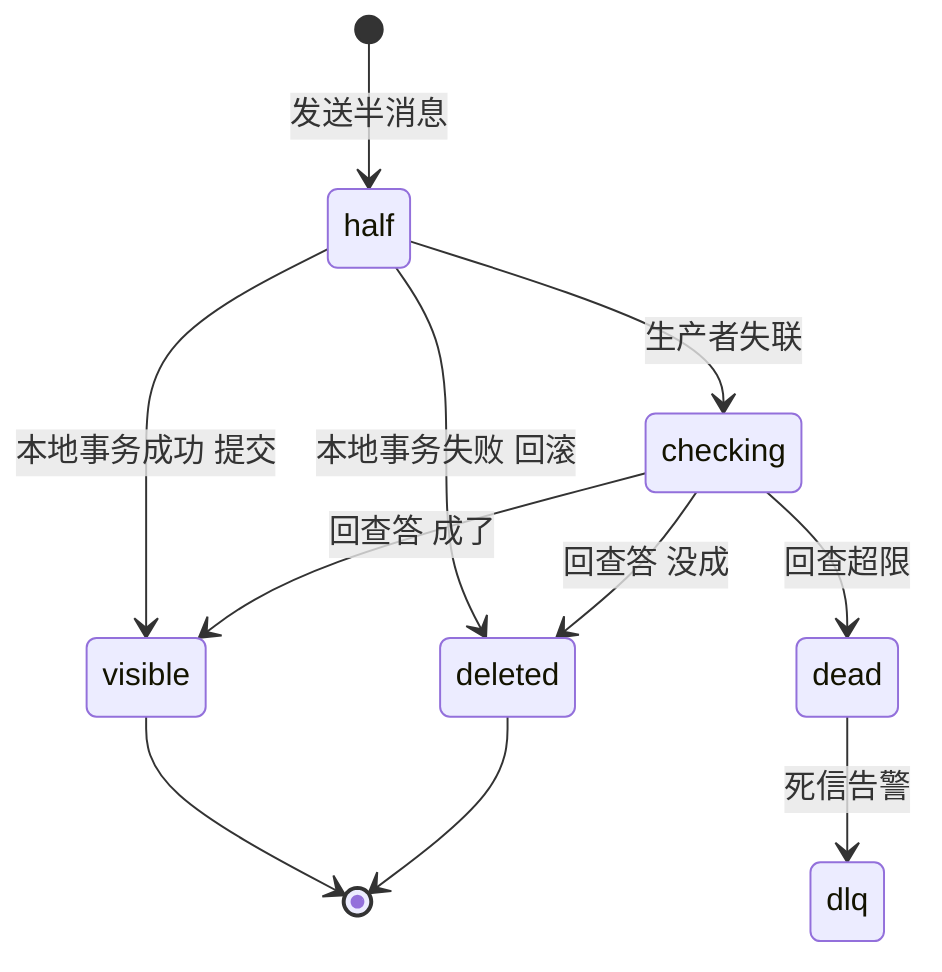

# 事务消息

> **一句话摘要**：事务消息把本地消息表的「消息暂存区」从业务库搬到 MQ——生产者先发**半消息**（对消费者不可见）、执行本地事务、提交或回滚半消息；MQ 定期**回查**失联的生产者「事务到底成没成」——用「两阶段 + 回查」替代消息表与轮询器，原子性载体从数据库变成消息中间件。

> **本文核心**：机制链 = **半消息（prepare）→ 本地事务 → 提交/回滚半消息 → 失联则 MQ 回查本地事务状态**——它解决的仍是「业务成功但消息丢」的同一条缝（与本地消息表同题），差别在托管方（MQ 接管暂存与重试）与新增的义务（业务必须实现回查接口）；回查是整个机制的命门。

前置阅读：[本地消息表](./9_本地消息表-入门.md)（同题的表版原型）。实现细节归本仓库 RocketMQ 系列事务消息专题（单源：机制在此、实现在彼）。

## 1. 背景：消息表太重，MQ 能不能自己扛

本地消息表（上一篇）的运维成本：消息表建在业务库、投递器要开发与扩容、表要归档。团队自然会问：MQ 本来就是干消息的，能不能让它托管这个「暂存区」？事务消息（以 RocketMQ 为代表，Kafka 的 Transactions 是另一语义——跨分区原子写，不是本机制）的回答：**可以，但业务要交出两样东西**——发送流程按两阶段走、实现一个「回查监听器」。

## 2. 核心机制：半消息与回查



- **半消息（half message）**：已写入 broker 但「消费者不可见」的消息——它是暂存区，替代了消息表的那一行。
- **本地事务**：半消息就绪后执行业务落库——这一步与消息发送已经解耦（半消息已在 MQ 手里，不怕「业务成了消息没发」）。
- **提交/回滚**：本地事务结果决定半消息命运——提交（可见、投递）或回滚（删除）。
- **回查（关键）**：生产者在提交/回滚前崩溃或失联 → MQ 定期问「这个半消息对应的事务成了吗」→ 生产者查**本地事务的真实状态**（订单表里有没有这单）作答。**回查的正确实现要求「本地事务状态可独立查询」**——这是业务必须保留的能力，也是回查语义的命门：查错了状态，半消息就会被错误地提交/回滚。

与本地消息表的机制对照：暂存区（表 → 半消息）、补发（轮询 → MQ 内部重投 + 回查）、业务义务（无需额外接口 → 必须实现回查）。**「本地事务与消息发送的原子绑定」这个不变式完全一致**。

## 3. 落地实践：正确实现回查

回查监听器的实现纪律（RocketMQ 语义）：

```text
executeLocalTransaction(msg, bizArg):    # 1. 执行本地事务
    半消息已就绪 => 本地事务: INSERT 订单 (带 bizKey)
    成功返回 COMMIT / 失败返回 ROLLBACK / 不确定返回 UNKNOW(等回查)

checkLocalTransaction(msg):              # 2. 回查: 查真实状态
    订单表按 msg 里的 bizKey 查:
    存在 => COMMIT_MESSAGE        (事务成了, 放行消息)
    不存在 => ROLLBACK_MESSAGE    (事务没成, 删消息)
    查不到且不确定 => UNKNOW      (继续等下一次回查, 有次数上限)
```

三条纪律：① **回查依据必须是「落库的事实」**（查表），不是内存变量/日志（进程重启就没了）；② **bizKey 从半消息属性透传**——回查时 MQ 只给你消息，你要能从消息还原「查哪条业务」；③ **回查有次数上限**（默认 15 次量级），超限半消息进死信——回查逻辑必须足够可靠，否则消息悄悄进死信。

## 4. 生产视角：事务消息的事故形态

- **回查实现错 → 幽灵消息/失踪消息**：回查无条件返回 COMMIT（偷懒）→ 失败事务的消息照样投递，下游幽灵消费；无条件 ROLLBACK → 成功事务的消息被删，业务成而下游不知。这类 bug 平时潜伏、生产者恰好失联时爆发——**用「半消息回查演练」（kill -9 生产者）验证**。
- **回查风暴**：生产者集群长时间不可用，半消息堆积 × 回查定时 → 恢复瞬间回查洪峰打垮刚起的服务。回查处理要轻（一次索引查询）+ MQ 侧回查频率有退避。
- **误当分布式事务框架用**：团队把事务消息当「万能事务」塞进多步流程——它只保证「本地事务与一条消息」的原子；多步流程是 Saga 的领域（链路上每跳各有自己的事务消息）。
- **死信无人看**：回查超限的半消息进死信——业务成而下游永远不知道，与消息表死信同款事故；死信监控跨方案通用。

## 5. 主流系统怎么做：各家的事务语义

| 系统 | 机制 | 与 RocketMQ 事务消息的差别 |
|---|---|---|
| RocketMQ | 半消息 + 回查（本篇机制） | 名正言顺的「事务消息」 |
| Kafka Transactions | 事务坐标 + 隔离级别（read_committed） | 「跨分区原子写」——多消息原子投递，**不与数据库事务绑定**，无回查 |
| RabbitMQ | 无内建（ publisher confirm 只是送达确认） | 需自建本地消息表方案 |
| Pulsar | 事务 API（两阶段 + 事务日志） | 思路相近的另一种实现 |

规律：**「事务消息」一词的语义各家不同**——RocketMQ 的是「与本地事务绑定的消息」（本篇），Kafka 的是「原子批量写」（不是同一问题）；选型与讨论先对齐语义。

## 6. 典型场景

- **订单 → 下游副作用**（经典级）：订单库提交与「订单已创建」事件的原子绑定——RocketMQ 生态的标准用法，替代消息表免运维。
- **积分/营销触发**（链式级）：支付成功消息触发积分发放——事务消息保证「支付成功必有信号」，发放环节自身再幂等。
- **跨服务状态同步**（集成级）：与消息表同场景，选择差异只在基础设施与运维偏好。

## 7. 与相邻概念的区别

- **事务消息 vs 本地消息表**：托管方不同（MQ vs 业务库）+ 业务义务不同（回查接口 vs 无）——机制同源，选型按基础设施与运维偏好（上篇对照表）。
- **半消息 vs XA PREPARE**：形似（两阶段）质不同——PREPARE 锁数据库资源、阻塞；半消息不锁任何业务资源、消费者不可见而已。「两阶段」是形态学，不是协议亲缘。
- **事务消息 vs 事务的 ACID**：它不提供多写原子/隔离——只保证「本地事务与一条消息的原子绑定」；把它当 ACID 用是概念级错误。
- **RocketMQ 事务消息 vs Kafka Transactions**：同名异义（上文对照）——中文语境说「事务消息」默认前者，跨团队讨论先对齐。

## 8. 常见误区与不适用

- **「事务消息保证下游一定处理成功」**：它只保证「消息一定送达」（投递可靠）；下游消费失败是消费端的事（重试 + 幂等 + 死信）——投递可靠 ≠ 处理可靠。
- **「回查逻辑可以后补」**：回查是机制的组成件——没实现回查（或实现错）的事务消息等于半成品；上线前必须做过失联演练。
- **「半消息阶段可以做业务」**：反了——半消息只是「预告」，本地事务才是事实；把业务做到回查里（延迟执行）是滥用，回查应当「只读状态」。
- **「Kafka Transactions 一样能做本地消息表替代」**：语义不同（原子批量写，无与数据库绑定的回查）——Kafka 场景老实用 Outbox 模式。
- **不适用**：需要同步回执的强一致场景；Kafka 生态（无回查语义）；多步长流程（每跳各自事务消息，流程交给 Saga）。

## 9. 你们可能会问

- **回查时本地事务还在进行中（既没提交也没回滚）怎么办？** 返回 UNKNOW 让 MQ 稍后再查——所以本地事务要「快」：回查窗口内事务还没定论，说明事务时长设计有问题。
- **为什么不在 broker 端直接查生产者的数据库？** 跨系统边界——broker 不该理解业务库 schema；回查把「状态翻译」留给业务（它最清楚什么叫「成了」），broker 只管调度。
- **半消息会阻塞普通消息吗？** 不会——半消息存特殊主题（RMQ_SYS_TRANS_HALF_TOPIC），提交后转正题；这也是排查入口（半消息堆积 = 生产者集体失联）。
- **事务消息能替代 TCC 吗？** 场景不同——TCC 是同步预留语义（要实时回滚），事务消息是异步最终一致（消息发出后不撤回）；资金冻结类需求不能用事务消息替代。
- **下游要「必达且顺序」怎么办？** 顺序用队列选择器（同 bizKey 同队列）+ 顺序消费；必达 = 事务消息（投递可靠）× 消费幂等（处理可靠）的组合，各管一段。

## 10. 一句话总结 + 5W 速记卡 + 自测三问

**🎯 核心带走**：

- **核心一句话**：事务消息 = 半消息暂存 + 本地事务 + 提交/回滚 + 失联回查——MQ 托管版的消息表，回查是命门。
- **链条复述**：发半消息 → 本地事务落库 → COMMIT/ROLLBACK 半消息 → 失联则 MQ 回查「查表作答」→ 超限死信告警。
- **失效点与边界**：回查错 = 幽灵/失踪消息；只保投递不保处理；Kafka Transactions 同名异义；多步流程要 Saga 组合。

**5W 速记卡**：

| 维度 | 内容 |
|---|---|
| What | 半消息两阶段 + 回查机制 |
| Why | 消息表方案要自建投递器——MQ 托管暂存区减负 |
| When | RocketMQ 生态、订单/支付事件出口、不想维护消息表 |
| Where | 生产者（两阶段 API + 回查监听器）+ Broker（暂存/回查调度） |
| How | 回查查表作答 → bizKey 透传 → 死信监控 → 失联演练 |

💡 **实战提示**：回查依据必须是落库事实；上线前 kill -9 演练半消息恢复；回查处理保持轻（一次索引查询）；死信主题进监控大盘。

**开放问题**：如果回查责任 future 收敛到「框架从 binlog 自动判断事务状态」（CDC + 事务消息结合），业务还会保留回查接口吗——义务会转移到哪？

**决策（何时用）**：RocketMQ 生态推荐事务消息替代消息表（免投递器）；Kafka 生态推荐 Outbox；推荐「回查演练通过」作为事务消息上生产的硬性门禁。

**Trade-off（代价与反方案）**：事务消息用「MQ 绑定 + 回查实现义务」换「暂存区托管」；反方案——本地消息表（全可控，代价是自建投递）、CDC 出口（免表免回查，代价是 binlog 设施）、同步 RPC（免投递，代价是耦合）；回查的赌注是「状态可独立查询」的架构前提，破坏前提的方案不适用。

**演进视角**：从本地消息表（手工商城时代）到事务消息（RocketMQ 产品化）再到云消息服务的托管事务 API——托管边界持续上移，「原子绑定」的不变式贯穿始终。

---

**下篇预告**：最终一致极的收口——下一篇[最终一致性与对账](./11_最终一致性与对账-入门.md)讲「传播保时效、对账保完整」的双轨闭环。

---



## 📌 数据与事实声明

RocketMQ 事务消息（半消息/回查/次数上限）为官方文档机制；Kafka Transactions/RabbitMQ/Pulsar 的语义对照为各自官方文档；事故形态为公开工程实践归纳。实现细节以 RocketMQ 系列专题与本篇机制篇分工（单源原则）。

## 📚 参考资料

| 类型 | 标题 | 来源 |
|---|---|---|
| 文档 | RocketMQ: 事务消息 | rocketmq.apache.org |
| 文档 | Kafka: Transactions（语义对照） | kafka.apache.org |
| 系列文章 | 本地消息表（本系列上一篇） | 本仓库同系列 |
| 系列文章 | RocketMQ 事务消息专题（实现层） | 本仓库 docs/middleware/rocketmq/ |
