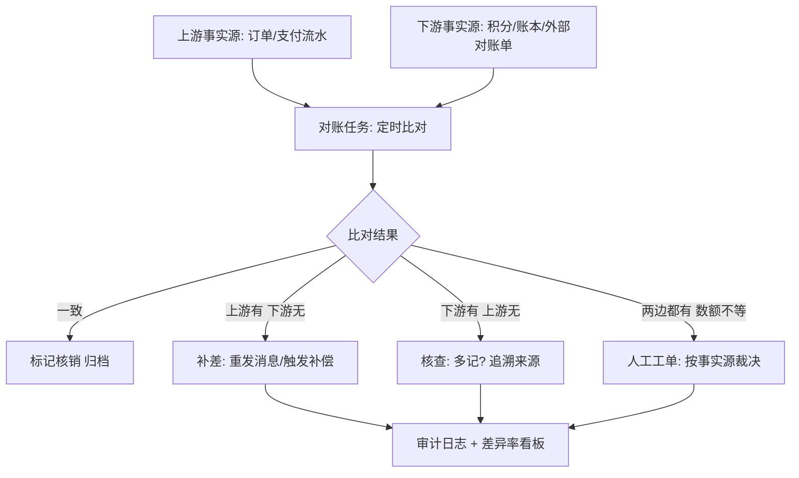
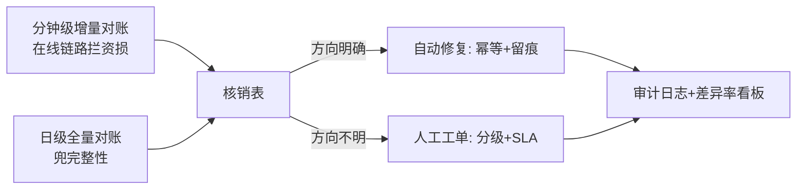

# 最终一致性与对账

> **一句话摘要**：最终一致的「最终」不是许愿是机制——**传播保时效（消息/重试/幂等）、对账保完整（定时比对 + 差异修复）**双轨并行；对账不是失败后的补救，是一等公民的常态组件：任何柔性方案（TCC/Saga/消息）的资金与核心数据，没有对账兜底就不允许上生产。

> **本文核心**：机制链 = **柔性链路（传播层保时效）→ 差异必然残留（丢失/重复/顺序/补偿失败）→ 对账层定期比对上下游事实 → 差异分级（自动修复/人工工单）→ 审计闭环**——对账的设计三问：比什么（事实源）、多久比（时效 SLA）、差异了怎么办（修复分级）。

前置阅读：[BASE 理论](../../../distributed-theory/入门层/从零开始认识分布式理论系列/3_BASE理论-入门.md)（收敛四机制）、[幂等与去重](../../../distributed-theory/入门层/从零开始认识分布式理论系列/10_幂等与去重-入门.md)。本篇是组 4 的收口，也是全系列柔性方案的公共底座。

## 1. 背景：为什么传播层必然漏

消息 + 重试 + 幂等已经很强，为什么还要对账？因为漏网场景是结构性的：

- **双写缝隙**：本地消息表/事务消息保「业务↔消息」原子，但「消费方落库失败且重试耗尽进死信」——业务 A 成了、业务 B 永远不知道（死信没人看的时期）。
- **补偿失败**：TCC 的 Cancel 重试超限、Saga 的补偿动作卡死——正向已生效、反向没完成。
- **隐性 bug**：消费逻辑的条件分支漏网（某状态组合不触发）、上下游对「成功」的定义有微差（A 认为成功、B 认为待处理）。
- **时间窗口内的人祸**：运营手工修数、历史数据迁移——不在任何机制的覆盖内。

结论：**柔性方案的一致性 = 传播机制 × 对账兜底**，两者相乘才算闭环；只有前者是「尽力收敛」，加上后者才是「承诺收敛」。资金级数据的行业惯例：传播层做到 99.99%，对账层兜住最后 0.01%——且这 0.01% 的发现时效（分钟级对账 vs T+1）直接决定资损规模。

## 2. 核心机制：对账体系的四件套

四件套设计：

- **比什么（事实源选定）**：每条链路指定**唯一权威事实源**（支付以支付流水为准、积分以发放流水为准）——「两边都有」时听谁的必须预先定义；事实源自身要不可变（流水只增不改）。
- **怎么比（维度与键）**：按业务单号逐笔核销（明细级）+ 汇总金额核对（总额级）双层——只对总额会漏「互相抵消」的错（A 多 100、B 少 100）。
- **多久比（时效分层）**：分钟级增量对账（在线链路，拦资损）+ 日级全量对账（兜完整性，捕捉增量的漏网）——两层是互补不是替代。
- **差异了怎么办（修复分级）**：方向明确的差异自动修复（重发/补偿）；方向不明（多记/来源不明）转人工工单——**自动修复必须可审计**（每笔修复留痕），否则对账系统自己变成不可信黑盒。

## 3. 落地实践：给一条链路补上对账

以「订单 → 积分」链为例：

1. **定义核销键**：订单号 + 操作类型（发放）——上下游都能按它定位单笔。
2. **建对账任务**：分钟级扫「近 1 小时已支付订单」vs「积分流水」，逐单核销。
3. **定差异处理**：订单已支付但无积分流水 → 自动重发积分消息（幂等保证不重发）；有积分无订单 → 告警工单（核查多记）。
4. **配看板**：差异笔数/差异率/修复时效三指标——差异率突变（如从 0.001% 跳到 1%）就是系统性故障信号，先于客诉。
5. **演练**：人为制造差异（堵住消息），验证对账发现 → 自动修复 → 审计留痕全链路——不演练的对账等于没有。

## 4. 生产视角：对账缺失的资损形态

- **T+1 才发现的长尾资损**：死信里的支付回调没人看，T+1 对账发现「用户付了钱订单未确认」——资金安全保住了（可退款/补单），但客诉与超时赔付已经发生。对账时效每差一个量级，处置成本涨一个量级。
- **「互相抵消」骗过总额对账**：只对总额的系统，两笔方向相反的差错互相抵消、全年未被发现——明细级核销的价值就在抓这类错。
- **修复动作制造新差异**：自动修复脚本不带幂等，修复时又重发一遍——对账系统自己成了新的差错源；修复的三层幂等纪律与业务一致。
- **对账覆盖率假象**：报表说「覆盖率 99%」，剩下 1% 是「没法比」的数据（键缺失/跨年归档）——未覆盖区恰是事故温床；覆盖率指标要拆到「按可核销口径 100%」。

## 5. 主流系统怎么做：对账的工程形态

| 层 | 惯例形态 | tips |
|---|---|---|
| 触发 | 定时任务（分钟/小时/日三级） | 调度平台托管 + 分片并行（大表按时间段切） |
| 比对 | 数据仓库比对 / 在线双查询 | 大数据量进数仓比（T+1 全量），在线增量走双查询 |
| 修复 | 自动补偿任务 + 人工工单系统 | 自动修复必须幂等 + 留痕 |
| 核销 | 核销表（比对通过的记录标记） | 核销状态防重复比对与重复修复 |
| 监控 | 差异率/修复时效/覆盖率三指标 | 差异率突变告警先于客诉 |

规律：**对账系统的工程量常被低估——它是「一个小型数据产品」**（调度、比对、修复、看板四模块）；资金级业务的标配，评估成本时按产品算，不按脚本算。

## 6. 典型场景

- **支付 → 账务**（资金级）：分钟级增量（拦资损）+ 日级与渠道方对账单全量核对（外部事实源）——双重对账是支付系统的行业标配。
- **订单 → 积分/优惠券**（营销级）：日级全量 + 差异自动补偿——营销资产也有成本，长尾漏发同样是损失。
- **跨机构清结算**（外部级）：与渠道/银行的对账文件核对——「文件 + 核销 + 差错处理流程」是金融老三样，数字化程度低但纪律最严。

## 7. 与相邻概念的区别

- **对账 vs 监控告警**：监控看「系统健康指标」（RT/错误率），对账看「数据事实差异」——系统全绿但数据有差是常态场景，两者互补。
- **对账 vs 补偿（TCC/Saga 的 C）**：补偿是「事务流程内的主动撤销」，对账是「流程外的事后比对修复」——补偿失败的对端就是对账（对账会重新发现它）。
- **明细核销 vs 总额核对**：逐笔 vs 汇总——前者抓结构性错误、后者抓系统性偏差，双层都要。
- **本篇 vs BASE 篇**：BASE 篇把对账列为收敛四机制之一（理论定位）；本篇展开它的工程全貌（设计三问/四件套/演练）——理论与实现分层。

## 8. 常见误区与不适用

- **「有消息重试就不需要对账」**：重试保「过程尽力」，对账保「结果完整」——死信、补偿失败、隐性 bug 都在重试的保险之外。
- **「对账是出问题才建的」**：对账的价值是「持续证明数据一致」，事后建的对账没有基线（历史差异无从追溯）——与柔性方案同步建设。
- **「自动修复越多越好」**：修复自动化程度 = 事实源置信度 × 方向明确度——事实源模糊的差异自动修，等于让程序猜钱。
- **「差异率为零才健康」**：永远为零可能说明比对没跑通（假阴性）；健康的状态是「微小差异 + 快速修复 + 全留痕」——差异可见比零差异更可信。
- **不适用**：纯只读展示数据（错了重算即可，无需对账体系）；单库强一致链路（数据库约束已是保证层）——对账服务于「跨系统柔性数据」。

## 9. 你们可能会问

- **对账任务的扫描窗口怎么定？** 覆盖「最慢链路延迟 × 安全系数」：消息最坏投递 5 分钟 → 增量对账扫近 1 小时（重叠扫描防边界漏）；全量按自然日 + 前日重叠。
- **上游下游都可能是错的时候，事实源怎么定？** 按「离资金/业务事实最近」定：支付以支付网关流水为准（不是订单表）、积分以发放流水为准（不是余额表）——事实源=不可变流水，余额是衍生品。
- **差异处理的人工工单怎么不积压？** 工单分级（金额分级：大额优先）+ SLA 时效看板 + 高频差异类型治理（重复出现的差异模式要修根因而不是反复人工）。
- **怎么验证对账系统自己是对的？** 注入差异演练（堵消息/造脏数）验证「发现率 100%」+ 双套对账比对（重要链路两套独立实现交叉验证）——对账系统的元校验。
- **外部机构对账文件延迟怎么办？** 核销设计容忍「先内部后外部」两段式（内部先核销、外部文件到后补核）——跨机构对账的常态化现实。

## 10. 一句话总结 + 5W 速记卡 + 自测三问

**🎯 核心带走**：

- **核心一句话**：柔性一致性 = 传播保时效 × 对账保完整——对账是一等公民组件，设计三问（比什么/多久比/差异怎么办）先于实现。
- **链条复述**：定事实源 → 明细核销 + 总额双层 → 分钟增量 + 日全量分层 → 差异分级修复（自动幂等留痕/人工工单）→ 三指标看板 + 注入演练。
- **失效点与边界**：只读数据不需要；「互相抵消」骗总额——明细核销必须；自动修复的边界由事实源置信度定。

**5W 速记卡**：

| 维度 | 内容 |
|---|---|
| What | 事实源 + 双层比对 + 分级修复 + 三指标 + 演练 |
| Why | 传播层必然漏（死信/补偿失败/隐性 bug），资金级不允许裸奔 |
| When | 一切柔性链路（消息/TCC/Saga）建设期同步设计 |
| Where | 调度 + 比对 + 修复 + 看板四模块 |
| How | 定事实源 → 分层扫描 → 差异分级 → 注入演练验证 |

💡 **实战提示**：事实源 = 不可变流水；自动修复必须幂等 + 留痕；差异率突变是最灵敏的系统故障信号；对账系统自身要注入演练做元校验。

**开放问题**：实时数仓普及后，分钟级增量对账会演进成「实时数据质量监控」吗——对账与可观测的边界会融合吗？

**决策（何时用）**：资金/营销资产/跨机构数据推荐「分钟增量 + 日全量」双轨；只读衍生数据推荐简单重算；推荐对账设计与柔性方案同步立项，不做事后补丁。

**Trade-off（代价与反方案）**：对账用「一个数据产品的建设成本」换「一致性的最终承诺」；反方案——收窄柔性面（更多操作走强一致，对账变轻）、提高传播层冗余（降差异率但成本升）、接受 T+1 发现（便宜但资损窗口大）；对账深度的账要按「漏网差异的资损期望」算，不按开发工时算。

**演进视角**：对账从财务手工勾稽（纸面对账单时代）到 T+1 批量（数据仓库时代）再到实时数据质量监控（流式演进）——工具在变，「用独立事实源交叉验证」的会计学内核四百年没变。

---

**下篇预告**：全部机制装进决策树——下一篇[分布式事务选型决策](./12_分布式事务选型决策-入门.md)把三极方案的选型一次收拢。

---

## 📌 数据与事实声明

本文对账体系设计为支付/金融领域公开工程惯例的归纳（《深入理解分布式事务》、各支付机构公开技术分享的机制级概括）；资损形态为通用化描述，不指向具体公司。以行业公开资料为准。

## 📚 参考资料

| 类型 | 标题 | 来源 |
|---|---|---|
| 图书 | 深入理解分布式事务（对账章节） | 电子工业出版社（2021） |
| 系列文章 | BASE 理论 / 幂等与去重（理论系列） | 本仓库 distributed-theory/ |
| 系列文章 | 稳定性工程（监控告警联动） | 本仓库 service-governance/stability/ |
