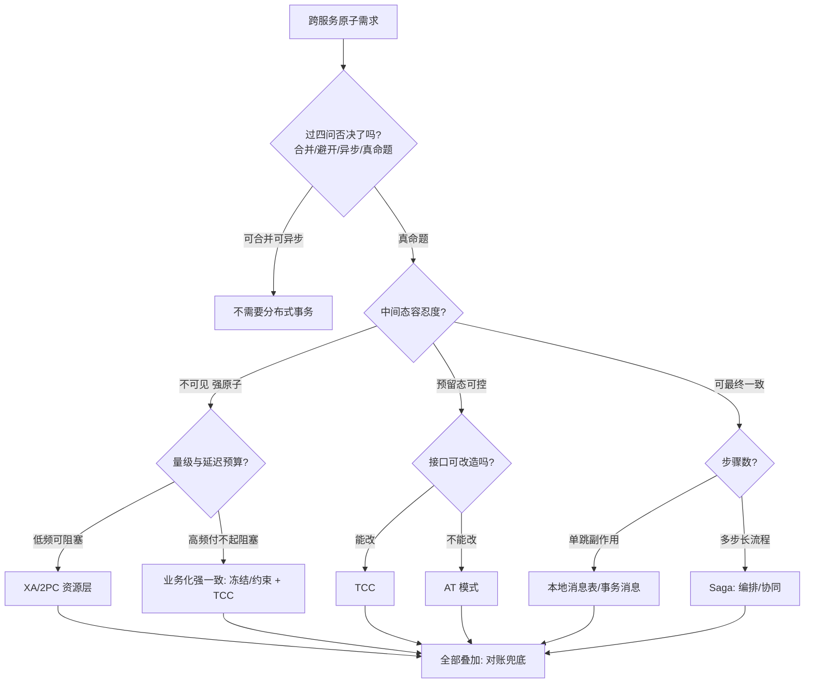
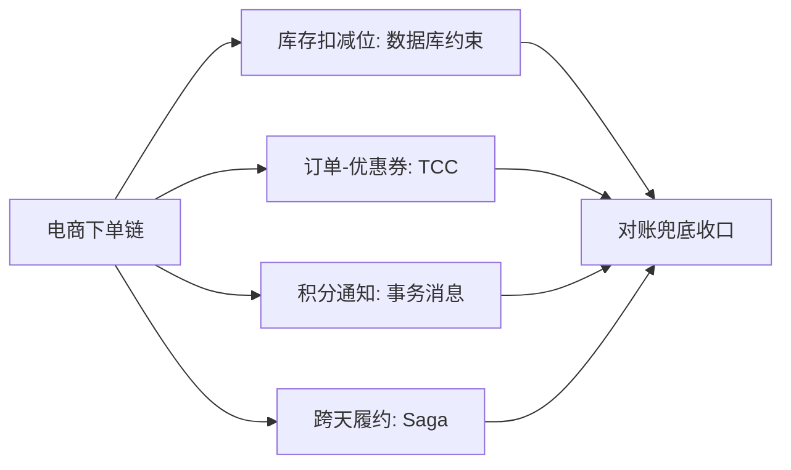

# 分布式事务选型决策

> **一句话摘要**：选型的全部决策变量只有四个——**一致性语义（要什么档）、流程形态（短预留还是长流程）、改造成本（存量还是绿地）、运维成熟度（团队能管什么）**——本篇把全系列的方案装进一棵决策树 + 一张对比总表，并给出「混用组合」的行业标准答案：一条链路多个方案各就各位才是常态。

> **本文核心**：机制链 = **四问定案（语义→形态→成本→运维）→ 单点选型 → 链路混用 → 对账兜底收口**——先验是速查表，终审是业务代价；「选型错误」的两大来源是「按框架熟悉度选」和「全站统一一个方案」。

前置阅读：[方案全景](./2_分布式事务方案全景-入门.md)（谱系坐标）+ 各方案篇（1-11）。理论档位方法见[一致性方案选型](../../../distributed-theory/入门层/从零开始认识分布式理论系列/11_一致性方案选型-入门.md)。

## 1. 背景：为什么选型总被做错

> 量级分档意识：本文方法在十万级 QPS、千万级用户、亿级流量的场景下均需重新评估——量级变化时架构与参数需同步调整。


方案各有明确适用域（前十一篇逐个讲过），选型仍然做错，复盘下来两个根因：**按熟悉度选**（团队会 Seata AT 就全站 AT）、**按「最强」选**（强一致总不会错——错，代价会错）。正确的选型是**把业务约束翻译成决策变量**，让方案自己浮出来；本篇的四问就是这个翻译器。

## 2. 核心机制：四问决策树



四问逐条：

- **一问一致性语义**：中间态「不可见（强原子）/ 可见但受控（预留）/ 可见最终一致」——对应理论系列的档位翻译，这是第一刀，切掉一半方案。
- **二问流程形态**：单跳（订单→积分）选消息极；可预留的短事务选 TCC；多步长流程选 Saga；不可改造的存量选 AT——形态错配是体验灾难的来源（长流程套 TCC = 冻结跨天）。
- **三问改造成本**：绿地项目可按理想选；存量系统「接口能不能改」常是一票否决项（改不动 → AT 或消息极绕行）。
- **四问运维成熟度**：XA 要 TM 运维、AT 要全局锁与 undo 治理、TCC 要三件套纪律、消息极要投递器/回查——**团队能管好的才是候选**；方案的隐性运维账（第十一篇的对账是公共必答题）。

## 3. 落地实践：一张对比总表 + 一个混用模板

**对比总表**（四维速查）：

| 方案 | 一致性 | 性能 | 侵入 | 运维重点 |
|---|---|---|---|---|
| XA/2PC | 强一致 | 差（阻塞） | 零 | TM 决策日志/悬挂收口 |
| TCC | 预留强语义 | 好 | 高（三接口+三件套） | 幂等/空回滚/悬挂 |
| Saga | 最终一致 | 好 | 中（补偿链） | 补偿完备/状态观测 |
| AT | 最终一致 | 中（全局锁） | 零 | 热点行/undo 治理 |
| 消息极 | 最终一致 | 最好 | 低（消息表/回查） | 投递/回查/死信 |
| 对账（公共） | 完整性承诺 | 异步 | 低 | 覆盖率/差异修复 |

**混用模板**（电商下单链的行业答案）：

```text
库存扣减位: 数据库约束(强一致, 不进框架)
订单-优惠券: TCC(预留语义天然)
积分/通知/推荐: 事务消息(副作用最终一致)
跨天履约: Saga(补偿链)
全链路: 对账兜底
```

混用的判定单位是「操作」不是「链路」——按操作的一致性档位分配方案（理论系列选型篇的方法在此落地为方案级）。

## 4. 生产视角：选型失误的形态

- **全站统一 AT**：热点交易与管理后台共用一套——热点行全局锁拖垮交易，管理后台的舒适区被交易的事故连坐。按操作分级混用后双活。
- **用消息极做资金冻结**：消息发出后不可撤回——「冻结」语义丢失，出现「消息已发、资金已动、订单未建」的三不管窗口。强语义需求回 TCC/业务化冻结。
- **长流程硬上 TCC**：跨天流程的 Try 冻结三天——资源被无意义占用、超时释放逻辑比业务还复杂。流程形态与方案错配。
- **框架升级引发的隐性换极**：框架版本升级悄悄改变某模式语义（如 AT 全局锁策略调整）——选型决策的依据要落在机制（记录「为什么选它」），不能只落在框架配置。

## 5. 主流系统怎么做：业界组合形态

| 业界形态 | 组合 | 提示 |
|---|---|---|
| 电商交易 | 约束 + TCC + 事务消息 + 对账 | 本篇混用模板的原型，公开技术分享最常见组合 |
| 支付/清结算 | 业务化预扣 + 消息 + 双向对账 | 外部边界用不了 XA——业务化强一致 + 对账 |
| 内容平台 | 消息极为主 + 少量 AT | 一致性压力小，简单方案占优 |
| 传统企业 | XA/商用 TM 存量 + 新模块柔性 | 双栈过渡是常态，边界要清晰 |

规律：**没有一家只用一个方案**——公开的架构演进史里，「多方案组合 + 按操作分级」是收敛的行业终态。

## 6. 典型场景

- **新业务线立项**（绿地级）：四问全流程走一遍，首选「约束 + 消息极」的最简组合，随业务复杂度引入 TCC/Saga——从简出发比从全出发好。
- **存量系统接新需求**（改造级）：先看能不能消息极绕行（改造成本最低），真命题再评估 AT（改不动接口）与 TCC（改得动）。
- **架构评审**（守门级）：用四问 + 总表做 check list——「这个链路为什么选这个方案」答不出四问中任何一问的，退回重选。

## 7. 与相邻概念的区别

- **本篇 vs 方案全景（篇 2）**：全景给谱系地图（认知），本篇给决策流程（操作）——地图回答「有哪些」，决策树回答「怎么选」。
- **本篇 vs 一致性方案选型（理论系列）**：理论篇定「数据档位」（一致性语言），本篇定「方案选择」（工程语言）——档位是输入，方案是输出，两篇是上下游。
- **选型 vs 对账**：对账（上篇）不是候选方案而是公共必选——任何选型组合的收口动作；把它当「方案之一」参与竞争是范畴错误。
- **选型决策 vs ADR**：选型结论应沉淀为 ADR（架构决策记录）——「四问的答案 + 选了什么 + 放弃了什么」留档，半年后争议时是唯一凭据。

## 8. 常见误区与不适用

- **「选最新的方案」**：方案成熟度 = 机制清晰度 × 生态工具 × 团队经验——新方案的红利常小于学习成本；按四问选，不按发布日期选。
- **「性能压测过了就行」**：压测证明「跑得动」，证明不了「语义对」——消息极压测再好也变不出预留语义。语义先行，性能验证在后。
- **「混用太复杂，不如统一」**：统一的复杂度只是被隐藏（错配方案的运维债）——分级的复杂度是显式且可控的；显式优于隐藏。
- **「选型做完就结束」**：业务变化会改变答案（积分从营销品变资产）——选型结论随分级表滚动复审；ADR 里写明「复审触发条件」。
- **不适用**：未过四问否决的链路（先做减法）；单库业务（本地事务）；纯展示数据（重算即可）。

## 9. 你们可能会问

- **四问的顺序能换吗？** 不能——语义是业务约束（客观），成本与运维是团队约束（现实），顺序反了会「先选了顺手的方案再找理由」；语义一刀切下去，候选直接减半。
- **团队只会一个框架怎么办？** 短期按「会什么选什么」+ 补对账兜底（务实），长期把「至少掌握柔性极两方案」设为团队能力目标——能力债要有偿还计划，不是否认存在。
- **怎么评审别人的选型？** 三问：「四问答案是什么」「放弃的方案为什么放弃」「对账覆盖了吗」——第三问最常漏，柔性方案没有对账 = 裸奔。
- **混用链路的排障怎么做？** 全局事务 ID 贯穿（TCC 的 xid / 消息的 bizKey / Saga 的流程 ID 统一编号规范）+ 每方案的机制篇是排查手册——混用的排障成本是选型时就要计入的账。
- **什么时候该推翻已有选型？** 三个信号：语义需求变了（积分变资产）、方案代价显现（热点锁雪崩）、框架路线变化（停维护）——推翻要有 ADR 留痕，避免「悄悄换」。

## 10. 一句话总结 + 5W 速记卡 + 自测三问

**🎯 核心带走**：

- **核心一句话**：选型 = 四问翻译（语义/形态/成本/运维）→ 单点选方案 → 链路混用 → 对账收口；按操作分级，反对全站统一。
- **链条复述**：四问否决 → 语义定极 → 形态定方案 → 成本与运维定可行性 → 混用模板组合 → ADR 留痕 + 对账兜底。
- **失效点与边界**：业务变化触发复审；排障成本计入选型；团队成熟度是现实约束不是借口（要有能力偿还计划）。

**5W 速记卡**：

| 维度 | 内容 |
|---|---|
| What | 四问决策树 + 四维总表 + 混用模板 |
| Why | 选型错误的两大来源：按熟悉度选、全站统一 |
| When | 新链路立项、架构评审、方案代价显现、业务语义变化 |
| Where | 设计文档 ADR + 数据一致性分级表 |
| How | 四问翻译 → 对照总表 → 混用分配 → 对账收口 → 留痕复审 |

💡 **实战提示**：语义第一刀先切（减半候选）；「放弃方案的代价」写进 ADR；评审必查对账覆盖；混用链路先定全局 ID 规范。

**开放问题**：基础设施持续内建事务能力（NewSQL/云托管），四问中的「成本与运维」两问会不会逐渐消失——选型退化为纯语义问题？

**决策（何时用）**：一切跨服务原子需求的立项与评审；推荐「四问 + 总表」固化为团队评审 checklist，推荐每个选型结论配 ADR 与复审条件。

**Trade-off（代价与反方案）**：结构化选型用「流程成本」换「决策质量与可追溯」；反方案——专家拍板（快但不可传承）、全站统一（简单但错配债）、随波逐流（省事但事故驱动演进）；结构化的度要随团队规模调——三人团队四问可以发生在一次白板讨论里。

**演进视角**：选型方法论从「背方案」到「按维度匹配」到「分级混用成为行业终态」——方案在轮替（XA→TCC→消息→NewSQL），「按业务语义匹配机制」的决策学稳定如山。

---

## 本系列收官 · 全系列地图

| 组 | 篇目 | 一句话 |
|---|---|---|
| 认知与问题域 | [1 是什么与为什么难](./1_分布式事务是什么与为什么难-入门.md) · [2 方案全景](./2_分布式事务方案全景-入门.md) | 问题定义 + 三极地图 |
| 强一致极 | [3 2PC](./3_2PC两阶段提交-入门.md) · [4 3PC](./4_3PC三阶段提交-入门.md) · [5 XA](./5_XA规范与数据库支持-入门.md) | 先问再干与它的代价 |
| 柔性极 | [6 TCC](./6_TCC补偿事务-入门.md) · [7 Saga](./7_Saga长事务-入门.md) · [8 AT](./8_AT自动补偿模式-入门.md) | 预留/补偿/自动化三种柔性 |
| 最终一致极 | [9 本地消息表](./9_本地消息表-入门.md) · [10 事务消息](./10_事务消息-入门.md) · [11 对账](./11_最终一致性与对账-入门.md) | 传播保时效对账保完整 |
| 选型与实践 | 本篇 · [13 金融场景实战](./13_金融场景实战-入门.md) | 决策树 + 实战收束 |

理论框架在[分布式理论系列](../../../distributed-theory/入门层/从零开始认识分布式理论系列/0_系列导读-全景.md)，工程基座在[分布式系统设计系列](../../../distributed-system-design/入门层/从零开始认识分布式系统设计系列/0_系列导读-全景.md)。

---



## 📌 数据与事实声明

本文四问决策树与混用模板为对全系列方案公开机制的工程化归纳；业界组合形态综合自电商/支付领域公开架构分享的机制级概括，不指向具体公司。各方案细节以对应篇章与官方文档为准。

## 📚 参考资料

| 类型 | 标题 | 来源 |
|---|---|---|
| 图书 | 数据密集型应用系统设计（DDIA）/ 深入理解分布式事务 | O'Reilly / 电子工业出版社 |
| 系列文章 | 本系列 1-11 篇 + 一致性方案选型（理论系列） | 本仓库 |
| 方法 | Architecture Decision Records | adr.github.io |
