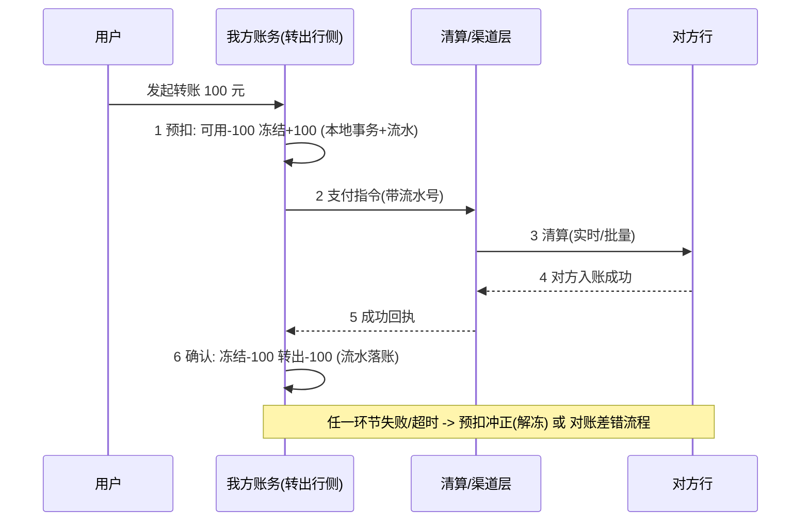
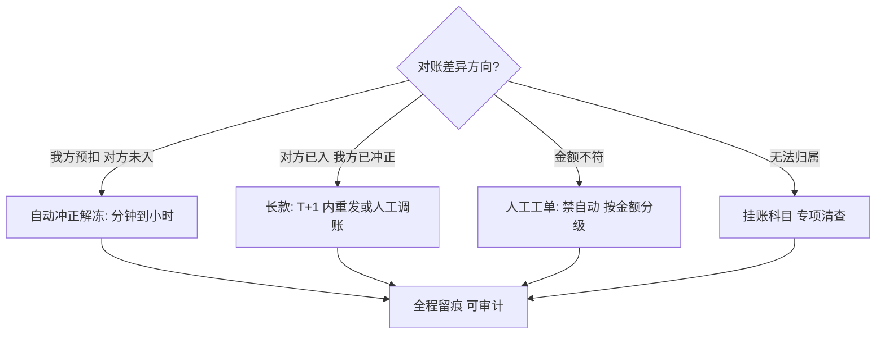

# 金融场景实战

> **一句话摘要**：金融场景把分布式事务的要求推到极限——金额不能错、状态可审计、差错可追溯；行业的标准答案不是「最强的协议」而是「业务化强一致 + 双向对账 + 人工介入点」的三板斧：跨行转账用「预扣-清算-对账」、退款用「原路冲正 + 红字冲销」、资金一致性靠「流水不可变 + 双向核对」。本篇把全系列机制放进金融约束里走一遍。

> **本文核心**：金融事务的机制链 = **流水记账（不可变事实源）→ 业务化预留（预扣/冻结替代协议锁）→ 异步清算（消息/批量）→ 双向对账（内部↔内部、内部↔外部）→ 差错分级处理（自动冲正/红字冲销/人工）**——协议（TCC/XA）只在机构内的合适位置使用，跨机构边界靠业务惯例与对账。

前置阅读：[选型决策](./12_分布式事务选型决策-入门.md)、[最终一致性与对账](./11_最终一致性与对账-入门.md)。本篇是全系列的实战收束：所有机制在金融约束下的组合形态。

## 1. 背景：金融约束与互联网约束差在哪

> 量级分档意识：本文方法在十万级 QPS、千万级用户、亿级流量的场景下均需重新评估——量级变化时架构与参数需同步调整。


互联网交易追求「可用性优先、可补偿」，金融资金场景多四条硬约束：

- **金额不可错**：差错按资损计（不是按体验计）——一致性档位自动拉满，且要求「可证明的一致」（审计），不只是「实际一致」。
- **全程可审计**：每笔资金的来龙去脉要有不可篡改的流水链——「补偿后恢复原状」不够，要「原操作 + 冲正操作」都可追溯（红字冲销文化的由来）。
- **差错有时限与分级**：长款短款按金额与时限定处置流程——自动化程度受监管与内控约束，「全自动」在资金错账上反而是风险。
- **外部边界不可控**：跨行/跨机构不可能共用电文协议之外的事务机制——XA/TCC 出不了自家边界，边界一致性靠「业务惯例（预扣/清算）+ 对账」。

这四条决定了金融的答案组合：**机构内用机制（TCC/约束），机构间用惯例（预扣-清算），全链用对账，差错用分级处置**。

## 2. 核心机制：跨行转账的完整走法（拆解行业惯例）



机制要点逐条（每条都能对回全系列）：

- **预扣（业务化 Try）**：可用减、冻结加，本地事务 + 不可变流水——这就是 TCC 的 Try，金融场景用自己的惯例实现了它（协议化与惯例化是同一语义的两种载体，TCC 篇的「预留」在此落地）。
- **异步清算**：跨行环节是异步的（渠道排队/批量清算）——最终一致极的形态；流水号（幂等键）贯穿全程，重复指令被渠道幂等拒绝。
- **确认与冲正**：成功回执 → 冻结转实扣（Confirm）；失败/超时 → 解冻（Cancel）——两阶段完整；超时的处理是「先冲正解冻 + 若对方实际已入账则由对账发现并走长款流程」——**宁可先退用户、不可占着冻结**（可用性倾向 + 对账兜底的组合）。
- **双向对账**：我方流水 ↔ 渠道对账单 ↔ 对方入账——三本账逐笔核销（对账篇的双向对账在金融的完整形态）；长款（对方多记）短款（我方多记）分级处置。
- **流水不可变**：账务只增不改——改错用「红字冲销」（一笔反向流水），原流水永远在链上。这是审计约束，也是「对账事实源」的根基（对账篇的事实源纪律在金融的刚性形态）。

## 3. 落地实践：退款与差错处置

**原路退款的补偿链**（Saga 形态）：

```text
退款发起 -> 渠道退款请求(幂等: 原支付流水号) -> 渠道异步处理 -> 退款成功回执 -> 我方账务落退款流水
失败分支: 退款失败回执 -> 状态回滚为可退 -> 重试或转人工
超时分支: 无回执 -> 查证渠道 -> 对账差异流程
```

**差错分级处置**（对账篇的「分级修复」在金融的落地）：

| 差异类型 | 处置 | 时限惯例 |
|---|---|---|
| 我方预扣、对方未入账（短款方向） | 自动冲正解冻 | 分钟~小时级 |
| 对方已入账、我方已冲正（长款） | 对账发现 → 重新发起或人工调账 | T+1 内 |
| 金额不符 | 人工工单（禁自动） | 按金额分级 |
| 无法归属 | 挂账科目 + 专项清查 | 监管时限 |

两条铁律：**方向明确的自动冲正必须幂等可审计；方向不明的差异禁入自动化**（对账篇的修复分级在资金的刚性版）。

## 4. 生产视角：金融资金事故的形态与防线

- **重复支付**：用户重试 + 渠道重发——防线三层：支付单号幂等（业务约束）、渠道流水号幂等（外部约束）、对账兜底。行业要求「三层各自独立有效」（不能假设前一层永远在线）。
- **掉单（付款成功订单未确认）**：回调丢失——「主动查证」补位（支付后未确认的定时轮询渠道查证），配合对账；掉单是支付系统必答题，纯被动等回调是不合格设计。
- **长款挂账积压**：对账发现的长款没人处理，挂账科目越滚越大——差错处置要有 SLA 看板与清零机制（对账篇的工单分级在资金的纪律版）。
- **账实不符（账务与真实资金）**：内部流水与渠道/银行实际资金核对——日终试算（昨结 + 今日发生 = 今结）是账务系统的自检日课；试算不平 = 停止对外清算优先查平。

## 5. 主流系统怎么做：金融事务的工程形态

| 环节 | 行业惯例形态 | tips |
|---|---|---|
| 账务核心 | 记账流水（借贷复式）+ 余额衍生 | 余额可重建（流水重放），流水是唯一事实源 |
| 机构内事务 | TCC/约束 + 本地事务 | 预扣即 Try；框架与惯例并存 |
| 跨机构 | 电文/渠道接口 + 幂等流水号 + 清算 | 协议止步于边界 |
| 一致性保证 | 双向对账 + 日终试算 | 资金级对账是监管与内控要求 |
| 差错 | 分级处置 + 红字冲销 | 全程可审计 |

规律：**金融把「柔性 + 对账」做到了理论极限**——它比互联网更早接受「跨机构无法强一致」的现实，并用审计与差错流程把最终一致管理到监管可接受。

## 6. 典型场景

- **支付网关**（机构内+边界）：内部订单-账务 TCC/消息组合，对外渠道幂等 + 掉单查证 + 对账。
- **钱包/账务系统**（记账级）：复式流水 + 余额试算 + 冻结域——本篇机制的日常载体。
- **清结算平台**（批量级）：批量清算文件 + 对账文件核销 + 差错清单——Saga 编排式（批量流程）+ 对账的组合。

## 7. 与相邻概念的区别

- **金融账务 vs 互联网订单库**：流水不可变 vs 记录可改——审计约束决定了「冲正文化」（错要留痕地改）与「重算文化」（余额可重建）。
- **预扣 vs TCC Try**：同语义双载体——金融惯例（冻结域）更早存在，TCC 把它协议化；机构内选框架省约定，机构间只能靠惯例。
- **对账 vs 试算**：对账比「我与外部」，试算比「我自己的账」（借贷平衡）——一个外部校验一个内部自检，日课双开。
- **本篇 vs 选型篇**：选型篇给决策树，本篇给「金融约束下的既定答案」——约束足够强时，决策树收敛为行业惯例；学习价值在于理解惯例背后的机制（全系列 1-12）。

## 8. 常见误区与不适用

- **「资金场景必须上最强协议（XA）」**：跨机构上不了、机构内高频也扛不住——金融的真实答案是业务化强一致（预扣/冻结）+ 对账；「协议最强」与「体系最稳」不是一回事。
- **「自动冲正越快越好」**：渠道超时 ≠ 对方未入账（清算在途）——盲目快速冲正制造长款；冲正时点要按渠道清算周期设计（宁可先解冻用户侧、内部挂应收）。
- **「对账文件到了再核对就行」**：被动等文件 = 资损窗口以天计——主动查证（支付后轮询渠道）+ 分钟级内部对账先顶住，外部文件做最终核销。
- **「冲正把数据改回来就行」**：红字冲销留原流水——审计要求「可追溯的错误」优于「消失的错误」；直接 UPDATE 原流水是金融系统的高压线。
- **不适用**：非资金类互联网业务（对账可降级为抽样核对；审计约束宽松）；机构内强一致可覆盖的小闭环（本地事务即可，无需整套三板斧）。

## 9. 你们可能会问

- **为什么金融不直接把所有操作做成强一致？** 跨机构做不到（无共同事务域）、机构内高频做不起（协议代价）——可接受的一致性档位由「资金差错的可追溯 + 可冲正」兜底，而不是由协议实时保证。
- **长款和短款怎么快速区分？** 长款 = 对方多记（我方账上没有对应支出/对方多了钱），短款 = 我方多记——按「两边流水逐笔核销后的悬空方向」判定；核销键（流水号）质量决定判定速度。
- **掉单的主动查证周期怎么定？** 按渠道清算周期：实时渠道分钟级查证、批量渠道小时级——查证是支付单状态的「兜底迁移器」，与回调并行。
- **日终试算不平怎么处置？** 停止对外清算（防错扩散）→ 按科目逐级定位（总账→明细→流水）→ 查平前资金操作降级——试算是账务系统的「熔断器」。
- **监管审计最常查什么？** 流水完整性（不可变 + 链路可追溯）、差错处置时效与留痕、对账覆盖率——本篇三板斧的每一板都是审计对象，这也是它们被严格执行的原因。

## 10. 一句话总结 + 5W 速记卡 + 自测三问

**🎯 核心带走**：

- **核心一句话**：金融资金一致性 = 业务化强一致（预扣/冻结）+ 异步清算（流水号幂等）+ 双向对账 + 分级差错处置——协议进机构内，惯例管边界，对账兜全局。
- **链条复述**：流水记账（不可变事实源）→ 预扣（Try 惯例版）→ 清算（异步 + 幂等）→ 确认/冲正（Confirm/Cancel）→ 三本账核销 → 红字冲销收尾。
- **失效点与边界**：冲正时点按清算周期定（盲目快 = 长款）；方向不明禁自动；直接改流水是高压线；外部边界协议止步。

**5W 速记卡**：

| 维度 | 内容 |
|---|---|
| What | 预扣-清算-对账三板斧 + 流水不可变 + 红字冲销 |
| Why | 金额不可错、全程可审计、边界不可控——四条金融硬约束 |
| When | 支付/钱包/清结算类系统的设计与复盘 |
| Where | 账务核心、支付网关、清结算平台 |
| How | 记账先行 → 预扣预留 → 异步清算 → 双向核对 → 分级处置 |

💡 **实战提示**：流水只增不改、余额可重建；掉单主动查证与回调并行；日终试算是账务熔断器；自动冲正按渠道清算周期设计时点。

**开放问题**：数字货币与可编程清算兴起后，「跨机构对账」会不会被「清算即结算」替代——三板斧里的对账板会收缩还是转岗？

**决策（何时用）**：资金类系统全场景适用（这是行业既定答案）；推荐把三板斧作为资金系统设计评审的固定三查项；机构内组件选型回选型篇决策树。

**Trade-off（代价与反方案）**：三板斧用「账务体系复杂度 + 对账建设」换「跨边界资金安全与审计合规」；反方案——追求协议强一致（在边界处不可行）、放松审计换简化（监管不允许可追溯性打折）；冲正时效的权衡（快解冻用户 vs 慢冲正防长款）本质是「用户可用性 vs 资金差错成本」的定价，按业务档位定。

**演进视角**：从手工账本的红字冲销到电算化批量清算再到实时支付与数字清算——工具形态三十年剧变，但「不可变流水 + 双向核对 + 分级差错」的会计学骨架始终如一；这也是本系列对「机制长存、载体轮替」的最后一次印证。

---

## 本系列与全仓库的闭环

理论公理（[分布式理论系列](../../../distributed-theory/入门层/从零开始认识分布式理论系列/0_系列导读-全景.md)）→ 工程手段（[分布式系统设计系列](../../../distributed-system-design/入门层/从零开始认识分布式系统设计系列/0_系列导读-全景.md)）→ 事务谱系（本系列 1-12）→ 行业收束（本篇）——机制细节的实现层分布：RocketMQ 事务消息专题（docs/middleware/rocketmq/）、稳定性兜底（service-governance/stability/）。

---



## 📌 数据与事实声明

本文三板斧（预扣-清算-对账）与差错分级为支付/银行业公开工程惯例的机制级归纳（《深入理解分布式事务》金融章节、公开支付体系技术资料）；场景为通用化描述，不指向任何真实机构；监管时限等表述为行业通用认知。以行业公开资料为准。

## 📚 参考资料

| 类型 | 标题 | 来源 |
|---|---|---|
| 图书 | 深入理解分布式事务（金融实践章节） | 电子工业出版社（2021） |
| 系列文章 | 本系列 1-12 篇 | 本仓库同系列 |
| 系列文章 | 稳定性工程 / RocketMQ 事务消息专题 | 本仓库 |
