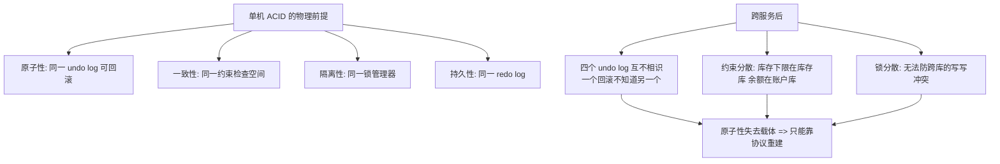

# 分布式事务是什么与为什么难

> **一句话摘要**：分布式事务 = 跨多个服务/存储的「全做或全不做」——单机事务靠「同一个数据库的 undo log + 锁」轻松保证 ACID，跨了边界后「原子性」失去物理载体，于是衍生出整个方案谱系；本篇讲清失效的机制根源，是全系列的「问题定义」。

> **本文核心**：单机 ACID 依赖三个物理前提（同一事务管理器 / 同一 undo log / 同一锁空间）→ 跨服务后三个前提全部消失 → 原子性只能靠「协议」重建（2PC/补偿/消息），一致性只能降档或付代价 → 全系列 = 重建原子性的三条路线。

前置阅读：[分布式理论系列](../../../distributed-theory/入门层/从零开始认识分布式理论系列/1_分布式系统是什么与为什么难-入门.md)（部分失败公理）。理论（CAP/共识）在该系列，本系列专讲「业务原子性」的工程方案。

## 1. 背景：从「一条 SQL 的事务」到「一次业务的事务」

> 量级分档意识：本文方法在十万级 QPS、千万级用户、亿级流量的场景下均需重新评估——量级变化时架构与参数需同步调整。


电商下单这一「业务事务」，物理上是四个存储上的操作：订单库插订单、库存库扣库存、优惠券库核销券、账户库扣款。单机时代它们可能在一个数据库里——一个 `BEGIN/COMMIT` 全包；服务化之后拆到了四个服务、四个库——**业务要求它们「全做或全不做」，物理上却没有任何一个组件能同时看到这四个操作**。

这就是分布式事务的问题定义：**业务的原子性边界 > 物理的事务能力边界**。每多拆一次服务、每多分一次库，这条裂缝就宽一寸。它不是微服务的 bug，是拆分的固有代价——代价的支付方式，就是全系列的十几种方案。

## 2. 核心机制：单机 ACID 为什么失效



三个失效点逐条看（呼应[分布式理论系列的部分失败公理](../../../distributed-theory/入门层/从零开始认识分布式理论系列/1_分布式系统是什么与为什么难-入门.md)）：

- **原子性失效（最核心）**：本地事务的回滚靠 undo log——「我知道自己做过什么，所以能撤销」。跨库后，订单库的 undo log 不包含库存操作；订单提交成功后库存扣减失败，没有任何机制能「自动」把订单撤掉。**恢复原子性 = 让四个操作互相知道彼此的状态**，这正是 2PC（共享协调者）/补偿（主动撤销）/消息（最终收口）三条路线的分水岭。
- **隔离性失效**：单库的行锁挡不住跨库的写写冲突——两个并发请求在订单库、库存库分别拿到不同的锁序，可能出现「请求 A 扣了库存没下成单、请求 B 下成单没扣库存」的交错。隔离性的部分让渡（读未提交级别的中间态暴露）是柔性方案的默认选择。
- **一致性降档**：CAP 在这里兑现——强一致要求跨库协调锁与提交（性能代价，XA 系），业务可容忍时选择最终一致（柔性/消息系）。**「分布式事务选型」本质是在为每条业务数据选一致性档位**（选型方法论见[一致性方案选型](../../../distributed-theory/入门层/从零开始认识分布式理论系列/11_一致性方案选型-入门.md)）。

## 3. 落地实践：先判「要不要分布式事务」

工程第一纪律：**最好的分布式事务是不需要分布式事务**。评审顺序四问：

1. **能合并吗？** 同库能解决的不要拆（订单+订单明细同库一个事务）——拆分前先问业务边界，不为技术洁癖制造跨库。
2. **能避开吗？** 用「业务设计」替代「事务机制」：余额扣减改成「冻结+扣减」两步（资金账户自己保证原子），或把强一致收窄到「一个字段」（扣减位）而不是整个流程。
3. **能异步吗？** 副作用（积分/通知/物流单）全部走消息最终一致——九成「看起来需要分布式事务」的场景其实是「需要可靠消息 + 幂等」。
4. **剩下的才是真命题**：跨服务的强原子（资金划转的两边）——进入本系列的方案谱系选型。

## 4. 生产视角：没有方案时的裸奔形态

- **「先扣款再下单」的双写不一致**：代码顺序调用两个服务，第二个失败后第一个「没人管」——线上表现为「钱扣了订单没生成」，客诉 + 人工修数。这是无方案团队的默认状态：**一致性靠用户投诉发现，修复靠运营人肉**。
- **补偿逻辑散落各处**：每个调用方自己 try-catch 里写「失败了把前面的撤掉」——三个月后没人说得清全部补偿路径，改一处漏三处。**补偿必须是机制（框架/协议）而不是代码习惯**——这是 TCC/Saga 框架存在的理由。
- **中间态暴露引发的业务混乱**：无隔离性设计时，「扣了款但订单未创建」的中间态被前端轮询读到，用户看到「已扣款-无订单」页面疯狂刷新重试——中间态的可见性设计（状态机 + 对外语义）是方案选型之外的第二必修。
- **对账发现的滞后**：最终靠 T+1 对账兜住差异——能兜住资金安全，但用户体验与库存超卖已经发生。对账是底线不是方案（组 4 专讲）。

## 5. 主流方案怎么做：谱系预览（后文逐个展开）

| 极 | 方案 | 一句话机制 | 代价 |
|---|---|---|---|
| 强一致 | 2PC/3PC/XA（组 2） | 协调者先问所有参与者「能提交吗」再统一下令 | 同步阻塞、协调者单点、性能差 |
| 柔性 | TCC/Saga/AT（组 3） | 业务分层 Try-Confirm 或正向+补偿 | 侵入业务、要处理空回滚/悬挂 |
| 最终一致 | 本地消息表/事务消息/对账（组 4） | 可靠消息 + 幂等消费 + 对账兜底 | 中间态可见、窗口内不一致 |

规律：**三极 = 一致性 × 性能 × 侵入性的三维权衡**——没有「最好的方案」，只有「与业务代价匹配的方案」（全景对比见下一篇）。

## 6. 典型场景

- **跨行转账**（强原子级）：两边账户「一加一减」必须原子——典型的强一致命题，但跨机构的实现靠「预扣 + 确认 + 对账」而非 XA（金融实战篇展开）。
- **下单扣库存**（混合级）：库存扣减位强一致（约束/锁），订单-积分-通知走消息最终一致——一条链路两种方案并存。
- **跨服务退款**（补偿级）：原路退款失败要「挂起 + 重试 + 人工兜底」——补偿型方案的日常形态。

## 7. 与相邻概念的区别

- **分布式事务 vs 分布式一致性**：一致性模型管「多副本读写的可见性承诺」（理论系列）；分布式事务管「多个操作的原子性」（本系列）。共识是前者的机制、也常是后者的底层组件——三个词三层，混用是方案讨论跑偏的头号原因。
- **分布式事务 vs 消息最终一致**：后者是本系列的一极（组 4），不是并列概念——它牺牲实时原子换可用，是「事务」的柔性化而非替代。
- **本地事务 vs 分布式事务**：分界线是「事务管理器的边界」——一个数据库内的多表操作仍是本地事务（哪怕表再多）；跨数据源才进入本系列。

## 8. 常见误区与不适用

- **「微服务就要上 Seata」**：框架是最后一步——先过「合并/避开/异步」三问，多数链路根本不需要分布式事务框架；无差别接入是复杂度自残。
- **「强一致方案更安全，闭眼选 XA」**：XA 的同步阻塞在高峰期是把系统钉死的锁——「安全」的代价可能是全站不可用。安全 = 与业务代价匹配，不是机制最强。
- **「消息最终一致不算事务」**：它是事务的柔性形态，工程含量（可靠投递/幂等/对账）不比强一致低——轻视它才是事故来源。
- **「补偿逻辑写在哪都行」**：散落的补偿是技术债的温床——补偿要机制化（框架/状态机/对账），纪律见组 3。
- **不适用**：单库业务（本地事务已够）；纯只读聚合（无原子性诉求）；可重算的衍生数据（丢了重建即可，不用事务）。

## 9. 你们可能会问

- **为什么不能把四个库合成一个？** 能合的早合了（第一步评审）——拆分来自业务规模与组织边界；「合回去」是分布式事务难题的标准第一答案，但往往不可行，所以才需要谱系。
- **CAP 和分布式事务什么关系？** CAP 约束「分区时的可见性选择」，分布式事务在其框架内解决「原子性重建」——选 CP 路线（强一致）还是 AP 路线（柔性/消息）就是 CAP 选边在事务上的投影。
- **TCC 和 2PC 都有「两阶段」，是一回事吗？** 机制同形（先预留后确认）但层级不同——2PC 在资源层（数据库协议），TCC 在业务层（Try/Confirm 是业务动作）；TCC 把 2PC 的思想搬到了应用层换灵活性。
- **怎么判断我的场景属于哪一极？** 两问：中间态可见几秒业务能忍吗？两边操作能抽象成「预留-确认」吗？——不能忍且能抽象 → 柔性；不能忍不能抽象 → 强一致；能忍 → 消息最终一致。
- **Seata 是什么位置？** 一个把 AT/TCC/Saga/XA 四模式框架化的实现（组 3 的 AT 篇专讲）——理解机制再上框架，否则配置出错时无从排查。

## 10. 一句话总结 + 5W 速记卡 + 自测三问

**🎯 核心带走**：

- **核心一句话**：业务原子性边界 > 物理事务能力边界，是分布式事务的全部难题；重建原子性 = 协议（强一致）/补偿（柔性）/消息（最终一致）三条路线。
- **链条复述**：单机 ACID 靠三个物理前提 → 跨服务后前提消失 → 先过「合并/避开/异步」三问 → 真命题进三极谱系选型。
- **失效点与边界**：单库业务不适用；「不需要分布式事务」永远是第一答案。

💡 **实战提示**：评审新链路先跑四问（合并/避开/异步/真命题）；补偿必须机制化；中间态的对外语义与状态机一起设计；对账是底线不是方案。

**开放问题**：如果存储层未来原生提供「跨库原子提交」且性能无损（NewSQL 的承诺），本系列的方案谱系会剩下什么？

**决策（何时用）**：能用本地事务/消息最终一致解决的，推荐不上分布式事务框架；跨服务强原子真命题出现时，推荐按组 2→3→4 的谱系顺序评估。

**Trade-off（代价与反方案）**：本篇的反方案是「不拆」——合并服务换掉整个问题域，代价是组织与扩展边界；另一反方案「全异步化」——把强原子需求业务化（冻结/预扣），代价是业务模型复杂度。谱系的选择从来不是纯技术题。

**演进视角**：从银行时代的 XA 到互联网时代的柔性事务再到云原生 NewSQL，方案重心二十年从「资源层强一致」迁移到「应用层柔性」——但「部分失败下重建原子性」的问题定义从未改变。

---

**下篇预告**：三极谱系的全景地图——下一篇[分布式事务方案全景](./2_分布式事务方案全景-入门.md)一次看全所有方案的机制、代价与适用边界。

```mermaid
flowchart TD
    B[业务事务: 下单] --> O[订单库 插订单]
    B --> K[库存库 扣库存]
    B --> C[优惠券库 核销]
    B --> A[账户库 扣款]
    O & K & C & A -.四个 undo log 互不相识.-> F[原子性失去物理载体]
    F -> R[三条重建路线: 协议/补偿/消息]
    style F fill:#ffcdd2
```

---

## 🎓 自测三问

1. 你最近一次跨服务调用失败后的「补偿」是谁做的——机制还是人肉？
2. 合并/避开/异步三问，你的链路立项时跑过吗？
3. 哪些操作被默认「需要分布式事务」，其实一条唯一约束就能解决？

**5W 速记卡**：

| 维度 | 内容 |
|---|---|
| What | 分布式事务是什么与为什么难 的定义、机制与边界 |
| Why | 单机事务的物理前提跨服务后消失 |
| When | 跨服务写链路的立项与评审 |
| Where | 服务边界与数据边界之间 |
| How | 先过三问（合并/避开/异步），真命题按谱系选型 |

---

## 📌 数据与事实声明

本文的失效分析与方案分类为分布式事务领域公开共识（DDIA 第 9 章、《深入理解分布式事务》2021、凤凰架构）；场景形态为通用电商/金融案例的教学化描述，不指向任何真实公司。方案细节以各官方文档为准。

## 📚 参考资料

| 类型 | 标题 | 来源 |
|---|---|---|
| 图书 | 数据密集型应用系统设计（DDIA）第 9 章 | O'Reilly（2017 中译） |
| 图书 | 深入理解分布式事务 | 电子工业出版社（2021） |
| 图书 | 凤凰架构——冰山之下（事务章节） | icyfenix.cn |
| 系列文章 | 分布式理论系列（部分失败/CAP） | 本仓库同目录 distributed-theory/ |
