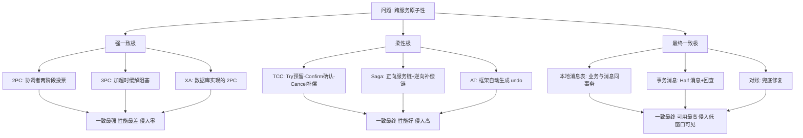
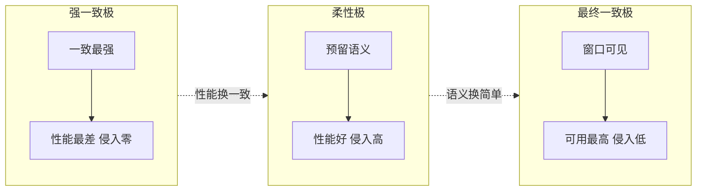

# 分布式事务方案全景

> **一句话摘要**：所有分布式事务方案都在「一致性 × 性能 × 侵入性」三维谱系上占位——强一致极（2PC/3PC/XA）：一致最强、性能最差；柔性极（TCC/Saga/AT）：业务侵入换性能；最终一致极（本地消息表/事务消息/对账）：窗口换可用；本篇是全系列的总地图。

> **本文核心**：三极谱系的机制分野 = **原子性由谁重建**——资源层协议（XA 系）重建最彻底但锁死性能；业务层补偿（TCC/Saga/AT）把原子性翻译成业务动作；消息驱动（组 4）把「同时原子」改成「最终都成」。选型 = 在三维里给业务找位。

前置阅读：[分布式事务是什么与为什么难](./1_分布式事务是什么与为什么难-入门.md)。本篇是地图，各方案细节在组 2/3/4 逐个展开。

## 1. 背景：为什么方案这么多

因为「重建原子性」可以发生在不同层级：**资源层**（让数据库自己协调——XA）、**协调层**（独立事务管理器指挥——2PC/3PC）、**业务层**（把提交/回滚翻译成业务动作——TCC/Saga/AT）、**消息层**（放弃同时、保证最终——本地消息表/事务消息）。层级越往下越透明（业务无感）但性能越差；越往上性能越好但侵入越大。方案多不是历史混乱，是这条「层级-代价」曲线上的不同取点。

## 2. 核心机制：三极谱系总图

三维读图法（每个方案问三句）：

- **一致性档**：中间态对外可见吗、可见多久？（强一致极：不可见；柔性极：短暂可见但语义受控；最终一致极：窗口可见，秒到分钟级）
- **性能档**：同步锁/协调占请求路径多长？（强一致极全程同步阻塞；柔性极一次额外预留往返；最终一致极几乎为零——异步）
- **侵入档**：业务要写多少「事务本身」之外的代码？（强一致极接近零；TCC 三个接口 + 幂等/空回滚/悬挂全套；消息极一个消息表 + 幂等消费）

## 3. 落地实践：选型的第一张速查表

| 业务形态 | 首选 | 理由 |
|---|---|---|
| 同库多表 | 本地事务 | 不进谱系 |
| 跨服务、短事务、可抽象「预留-确认」 | TCC | 性能与一致性平衡，金融高频场景主流 |
| 跨服务、长流程（多步骤、跨天） | Saga | 补偿链适配长周期，编排/协同按团队定 |
| 老系统无法改造接口 | AT | 低侵入换框架接管（理解全局锁代价） |
| 能容忍秒级窗口的副作用 | 消息最终一致 | 成本最低、可用性最高 |
| 强原子且低频（资金划转） | 强一致极/业务化冻结 | 量小付得起协调代价 |

速查表是「先验默认」，落地仍要跑上一篇的四问（合并/避开/异步/真命题）——**速查表回答「真命题选哪极」，四问回答「是不是真命题」**。

## 4. 生产视角：谱系选错的形态

- **该消息的上了 TCC**：把积分、通知这类副作用塞进 TCC——Try/Confirm/Cancel 三接口的维护成本全砸在「失败了也无妨」的操作上，团队被事务语义绑架。副作用回归消息极后复杂度骤降。
- **该 TCC 的上了消息**：资金划转用「消息 + 最终一致」——窗口内用户余额显示错乱、并发扣减穿透。资金强原子的代价该付就付（强一致极或业务化冻结）。
- **XA 在高并发的窒息**：互联网业务高峰期数据库连接被 XA 的事务树占满——传统企业方案照搬到互联网场景的经典水土不服（组 2 细讲阻塞机制）。
- **AT 的全局锁暗雷**：看中 AT 零侵入直接上生产，脏写冲突时全局锁串行化把吞吐拖垮——AT 的「自动」不等于「免费」（AT 篇专讲）。

## 5. 主流系统怎么做：框架与实现的站位

| 方案 | 主流实现 | tips |
|---|---|---|
| XA | 数据库原生（MySQL XA/Oracle） | 协议在资源层，应用只管 begin/join；MySQL XA 在 5.7 后修复了大量缺陷但仍慎用于高并发 |
| TCC | Seata TCC 模式 / 自研 | 幂等/空回滚/悬挂三件套是自研的真正工作量（TCC 篇展开） |
| Saga | Seata Saga（状态机）/ Temporal 类工作流 | 编排式（中心状态机）与协同式（事件链）两条实现路线 |
| AT | Seata AT | 代理数据源 + undo log 自动生成 + 全局锁 |
| 消息最终一致 | RocketMQ 事务消息 / 本地消息表+轮询 | 实现细节归本仓库 RocketMQ 系列（事务消息专题层已完成） |

规律：**框架把「协议」产品化了，但选型判断无法外包**——Seata 四个模式对应谱系四点，选错模式的代价框架替你扛不了。

## 6. 典型场景

- **电商下单链**（混合教科书）：库存扣减位强一致（约束）→ 订单-优惠券 TCC（预留语义天然）→ 积分/通知消息最终一致——一条链三个极，是谱系混用的标准示范。
- **跨行清结算**（强一致+对账）：机构间「预扣-清算-对账」——不用 XA 用业务化三段，最终一致极的对账兜底（金融实战篇展开）。
- **长流程履约**（Saga 级）：出库→发货→签收跨天流程，Saga 补偿链（签收失败回滚发货状态）配人工介入点。

## 7. 与相邻概念的区别

- **全景 vs 各方案篇**：本篇给「谱系坐标」，组 2/3/4 给「每极的机制细节」——先有地图再进景点，否则每个方案都像孤岛。
- **TCC vs 2PC**：同形不同层——资源层协议 vs 业务层动作（区别的完整对比在 TCC 篇）。
- **事务消息 vs 本地消息表**：同一极的两条实现路线——「消息中间件接管半消息」vs「业务库自己存消息」——取舍在对外部组件的依赖度（组 4 对照）。

## 8. 常见误区与不适用

- **「选一个框架全站统一」**：谱系是按数据/操作分的（一致性分级表），「全站 Seata AT」等于把所有业务绑到同一极——混用是常态也是正确姿势。
- **「柔性 = 不保证一致」**：柔性保证「最终一致 + 中间态受控」，工程含量（幂等/空回滚/补偿可靠性）不低于强一致——轻视柔性纪律才是事故源。
- **「窗口内不一致 = 脏数据」**：窗口内的中间态是「设计过的状态」——状态机 + 对外语义（处理中）让它可解释；没设计语义的窗口才是脏。
- **「先上框架再学机制」**：框架故障的排查需要机制知识（全局锁、undo log、半消息回查）——顺序反过来，框架就是黑盒陷阱。
- **不适用**：未过「四问」的链路（多数「需要分布式事务」的直觉是错的）；单库业务（本地事务）；可重建衍生数据（重算比事务便宜）。

## 9. 你们可能会问

- **三个极能混用在一条链路里吗？** 能且推荐——按操作的一致性代价分级（理论系列选型篇的方法），扣减强、流程柔、副作用消息，一条链三个极各就各位。
- **为什么互联网公司很少用 XA？** 同步阻塞 + 协调者单点 + 数据库连接占用，在高峰流量下是不可接受的——一致性需求用「业务化强一致」（冻结/约束）+ 柔性方案组合满足。
- **AT、TCC、Saga 怎么快速三选一？** 能改造接口要性能 → TCC；流程长有状态机 → Saga；老系统要低侵入 → AT（接受全局锁代价）——三问三答。
- **最终一致极的窗口能压到多短？** 消息投递毫秒级 + 消费能力决定——常态百毫秒到秒级；压窗口的关键在消费端吞吐，不在协议。
- **本系列与 RocketMQ 专题的关系？** 组 4 的「事务消息」讲机制（半消息/回查为什么这样设计），RocketMQ 专题层讲实现（配置/运维/源码）——机制归这里，实现归那里（单源原则）。

## 10. 一句话总结 + 5W 速记卡 + 自测三问

**🎯 核心带走**：

- **核心一句话**：所有方案在「一致性 × 性能 × 侵入性」三维谱系上取点——原子性由谁重建（资源层/业务层/消息层）决定坐标。
- **链条复述**：问题（原子性重建）→ 三极（强一致/柔性/最终一致）→ 三维评估每方案 → 按数据分级混用。
- **失效点与边界**：未过四问的链路不进谱系；框架不能外包选型判断；窗口语义必须状态机化。

💡 **实战提示**：用三维速查表做先验默认，用四问做否决；一条链混用多极是常态；框架选型后回头读对应机制篇。

**开放问题**：如果 NewSQL 让「跨服务强一致」的代价降到可忽略，柔性极会被淘汰还是因「业务语义显式化」的价值而长存？

**决策（何时用）**：推荐按速查表对号入座 + 每条链路重跑四问；推荐把「为什么选这一极」写进设计文档——三个月后排查时它是唯一线索。

**Trade-off（代价与反方案）**：谱系本身就是一张 Trade-off 总表——强一致极用性能换确定性，柔性极用侵入换性能，最终一致极用窗口换可用；反方案是「不拆服务」（消除问题域）或「业务化冻结」（消除跨服务原子需求），两者常比上方案更便宜。

**演进视角**：二十年方案重心从资源层（XA）上移到业务层（TCC/Saga）与消息层（事务消息），再被 NewSQL 从底部掏空——层级迁移在继续，三维权衡不变。

---

## 本系列与兄弟系列的地图

| 知识域 | 位置 | 关系 |
|---|---|---|
| 理论边界（CAP/BASE/一致性模型） | [分布式理论系列](../../../distributed-theory/入门层/从零开始认识分布式理论系列/0_系列导读-全景.md) | 本系列方案的理论框架 |
| 工程手段（缓存/异步/幂等） | [分布式系统设计系列](../../../distributed-system-design/入门层/从零开始认识分布式系统设计系列/0_系列导读-全景.md) | 最终一致极的工程基座 |
| 事务消息实现 | 本仓库 docs/middleware/rocketmq/ | 组 4 机制的实现层 |
| 运行期兜底 | [稳定性工程](../../../../service-governance/stability/index.md) | 对账告警与应急 |

---

**下篇预告**：进入强一致极——下一篇[2PC 两阶段提交](./3_2PC两阶段提交-入门.md)讲协调者投票协议的机制与阻塞代价。

---

## 🎓 自测三问

1. 你团队现在同时用了三极中的哪几极？选型依据还在文档里吗？
2. 副作用类操作（通知/积分）还在占用预留语义吗？
3. 「全站统一方案」的历史债，现在在哪条链路上疼？

**5W 速记卡**：

| 维度 | 内容 |
|---|---|
| What | 分布式事务方案全景 的定义、机制与边界 |
| Why | 单机事务的物理前提跨服务后消失 |
| When | 跨服务写链路的立项与评审 |
| Where | 服务边界与数据边界之间 |
| How | 先过三问（合并/避开/异步），真命题按谱系选型 |

---

## 📌 数据与事实声明

本文三极分类与三维评估框架综合自 DDIA、《深入理解分布式事务》（2021）与凤凰架构的公开论述；Seata/RocketMQ 等实现为官方文档的机制级概括；场景为通用化教学案例。细节以官方文档为准。

## 📚 参考资料

| 类型 | 标题 | 来源 |
|---|---|---|
| 图书 | 数据密集型应用系统设计（DDIA）第 9 章 | O'Reilly（2017 中译） |
| 图书 | 深入理解分布式事务 | 电子工业出版社（2021） |
| 文档 | Seata 官方文档（四模式） | seata.apache.org |
| 系列文章 | RocketMQ 事务消息专题 | 本仓库 docs/middleware/rocketmq/ |
