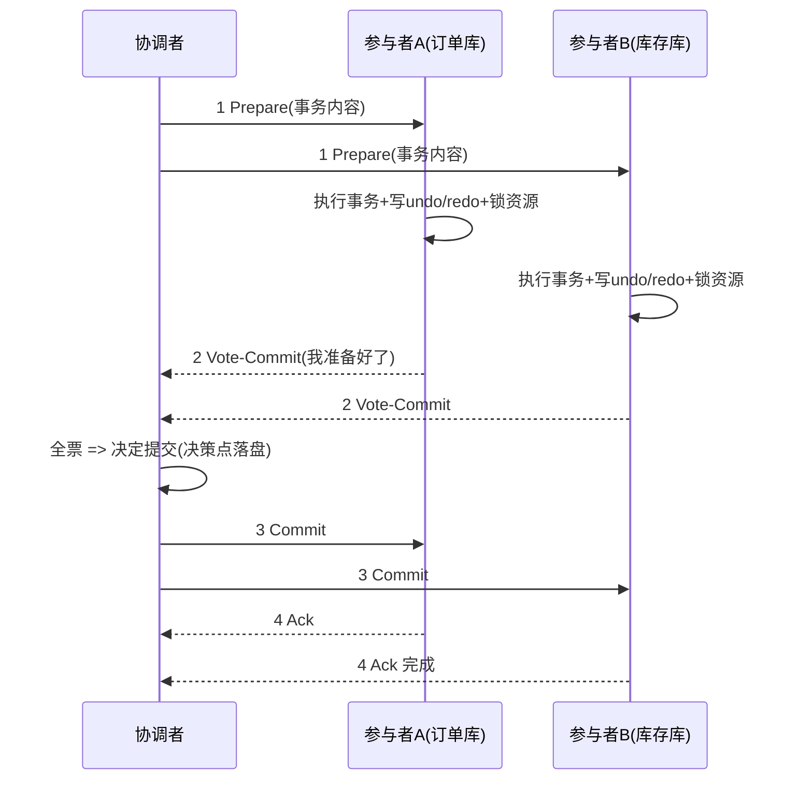
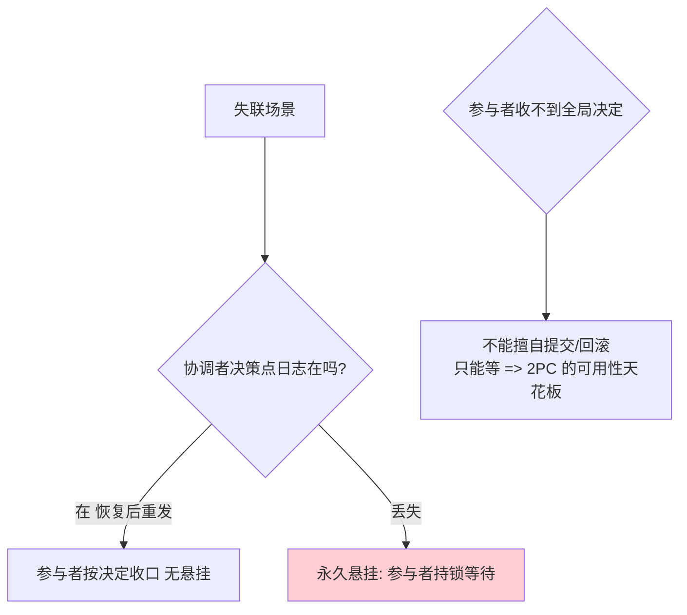

# 2PC 两阶段提交

> **一句话摘要**：2PC 用「先投票、后执行」的两阶段协议重建原子性——协调者先问全部参与者「能不能提交」（投票/准备阶段，资源已锁定），全票通过才统一令提交（执行阶段）；它是强一致极的祖师协议，代价三件套：同步阻塞、协调者单点、数据不一致窗口——理解了这三件，就知道互联网为什么绕着它走。

> **本文核心**：2PC 的机制链 = **Prepare（锁定资源+写 undo/redo）→ 全票 → Commit/Rollback 统一下令**；原子性由「锁定后不可反悔 + 全票才放行」保证；三个失效点（阻塞/单点/消息丢失窗口）全部长在「协调者与参与者之间失联」这一个根上。

前置阅读：[分布式事务是什么与为什么难](./1_分布式事务是什么与为什么难-入门.md)、[方案全景](./2_分布式事务方案全景-入门.md)。共识协议族的对照见[分布式理论系列 Paxos 篇](../../../distributed-theory/入门层/从零开始认识分布式理论系列/6_共识问题与Paxos-入门.md)。

## 1. 背景：为什么「先问再干」能重建原子性

> 量级分档意识：本文方法在十万级 QPS、千万级用户、亿级流量的场景下均需重新评估——量级变化时架构与参数需同步调整。

上一篇定位了问题：跨库操作的 undo log 互不相识，一个回滚不知道另一个。2PC 的解法朴素而深刻：**在真正提交前，先让所有参与者把「要做的操作」准备好并锁住资源**——这一步之后每个参与者都处于「只等一声令下、执行或撤销皆可」的状态（prepared）。此时无论谁反悔，全局回滚都还来得及；一旦全票通过，提交就「不可逆地安全」了（每个参与者都已持久化 redo，执行只会成功）。

「先问再干」把原子性从「同一 undo log」的物理保证，变成了「两阶段 + 锁定」的协议保证——代价也全在这份「锁定」上。

## 2. 核心机制：两阶段流程与失效点

**阶段一（投票/准备）**：协调者向所有参与者发 Prepare；参与者执行事务但不提交——写 undo log（保证可回滚）+ redo log（保证可提交）+ 锁住涉及资源，然后投票 Yes/No。任一 No 或超时无响应 → 协调者决定回滚。

**阶段二（执行）**：协调者把决定（先落盘自身日志——决策点）广播给全员；参与者执行提交或回滚并 Ack。**决策点落盘是 2PC 安全性的关键细节**：协调者在发出 Commit 前必须先把自己的「决定提交」写入持久日志——否则协调者此刻崩溃，重启后没人知道该提交还是回滚。

三个失效点（全部根植于「失联」）：

- **同步阻塞**：从 Prepare 到 Commit/Rollback 之间，所有参与者的锁全部持有——任何网络抖动都延长锁定窗口，高峰期连接池被事务树占满、吞吐崩塌。这是互联网场景绕开 2PC 的第一原因。
- **协调者单点**：协调者在「收到全票之后、广播之前」崩溃——参与者全体卡在 prepared 状态持锁等待，直到协调者恢复。协调者是整个协议的可用性瓶颈。
- **消息丢失的不一致窗口**：参与者收到 Commit 但 Ack 丢了，协调者重发即可（参与者幂等重试提交）；但若参与者在 prepared 后与协调者**双向失联**且从未收到决定——它只能锁着资源干等（不能擅自提交也不能回滚，因为它不知道全局决定），直到协调者恢复。这段时间该数据不可用。

## 3. 落地实践：2PC 的正确使用位置

1. **低频强原子**：协调代价付得起的场景（内部低频管理操作、跨库批处理）——量小则阻塞无害。
2. **交给数据库 XA 而非自研**：应用层自己实现 2PC 要处理决策点日志、超时仲裁、参与者恢复——直接用数据库 XA 接口（下一篇），让资源层承担协议。
3. **参与者超时策略要显式**：prepared 卡死是运维事故常客——参与者侧配置「prepared 超时后上报/告警/人工仲裁」的兜底路径（标准 2PC 不允许参与者单方面决定，工程实现必须补这条逃生通道）。
4. **监控事务树**：跨库事务的「存在时长」是第一健康指标——prepared 停留时间告警先于业务故障出现。

## 4. 生产视角：2PC 故障的形态

- **高峰窒息**：大促期间 XA 事务把连接池占满（每个事务锁两条连接直到二阶段结束）——RT 阶跃上涨，全库连接耗尽。这是「强一致极的代价具象化」，解法不在调参在换极（柔性/消息）。
- **协调者崩溃的冻结窗口**：协调者与参与者同机部署，应用发版重启 = 协调者「崩溃」——所有 in-flight 跨库事务卡在 prepared，等待重启完成后仲裁恢复。发版纪律：XA 场景滚动重启前先确认无 in-flight 事务。
- **日志丢失的不可恢复**：协调者决策点日志未落盘即崩溃 → 重启后不知道决定 → 参与者永久悬挂。这是自研 2PC 的高频翻车点（决策点持久化省不得）。
- **与共识的本质差距**：分区时 2PC 的少数派参与者让全局无法提交（阻塞）；Paxos/Raft 用多数派让多数派侧继续工作——「投票全票制」vs「多数派制」是 2PC 与共识的分水岭（为什么共识能当基础设施、2PC 只能当事务协议，对照[Paxos 篇](../../../distributed-theory/入门层/从零开始认识分布式理论系列/6_共识问题与Paxos-入门.md)）。

## 5. 主流系统怎么做：2PC 的实现载体

| 载体 | 2PC 的角色 | tips |
|---|---|---|
| 数据库 XA（MySQL/Oracle） | 协议内建（组 2 下一篇） | `XA START/END/PREPARE/COMMIT`；MySQL 的 XA 在连接管理上仍有坑 |
| XA 事务管理器 | 协调者产品化（Atomikos/Seata XA 模式） | TC（事务协调器）的日志与恢复是运维重点 |
| NewSQL（Spanner/Percolator） | 2PC 的改良变体 | Percolator 用「一个参与者当主锁」去中心化协调 + 共识存状态——2PC 思想与共识的结合 |
| Kafka 事务（对照） | 幂等Producer+事务坐标 | 名为「事务」实为「跨分区原子写」，与数据库 2PC 语义不同——名词陷阱 |

规律：**2PC 从未被互联网直接采用，但它的思想无处不在**——TCC 的两阶段、Percolator 的改良、NewSQL 的提交协议，都是「先准备后提交」的变体。

## 6. 典型场景

- **内部批处理跨库迁移**（低频级）：夜间跑批跨两个库的数据搬迁，量小频率低——XA 可用，阻塞无害。
- **NewSQL 内部提交协议**（改良级）：用户感知不到 2PC，它被 Percolator 类协议封装在存储层内部，配合共识消解单点。
- **反例教材（高峰交易）**：下单链路上 XA——展示了「强一致极」在互联网场景的真实代价，是方案全景图的活教材。

## 7. 与相邻概念的区别

- **2PC vs 3PC**：3PC 加「CanCommit 预询 + 超时自动放行」缓解阻塞与单点，但引入新的不一致窗口（下一篇对比）。
- **2PC vs 共识（Paxos/Raft）**：全票制 vs 多数派制——2PC 要求全员存活才前进（阻塞），共识只要多数派（可用）；2PC 保证原子性，共识保证唯一性——层次不同，NewSQL 把两者叠用。
- **2PC vs TCC**：同形（先准备后确认）不同层——资源层协议 vs 业务层动作；TCC 把「锁定资源」翻译成 Try 业务动作，绕开了数据库锁（TCC 篇对比）。
- **2PC vs 事务消息**：同步两阶段 vs 异步半消息——一个保实时原子，一个保最终一致（组 4）。

## 8. 常见误区与不适用

- **「2PC 保证强一致所以最安全」**：它保证「提交原子」，不保证可用性——阻塞与冻结窗口让「安全」变成「一起不可用」。安全要连可用性一起算。
- **「参与者收不到 Commit 可以自行超时回滚」**：标准 2PC 禁止——擅自回滚可能与协调者的「提交」决定冲突（它可能已让其他参与者提交）。超时仲裁是工程补丁（3PC 的动机），不是协议原生行为。
- **「协调者做个主从高可用就行」**：主备切换时的「决定日志同步」是关键——新协调者必须恢复出「崩溃前的决定」，否则切换本身制造悬挂。协调者的高可用 = 决策日志的高可用。
- **「我们用了分布式事务框架 = 用的 2PC」**：Seata 默认 AT 不是 2PC（undo log 反向补偿）；XA 模式才是。框架模式名与协议名要对齐再讨论。
- **不适用**：高并发在线交易（阻塞不可接受）；跨机构长周期流程（锁不了那么久——Saga/最终一致）；参与者不可靠的自治系统（全票制凑不齐）。

## 9. 你们可能会问

- **为什么参与者不能「prepared 超时自己回滚」？** 它不知道全局决定——若协调者已决定提交并让 A 提交了，B 擅自回滚就破坏原子性。这是「原子性」与「可用性」的直接冲突（CAP 的微观显形）。
- **决策点落盘到底防什么？** 防「协调者在决定前后崩溃」的歧义——没落盘就广播，崩溃后无法判断「发过没有、决定是什么」，参与者悬挂且无法仲裁。
- **2PC 和 Raft 的 log 提交像在哪？** 都有「多数/全员确认后生效」的直觉；差别在 2PC 全员投票且锁资源、Raft 多数派且不锁（冲突由 log 序裁决）——「像」是表象，「全员 vs 多数」是本质。
- **XA 的事务树是什么？** 协调者维护的「本次全局事务的所有分支」结构——事务越大树越大，遍历与日志成本随之上涨，这是大事务在 XA 下格外慢的原因之一。
- **什么信号说明我该离开 2PC 极？** 三个：事务时长 P99 上涨、连接池水位异常、prepared 悬挂告警增多——代价显现时换极比调参有效。

## 10. 一句话总结 + 5W 速记卡 + 自测三问

**🎯 核心带走**：

- **核心一句话**：2PC = 先锁定投票、后统一定夺的两阶段协议——原子性靠「锁定后不可反悔 + 全票才放行」。
- **链条复述**：Prepare（执行+落盘+锁+投票）→ 决策点落盘 → 全票 Commit / 任一否 Rollback → 广播执行 → Ack 收口。
- **失效点与边界**：阻塞（锁跨两阶段）、协调者单点（决策日志是命门）、失联悬挂窗口；高并发在线业务不适用。

💡 **实战提示**：决策点日志省不得；参与者超时仲裁通道必须工程补齐；事务时长与 prepared 停留是第一监控；高峰窒息的出路是换极不是调参。

**开放问题**：如果「锁定」的成本降到近零（乐观并发控制成熟），2PC 的阻塞批评还剩几成？它的复兴条件是什么？

**决策（何时用）**：低频强原子、资源层可控的场景推荐数据库 XA；在线高并发推荐移步柔性极/消息极；推荐把「事务时长预算」作为进入 2PC 极的门票标准。

**Trade-off（代价与反方案）**：2PC 用「锁 + 同步等待」买原子性——反方案是 TCC（业务预留换掉资源锁，代价是侵入）与消息最终一致（窗口换掉同步，代价是语义弱化）；协调者单点的反方案是 Percolator 式去中心化改良（代价是复杂度）。

**演进视角**：从 1978 年 Gray 的提交协议到 Percolator（2010）再到 NewSQL 内核，2PC 五十年间从「主角」退居「内核零件」——协议思想长存，部署形态不断下沉。

---

**下篇预告**：给 2PC 打补丁的 3PC——下一篇[3PC 三阶段提交](./4_3PC三阶段提交-入门.md)讲超时放行如何缓解阻塞、又如何引入新的一致性窗口。

---

## 🎓 自测三问

1. 你系统里 XA 事务的 prepared 最长停留过多久？告警在哪？
2. 协调者的决策日志存在哪？恢复演练做过吗？
3. 高峰期「事务时长 × 并发」的连接占用账算过吗？

**5W 速记卡**：

| 维度 | 内容 |
|---|---|
| What | 2PC 两阶段提交 的定义、机制与边界 |
| Why | 单机事务的物理前提跨服务后消失 |
| When | 跨服务写链路的立项与评审 |
| Where | 服务边界与数据边界之间 |
| How | 先过三问（合并/避开/异步），真命题按谱系选型 |

---

## 📌 数据与事实声明

2PC 协议出处为 C. Mohan 等对提交协议的系统化整理（Gray 1978 原始构想）与 DDIA 第 9 章的公开归纳；MySQL XA 与 Seata XA 模式为官方文档内容；Percolator 出处为 Google 论文（2010）。场景形态为教学化描述。

## 📚 参考资料

| 类型 | 标题 | 来源 |
|---|---|---|
| 图书 | 数据密集型应用系统设计（DDIA）第 9 章 | O'Reilly（2017 中译） |
| 论文 | Large-scale Incremental Processing Using Distributed Transactions and Notifications（Percolator） | Google（2010） |
| 文档 | MySQL XA 事务 / Seata XA 模式 | dev.mysql.com · seata.apache.org |
| 系列文章 | 3PC / XA（本系列后续） | 本仓库同系列 |
