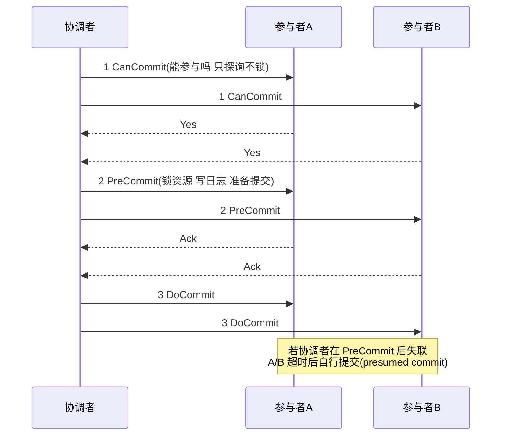
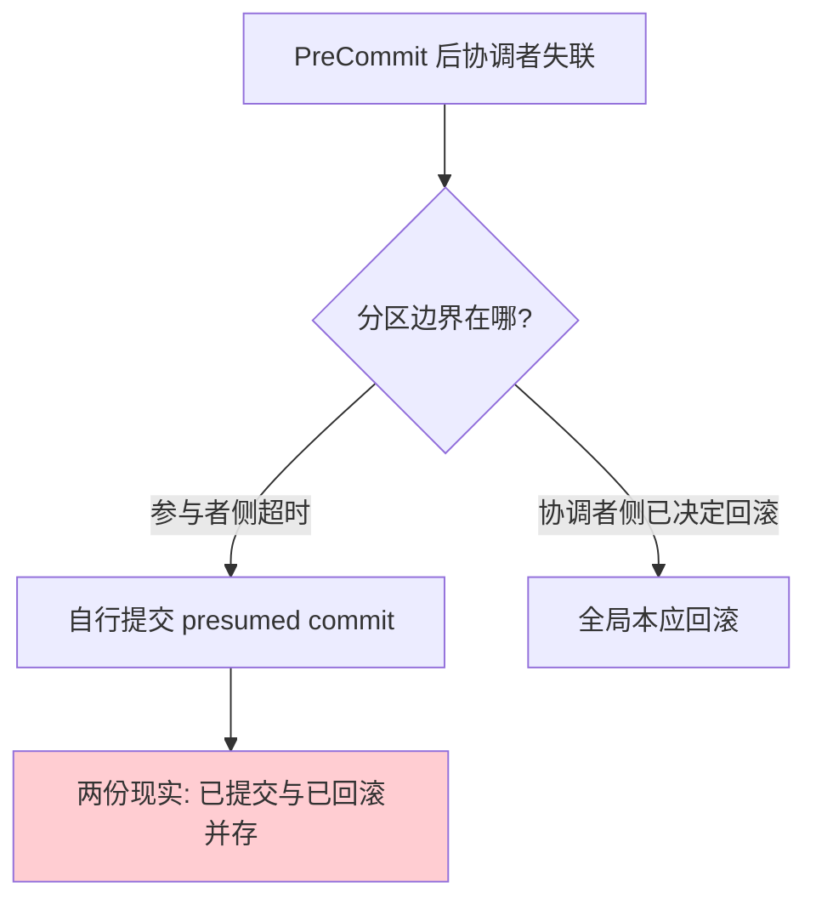

# 3PC 三阶段提交

> **一句话摘要**：3PC 在 2PC 之间插入 CanCommit 预询阶段并引入超时放行——参与者超时未收到决定时可以**自行提交**（ presumed commit），缓解了阻塞与协调者单点；代价是把「悬挂」换成了「不一致窗口」：分区下自行提交可能与全局回滚冲突——3PC 是教科书协议，工程界几乎无人直接使用，它的价值是讲清「阻塞与不一致不可兼得」的权衡结构。

> **本文核心**：3PC = **CanCommit（探询）→ PreCommit（锁定+预提交）→ DoCommit（执行）**——用「多一轮确认 + 超时默认值」换 2PC 的阻塞缓解；机制链：预询挡掉必败事务 → 超时默认提交让参与者自治 → 分区时默认值可能错 → 一致性窗口。工程结论：只有理论地位，无直接落地。

前置阅读：[2PC 两阶段提交](./3_2PC两阶段提交-入门.md)。理论对照（FLP/超时假设）见[分布式理论系列](../../../distributed-theory/入门层/从零开始认识分布式理论系列/6_共识问题与Paxos-入门.md)。

## 1. 背景：2PC 的两个痛点与 3PC 的两剂药

> 量级分档意识：本文方法在十万级 QPS、千万级用户、亿级流量的场景下均需重新评估——量级变化时架构与参数需同步调整。

2PC 的病灶（上一篇）：① 参与者 prepared 后「不能擅自决定」——协调者失联就全体冻结（阻塞+单点）；② 根源是参与者**没有足够信息自行决策**（不知道其他人的投票结果）。3PC 的两剂药：

- **CanCommit 预询**：正式锁定前先轻量探询「你状态好吗、能参与吗」——把「肯定不行」的参与者提前淘汰，减少「锁了资源才发现失败」的浪费，也缩短了重锁时间。
- **超时默认值**：给参与者装上「自治规则」——PreCommit 阶段超时未收到 DoCommit → **自行提交**（因为走到 PreCommit 意味着全局已投过票、大概率会提交）；CanCommit/准备阶段超时 → 自行回滚。参与者不再无限等待协调者。

## 2. 核心机制：三阶段流程与权衡结构

权衡结构的本质：**2PC 的「参与者不自决」保了一致性但牺牲可用性；3PC 的「超时自决」保了可用性但引入不一致窗口**。窗口在哪里：协调者在 PreCommit 后、网络分区把协调者与部分参与者隔离——

- 分区一侧的参与者超时 → 自行提交（presumed commit）；
- 另一侧若包含投了 No 的场景或协调者决定回滚 → 全局本应回滚；
- 两边对不上 = **一个事务同时存在「已提交」与「已回滚」两份现实**——比 2PC 的悬挂（至少状态一致）更糟。

为什么敢「presumed commit」：能走到 PreCommit 说明 CanCommit 全票 Yes——超时时「全局大概率会提交」是合理赌注。但「大概率」在分区面前不是保证——这正是 FLP 之后所有超时协议的共同底色（用超时假设换终止性，见[Paxos 篇](../../../distributed-theory/入门层/从零开始认识分布式理论系列/6_共识问题与Paxos-入门.md)）。

## 3. 落地实践：3PC 的正确「用法」

1. **作为思维模型而非实现**：评审 2PC 方案时，3PC 的两个问题（预询降失败率、超时默认值）是现成的工程改良清单——很多 XA 实现的「超时仲裁」就是 3PC 思想的局部采纳。
2. **改良思想单点采纳**：工程上常见的是「2PC + 参与者超时仲裁通道」（上一篇的逃生通道）——取 3PC 的自治精神，但把默认值从「提交」改为「上报人工/按业务幂等收口」，避开不一致窗口。
3. **教学价值**：理解「阻塞-不一致」的不可兼得后，再看 Paxos/Raft 的多数派方案，会明白共识为什么是「另一条路」而不是「3PC 的完善版」——多数派从根上绕开了全员协调。

## 4. 生产视角：为什么工程界绕开它

- **网络分区不是小概率**：3PC 的不一致窗口恰在分区时打开——而分区是分布式系统的必然（理论系列第一篇的公理）。为一个「缓解阻塞」的收益引入「分区时数据分裂」的风险，账算不过来。
- **成本加了一轮、问题没解完**：CanCommit 多一次往返（延迟+50%），换来的是「提前淘汰」的小收益；而协调者单点的信息瓶颈仍在（它仍是唯一知道全局状态的节点，只是参与者多了默认值）。
- **共识协议给出了更好的答案**：同样的「超时自治」需求，Raft 用「任期 + 多数派选举」实现——参与者的默认行为不是「赌提交」而是「认任期」，分区少数派自动失格、不存在两边自决冲突。工程界用脚投票的结果：直接实现 3PC 的主流系统几乎为零。
- **它留在两处**：教科书（讲清权衡结构）与协议设计 review（作为「加阶段/加默认值」这类补丁思路的参照系）。

## 5. 主流系统怎么做：3PC 思想的影子

| 系统 | 3PC 思想的影子 | 实际路线 |
|---|---|---|
| 数据库 XA 实现 | prepared 超时仲裁（工程补丁） | 2PC + 人工/业务仲裁，非 3PC |
| Percolator/NewSQL | 预询与状态分阶段 | 2PC 改良 + 共识存状态，绕开单点而非加阶段 |
| Paxos/Raft | 「超时默认值」的思想 | 任期机制——自决依据从「赌」变「选」 |
| TCC | Try 即预询+预占 | 业务层两阶段，无协调者单点（业务化协调） |

规律：**3PC 的两个补丁思想（预询/默认值）被广泛局部借用，完整协议无人使用**——补丁有效、拼装无效，因为缺的是「全局状态的可靠共识」这块地基。

## 6. 典型场景

- **教学与评审**（思维级）：新工程师理解「为什么不能简单给 2PC 加超时」的最短路径；方案评审中识别「自研两阶段协议」的隐患清单。
- **超时仲裁设计**（局部采纳级）：给 XA/自研协调器设计参与者超时行为时，3PC 的权衡结构是分析框架——默认值选什么、窗口在哪、如何兜底。
- **反例教材**：面试与复盘里「我们改良了 2PC 加了自动提交」的方案——按 3PC 的窗口分析一推就倒。

## 7. 与相邻概念的区别

- **3PC vs 2PC**：多一轮预询 + 超时自决——阻塞缓解、单点缓解、一致性窗口引入；一句话：用一致性风险换可用性，工程判定不值。
- **3PC vs 共识**：3PC 仍在「全员协调」框架内打补丁；共识换框架（多数派 + 任期）——这是「改良」与「换道」的区别，也是教科书协议与工业协议的分界。
- **presumed commit vs 幂等重试**：前者是「没消息就当成功」（赌），后者是「重复执行安全」（机制）——工程永远优先后者（幂等篇的三层防线）。
- **3PC vs TCC**：同为多阶段，TCC 的「协调者」是业务发起方、各动作显式幂等/防悬挂——它把 3PC 想解决的单点问题用「业务化 + 幂等」绕开了（TCC 篇）。

## 8. 常见误区与不适用

- **「3PC 是 2PC 的升级版，新项目该用 3PC」**：方向反了——3PC 修复的阻塞与单点以「分区不一致」为代价，工程界从未采信；升级叙事是教科书误读的高发区。
- **「超时默认提交很合理，因为大概率会提交」**：「大概率」在分区面前等于「必然出错的时刻」——一致性问题只看最坏情况。
- **「3PC 解决了协调者单点」**：只缓解了「协调者挂了大家干等」——全局状态的唯一知情者仍是协调者，单点的信息论地位没变。
- **「我们团队自研了两阶段协议，比 XA 灵活」**：先过 3PC 这课——检查你的超时策略、决策日志、分区行为三处，多数「灵活自研」的窗口在 3PC 里早被分析过。
- **不适用**：一切生产实现场景——它没有直接落地点；需要的是 2PC + 工程补丁或共识路线。

## 9. 你们可能会问

- **CanCommit 和 Prepare 有什么区别？** 前者纯探询（不执行不锁，随时可退），后者执行事务+落盘+锁资源（成本重、不可轻易回退）——3PC 用轻探询挡掉必败 case，避免「重准备后失败」的浪费。
- **为什么 presumed commit 敢默认「提交」而不是「回滚」？** 能走到 PreCommit 意味着投票阶段全票通过——统计上全局决定几乎必然是提交；默认值选「最可能的方向」把窗口压到最小，但压不掉。
- **如果网络永不分区，3PC 是不是就完美了？** 是——这也反证了它的问题专属于分区；而分区是公理级必然（理论系列第一篇）。
- **3PC 和 Paxos 是「同题不同解」吗？** 是同一问题（部分失败下的一致决策）的两个流派：全员协调+补丁 vs 多数派+换框架——对照学，共识的优势才看得懂。
- **评审自研协议时怎么用 3PC？** 三问：超时默认值是什么？分区打开时两边行为会不会分裂？决策日志是否持久化且可恢复——三问答不稳，协议不上市。

## 10. 一句话总结 + 5W 速查卡 + 自测三问

**🎯 核心带走**：

- **核心一句话**：3PC = 2PC + 预询 + 超时自决——用一致性窗口换阻塞缓解的教科书协议，工程界只借思想不直接使用。
- **链条复述**：CanCommit 探询 → PreCommit 锁定 → DoCommit 执行；失联时参与者按阶段默认值自决 → 分区下默认值可能错 → 不一致窗口。
- **失效点与边界**：分区时「已提交/已回滚」两份现实；多一轮往返成本；协调者信息瓶颈未解。

💡 **实战提示**：把 3PC 当分析框架不当实现方案；超时仲裁的默认值选「上报/幂等收口」别选「赌提交」；评审自研两阶段协议的三问清单（默认值/分区行为/决策日志）。

**开放问题**：共识协议用「任期」替代「赌注」解决了自决冲突——还有没有第三种自决依据（不靠多数派、不靠赌注）？

**决策（何时用）**：生产实现推荐 2PC+工程补丁或共识路线，不推荐 3PC；它的推荐用法只有两个——教学与协议评审清单。

**Trade-off（代价与反方案）**：3PC 的全部就是一张权衡表——可用性（超时自决）↑ 一致性（分区窗口）↓；反方案有二：留在 2PC 接受悬挂（保一致），换道共识接受多数派复杂度（保可用兼一致但机制重）——三选一没有免费的午餐。

**演进视角**：3PC（1980s 教科书）到共识工程化（2014 Raft）的路线对比，是「补丁思维」与「换道思维」的经典案例——三十年后仍是最有教育价值的一课。

---

**下篇预告**：2PC 在资源层的工业落地——下一篇[XA 规范与数据库支持](./5_XA规范与数据库支持-入门.md)讲 X/Open DTP 模型与 MySQL XA 的真实体验。

---

## 🎓 自测三问

1. 如果你们自研两阶段协议，超时默认值是什么？
2. 分区打开时，协议两侧的行为分析过吗？
3. 决策点日志持久化与恢复，验证过还是假设的？

**5W 速记卡**：

| 维度 | 内容 |
|---|---|
| What | 3PC 三阶段提交 的定义、机制与边界 |
| Why | 单机事务的物理前提跨服务后消失 |
| When | 跨服务写链路的立项与评审 |
| Where | 服务边界与数据边界之间 |
| How | 先过三问（合并/避开/异步），真命题按谱系选型 |

---

## 📌 数据与事实声明

3PC 协议的分析框架源自 Skeen（1981）与 DDIA 第 9 章的公开归纳；「工程界无直接落地」为公开技术社区的共识判断；presumed commit 的窗口分析为教科书标准内容。以学术原文与官方文档为准。

## 📚 参考资料

| 类型 | 标题 | 来源 |
|---|---|---|
| 图书 | 数据密集型应用系统设计（DDIA）第 9 章 | O'Reilly（2017 中译） |
| 论文 | Notes on Data Base Operating Systems（Skeen/Gray，提交协议谱系） | 公开学术资料（1981） |
| 系列文章 | 2PC / 共识问题与 Paxos（对照） | 本仓库同系列与 distributed-theory/ |
