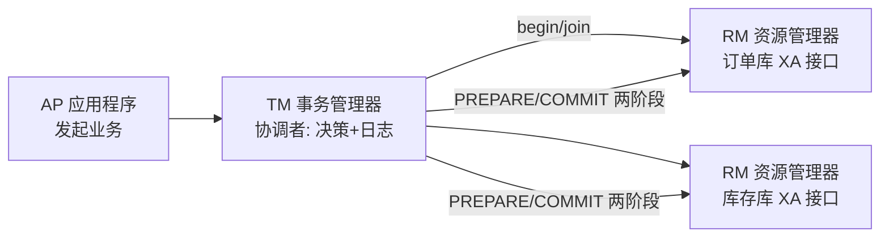
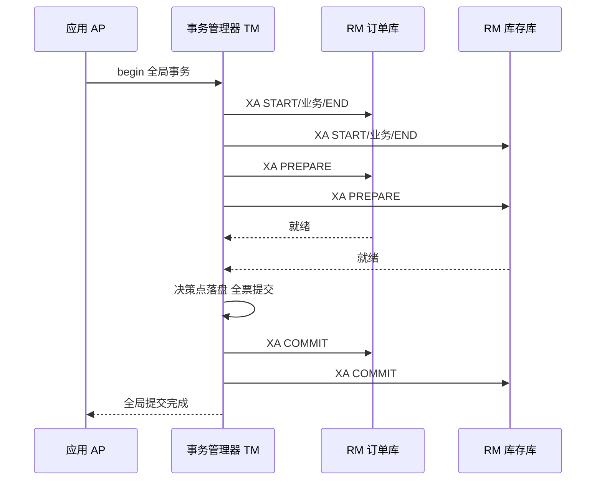

# XA 规范与数据库支持

> **一句话摘要**：XA 是 2PC 在资源层的工业标准化——X/Open DTP 模型定义了「应用（AP）+ 事务管理器（TM）+ 资源管理器（RM）」三角，数据库通过 `XA START/END/PREPARE/COMMIT` 接口成为标准参与者；它让跨库事务「零业务侵入」，也把 2PC 的阻塞与连接占用原样带到了生产——MySQL XA 的真实体验是「能用但高频场景慎用」。

> **本文核心**：XA 的机制链 = **AP 发起 → TM 协调 → RM 执行两阶段（PREPARE 落盘锁定 / COMMIT 提交）**——协议内建于数据库，业务无感；代价三件（事务树管理/连接独占/恢复复杂度）全部由 TM 与 RM 的运维承接；定位是低频强原子的资源层方案。

前置阅读：[2PC 两阶段提交](./3_2PC两阶段提交-入门.md)（协议本体）。本篇讲它的工业封装。

## 1. 背景：为什么需要把 2PC 标准化

2PC 是协议思想，落地时每个团队自己写协调者必然乱象（决策日志格式、恢复流程各自发明）。1991 年 X/Open 组织把它标准化为 **XA 接口**：数据库只要实现 XA 接口就是标准参与者（RM），任何实现 TM 角色的协调器都能指挥它——跨厂商、跨语言的分布式事务从此有了通用插座。Java 世界的 JDBC `XAResource`、JTA 规范都是这套标准的映射。

理解 XA 的正确姿势：**它不是新协议，是 2PC 的工程接口化**——2PC 的三件代价（阻塞/单点/悬挂窗口）一件没少，只是从「自研风险」变成了「标准化行为」。

## 2. 核心机制：DTP 三角与 XA 命令流



XA 命令流（对照 2PC 两阶段）：

```
XA START xid          -- 开启分支事务(绑定全局事务ID xid)
  [业务 SQL]
XA END xid            -- 分支逻辑结束(不再发SQL)
XA PREPARE xid        -- 阶段一: 落盘 redo/undo + 锁资源 + 就绪
XA COMMIT xid         -- 阶段二: TM 全票后下令提交 (或 ROLLBACK)
```

关键机制细节：**xid 全局事务 ID**（TM 生成，贯穿所有分支——恢复与排查的主键）；**TM 决策日志**（2PC 篇讲过的命门，TM 产品化的核心价值就是把它的持久化与恢复做对）；**悬挂事务恢复**（PREPARE 后 TM 失联，RM 侧事务挂着——MySQL 里 `XA RECOVER` 列出悬挂事务人工/工具仲裁）。

## 3. 落地实践：MySQL XA 的使用要点

```sql
-- 应用/JDBC 经 TM 驱动执行, 手工演示两库分支:
-- 连接1(订单库)
XA START 'xid-001'; UPDATE orders SET ...; XA END 'xid-001';
XA PREPARE 'xid-001';
-- 连接2(库存库)
XA START 'xid-001'; UPDATE stock SET ...; XA END 'xid-001';
XA PREPARE 'xid-001';
-- TM 全票后分别: XA COMMIT 'xid-001' (任一失败则 XA ROLLBACK)
```

要点四条：① **连接独占**：从 START 到 COMMIT，一条连接被一个事务分支独占——事务越长连接占用越久（连接池窒息的根源）；② **PREPARE 后的事务在 MySQL 里独立存在**（`XA RECOVER` 可见），应用崩溃后要靠 TM 或运维收口；③ **JDBC/框架使用时无感**（JTA/Seata XA 模式封装了命令流），但排查时必须看得懂底层命令；④ **binlog 与 XA**：内部 XA（MySQL 主从间的 2PC）与外部 XA 是两回事，别混淆——主从一致性是存储引擎- binlog 的内部两阶段，不归本篇。

## 4. 生产视角：XA 的真实体验

- **连接池窒息复现**：高峰期 XA 事务把「事务时长 × 并发」的连接需求放大（双库事务占双连接且贯穿两阶段）——RT 上涨 → 事务更慢 → 连接占用更久，正反馈拖垮。行业经验：互联网在线交易场景 XA 的吞吐天花板比柔性方案低一个量级。
- **悬挂事务的运维常态化**：TM 与 RM 网络抖动后，`XA RECOVER` 出现悬挂分支——需要明确「谁在多久后仲裁」（TM 自动恢复 / 告警人工），没有收口流程的团队会积累「僵尸事务」。
- **TM 的可用性即全局可用性**：TM 挂 = 所有 in-flight 全局事务冻结——TM 自身要决策日志高可用（2PC 篇的纪律），其运维成本常被低估。
- **与柔性方案的临界点**：行业共识的经验线——事务频率低（内部操作）、强原子不可妥协 → XA 合算；在线高频 → 柔性/消息极。用「事务时长 P99 × 频率」的连接占用账来定量判断。

## 5. 主流系统怎么做：各家的 XA 支持

| 系统 | XA 支持 | tips |
|---|---|---|
| MySQL | `XA` 语句族完整支持 | 5.7+ 修复早期缺陷；外部 XA 在连接管理与 GTD 上仍有工程注意项 |
| Oracle | XA 成熟（老牌强项） | 传统企业主力，配合 Tuxedo/OTM 类 TM |
| PostgreSQL | PREPARE TRANSACTION/COMMIT PREPARED | 2PC 原语原生暴露，TM 层拼装 |
| Seata XA 模式 | TM 角色产品化 | 对标传统 XA 但融入微服务栈（branch 注册/全局锁语义不同） |
| 消息系统（对照） | 无 XA | 事务消息是「消息层的最终一致」，不是 XA——名词区分 |

## 6. 典型场景

- **跨库批处理**（低频级）：夜间对账数据在两库间的一致搬迁——量小、可接受连接独占，XA 直接可靠。
- **传统企业核心**（存量级）：银行/电信的 XA + 商用 TM 体系——生态成熟、运维体系配套，互联网判断不适用。
- **Seata XA 模式**（微服务桥接）：微服务架构里仍要资源层强一致的少量场景——TM 角色由 Seata TC 承担，业务无感但 TC 高可用要配套。

## 7. 与相邻概念的区别

- **XA vs 2PC**：协议 vs 接口标准——2PC 是流程，XA 是「谁来实现什么接口」的规范（含 TM/RM 角色划分与恢复语义）。
- **内部 XA vs 外部 XA**：MySQL 主从的内部两阶段（binlog 一致性）是存储内部事务；跨库的外部 XA 才是本篇主题——同名词两个世界。
- **XA vs AT（Seata）**：AT 用 undo log 反向补偿绕开 PREPARE 锁定（性能好但有一致性窗口与全局锁代价）——XA 强一致无窗口但阻塞，是两极的代表（AT 篇详比）。
- **XA vs JTA**：JTA 是 Java 的事务管理 API 规范（应用层视图），XA 是资源层接口规范——JTA 底下可以挂 XA 也可以挂别的（如 Last-Resource 优化）。

## 8. 常见误区与不适用

- **「MySQL XA 事务就绝对安全」**：协议安全 ≠ 部署安全——TM 决策日志、悬挂收口流程、连接池水位，任何一处缺口都是事故面。安全是整套体系不是接口名。
- **「XA 零侵入所以免费」**：业务代码无感，代价转移到连接占用、TM 运维、吞吐上限——「侵入低」不等于「成本低」，三维评估的另外两维要算。
- **「PREPARE 后马上 COMMIT，阻塞窗口很小」**：阻塞窗口 = 两阶段之间的全部协调时间（含 TM 决策落盘、最慢参与者响应），业务 SQL 快不等于窗口短。
- **「用 XA 就不用考虑幂等了」**：XA 只管它事务树内的原子——事务外的消息、外部调用照旧要幂等（幂等是全场景义务）。
- **不适用**：在线高频交易（连接与阻塞不可承受）；无 TM 运维能力的团队（悬挂收口没人管）；跨机构流程（XA 的 RM 边界出不了自家机房——用业务化预扣+对账）。

## 9. 你们可能会问

- **`XA RECOVER` 出现悬挂事务，标准处理流程是什么？** 三步：确认对应全局事务的最终决定（查 TM 决策日志）→ 按决定 `XA COMMIT/ROLLBACK` → 复盘悬挂根因（TM 失联时长/网络）——没有 TM 日志就人工按业务后果仲裁。
- **为什么 XA 事务不能用连接池的常规回收策略？** 分支事务贯穿两阶段，连接被逻辑独占——常规「空闲即回收」会把活跃事务掐死；XA 连接要标记长租约。
- **Seata XA 模式和原生 XA 的差别？** TM 角色从独立产品变成 Seata TC（微服务栈内嵌），分支注册走 TC 而非 JTA——协议同源，协调器形态与生态不同。
- **怎么量化「我该不该用 XA」？** 算三笔账：连接占用账（事务时长 × 频率 × 分支数 vs 连接池容量）、悬挂风险账（TM/RM 网络抖动频率）、吞吐账（压测对比柔性方案）——三账过线再上。
- **XA 会消失吗？** 不会——低频强原子的资源层刚需长期存在，NewSQL 内部的提交协议也仍是 2PC 变体；它在收缩到「该在的位置」，而非消亡。

## 10. 一句话总结 + 5W 速记卡 + 自测三问

**🎯 核心带走**：

- **核心一句话**：XA = 2PC 的资源层工业标准（AP/TM/RM 三角 + xid 贯穿），业务零侵入、代价原样继承（阻塞/独占/悬挂运维）。
- **链条复述**：AP 发起 → TM 协调 + 决策日志 → RM 按 START/END/PREPARE/COMMIT 两阶段执行 → 悬挂由 XA RECOVER 收口。
- **失效点与边界**：高频在线不适用；TM 单点是全局可用性瓶颈；「零侵入」不等于「零成本」。

**5W 速记卡**：

| 维度 | 内容 |
|---|---|
| What | DTP 三角模型 + XA 命令流 + 悬挂恢复 |
| Why | 2PC 需要标准化接口才能跨厂商落地 |
| When | 低频强原子、传统企业核心、Seata XA 少量场景 |
| Where | 资源层（数据库 XA 接口）+ TM 协调器 |
| How | 算三笔账（连接/悬挂/吞吐）→ 配 TM 高可用 → 悬挂收口流程化 |

💡 **实战提示**：`XA RECOVER` 巡检进运维日课；连接池给 XA 事务单独的池与长租约策略；TM 决策日志的备份与恢复演练是上线前置项。

**开放问题**：如果数据库厂商把「跨库原子提交」做成云原生托管能力（用户只声明原子域），TM 角色会不会彻底消失进基础设施？

**决策（何时用）**：低频强原子推荐 XA（数据库原生可靠）；在线高频推荐柔性/消息极；推荐以「事务时长预算 + 连接占用账」为进入判据。

**Trade-off（代价与反方案）**：XA 用「吞吐与运维」换「零侵入 + 强原子」；反方案三选——AT（接受窗口与全局锁换性能）、TCC（接受侵入换性能）、消息极（接受窗口换可用）；TM 单点的反方案是把协调逻辑业务化（冻结/预扣，金融惯例）。

**演进视角**：XA 从 1991 年标准到今天仍是传统行业的运行主力，同时在互联网场景退居长尾——「标准长寿、场景收缩」是基础设施协议的典型生命周期。

---

**下篇预告**：进入柔性极——下一篇[TCC 补偿事务](./6_TCC补偿事务-入门.md)讲 Try-Confirm-Cancel 如何把两阶段搬到业务层，以及空回滚/悬挂/幂等三大配套难题。



---

## 📌 数据与事实声明

X/Open DTP 模型与 XA 接口为公开行业标准（The Open Group）；MySQL/PostgreSQL XA 支持为官方文档内容；「连接独占/悬挂恢复」机制为公开工程实践归纳。以官方文档为准。

## 📚 参考资料

| 类型 | 标题 | 来源 |
|---|---|---|
| 标准 | X/Open CAE Specification: Distributed Transaction Processing (XA) | The Open Group |
| 文档 | MySQL: XA Transactions | dev.mysql.com |
| 文档 | Seata: XA 模式 | seata.apache.org |
| 图书 | 深入理解分布式事务（XA 章节） | 电子工业出版社（2021） |
