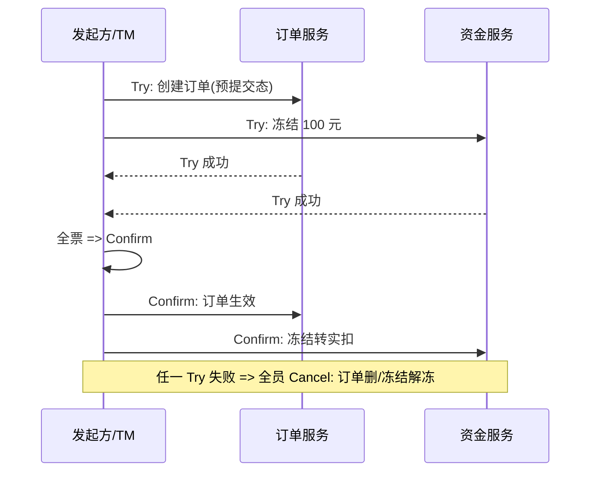
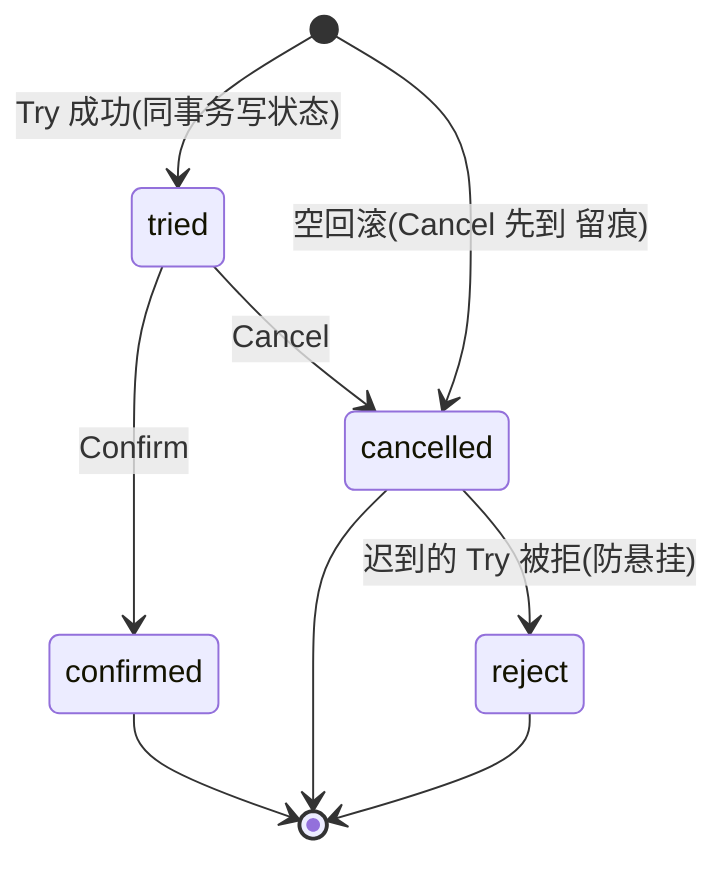

# TCC 补偿事务

> **一句话摘要**：TCC 把 2PC 的两阶段搬到业务层——Try 预留资源（冻结额度/预占库存）、Confirm 确认（真扣）、Cancel 释放（解冻）；性能好、语义强，但把复杂度换来业务侧：**幂等、空回滚、悬挂**三大难题是 TCC 的真正工作量，框架只能帮你管流程、帮不了你管语义。

> **本文核心**：TCC 机制链 = **Try 全员预留 → 全票 Confirm / 任一败 Cancel**——原子性由「预留态可进可退」保证；三大配套（幂等防重放、空回滚防「没 Try 先 Cancel」、悬挂防「Cancel 之后迟到的 Try 生效」）是自研成本的主体，也是选型判断的核心（团队能否管好这三件）。

前置阅读：[方案全景](./2_分布式事务方案全景-入门.md)。幂等的三层防线见[理论系列幂等篇](../../../distributed-theory/入门层/从零开始认识分布式理论系列/10_幂等与去重-入门.md)。

## 1. 背景：为什么要把两阶段搬到业务层

> 量级分档意识：本文方法在十万级 QPS、千万级用户、亿级流量的场景下均需重新评估——量级变化时架构与参数需同步调整。


XA（上一篇）的问题在资源层锁：PREPARE 阶段数据库锁资源、连接独占，高峰期吞吐窒息。TCC 的思路：**资源层不锁，业务层预留**——「冻结 100 元」不是锁住账户行，而是把可用余额转 100 到冻结字段；「预占 1 件库存」不是行锁，是可售数减 1、预占数加 1。预留态的特点：**可进（Confirm 真扣）可退（Cancel 解冻）**，且不阻塞他人读、不长期占连接。

代价同步而生：预留/确认/释放都是业务逻辑，TCC 语义的正确性从数据库协议变成了**业务代码纪律**——三大难题由此而来。

## 2. 核心机制：两阶段与三大难题



三大难题的机制与标准解法：

- **幂等**：Confirm/Cancel 都会被 TM 重试（网络丢失后重发）——每个接口必须按「事务 ID + 分支」防重：重复 Confirm 无副作用、重复 Cancel 无副作用（理论系列幂等篇的三层防线在此落地：唯一约束 + 状态机）。
- **空回滚**：Try 请求丢失（未到达），TM 超时判定失败发起 Cancel——Cancel 到了一个「没有 Try 过」的分支。必须允许 Cancel 空跑（记录「已回滚」标记直接成功），否则全局事务卡死。
- **悬挂**：Cancel 先到（空回滚并记录）之后，**迟到的 Try** 才到——若照常执行预留，资源将被永久冻结（没人会再来 Cancel）。解法：Try 执行前检查「是否已被回滚」，是则拒绝执行。三者是一组连环：**幂等防重放、空回滚防卡死、悬挂防泄漏**，缺一即事故。

工程惯例是把三件套沉淀为框架能力（事务 ID 贯穿 + 分支状态表：`状态机 = tried / confirmed / cancelled / suspend`），业务只写三个接口的「净逻辑」。

## 3. 落地实践：设计一个 TCC 接口

以资金服务「冻结 100 元」为例的正确姿势：

```text
Try(xid):
  1. 查分支状态表: 已 cancelled => 拒绝(防悬挂); 已 tried/confirmed => 幂等返回
  2. 条件更新: UPDATE account SET frozen=frozen+100, available=available-100
     WHERE available>=100 AND xid NOT IN (SELECT xid FROM tcc_branch WHERE ...)
  3. 写分支状态: tried  (与 2 同事务 => 原子)
Confirm(xid):
  查状态表: 已 confirmed => 幂等返回; 未 tried => 异常(理论不可达, 告警)
  条件更新: frozen-=100, 扣减落账; 状态改 confirmed (同事务)
Cancel(xid):
  查状态表: 已 cancelled => 幂等返回; 未 tried => 写 cancelled 记录直接成功(空回滚)
  条件更新: frozen-=100, available+=100; 状态改 cancelled (同事务)
```

三条纪律：**状态表与业务变更同事务**（原子性）、**所有变更用条件更新**（并发安全 + 天然幂等）、**预留额要有对账**（冻结字段与流水核对——柔性极的对账底线同样适用）。

## 4. 生产视角：TCC 的事故形态

- **悬挂导致的资金冻结泄漏**：没做防悬挂检查，迟到的 Try 把 100 元转进冻结字段后无人认领——用户「钱少了」，客服查不到订单。修复只能脚本解冻 + 根因是框架没管住 Try 的进入条件。
- **Confirm/Cancel 全失败的僵局**：Confirm 重试 N 次仍失败（下游宕机超窗口）——TM 的处置要有「转人工/转对账」的终态出口，无限重试只是延迟事故。
- **Try 接口里藏重量级操作**：有人在 Try 里调外部第三方接口——预留阶段被外部依赖拖住，全局事务时长失控。纪律：**Try 只做「本地、快、可逆」的预留**，外部交互放 Confirm 或链路外。
- **业务不允许「中间可见」却用了 TCC**：冻结态被余额查询读到（可用少了 100 但没消费记录）——Try 语义设计时就要定「冻结是否对外可见」（账户明细展示「冻结中」比「凭空少钱」体验好得多）。

## 5. 主流系统怎么做：框架与实现

| 实现 | 承担的部分 | 留给业务的 |
|---|---|---|
| Seata TCC | 分支注册/两阶段调度/重试 | 三接口业务逻辑 + （部分）幂等防挂標注 |
| 自研 TM | 同上 | 全部三件套语义 |
| ByteTCC / 其他 | 类似 | 类似 |

规律：**框架管「流程时序」，业务管「状态语义」**——状态表设计（tried/confirmed/cancelled/suspend + 同事务原子）是业务侧不可外包的部分；评估 TCC 可行性 = 评估团队能否把三件套做对，而不是有没有框架。

## 6. 典型场景

- **支付下单**（经典级）：资金冻结（Try）→ 支付成功实扣（Confirm）→ 超时/失败解冻（Cancel）——预留语义与业务天然同构，TCC 最标准的用武之地。
- **库存预占**（秒杀级）：可售减预占加（Try）→ 支付成功转实扣（Confirm）→ 未支付超时释放（Cancel）——与「预占-超时释放」的业务模式天然匹配。
- **优惠券核销**（混合级）：券锁定（Try）→ 订单完成核销（Confirm）→ 释放回池（Cancel）。

## 7. 与相邻概念的区别

- **TCC vs 2PC/XA**：业务层预留 vs 资源层锁定——TCC 无长锁、性能高，代价是三大难题 + 接口改造成本；同形（两阶段）不同层。
- **TCC vs Saga**：TCC 有独立预留阶段（Try），Saga 直接执行正向服务靠事后补偿——TCC 中间态「受控预留」，Saga 中间态「已生效待补偿」；隔离性 TCC 更强，流程长度 Saga 更适配（Saga 篇详比）。
- **TCC vs AT**：AT 框架自动生成 undo（零改造）但有全局锁与反向补偿窗口；TCC 手写三接口（高侵入）但语义最明确、性能最好——侵入换性能的两端。
- **Try 的「冻结」vs 业务「预扣」**：形态相同——TCC 是把「冻结/预扣」这套业务惯例**协议化**（统一时序、统一补偿、统一防悬挂），这正是它的价值：不是发明预留，是管理预留。

## 8. 常见误区与不适用

- **「上了 TCC 框架就自动正确」**：框架管时序不管语义——三大难题的判定条件（分支状态表）要业务自己写对；「框架兜底」的错觉是悬挂事故的思想根源。
- **「Try 失败就不用 Cancel」**：Try 部分成功后全局失败（比如 B 失败但 A 已 Try 成功）必须 Cancel A——「Try 失败」指的是「有任一失败」，已成功的都要退。
- **「Cancel 要设计成失败可重试到死」**：重试要有终态出口（转人工/对账），无限重试掩盖系统性故障。
- **「TCC 一定比消息最终一致好」**：多花三个接口与三件套，买到的是「强语义预留 + 实时回滚」——副作用类操作（通知/积分）买这个不划算，按业务语义定。
- **不适用**：无法定义「预留」的操作（比如跨机构外部扣款，Try 不可逆——用业务化预扣+对账）；低频内部流程（框架成本 > 收益）；无法接受接口改造的遗留系统（用 AT 或消息）。

## 9. 你们可能会问

- **为什么 Try 必须和「写分支状态」同事务？** 分开则 Try 成功、状态没写（或反之）——防悬挂检查与幂等判定全部失去依据；同事务是三件套的地基。
- **空回滚的「记录」有什么用？** 它就是防悬挂的依据——迟到的 Try 查到「已取消」标记即拒绝；空回滚不是「什么都不做」，是「记下无事可做」。
- **TM 怎么知道该重试 Confirm 还是 Cancel？** 全局事务状态机：任一分支 Try 失败/超时 → 全局回滚路径；全员成功 → 提交路径——TM 的决策日志记录路径选择（与 2PC 决策点同义）。
- **TCC 的隔离性到底好在哪？** 预留态把「未确认的占用」显式化——其他事务读到的可用值已扣除预留（或明细显示冻结），不会读到「假可用」；Saga 的已执行待补偿则可能被读到「将撤销的结果」。业务隔离语义更干净。
- **存量接口怎么 TCC 化？** 通常包一层：Try=冻结/预占的等价物改造，Confirm=原提交动作，Cancel=新增的反向动作——改造成本是 TCC 选型的最大现实约束，改不动的用 AT/消息。

## 10. 一句话总结 + 5W 速查 + 自测三问

**🎯 核心带走**：

- **核心一句话**：TCC = 业务层的两阶段——Try 预留、Confirm 真扣、Cancel 释放，性能与语义皆强，复杂度在幂等/空回滚/悬挂三件套。
- **链条复述**：Try（冻结+写状态，同事务）→ 全票 Confirm / 任一败 Cancel → 重试靠幂等、空跑靠标记、迟到靠防悬挂检查 → 对账兜底。
- **失效点与边界**：Try 不可逆的业务（外部扣款）不适用；Confirm 终态出口（人工/对账）必须有；预留可见性要产品设计。

**5W 速记卡**：

| 维度 | 内容 |
|---|---|
| What | Try/Confirm/Cancel 三接口 + 幂等/空回滚/悬挂三件套 |
| Why | 资源层锁太贵（XA），业务层预留换性能与隔离语义 |
| When | 支付冻结、库存预占、券核销——能定义「预留」的高频强语义场景 |
| Where | 业务层（服务接口）+ 分支状态表 + TM 调度 |
| How | 状态表同事务 → 条件更新全幂等 → 三件套判定齐 → 对账兜底 |

💡 **实战提示**：Try 只做本地快可逆的预留；分支状态表是三件套的地基（同事务原子写）；Cancel 空跑要留痕；Confirm 终态出口转对账。

**开放问题**：如果业务模型天然支持「预扣」（账户体系原生冻结域），TCC 框架还剩多少增量价值——协议化预留与原生预留的边界在哪？

**决策（何时用）**：能定义预留、高频、强语义的场景推荐 TCC；改造成本过高的遗留系统推荐 AT/消息极；推荐以「三件套能否做对」为团队准入判据。

**Trade-off（代价与反方案）**：TCC 用「接口侵入 + 三件套维护」换「性能 + 隔离语义」；反方案——AT（零侵入换框架暗锁）、Saga（无预留换长流程适配）、消息极（低侵入换窗口）；预留语义本身也有反方案：业务原生冻结域（建模更重但无需协议）。

**演进视角**：TCC 从理财/支付行业的手工惯例（冻结/解冻）被协议化（2007 Twitter 提出命名）再到框架产品化——本质是「业务预留」的工程管理史；业务建模越原生，协议越薄。

---

**下篇预告**：没有预留阶段的柔性方案——下一篇[Saga 长事务](./7_Saga长事务-入门.md)讲正向服务链与补偿链如何适配跨天长流程。

---



## 📌 数据与事实声明

TCC 命名与模式说明出自公开工程文献（Twitter 工程师对 Try-Confirm-Cancel 的总结）；空回滚/悬挂的机制分析与解法为分布式事务领域公开共识（《深入理解分布式事务》2021、Seata 官方文档）；代码骨架为教学化示例。以官方文档为准。

## 📚 参考资料

| 类型 | 标题 | 来源 |
|---|---|---|
| 文档 | Seata: TCC 模式 | seata.apache.org |
| 图书 | 深入理解分布式事务（TCC 章节） | 电子工业出版社（2021） |
| 系列文章 | 幂等与去重（理论系列） | 本仓库 distributed-theory/ |
| 系列文章 | Saga / AT（本系列后续） | 本仓库同系列 |
