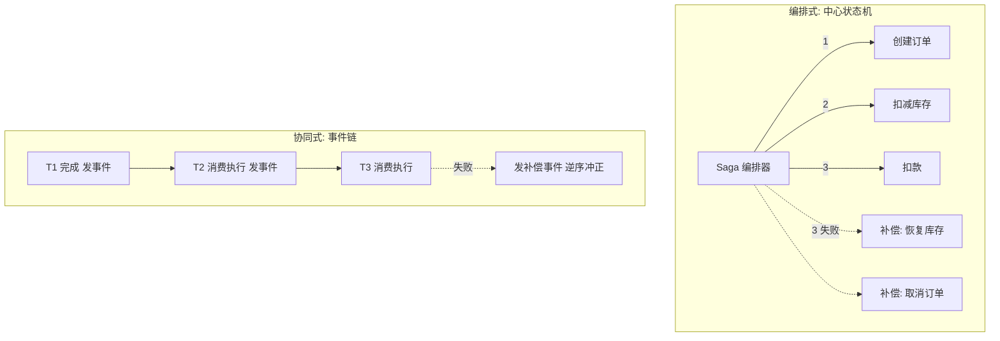
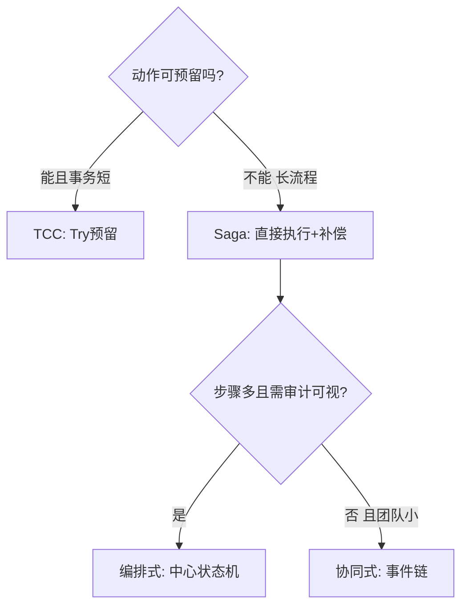

# Saga 长事务

> **一句话摘要**：Saga = 把长事务拆成一串本地事务 T1→T2→…→Tn，每个 Ti 配一个补偿动作 Ci——中途失败就按逆序执行 C(i-1)…C1 撤销；没有预留阶段（与 TCC 的本质区别），中间态「已生效但可能被补偿」，靠**编排式（中心状态机）或协同式（事件链）**组织，是跨天长流程的唯一正解。

> **本文核心**：Saga 机制链 = **本地事务序列 + 逆序补偿**——原子性由「补偿动作的完备性」保证（每个 Ti 必须有可撤销的 Ci）；隔离性是它的天然短板（无预留、已生效），靠「业务语义设计 + 语义锁/-commutative 更新」缓解；编排 vs 协同是工程实现的分水岭。

前置阅读：[TCC 补偿事务](./6_TCC补偿事务-入门.md)（预留 vs 补偿的对照）。概念出处为数据库经典论文（Garcia-Molina & Salem, 1987）。

## 1. 背景：为什么长流程只能用 Saga

> 量级分档意识：本文方法在十万级 QPS、千万级用户、亿级流量的场景下均需重新评估——量级变化时架构与参数需同步调整。

「预留」语义有边界：TCC 的 Try 能冻结一笔钱、预占一件库存，但没法「冻结」一个已发货的包裹、已发送的通知、已写入的账本。而跨天/跨机构的长流程（履约、清结算、审批链）恰恰充满这类「一旦发生只能反向冲正」的动作——Saga 承认这个现实：**不预留、直接做，失败就逐个补偿**。

它放弃的东西同样明确：没有 Try，就没有「未确认的受控中间态」——T2 执行后 T1 的结果就是「对外真实生效」的；直到全部完成前，事务处于「部分完成」的可观察状态。隔离性（理论系列的 I）在这里是 Sagas 论文开篇承认的让步，工程上靠语义设计补。

## 2. 核心机制：补偿链与两种组织方式

- **补偿的完备性要求**：每个 Ti 必须存在语义上「足以撤销」的 Ci——「已发送的短信」补偿不了（只能发道歉短信），这类动作要么放链尾、要么设计成可撤回（延迟发送）。**设计 Saga 第一步是给每个动作标注「可补偿性」**，不可补偿动作的放位决定整个流程的健壮性。
- **逆序与并行**：补偿按逆序（后做的先撤）；并行执行的分支各自回滚。补偿动作本身也要幂等（补偿重试是常态）。
- **两种组织方式的取舍**：
  - **编排式（Orchestration）**：中心状态机显式指挥每一步——流程可视、易调试、集中控制，代价是编排器是单点关注对象（要有状态持久化与恢复能力）；
  - **协同式（Choreography）**：服务间靠事件链自发协作——去中心、新增步骤灵活，代价是流程隐没在事件拓扑里（「这个流程到底有几步」要靠翻代码回答），补偿链的追踪困难。
  - 行业经验：步骤少（<5）且团队小用协同式；流程复杂、要审计可视化的金融场景用编排式。
- **隔离性缓解三招**（Sagas 论文提出的工程补丁）：**语义锁**（状态字段标记 pending，挡住对未确认数据的操作）；**可交换更新**（设计成加减型操作，乱序也收敛）；**悲观视图**（对外展示「处理中」语义而不是中间数值）。

## 3. 落地实践：设计一条 Saga 链

1. **拆步骤并标可补偿性**：每步写清「正向动作 + 补偿动作 + 补偿是否完备」；不可补偿动作（发短信、外部扣款）尽量后置或改为「可撤回形态」。
2. **定补偿触发与重试**：失败触发逆序补偿；补偿失败进重试队列 → 超限转人工（终态出口，同 TCC 纪律）。
3. **状态可观测**：每个全局事务一条状态记录（到哪一步、补偿到哪一步）——长流程跨天，没有状态面板等于盲飞；编排器的状态持久化就是为此。
4. **对账兜底**：Saga 的「最终一致」承诺靠「补偿完备 + 重试 + 对账」三层兑现——链路越长越要外部对账（组 4 的机制通用）。

## 4. 生产视角：Saga 的事故形态

- **不可补偿动作放在链中间**：流程第 3 步调了外部扣款、第 5 步失败——外部扣款退不回，补偿链断在中间，人工冲正。复盘结论永远是「设计期没标可补偿性」。
- **协同式的「幽灵流程」**：事件链加了两年后没人说得清完整流程图——新需求动一步，三处下游意外被触发。修法是引入流程文档/编排器，或至少维护事件拓扑图。
- **补偿与并发的交错**：补偿执行时，新的正向请求又进来了（补偿未完成、新单又扣库存）——语义锁（pending 状态挡新请求）是标准解，漏了就会出现「补偿与新单交错」的诡异数据。
- **补偿动作本身不幂等**：恢复库存的补偿被重试两次，库存多还一件——补偿与正向动作同等的幂等纪律，一视同仁。

## 5. 主流系统怎么做：实现载体

| 实现 | 形态 | tips |
|---|---|---|
| Seata Saga | 编排式（JSON 状态机定义） | 状态机可视化 + 补偿配置化，Java 生态顺手 |
| Temporal / Cadence | 通用工作流引擎（代码即状态机） | 长流程 + 重试 + 状态持久化全家桶，学习曲线换工程能力 |
| 事件驱动自研 | 协同式 | 事件总线（MQ）+ 本地状态表，灵活但治理靠纪律 |
| 微服务网关层编排 | 轻量编排 | 简单顺序流程够用，复杂分支不建议 |

规律：**编排器在「专用（Seata Saga）」与「通用（Temporal）」之间选**——只为 Saga 用就 Seata，长流程平台化诉求就 Temporal 类。

## 6. 典型场景

- **电商履约链**（跨天级）：出库 → 发货 → 签收 → 结算——Saga 教科书场景，补偿（拦截/退回/红冲）与业务语义天然对齐。
- **清结算对账链**（金融级）：文件获取 → 解析 → 清分 → 划款——步骤多、周期长、每步可冲正（红字冲销），编排式 Saga + 人工介入点。
- **差旅/审批流**（工作流级）：预订 → 出行 → 报销——Temporal 类引擎的主场。

## 7. 与相邻概念的区别

- **Saga vs TCC**：无预留 vs 有预留——TCC 隔离性强（受控中间态）、Saga 适配长流程（预留不了那么久）；选择标尺是「动作可否预留」与「流程时长」。
- **编排 vs 协同**：控制权在中心状态机 vs 在事件链——可视化/治理 vs 去中心/灵活；同一条链也可以混合（主干编排 + 旁路协同）。
- **Saga vs 工作流引擎**：Saga 是「补偿型事务」的协议概念；Temporal 类是「持久化执行」的工程平台（Saga 是其上的一种模式）——概念与平台的关系。
- **补偿 vs 回滚**：回滚恢复到事务前状态（数据库机制）；补偿是「业务上的反向冲正」（一个新的正向操作）——补偿后系统处于「冲正后」状态而非「从未发生」状态，审计口径要按此设计。

## 8. 常见误区与不适用

- **「Saga 就是分布式的 try-catch」**：补偿是业务语义（冲正）不是代码回滚——补偿后的数据状态、审计口径、用户感知都要按「曾发生」设计；try-catch 思维写出的是假补偿。
- **「协同式更优雅，都用事件链」**：优雅在初期，失控在规模——流程可视化缺失的治理债三年后集中爆发；按步骤数与合规要求选，不按风格选。
- **「补偿动作随手写写就行」**：补偿 = 另一个正向业务操作——幂等、并发、审计要求一视同仁；补偿的代码质量常低于正向（没人 review），是事故暗角。
- **「Saga 保证隔离性」**：不保证——这是 Sagas 论文开篇的显式让步；中间态对外可见是默认行为，缓解靠语义三招，不能靠想象。
- **不适用**：需要强隔离的短事务（TCC/强一致极）；动作大多不可补偿的流程（重新设计动作，或用「人工确认门」）；低延迟要求（补偿链的收敛是异步的）。

## 9. 你们可能会问

- **补偿应该自动还是人工？** 分级：标准化冲正（库存恢复）自动；涉及资金错账/外部机构的转人工队列——全自动补偿在金融场景反而危险，人工介入点是设计出来的不是失败出来的。
- **怎么防止补偿与新请求交错？** 语义锁：全局事务状态 pending 期间，相关资源的变更请求排队/拒绝——把「隔离性让渡」的口子用状态机收窄。
- **长流程的状态存哪？** 编排器数据库（编排式）或各服务的本地状态表 + 关联 ID 串联（协同式）——关键是「一个全局事务 ID 贯穿全部步骤」，排障与对账都靠它。
- **Saga 和 MQ 事务消息什么关系？** 常搭配——协同式 Saga 的每步触发就是事件（事务消息保证事件可靠）；事务消息解决「消息与本地事务的原子」，Saga 解决「多步流程的补偿」，一个管投递一个管流程。
- **补偿顺序必须严格逆序吗？** 语义上要求（后做的先撤）；有依赖的并行分支各自回滚——严格逆序是默认，业务允许时可以并行补偿（时效更好，但要确认无依赖）。

## 10. 一句话总结 + 5W 速查卡 + 自测三问

**🎯 核心带走**：

- **核心一句话**：Saga = 本地事务序列 + 逆序补偿——不预留直接做，失败逐个冲正；补偿完备性与隔离性让渡是它的两大命门。
- **链条复述**：拆步骤标可补偿性 → 编排（状态机）/协同（事件链）组织 → 失败逆序补偿 → 重试 + 人工出口 + 对账三层兑现最终一致。
- **失效点与边界**：不可补偿动作破坏链条；隔离性天然弱（语义三招缓解）；补偿动作与正向同等的幂等纪律。

**5W 速记卡**：

| 维度 | 内容 |
|---|---|
| What | T 序列 + C 补偿链 + 编排/协同两组织 |
| Why | 长流程无法预留（TCC 失效），只能直接做 + 冲正 |
| When | 跨天履约、清结算、审批链等多步骤长周期流程 |
| Where | 编排器/工作流引擎/事件总线 |
| How | 标可补偿性 → 选组织方式 → 状态贯穿 + 语义锁 → 补偿幂等 + 对账 |

💡 **实战提示**：设计第一步给每个动作标「可补偿性」；补偿代码 review 标准与正向一致；全局事务 ID 贯穿全程；人工介入点主动设计（金融场景全自动反而危险）。

**开放问题**：Temporal 类「持久化执行」平台普及后，Saga 会不会从「协议」退化为「平台的一个内置模式」——协议知识还剩多少独立价值？

**决策（何时用）**：多步骤长周期流程推荐 Saga（编排式为主）；短事务强语义推荐 TCC；推荐「步骤数 > 4 或周期 > 小时级」作为进入 Saga 的经验门槛。

**Trade-off（代价与反方案）**：Saga 用「隔离性让渡 + 补偿开发」换「长流程可行性」；反方案——TCC（预留换隔离，长流程不可行）、工作流人工化（无自动补偿但慢）、业务重设计（把长流程拆成独立短事务，代价是业务语义重组）。

**演进视角**：从 1987 年 Sagas 论文（数据库长事务）到微服务时代的重新发明，再到 Temporal 类「持久化执行」平台——补偿思想四十年未变，变化的是承载它的基础设施越来越厚。

---

**下篇预告**：零侵入的柔性方案——下一篇[AT 自动补偿模式](./8_AT自动补偿模式-入门.md)讲 Seata AT 如何用 undo log 自动生成补偿，以及全局锁的真实代价。

---

## 📌 数据与事实声明

Saga 概念出处为 Garcia-Molina & Salem《Sagas》（SIGMOD 1987）；编排/协同分类与隔离性缓解策略为公开工程共识（微服务领域文献与 Seata/Temporal 官方文档）；实现对照为官方文档机制级概括。以官方文档为准。

## 📚 参考资料

| 类型 | 标题 | 来源 |
|---|---|---|
| 论文 | Sagas | Garcia-Molina & Salem, SIGMOD（1987） |
| 文档 | Seata: Saga 模式（状态机） | seata.apache.org |
| 文档 | Temporal: workflow documentation | docs.temporal.io |
| 图书 | 深入理解分布式事务（Saga 章节） | 电子工业出版社（2021） |
