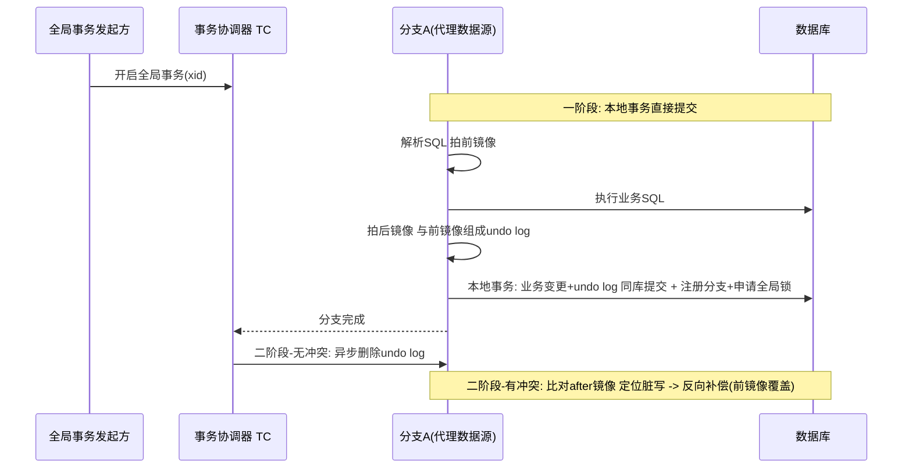
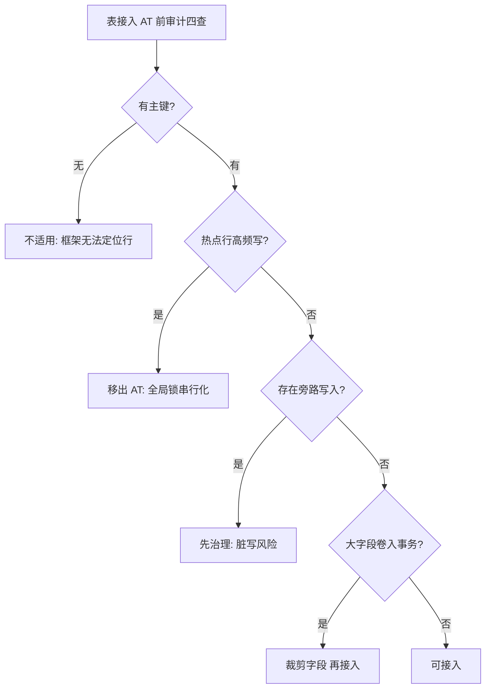

# AT 自动补偿模式

> **一句话摘要**：AT（Seata）是「自动化的 Saga 补偿」——框架代理数据源，业务执行时自动拍前后镜像（before/after image）生成 undo log，回滚时反向补偿；业务零改造换柔性事务，代价是**全局锁的串行化**与脏写的处理复杂度——「自动」不等于「免费」，全局锁是它的真实成本中心。

> **本文核心**：AT 机制链 = **一阶段本地提交 + 自动 undo log → 二阶段：全局无冲突则异步删 undo / 有冲突则反向补偿**——它与 XA 的分野在一阶段就提交（不锁资源等协调），用「可能补偿」换「不阻塞」；正确性押在全局锁与镜像比对的机制上，这既是它零侵入的原因也是它的性能天花板。

前置阅读：[方案全景](./2_分布式事务方案全景-入门.md)、[Saga 长事务](./7_Saga长事务-入门.md)（补偿思想的自动化前传）。实现为 Seata AT 模式（事实标准）。

## 1. 背景：能不能既柔性又不改代码

TCC 要写三个接口、Saga 要为每步写补偿——侵入是柔性极的入场费。AT 的回答：**补偿可以自动生成**——数据库本来就有 undo 的概念（本地事务回滚），把「前后镜像」记下来，回滚时照着反向执行即可。Seata 把这套机制做成了数据源代理：业务代码只写普通 `@GlobalTransactional` + 本地 SQL，框架在 SQL 执行时自动解析、拍镜像、生成 undo log、参与全局事务。业务零改造，这是 AT 在存量系统里流行的根本原因。

## 2. 核心机制：两阶段的独特走法

四步机制拆解：

- **一阶段即提交**：与 XA 的 PREPARE 等待完全不同——AT 的分支在本地事务里「业务变更 + undo log」一起提交，资源立即释放（不阻塞别人）。「原子性」暂时让渡，押注到二阶段的补偿能力上。
- **undo log 同库存放**：前镜像/后镜像与业务变更在同一个本地事务里落库——要么都有要么都没有，补偿依据不会丢失。
- **全局锁（关键成本）**：同一行数据在全局事务层面串行——分支提交前要拿「该行的全局锁」，防止「AT 事务回滚期间，别的事务改了这行」造成补偿覆盖别人的更新（脏写）。**全局锁是 AT 正确性的基石，也是它的性能天花板**：热点行上的全局锁竞争，把「一阶段即提交」的吞吐优势吃掉。
- **二阶段分叉**：无冲突（该行全程没人动过——after 镜像与库中当前值比对一致）→ 异步删 undo log，近乎零成本收口；有冲突（别人改过）→ 说明发生脏写风险/需要补偿，用前镜像生成反向 SQL 执行回滚——这是「异步补偿」的慢路径，也是数据正确性的最后防线。

## 3. 落地实践：AT 的使用要点

1. **表必须带主键**：undo log 与全局锁都按行主键定位——无主键表不适用（框架无法定位行）。
2. **热点行是选型红线**：同一行高频更新（库存扣减位、账户余额热点）→ 全局锁串行化吞吐。用 `@GlobalLock`/select for update 语义细究，或干脆换 TCC/业务化扣减。
3. **undo log 表运维**：branch_table/undo_log 表随事务量增长——清理策略与监控（异常残留的 undo log 意味着悬挂分支）。
4. **隔离级别认知**：AT 默认全局隔离是「读未提交」（其他全局事务在提交前就能读到中间值）——需要读隔离要 select for update 走 @GlobalLock，性能代价另算。

## 4. 生产视角：AT 的事故形态

- **热点行吞吐雪崩**：营销活动把某个爆款库存行变成全局锁热点——TPS 从万级跌到百级量级。修复不是调参：热点行移出 AT（改 TCC 预占或 Redis 预扣 + 异步落库）。
- **脏写比对失败的人工海**：二阶段 after 比对不一致（补偿路径触发）频繁出现——通常意味着全局锁使用不当（绕过代理的原生 SQL 写同一张表）。AT 有一前提：**被 AT 管的表，所有写都该走代理**；旁路写入是脏写事故的根源。
- **undo log 残留**：TC 与分支失联导致二阶段没执行，undo log 永远留着——数据没坏（一阶段已提交），但要清理与告警；残留监控是 AT 运维的日常项。
- **「零侵入」的边界错觉**：团队以为 AT 完全无感，直到发现——SQL 写法受限（框架要能解析）、大字段镜像膨胀（undo log 巨大）、跨库外的 RPC 调用不归它管。「零改造」不等于「零约束」。

## 5. 主流系统怎么做：AT 的生态位

| 维度 | 现状 | tips |
|---|---|---|
| 实现 | Seata AT（事实唯一主流） | 模式源自 Seata 原创（阿里 GTS 的开源版思想） |
| 适用 | 存量系统柔性化、中低频跨库事务 | 改造成本最低的柔性入场券 |
| 不适用 | 热点行高频写、非关系型存储、旁路写入的表 | 每条都有对应替代（TCC/消息/治理纪律） |
| 对照 | TCC/Saga | 侵入依次上升、对业务的「自动化程度」依次下降 |

规律：**AT 是「用框架复杂度换业务侵入」的极端点**——它把柔性事务的所有难点内部化（镜像/锁/比对），换给用户一个注解；理解内部机制是判断「能不能用」的前提。

## 6. 典型场景

- **存量单体重构过渡**（过渡级）：单体拆微服务的中间态，跨库事务用 AT 顶住——等业务稳定再按热点分级改造为 TCC/消息。
- **中低频管理后台**（舒适级）：运营后台的跨库操作（改配置 + 记审计 + 动权限），频率低、无热点行——AT 的舒适区。
- **反例（热点交易）**：秒杀扣库存上 AT——全局锁热点的教科书反例，落地前用「行热度分析」过滤。

## 7. 与相邻概念的区别

- **AT vs XA**：一阶段提交 vs 一阶段锁定——AT 不阻塞但需要补偿路径（二阶段分叉），XA 强一致但全程持锁；一致性与吞吐的极点对。
- **AT vs Saga**：Saga 的补偿是业务手写的语义动作；AT 的补偿是镜像反向 SQL（机械还原）——机械还原快但语义粗（「恢复到前镜像」可能违背业务规则，如恢复库存时忘记扣减相关联动），Saga 补偿重但语义对。
- **AT vs TCC**：零改造 vs 三接口——隔离语义上 TCC 显式（预留可见可控），AT 隐式（读未提交 + 全局锁内部化）。
- **全局锁 vs 数据库行锁**：全局锁锁「跨库同一行在全局事务维度的顺序」（TC 内存/存储中的锁表），行锁锁「单库内的并发」——两层锁叠用，排查锁冲突时先分清层。

## 8. 常见误区与不适用

- **「AT 自动 = 不用理解事务机制」**：恰恰相反——热点行、脏写、undo 残留的排查全靠机制知识；AT 把复杂度从业务代码搬到运维与排查，没消失。
- **「AT 能保证强一致」**：AT 是柔性（读未提交 + 补偿窗口）——它保证「最终一致 + 冲突可检测」，不保证实时隔离。强一致需求走 XA/业务化。
- **「全局锁只在冲突时才有代价」**：锁的申请与释放是每次分支提交的固定动作——无冲突时是开销、有冲突时是串行化；热点场景两者都疼。
- **「所有表都能直接接入」**：无主键、大字段、旁路写入（绕代理的 SQL）、存储过程——四类表接入即埋雷；接入前做表结构审计。
- **不适用**：热点行高频写（换 TCC/预扣）；强隔离需求（换 XA/TCC）；无法保证「全部写走代理」的表（治理做不到就别接）。

## 9. 你们可能会问

- **脏写具体指什么？** AT 事务 A 回滚期间（一阶段已提交、二阶段未到），事务 B 又改了同一行——A 的前镜像补偿会把 B 的更新覆盖掉。全局锁防的就是它（B 拿不到全局锁就提交不了），绕过代理的写入防不住。
- **二阶段的 after 比对是多余的保险吗？** 不是——它是全局锁失效场景（旁路写入、bug）的最后防线：比对不一致说明有人绕过了机制，触发补偿并暴露问题。保险与锁是双防线。
- **undo log 会不会拖垮业务库？** 镜像与业务同库同事务写入——大事务/大字段时 undo 体积可观；治理靠：表设计克制（别把大字段卷进 AT 事务）、undo 清理策略、独立监控。
- **AT 的读未提交对业务影响大吗？** 多数业务可接受「处理中」语义；资金类读路径敏感场景要么 @GlobalLock 读（性能代价），要么业务侧按状态机过滤未提交数据。
- **新项目直接选 AT 吗？** 新项目有条件从第一天就按「约束 + 消息 + TCC」设计（侵入可控）——AT 的最大价值在存量改造，新项目默认它是次优解。

## 10. 一句话总结 + 5W 速查卡 + 自测三问

**🎯 核心带走**：

- **核心一句话**：AT = 一阶段提交 + 自动 undo + 全局锁 + 二阶段分叉（删日志/反向补偿）——零侵入柔性方案，成本在全局锁与机制复杂度。
- **链条复述**：代理数据源 → SQL 解析拍前后镜像 → 本地事务（业务+undo）提交 + 全局锁 → 二阶段无冲突删日志/有冲突反向补偿。
- **失效点与边界**：热点行串行化天花板；旁路写入破坏前提（脏写）；读未提交隔离；被管表必须全写走代理。

**5W 速记卡**：

| 维度 | 内容 |
|---|---|
| What | 镜像 undo + 一阶段提交 + 全局锁 + 二阶段分叉 |
| Why | 柔性极要「零改造」的入场形态（存量系统刚需） |
| When | 存量微服务化过渡、中低频跨库事务 |
| Where | 数据源代理层 + TC 协调器 + 同库 undo_log 表 |
| How | 表审计（主键/大字段/旁路）→ 热点行过滤 → undo 监控 → 隔离语义设计 |

💡 **实战提示**：接入前做表结构审计四查（主键/大字段/旁路写/存储过程）；热点行先移出 AT；undo 残留监控进日课；「读未提交」的业务语义提前与产品对齐。

**开放问题**：如果数据库原生集成「跨库 undo 与全局锁」（存储层内建 AT），框架代理层会消失吗——机制会下沉到哪一层？

**决策（何时用）**：存量改造、中低频、无热点行推荐 AT；新项目与热点交易推荐 TCC/消息极；推荐「行热度 + 旁路可治理」两项作为接入审计的硬门槛。

**Trade-off（代价与反方案）**：AT 用「框架复杂度 + 全局锁吞吐」换「业务零改造」；反方案——TCC（手写换性能）、XA（锁定换强一致）、消息极（窗口换可用），以及「先把旁路写治理好再上」的顺序反方案（治理成本前移）。

**演进视角**：AT 体现了柔性事务的一条产品化路线——「把协议藏进框架」；与它相对的是「把语义还给业务」（TCC/Saga）。两条路线十年间的消长，随团队工程成熟度的分布而动。

---

**下篇预告**：进入最终一致极——下一篇[本地消息表](./9_本地消息表-入门.md)讲「业务与消息同事务」这个最朴素也最可靠的最终一致起点。

---

## 📌 数据与事实声明

AT 模式机制（前后镜像/全局锁/二阶段分叉）出自 Seata 官方文档与源码公开说明；「热点行/脏写/读未提交」的行为分析为公开工程共识；场景为通用化教学描述。以官方文档为准。

## 📚 参考资料

| 类型 | 标题 | 来源 |
|---|---|---|
| 文档 | Seata: AT 模式（Undo Log/全局锁/隔离性） | seata.apache.org |
| 图书 | 深入理解分布式事务（AT 章节） | 电子工业出版社（2021） |
| 系列文章 | Saga / TCC（本系列） | 本仓库同系列 |
