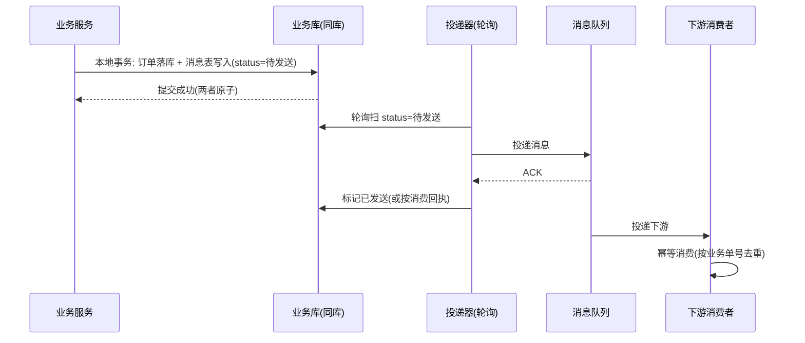
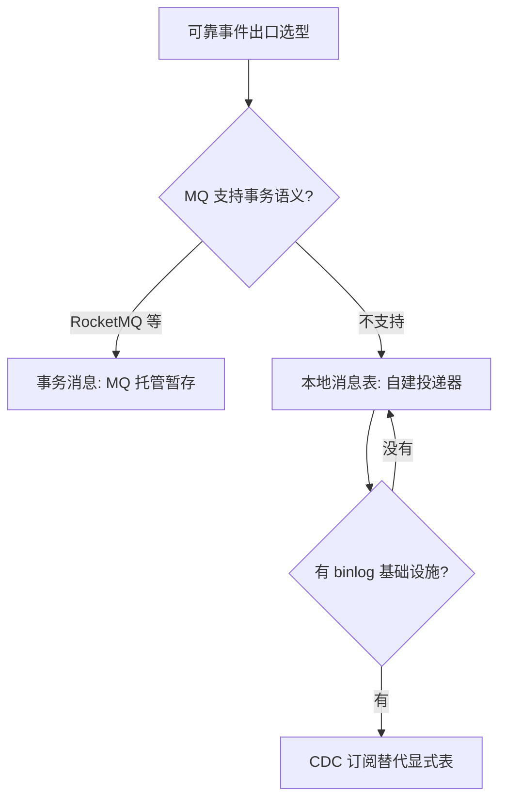

# 本地消息表

> **一句话摘要**：本地消息表是最终一致极的起点——「业务变更」与「待发消息」写在**同一个本地事务**里（原子性免费获得），后台任务轮询消息表补发到 MQ，下游幂等消费——用一张表 + 一个轮询器，把「业务成功但消息丢了」这个难题变成不可能事件。

> **本文核心**：机制链 = **业务表 + 消息表同事务落库 → 轮询/投递器扫表发 MQ → 下游幂等消费 → 成功后标记/归档**——原子性由「同库同事务」保证（不依赖任何分布式协议），可靠性由「消息在库里、不成功不罢休」保证；它是一切可靠消息方案（含事务消息）的原型。

前置阅读：[方案全景](./2_分布式事务方案全景-入门.md)。幂等消费见[理论系列幂等篇](../../../distributed-theory/入门层/从零开始认识分布式理论系列/10_幂等与去重-入门.md)。MQ 削峰语境见[异步削峰](../../../distributed-system-design/入门层/从零开始认识分布式系统设计系列/5_异步削峰-入门.md)。

## 1. 背景：为什么「先提交再发消息」不可靠

下游服务需要的触发信号是 MQ 消息。朴素做法「本地事务提交成功后 `mq.send(msg)`」有个致命缝：**提交成功、发送失败（网络抖动/MQ 宕机/进程崩溃在两步之间）**——业务成了、消息没了，下游永远不知道。反过来「先发消息再提交」也有缝：消息发了、事务回滚了——下游收到幽灵消息。

问题的本质：**跨「数据库事务」与「MQ 发送」两个系统，没有原子操作可用**（组 1 的失效分析在此重演）。本地消息表的解法聪明而朴素：**把「发消息」这件事降维成「写一行数据」**——写消息表和业务表在同一个本地事务里，原子性由数据库白送；发送这件事从「请求路径」挪到「后台补偿」，失败可无限重试。

## 2. 核心机制：同事务落库 + 轮询补发



机制四要点：

- **消息表设计**：核心字段 = 业务单号（幂等键）、消息体（或引用）、状态（待发送/已发送/失败计数）、下次重试时间。与业务表**同库**（这是原子性的前提——跨库就失效了）。
- **投递器（轮询）**：定时扫表 → 发 MQ → 标记。重试策略指数退避 + 最大次数告警（超限转人工——消息积压了说明下游或 MQ 有系统性问题）。
- **下游幂等消费**：投递器「至少一次」送达，下游按业务单号去重（幂等三层的第二层在此收口）。
- **状态回收**：已发送消息归档/TTL 清理，防表膨胀。

变体两个：**消息表 + 事件逻辑同服务**（最常见）；**共享事件表**（多服务读同一事件库，耦合高少用）。所有变体的不变式只有一条：**消息记录与业务变更原子**。

## 3. 落地实践：从零搭一张本地消息表

```sql
CREATE TABLE local_message (
  id BIGINT PRIMARY KEY AUTO_INCREMENT,
  biz_key VARCHAR(64) NOT NULL,          -- 业务单号(下游幂等键)
  topic VARCHAR(64) NOT NULL,
  payload TEXT NOT NULL,                  -- 消息体(JSON)
  status TINYINT DEFAULT 0,               -- 0待发送 1已发送 2死信
  retry_count INT DEFAULT 0,
  next_retry_time DATETIME,
  created_at DATETIME,
  UNIQUE KEY uk_biz (biz_key, topic)      -- 同一业务同主题只发一条
);
-- 业务事务内: INSERT 订单 + INSERT local_message (同一事务)
-- 投递器: 每 N 秒扫 status=0 AND next_retry_time<=now, 发MQ后置1, 失败retry_count+1并退避
```

三条纪律：① **payload 放「事实」不放「指令」**——「订单已创建」（事实，下游自行决定做什么）优于「请给用户加积分」（指令，业务耦合到消息里）；② **biz_key 即幂等键**贯穿上下游；③ 死信（retry 超限）必须有告警与人工出口。

## 4. 生产视角：本地消息表的事故形态

- **轮询延迟被当成「消息丢了」**：业务方报「下游没收到」，排查发现投递器周期 30 秒 + 扫描批次积压——消息只是慢不是丢。监控把「待发送滞留时长」做成 SLA 指标（P99 滞留 < N 秒），消除「丢没丢」的猜谜。
- **表膨胀拖垮业务库**：消息表与业务同库，百万级滞留（MQ 长故障）把业务查询一起拖慢——归档策略（已发送按天搬走）+ 滞留量告警是标配；MQ 长故障时的「消息落盘到文件/降级」预案要有。
- **投递器单点**：一个投递器实例挂了没人补发——投递器要多实例 + 任务分片（按 id 取模）或抢占锁；它本质是一个「自带状态的消费者」，按消费者的高可用纪律治理。
- **payload 版本演进**：消息体字段变更后，旧消息被新消费者解析失败——消息体带版本号，消费者兼容 N-1 版本（或只发 ID 让下游回查，见事务消息篇的回查思想）。

## 5. 主流系统怎么做：与事务消息的对照

| 维度 | 本地消息表 | 事务消息（RocketMQ） |
|---|---|---|
| 原子性载体 | 业务库自己的事务 | MQ 的半消息 + 本地事务 + 回查 |
| 基础设施依赖 | 只要数据库（最朴素） | 依赖 MQ 支持事务消息语义 |
| 运维负担 | 自己管消息表/投递器 | MQ 承担存储与回查，但回查逻辑仍要业务实现 |
| 适用 | 无事务消息能力的 MQ / 想要完全可控 | 已用 RocketMQ、不想自建投递器 |

规律：**两者是同一思想的两种托管方式**——「消息与业务原子绑定」不变，区别在「消息暂存区」放在业务库（表）还是 MQ（半消息）。实现层细节归本仓库 RocketMQ 系列事务消息专题（单源原则：机制在这里，实现在那里）。

## 6. 典型场景

- **订单 → 积分/通知**（经典级）：订单创建成功同事务写消息，投递器补发——副作用的最终一致标准链。
- **跨系统数据同步**（集成级）：与外部系统的数据最终一致（不能要求对方上 TCC）——消息表是「对外契约」的最稳载体。
- **CQRS 读模型更新**（架构级）：写库变更 → 消息表 → 投递 → 读模型更新——事件驱动读模型的可靠起点。

## 7. 与相邻概念的区别

- **本地消息表 vs 事务消息**：暂存区在业务库 vs 在 MQ（上一篇对照表）——机制同源，托管方不同。
- **消息表 vs Outbox 模式**：同一个东西的两种叫法——「本地消息表」是国内工程语境，「Transactional Outbox」是国际术语（DDIA/微服务模式文献）；见到 Outbox 不要当成新东西。
- **消息表 vs MQ 的事务/重试机制**：MQ 的重试保「MQ 内部不丢」，保不了「业务成功但消息从未进入 MQ」——消息表补的正是这段缝隙。
- **轮询投递 vs CDC 订阅**：投递器轮询消息表 vs 用 binlog 订阅（CDC）直接捕获业务变更——CDC 省了一张表，但引入 binlog 解析基础设施；两者都是「业务成功 → 必有事件」的可靠化（CDC 是「消息表」的隐式版）。

## 8. 常见误区与不适用

- **「写消息表后同步再发一次，双保险」**：同步发送成功也要等轮询确认（或直接标已发送）——双路径要收敛到一个状态源，否则状态机混乱；惯例是只走轮询（简单可靠）或「同步发送成功即标记」的优化路径。
- **「消息表在从库/别的库」**：跨库 = 原子性消失——必须与业务表同库同实例；这个前提破坏后整套机制归零。
- **「死信放着下次再试」**：死信是系统性故障信号（MQ 不可用/下游契约变了）——告警 + 人工出口必须有，静默重试是掩耳盗铃。
- **「下游会去重，我发重复没关系」**：投递器「至少一次」是设计内行为，但 biz_key 唯一约束防的是「上游重复产生」——两层幂等各自负责，别互相指望。
- **不适用**：需要「同步回执」的强一致场景（消息是异步的）；业务库写压力极限的极端场景（表 + 轮询的额外写放大要评估）；无幂等能力的下游（先补下游幂等，再上消息表）。

## 9. 你们可能会问

- **轮询周期设多少？** 按「下游可接受的延迟 SLA」倒推：SLA 5 秒 → 周期 1-2 秒 + 批量扫描；SLA 分钟级 → 秒到十秒级都行。周期越短 DB 扫描越频繁——索引（status+next_retry_time）与批量上限要配套。
- **消息体放什么？** 事实 + 最小上下文 + 版本号；大对象放存储引用（OSS 链接）——消息是「通知发生了什么」，不是「数据总线」。
- **怎么保证投递器不重发（已发送但标记失败）？** 不保证——「至少一次」语义下重发正常，下游幂等兜底；投递器的重发窗口由「标记是否原子」决定（发送成功后标记失败会重发一次，接受）。
- **本地消息表和事件溯源什么关系？** 消息表是「出口事件的可靠投递」；事件溯源是「以事件为事实源」的架构——后者重得多；消息表方案里业务表仍是事实源，消息只是通知。
- **迁移到事务消息值得吗？** 已有稳定消息表就别为换而换——新增 MQ 具备事务语义且投递器维护成本疼时再迁；两者可以长期共存（不同链路不同选择）。

## 10. 一句话总结 + 5W 速记卡 + 自测三问

**🎯 核心带走**：

- **核心一句话**：本地消息表 = 把「发消息」降维成「写一行」——业务与消息同事务，原子性白送，可靠性靠轮询补发 + 下游幂等。
- **链条复述**：同库同事务落库（业务+消息）→ 投递器扫表发 MQ（退避+死信）→ 下游按 biz_key 幂等消费 → 归档清理。
- **失效点与边界**：跨库即失效（同库前提）；异步语义（同步回执场景不适用）；表膨胀要有归档预案。

**5W 速记卡**：

| 维度 | 内容 |
|---|---|
| What | 消息表 + 轮询投递器 + 下游幂等的三件套 |
| Why | 「提交后发消息」的两步缝补不上，原子性要同库事务白送 |
| When | 副作用通知、跨系统同步、读模型更新——一切可靠事件出口 |
| Where | 业务库（消息表）+ 投递器 + MQ + 下游幂等 |
| How | 同事务写入 → 索引扫表 → 退避重试 → 死信告警 → 归档 |

💡 **实战提示**：biz_key 唯一约束是上游防重的根；payload 放事实放版本；滞留时长做 SLA 监控；死信告警 + 人工出口不可省。

**开放问题**：CDC（binlog 订阅）成熟后，「显式消息表」会被「隐式变更捕获」全面替代吗——业务语义的显式表达（表）与基础设施减负（CDC）怎么权衡？

**决策（何时用）**：一切「业务成功必须通知下游」的场景推荐消息表/Outbox 起步；MQ 支持事务语义且团队不想维护投递器时推荐事务消息；推荐「先消息表后按需演进」——朴素方案的可观测性最好排查。

**Trade-off（代价与反方案）**：本地消息表用「一张表 + 轮询的开发运维」换「零依赖的可靠投递」；反方案——事务消息（MQ 托管暂存区，代价是 MQ 绑定 + 回查实现）、CDC（免表，代价是 binlog 基础设施）、同步调用（免投递，代价是耦合与可用性联动）。

**演进视角**：Outbox 模式从邮件系统的朴素实践（2000s）到微服务模式文献的标准化（2018 前后）再到 CDC 工具链的产品化——「可靠事件出口」的需求从未变，实现从手工表走向基础设施化。

---

**下篇预告**：把消息暂存区交给 MQ 托管——下一篇[事务消息](./10_事务消息-入门.md)讲半消息与回查机制如何替代消息表。

---



## 📌 数据与事实声明

本地消息表/Transactional Outbox 模式为微服务领域公开模式（DDIA、微服务设计模式文献）；DDL 与投递流程为通用工程实践的教学化示例；与 RocketMQ 事务消息的对照为官方文档机制级概括。以官方文档为准。

## 📚 参考资料

| 类型 | 标题 | 来源 |
|---|---|---|
| 图书 | 数据密集型应用系统设计（DDIA）第 11 章 | O'Reilly（2017 中译） |
| 模式 | Transactional Outbox（微服务模式） | microservices.io |
| 系列文章 | 事务消息（本系列下一篇） | 本仓库同系列 |
| 系列文章 | 幂等与去重（理论系列） | 本仓库 distributed-theory/ |
