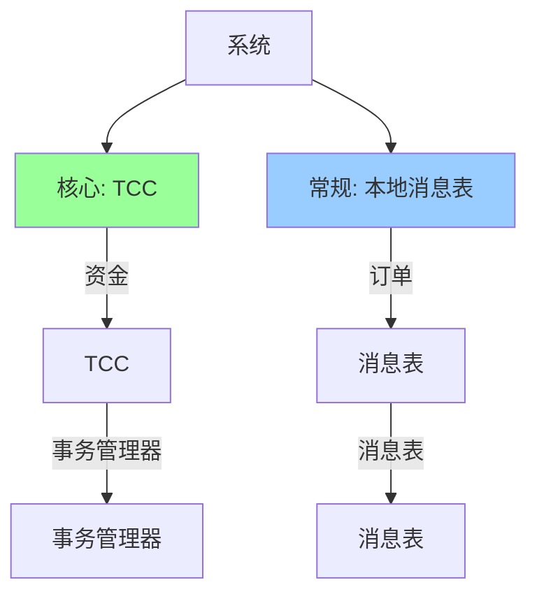

# 从零实现分布式事务框架（TCC + 本地消息表）

> **一句话摘要**：用代码实现分布式事务的两种核心模式——TCC（强一致）+ 本地消息表（最终一致）。
> **本文核心**：**实现 = 事务管理器 + 资源管理器 + 补偿机制**。

前置阅读：[TCC 补偿事务](./特性层/深入理解TCC系列/1_TCC补偿事务深度解析-特性.md)、[本地消息表](../分布式事务/入门层/从零开始认识分布式事务系列/9_本地消息表-入门.md)。本篇将理论转化为可运行代码。

## 1. 背景：为什么要实现

> 量级分档意识：本文方法在十万级 QPS、千万级用户、亿级流量的场景下均需重新评估——量级变化时架构与参数需同步调整。


看懂分布式事务不等于会用——实现过程才能理解：

- 事务管理器的设计
- 补偿机制的实现
- 消息可靠性的保证

通过实现，掌握分布式事务的工程实践。

## 2. 核心机制：TCC 实现

### 2.1 事务管理器

```java
// 分布式事务管理器
public class DistributedTxManager {
    
    // 全局事务ID
    private String globalTxId;
    
    // 分支事务列表
    private List<BranchTx> branches = new ArrayList<>();
    
    // 事务状态
    private TxStatus status; // INIT/TRYCOMMIT/CANCEL/COMPLETED
    
    public String begin() {
        this.globalTxId = generateTxId();
        this.status = TxStatus.INIT;
        persistTx(); // 持久化
        return globalTxId;
    }
    
    public void try(String service, String action, Map<String, Object> params) {
        BranchTx branch = new BranchTx(globalTxId, service, action, params);
        boolean result = callService(service, action, params, "try");
        if (result) {
            branch.setStatus(BranchStatus.TRIED);
            branches.add(branch);
        } else {
            rollback();
        }
        persistBranch(branch);
    }
    
    public void commit() {
        for (BranchTx branch : branches) {
            boolean result = callService(branch.getService(), "confirm", branch.getParams());
            if (!result) {
                // Confirm失败，触发Cancel补偿
                compensate(branch);
            }
        }
        this.status = TxStatus.COMPLETED;
        persistTx();
    }
    
    public void rollback() {
        for (BranchTx branch : branches) {
            compensate(branch);
        }
        this.status = TxStatus.CANCEL;
        persistTx();
    }
    
    private void compensate(BranchTx branch) {
        callService(branch.getService(), "cancel", branch.getParams());
    }
}
```

### 2.2 资源管理器

```java
// TCC 资源管理器
public class AccountResourceManager {
    
    // Try: 冻结金额
    public boolean tryDeduct(String userId, BigDecimal amount) {
        Account account = accountMapper.selectForUpdate(userId);
        if (account.getFrozenBalance().add(amount).compareTo(account.getTotalBalance()) > 0) {
            return false;
        }
        account.setFrozenBalance(account.getFrozenBalance().add(amount));
        accountMapper.update(account);
        return true;
    }
    
    // Confirm: 确认扣减
    public boolean confirmDeduct(String userId, BigDecimal amount) {
        Account account = accountMapper.selectForUpdate(userId);
        if (account.getFrozenBalance().compareTo(amount) < 0) {
            return false; // 空回滚
        }
        account.setFrozenBalance(account.getFrozenBalance().subtract(amount));
        account.setBalance(account.getBalance().subtract(amount));
        accountMapper.update(account);
        return true;
    }
    
    // Cancel: 取消释放
    public boolean cancelDeduct(String userId, BigDecimal amount) {
        Account account = accountMapper.selectForUpdate(userId);
        if (account.getFrozenBalance().compareTo(amount) < 0) {
            return true; // 空回滚（Confirm已经执行）
        }
        account.setFrozenBalance(account.getFrozenBalance().subtract(amount));
        accountMapper.update(account);
        return true;
    }
}
```

## 3. 落地实践：本地消息表实现

### 3.1 消息表结构

```sql
-- 本地消息表
CREATE TABLE transaction_message (
    id BIGINT PRIMARY KEY AUTO_INCREMENT,
    transaction_id VARCHAR(64) NOT NULL, -- 全局事务ID
    message_body JSON NOT NULL,          -- 消息内容
    status VARCHAR(20) NOT NULL,         -- PENDING/SENT/COMMITTED/FAILED
    retry_count INT DEFAULT 0,           -- 重试次数
    created_at TIMESTAMP DEFAULT CURRENT_TIMESTAMP,
    updated_at TIMESTAMP DEFAULT CURRENT_TIMESTAMP ON UPDATE CURRENT_TIMESTAMP,
    INDEX idx_transaction_id (transaction_id),
    INDEX idx_status (status)
);
```

### 3.2 消息发送流程

```java
// 本地消息表模式
@Transactional
public void placeOrder(Order order) {
    // 1. 本地事务：创建订单 + 记录消息
    orderMapper.insert(order);
    
    TransactionMessage message = new TransactionMessage();
    message.setTransactionId(generateTxId());
    message.setMessageBody(JSON.toJSONString(order));
    message.setStatus("PENDING");
    messageMapper.insert(message);
}

// 2. 定时任务：发送消息
@Scheduled(fixedDelay = 1000)
public void sendPendingMessages() {
    List<TransactionMessage> messages = messageMapper.selectByStatus("PENDING");
    for (TransactionMessage msg : messages) {
        try {
            mq.send(msg.getMessageBody());
            msg.setStatus("SENT");
            messageMapper.update(msg);
        } catch (Exception e) {
            // 重试
            msg.setRetryCount(msg.getRetryCount() + 1);
            if (msg.getRetryCount() > MAX_RETRY) {
                msg.setStatus("FAILED");
            }
            messageMapper.update(msg);
        }
    }
}
```

### 3.3 消息消费与幂等

```java
// 消费者
@RocketMQMessageListener(topic = "order-topic", consumerGroup = "order-group")
public void onMessage(String messageBody) {
    Order order = JSON.parseObject(messageBody, Order.class);
    
    // 幂等检查
    if (orderMapper.existsByOrderId(order.getOrderId())) {
        return; // 已经处理过
    }
    
    // 处理业务逻辑
    processOrder(order);
}
```

## 4. 落地实践：混合模式

实际系统中，TCC + 本地消息表混合使用：



## 5. 落地实践：完整架构

```java
// 分布式事务框架主入口
public class TxFramework {
    
    public static void main(String[] args) {
        // 1. 初始化事务管理器
        TxManager manager = new TxManager();
        manager.setPersistence(new FilePersistence());
        manager.setCompensator(new DefaultCompensator());
        
        // 2. 开始事务
        String txId = manager.begin();
        
        // 3. 注册分支
        manager.try("account-service", "deduct", params);
        manager.try("inventory-service", "decrease", params);
        
        // 4. 提交或回滚
        try {
            manager.commit();
        } catch (Exception e) {
            manager.rollback();
        }
    }
}
```

## 6. 生产视角：实现踩坑

- **踩坑 1**：事务管理器单点故障——需要高可用
- **踩坑 2**：消息表和本地事务不同步——需要本地事务保证
- **踩坑 3**：补偿失败——需要人工兜底
- **踩坑 4**：消息重复消费——需要幂等

**生产最佳实践**：

1. 事务管理器高可用部署
2. 本地消息表必须在本地事务中
3. 补偿失败有人工兜底
4. 消费者幂等处理
5. 监控事务状态

## 7. 典型场景

| 场景 | 模式 | 实现要点 |
|---|---|---|
| 资金转账 | TCC | Try冻结 + Confirm扣减 |
| 订单创建 | 消息表 | 本地事务 + 消息发送 |
| 跨服务同步 | 混合 | 核心TCC + 非核心消息表 |
| 金融清算 | Raft | 强一致 |

## 8. 你们可能会问

- **实现分布式事务框架难吗？** 中等——需要处理很多边界情况
- **需要自己实现吗？** 不需要——Seata/RocketMQ 已提供
- **消息表和 TCC 能结合吗？** 能——混合模式
- **性能如何？** 取决于方案——TCC 高，消息表中

## 9. 一句话总结 + 5W 速记卡 + 自测三问

**一句话总结**：实现 = 事务管理器 + 资源管理器 + 补偿机制 + 消息可靠性。

**5W 速记卡**：

| 维度 | 内容 |
|---|---|
| What | TCC + 本地消息表 |
| Why | 掌握分布式事务工程实践 |
| When | 实现阶段 |
| Where | 所有分布式事务 |
| How | 事务管理器 + 资源管理器 + 补偿 + 消息表 |

**自测三问**：

1. 你的 TCC 实现处理空回滚了吗？
2. 你的消息表和本地事务在同一个事务中吗？
3. 你的消费者幂等吗？

---

**整合层完结**：从零实现分布式事务框架的完整实践已建立。

**🎯 核心带走**：

- **核心一句话**：TCC = Try/Confirm/Cancel + 事务管理器；消息表 = 本地事务 + 消息发送
- **链条复述**：Begin → Try → Commit/Rollback → 补偿
- **失效点与边界**：事务管理器单点；补偿失败需人工

💡 **实战提示**：TCC 核心是空回滚和悬挂防护；消息表核心是本地事务保证。

**开放问题**：分布式事务框架能自动化吗？答案是：框架已经封装了大部分——Seata/RocketMQ 开箱即用。

**决策（何时用）**：学习用实现；生产用 Seata/RocketMQ。

## 📌 数据与事实声明

- 写于 2026-09-11
- 免责：以官方文档为准

## 📚 参考资料

| 类型 | 标题 | 来源 |
|---|---|---|
| 官方文档 | 官方文档 | 官方站点 |
