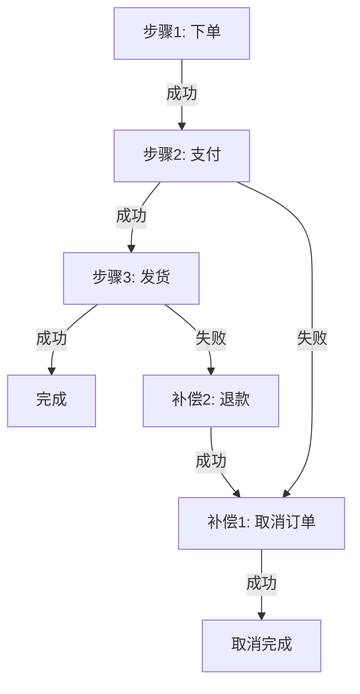
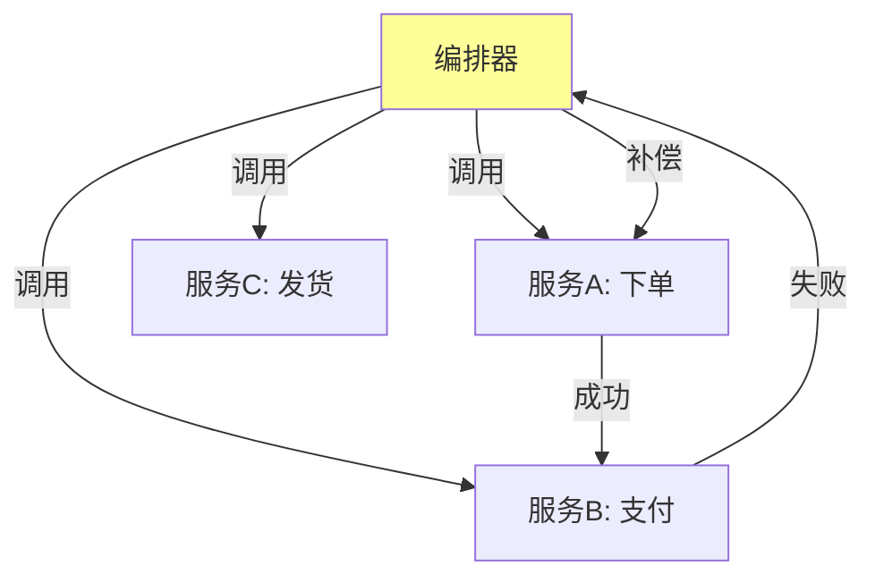
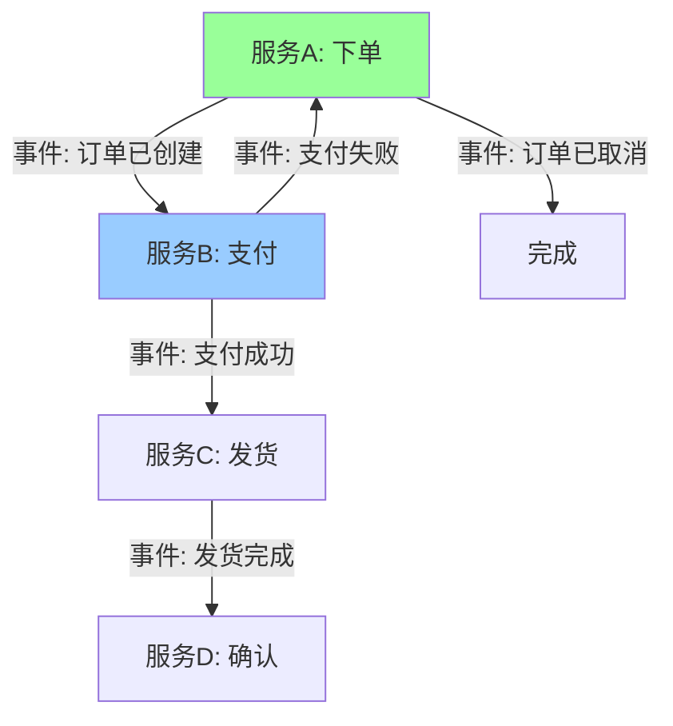

# Saga 长事务深度解析

> **一句话摘要**：Saga = 一系列本地事务 + 补偿链——每个步骤都提交，一旦失败反向执行补偿。
> **本文核心**：**Saga = 正向执行 + 反向补偿 + 编排/协调**。

前置阅读：[Saga 长事务](../分布式事务/入门层/从零开始认识分布式事务系列/7_Saga长事务-入门.md)。本篇深入 Saga 的实现机制和架构模式。

## 1. 背景：为什么需要 Saga

> 量级分档意识：本文方法在十万级 QPS、千万级用户、亿级流量的场景下均需重新评估——量级变化时架构与参数需同步调整。


TCC 适合短事务，但有些场景是长事务（分钟级甚至小时级）：

- 电商下单：下单 → 支付 → 发货 → 确认收货
- 旅行预订：订机票 → 订酒店 → 订车
- 金融审批：申请 → 审核 → 审批 → 放款

Saga 适合长事务：**每个步骤独立提交，失败时反向补偿**。



## 2. 核心机制：两种模式

### 2.1 编排式 Saga（Orchestration）

中心编排器控制流程：



**编排器职责**：
- 协调各服务执行顺序
- 记录执行状态
- 失败时触发补偿链

### 2.2 协调式 Saga（Choreography）

各服务自行通知下一个服务：



**协调式特点**：
- 无中心节点
- 通过事件驱动
- 服务间解耦

## 3. 落地实践：编排式 Saga 实现

### 3.1 编排器实现

```java
// Saga 编排器
public class OrderSagaOrchestrator {
    
    public void executeOrderSaga(OrderRequest request) {
        try {
            // Step 1: 创建订单
            Order order = orderService.createOrder(request);
            sagaContext.setStep1(order.getId());
            
            // Step 2: 扣款
            Payment payment = paymentService.deduct(order.getUserId(), order.getAmount());
            sagaContext.setStep2(payment.getId());
            
            // Step 3: 发货
            Shipping shipping = shippingService.ship(order.getId());
            sagaContext.setStep3(shipping.getId());
            
            // 完成
            sagaContext.markComplete();
            
        } catch (Exception e) {
            // 补偿链
            compensate();
        }
    }
    
    private void compensate() {
        // 反向补偿：先取消发货，再退款，再取消订单
        String shippingId = sagaContext.getStep3();
        if (shippingId != null) {
            shippingService.cancelShip(shippingId);
        }
        String paymentId = sagaContext.getStep2();
        if (paymentId != null) {
            paymentService.refund(paymentId);
        }
        String orderId = sagaContext.getStep1();
        if (orderId != null) {
            orderService.cancelOrder(orderId);
        }
    }
}
```

### 3.2 状态持久化

Saga 状态必须持久化（防止编排器挂了）：

```sql
-- Saga 状态表
CREATE TABLE saga_state (
    saga_id VARCHAR(64) PRIMARY KEY,  -- Saga ID
    current_step INT,                  -- 当前步骤
    status VARCHAR(20),                -- RUNNING/COMPENSATING/COMPLETED
    step_data JSON,                    -- 各步骤数据
    created_at TIMESTAMP,
    updated_at TIMESTAMP
);
```

### 3.3 补偿策略

```java
// 补偿链：每一步都要有补偿
public interface SagaStep {
    String execute(SagaContext ctx);    // 正向执行
    boolean compensate(SagaContext ctx, String stepData); // 反向补偿
}

// 订单Saga步骤
SagaStep createOrderStep = new SagaStep() {
    public String execute(SagaContext ctx) {
        return orderService.create(ctx.getRequest());
    }
    public boolean compensate(SagaContext ctx, String orderId) {
        return orderService.cancel(orderId);
    }
};
```

## 4. 落地实践：协调式 Saga 实现

### 4.1 事件驱动

```java
// 服务A完成 → 发事件 → 服务B执行
@Service
public class OrderService {
    @Transactional
    public Order createOrder(OrderRequest request) {
        Order order = doCreate(request);
        eventPublisher.publish(new OrderCreatedEvent(order.getId())); // 发事件
        return order;
    }
}

@Service
public class PaymentService {
    @EventListener
    public void handleOrderCreated(OrderCreatedEvent event) {
        paymentService.deduct(event.getOrderId(), event.getAmount());
        eventPublisher.publish(new PaymentCompletedEvent(event.getOrderId()));
    }
}
```

### 4.2 事件可靠性保障

```mermaid
flowchart TD
    S1[服务A: 创建订单] -->|本地事务+发消息| MQ[消息队列]
    MQ -->|可靠投递| S2[服务B: 扣款]
    S2 -->|本地事务+发消息| MQ2[消息队列]
    MQ2 -->|可靠投递| S3[服务C: 发货]
    
    Note over S1,S3: 每步本地事务+发消息保证可靠
```

## 5. 落地实践：Saga vs TCC 决策

```mermaid
flowchart TD
    S[Saga vs TCC] --> Q1{事务时长?}
    Q1 -->|短(秒级)| TCC[TCC]
    Q1 -->|长(分钟+)| Saga[Saga]
    Q2{有中心编排器吗?}
    Q2 -->|有| Orchestration[编排式]
    Q2 -->|无| Choreography[协调式]
```

| 维度 | Saga | TCC |
|---|---|---|
| 事务时长 | 长（分钟+） | 短（秒级） |
| 侵入性 | 中（需定义补偿） | 高（需三接口） |
| 一致性 | 最终一致 | 强一致 |
| 架构 | 事件驱动 | 同步调用 |
| 复杂度 | 中 | 高 |
| 适用场景 | 长流程业务 | 金融核心 |

## 6. 生产视角：Saga 踩坑

- **踩坑 1**：补偿链不完整——某个步骤没有补偿，失败时无法回滚
- **踩坑 2**：补偿失败——补偿本身也失败怎么办？
- **踩坑 3**：正序和补偿顺序不一致——顺序错了
- **踩坑 4**：长时间运行的状态管理——状态表膨胀

**生产最佳实践**：

1. 每步必须有补偿
2. 补偿也要幂等
3. 补偿失败有重试 + 人工兜底
4. 状态表定期清理
5. 监控 Saga 执行时长

## 7. 典型场景

| 场景 | 模式 | 理由 |
|---|---|---|
| 电商下单流程 | 编排式 Saga | 多步骤长流程 |
| 旅行预订 | 编排式 Saga | 多个服务协调 |
| 审批流程 | 协调式 Saga | 事件驱动，流程长 |
| 金融转账 | TCC | 短事务强一致 |
| 库存扣减 | TCC/AT | 短事务 |

## 8. 与相邻概念的区别

- **Saga vs TCC**：Saga 长事务最终一致，TCC 短事务强一致
- **Saga vs 状态机**：Saga 是流程编排，状态机是状态转换
- **Saga vs 编排式 vs 协调式**：编排有中心控制器，协调无中心
- **Saga vs BFF**：BFF 是前端聚合，Saga 是后端协调

## 9. 你们可能会问

- **Saga 的补偿能自动吗？** 能——定义好补偿链即可
- **补偿失败怎么处理？** 重试 + 人工兜底（报警）
- **Saga 能嵌套吗？** 能——子 Saga 本身可以是 Saga
- **协调式 Saga 怎么保证顺序？** 通过事件版本号/顺序号

## 10. 一句话总结 + 5W 速记卡 + 自测三问

**一句话总结**：Saga = 一系列本地事务 + 反向补偿链——适合长事务。

**5W 速记卡**：

| 维度 | 内容 |
|---|---|
| What | 正向执行 + 反向补偿 |
| Why | 长事务需要补偿 |
| When | 流程长于秒级 |
| Where | 电商/审批/预订等 |
| How | 编排式(中心) or 协调式(事件) |

**自测三问**：

1. 你的 Saga 补偿链完整吗？每步都有补偿吗？
2. 补偿失败怎么处理？
3. 你用编排式还是协调式？

---

**下篇预告**：分布式事务选型决策——[选型决策](../分布式事务/入门层/从零开始认识分布式事务系列/12_分布式事务选型决策-入门.md)。

**🎯 核心带走**：

- **核心一句话**：Saga = 正向 + 反向补偿链，适合长事务
- **链条复述**：步骤1 → 步骤2 → ... → 失败 → 反向补偿链
- **失效点与边界**：补偿失败需人工兜底

💡 **实战提示**：编排式适合有中心控制的流程，协调式适合服务间对等协作。

**开放问题**：Saga 能和 TCC 结合吗？答案是：能——长流程中的短步骤用 TCC，其他用 Saga。

**决策（何时用）**：长流程用 Saga；短事务用 TCC；非核心用 AT。

## 📌 数据与事实声明

- 写于 2026-09-11
- 免责：以官方文档为准

## 📚 参考资料

| 类型 | 标题 | 来源 |
|---|---|---|
| 官方文档 | 官方文档 | 官方站点 |
