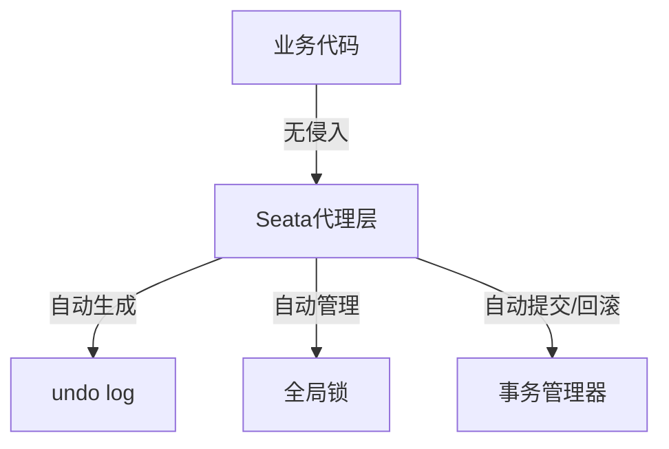
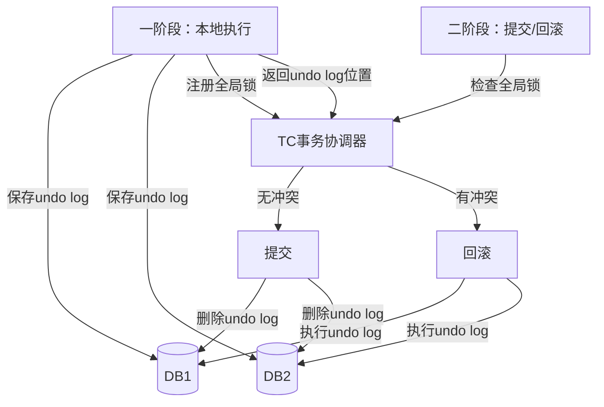

# Seata AT 模式深度解析

> **一句话摘要**：Seata AT = 自动补偿模式——业务无侵入，通过全局锁 + undo log 自动管理分布式事务的提交与回滚。
> **本文核心**：**AT = 全局锁 + undo log + 代理层**——让业务代码无感知参与分布式事务。

前置阅读：[AT 自动补偿模式](../分布式事务/入门层/从零开始认识分布式事务系列/8_AT自动补偿模式-入门.md)。本篇深入 AT 的实现机制和源码级理解。

## 1. 背景：为什么需要 AT

> 量级分档意识：本文方法在十万级 QPS、千万级用户、亿级流量的场景下均需重新评估——量级变化时架构与参数需同步调整。


TCC 要求业务实现 Try/Confirm/Cancel 三个接口，改造成本高。AT 的目标是：

- **业务无侵入**：不需要改业务代码
- **自动补偿**：自动生成 undo log，回滚自动执行
- **性能可接受**：全局锁不是悲观锁，是「提交阶段短暂锁定」



## 2. 核心机制：全局锁

### 2.1 全局锁 vs 悲观锁

| 维度 | 悲观锁 | 全局锁 |
|---|---|---|
| 锁定时间 | 整个事务期间 | 仅提交阶段 |
| 锁定粒度 | 行级 | 行级（但全局） |
| 性能 | 差（长锁定） | 好（短锁定） |
| 实现方式 | SELECT ... FOR UPDATE | 全局锁 + 冲突检测 |

### 2.2 全局锁工作原理



**关键点**：一阶段本地执行时，不加全局锁；只有二阶段才竞争全局锁。

### 2.3 undo log 机制

undo log 记录数据修改前的镜像：

```sql
-- undo log 结构
INSERT INTO undo_log (xid, branch_id, rollback_info, sql_type, table_name, pk)
VALUES ('xid-xxx', 1, '{"before": {"balance": 100}, "after": {"balance": 80}}', 'UPDATE', 'account', 1);
```

回滚时：根据 undo log 恢复数据。

## 3. 落地实践：Seata AT 配置

### 3.1 架构部署

```yaml
# Seata 部署架构
# 1. TC (Transaction Coordinator) 事务协调器
# 2. TM (Transaction Manager) 事务管理器 - 客户端
# 3. RM (Resource Manager) 资源管理器 - 客户端

seata:
  server:
    host: localhost
    port: 8091
  client:
    application-id: order-service
    tx-service-group: my_test_tx_group
```

### 3.2 全局事务使用

```java
// AT 模式使用 - 业务代码无侵入
@GlobalTransactional(name = "order-create", rollbackFor = Exception.class)
public void createOrder() {
    // 1. 创建订单（本地事务1）
    orderService.createOrder(order);
    
    // 2. 扣减库存（本地事务2）
    inventoryService.decrease(productId, count);
    
    // 3. 扣减余额（本地事务3）
    accountService.deduct(userId, amount);
}
// 三个本地事务自动注册到全局事务
// 一阶段全部提交，二阶段自动决定提交/回滚
```

### 3.3 AT 模式配置

```yaml
# Seata AT 配置
seata:
  client:
    tm:
      commit-retry-count: 5      # 提交重试次数
      rollback-retry-count: 5    # 回滚重试次数
    rm:
      report-retry-count: 3      # 汇报重试次数
      table-meta-check-enable: true
```

## 4. 落地实践：AT 的全局锁冲突

### 4.1 冲突场景

```mermaid
sequenceDiagram
    T1[事务T1: 扣余额100→80] -->|一阶段提交| Lock1[全局锁: balance=100]
    T2[事务T2: 扣余额100→80] -->|一阶段等待| Lock1
    T1 -->|二阶段: 提交| Lock1
    Lock1 -->|释放| T2
    T2 -->|二阶段: 提交| DB
    
    Note over T1,T2: T2的一阶段本地已执行，但undo log已保存
```

### 4.2 冲突解决

- **读锁**：一阶段本地执行时，读取时检查全局锁
- **写锁**：二阶段提交时，检查是否有冲突
- **冲突策略**：先来先得（默认）/ 随机回滚

```java
// 全局锁冲突检测
public boolean checkConflict(String xid, String tableName, Object pk) {
    GlobalLock lock = lockStore.findGlobalLock(xid, tableName, pk);
    return lock != null && !lock.getOwner().equals(currentXid);
}
```

## 5. 落地实践：AT 与 TCC 对比

| 维度 | AT 模式 | TCC 模式 |
|---|---|---|
| 业务侵入 | 无 | 高（需实现三接口） |
| 性能 | 中（全局锁） | 高（无全局锁） |
| 一致性 | 最终一致 | 强一致 |
| 复杂度 | 低 | 高 |
| 适用场景 | 通用场景 | 金融核心场景 |
| 回滚 | 自动 | 手动实现 |

## 6. 生产视角：AT 踩坑

- **踩坑 1**：全局锁冲突导致大量回滚——热点数据场景 AT 性能差
- **踩坑 2**：undo log 表未初始化——导致 AT 模式不可用
- **踩坑 3**：大事务导致全局锁持有时间长——影响并发
- **踩坑 4**：AT 不支持跨库事务的隔离级别——默认读未提交

**生产最佳实践**：

1. AT 适合非核心业务（订单、积分等）
2. 金融核心交易用 TCC（强一致）
3. undo log 表必须初始化
4. 事务时长控制在秒级
5. 监控全局锁冲突率

## 7. 典型场景

| 场景 | 方案 | 理由 |
|---|---|---|
| 订单创建 | AT | 无侵入，自动管理 |
| 积分变动 | AT | 非核心，AT 足够 |
| 库存扣减 | AT/TCC | AT 有冲突风险时用 TCC |
| 金融转账 | TCC | 强一致要求 |
| 跨服务数据同步 | AT | 简单场景 |

## 8. 与相邻概念的区别

- **AT vs 2PC**：2PC 是协议，AT 是实现——AT 基于 2PC 的思想，但优化了锁机制
- **AT vs TCC**：AT 无侵入但有全局锁，TCC 高侵入但无全局锁
- **AT vs Saga**：AT 适合短事务，Saga 适合长事务
- **Seata AT vs 本地消息表**：AT 更简单但需要 Seata 组件

## 9. 你们可能会问

- **AT 是强一致还是最终一致？** 最终一致——一阶段提交后，二阶段可能回滚
- **全局锁的性能瓶颈在哪？** TC 节点的锁竞争
- **AT 能处理大事务吗？** 不推荐——大事务导致全局锁持有时间长
- **Seata 和 Spring Cloud 集成难吗？** 简单——一个 `@GlobalTransactional` 注解

## 10. 一句话总结 + 5W 速记卡 + 自测三问

**一句话总结**：Seata AT = 业务无侵入 + 全局锁 + undo log 自动补偿。

**5W 速记卡**：

| 维度 | 内容 |
|---|---|
| What | 自动补偿模式，业务无侵入 |
| Why | TCC 改造成本高，AT 零改造 |
| When | 通用分布式事务场景 |
| Where | 所有微服务 |
| How | 全局锁 + undo log + 代理层 |

**自测三问**：

1. 你的场景适合 AT 还是 TCC？
2. AT 的全局锁冲突怎么处理？
3. undo log 表初始化了吗？

---

**下篇预告**：TCC 补偿事务——[TCC 补偿事务](../分布式事务/入门层/从零开始认识分布式事务系列/6_TCC补偿事务-入门.md)。

**🎯 核心带走**：

- **核心一句话**：AT = 业务零侵入 + 全局锁（短锁定）+ undo log 自动回滚
- **链条复述**：一阶段（本地执行+保存undo）→ 二阶段（提交/回滚，全局锁控制）
- **失效点与边界**：热点数据冲突多；大事务性能差

💡 **实战提示**：AT 适合非核心业务；金融核心用 TCC。

**开放问题**：AT 能和 TCC 混用吗？答案是：能——同一个全局事务中不同分支可以用不同模式，但复杂度增加。

**决策（何时用）**：通用场景用 AT；金融核心用 TCC；长事务用 Saga。

## 📌 数据与事实声明

- 写于 2026-09-11
- 免责：以官方文档为准

## 📚 参考资料

| 类型 | 标题 | 来源 |
|---|---|---|
| 官方文档 | 官方文档 | 官方站点 |
