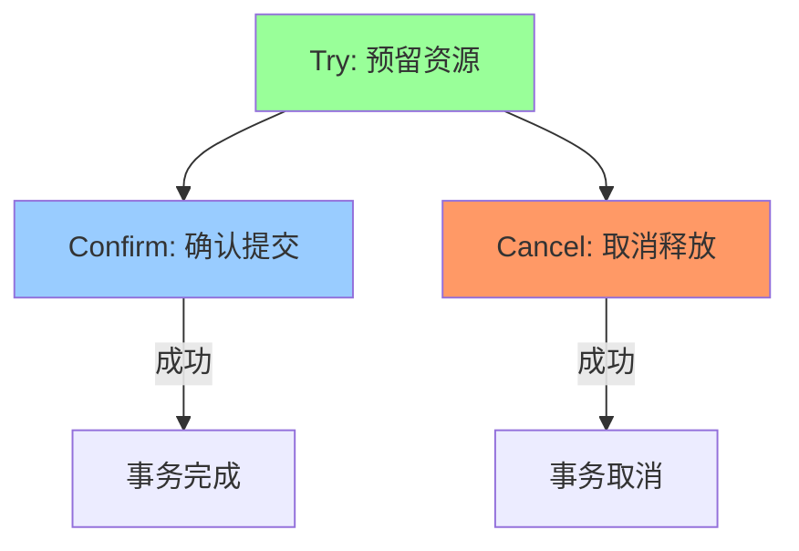
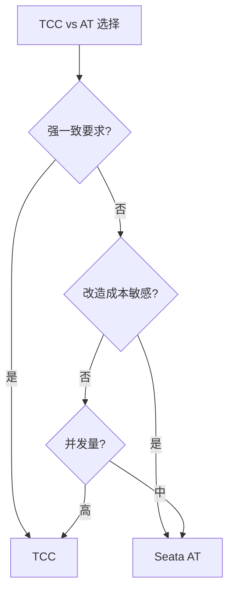

# TCC 补偿事务深度解析

> **一句话摘要**：TCC = Try-Confirm-Cancel——将事务拆为三个阶段，通过预留资源 + 确认 + 取消实现分布式事务。
> **本文核心**：**TCC = 资源预留 + 幂等 + 空回滚处理**。

前置阅读：[TCC 补偿事务](../分布式事务/入门层/从零开始认识分布式事务系列/6_TCC补偿事务-入门.md)。本篇深入 TCC 的实现细节和工程实践。

## 1. 背景：为什么需要 TCC

> 量级分档意识：本文方法在十万级 QPS、千万级用户、亿级流量的场景下均需重新评估——量级变化时架构与参数需同步调整。


AT 模式有全局锁的性能问题。TCC 通过「业务自己控制」避免了全局锁：

- 无全局锁 → 高并发
- 但需要业务实现三接口 → 改造成本高

TCC 的核心思想：**把「资源预留」和「实际提交」分开**。



## 2. 核心机制：三阶段

### 2.1 Try 阶段（资源预留）

- 冻结金额（不实际扣款）
- 预扣库存（不实际减库存）
- 冻结额度（不实际使用额度）

```java
// Try 阶段：冻结，不真正扣减
public boolean tryDeduct(String userId, BigDecimal amount) {
    Account account = accountMapper.selectForUpdate(userId);
    if (account.getFrozenBalance().add(amount).compareTo(account.getTotalBalance()) > 0) {
        return false; // 余额不足
    }
    account.setFrozenBalance(account.getFrozenBalance().add(amount));
    accountMapper.update(account);
    return true;
}
```

**Try 的核心**：资源冻结，不影响实际业务数据。

### 2.2 Confirm 阶段（确认提交）

- 真正扣减冻结的金额
- 真正减扣预扣的库存

```java
// Confirm 阶段：确认扣减
public boolean confirmDeduct(String userId, BigDecimal amount) {
    Account account = accountMapper.selectForUpdate(userId);
    if (account.getFrozenBalance().compareTo(amount) < 0) {
        return false; // 冻结金额不足（空回滚）
    }
    account.setFrozenBalance(account.getFrozenBalance().subtract(amount));
    account.setBalance(account.getBalance().subtract(amount));
    accountMapper.update(account);
    return true;
}
```

**Confirm 的核心**：幂等执行，确保不重复扣减。

### 2.3 Cancel 阶段（取消释放）

- 释放冻结的金额
- 恢复预扣的库存

```java
// Cancel 阶段：取消释放
public boolean cancelDeduct(String userId, BigDecimal amount) {
    Account account = accountMapper.selectForUpdate(userId);
    if (account.getFrozenBalance().compareTo(amount) < 0) {
        // 空回滚：冻结金额已经不够（Confirm可能已经执行）
        return true; // 幂等，直接返回成功
    }
    account.setFrozenBalance(account.getFrozenBalance().subtract(amount));
    accountMapper.update(account);
    return true;
}
```

**Cancel 的核心**：幂等执行 + 空回滚处理。

## 3. 落地实践：TCC 三大难题

### 3.1 幂等性

Confirm/Cancel 可能重复执行（网络重试）：

```java
// 幂等方案：事务ID去重
public boolean confirmDeduct(String txId, String userId, BigDecimal amount) {
    if (txIdRecord.exists(txId)) {
        return true; // 已经执行过，直接返回成功
    }
    // 执行业务逻辑
    doConfirm(txId, userId, amount);
    txIdRecord.save(txId); // 记录已执行
    return true;
}
```

### 3.2 空回滚

Confirm 已经执行，Cancel 被触发：

```java
// 空回滚检测
public boolean cancelDeduct(String txId, String userId, BigDecimal amount) {
    Account account = accountMapper.selectForUpdate(userId);
    // 冻结金额为0说明Confirm已经执行了（空回滚）
    if (account.getFrozenBalance().compareTo(amount) < 0) {
        return true; // 空回滚，直接返回成功
    }
    // 正常Cancel
    return doCancel(txId, userId, amount);
}
```

### 3.3 悬挂

Cancel 先于 Try 执行（Try 因网络延迟未到达）：

```java
// 悬挂防护：Try 记录状态
public boolean tryDeduct(String txId, String userId, BigDecimal amount) {
    if (txRecord.exists(txId, "canceled")) {
        return false; // 已经Cancel了，悬挂防护
    }
    // 正常Try
    return doTry(txId, userId, amount);
}
```

## 4. 落地实践：TCC 框架选择

| 框架 | 语言 | 特点 | 适用场景 |
|---|---|---|---|
| ByteTCC | Java | 成熟，Spring 集成 | Java 微服务 |
| TCC-Transaction | Java | 轻量，易用 | Java 项目 |
| Seata TCC | Java | 生态完善 | Seata 用户 |
| ServiceComb | Java | 华为开源 | 华为生态 |
| Go-TCC | Go | Go 生态 | Go 项目 |

**Seata TCC 配置**：

```java
// Seata TCC 使用
@TwoPhaseBusinessAction(name = "deduct", confirmMethod = "confirm", cancelMethod = "cancel")
public boolean tryDeduct(String userId, BigDecimal amount) {
    return doTry(userId, amount);
}

public boolean confirm(String userId, BigDecimal amount) {
    return doConfirm(userId, amount);
}

public boolean cancel(String userId, BigDecimal amount) {
    return doCancel(userId, amount);
}
```

## 5. 落地实践：TCC vs AT 决策



## 6. 生产视角：TCC 踩坑

- **踩坑 1**：Confirm 逻辑和 Try 逻辑不匹配——Confirm 失败导致悬挂
- **踩坑 2**：空回滚判断条件不严谨——导致重复扣款
- **踩坑 3**：Try 阶段超时——资源预留时间过长
- **踩坑 4**：TCC 框架本身的可用性——框架挂了全部完

**生产最佳实践**：

1. Confirm 逻辑必须和 Try 逻辑对称
2. 空回滚判断要严谨（冻结金额 < 请求金额）
3. Try 设置超时时间
4. TCC 框架高可用部署
5. 监控 Confirm/Cancel 成功率

## 7. 典型场景

| 场景 | 方案 | 理由 |
|---|---|---|
| 金融转账 | TCC | 强一致要求 |
| 库存扣减 | TCC | 高并发，需精确扣减 |
| 支付扣款 | TCC | 资金安全 |
| 积分兑换 | AT | 非核心，AT 更简单 |
| 订单创建 | AT | 非资金类 |

## 8. 与相邻概念的区别

- **TCC vs AT**：TCC 高侵入无全局锁，AT 低侵入有全局锁
- **TCC vs Saga**：TCC 是短事务（秒级），Saga 是长事务（分钟级+）
- **TCC vs 2PC**：TCC 是应用层实现，2PC 是协议层
- **TCC vs 本地消息表**：TCC 是代码级，消息表是消息级

## 9. 你们可能会问

- **TCC 能自动回滚吗？** 不能——需要业务实现 Cancel 接口
- **TCC 的确认失败怎么办？** Confirm 失败会触发 Cancel（补偿）
- **TCC 适合长事务吗？** 不适合——Try 预留资源有超时压力
- **TCC 和 AT 能混用吗？** 能——同一个全局事务中不同分支

## 10. 一句话总结 + 5W 速记卡 + 自测三问

**一句话总结**：TCC = Try（预留）+ Confirm（确认）+ Cancel（取消）——高侵入但无全局锁。

**5W 速记卡**：

| 维度 | 内容 |
|---|---|
| What | Try-Confirm-Cancel 三阶段 |
| Why | 避免全局锁，实现高并发 |
| When | 强一致+高并发场景 |
| Where | 金融核心服务 |
| How | 业务实现三接口 + 幂等 + 空回滚 |

**自测三问**：

1. 你的 TCC Confirm 逻辑和 Try 对称吗？
2. 你的空回滚怎么处理的？
3. 你的幂等方案是什么？

---

**下篇预告**：Saga 长事务——[Saga 长事务](../分布式事务/入门层/从零开始认识分布式事务系列/7_Saga长事务-入门.md)。

**🎯 核心带走**：

- **核心一句话**：TCC = 预留（Try）+ 确认（Confirm）+ 取消（Cancel），幂等 + 空回滚
- **链条复述**：Try冻结 → Confirm扣减 → Cancel释放
- **失效点与边界**：Confirm 失败需触发 Cancel；悬挂防护

💡 **实战提示**：金融核心用 TCC，但要做好三接口的幂等和空回滚——这是 TCC 的核心难点。

**开放问题**：TCC 能完全自动化吗？答案是：不能——Confirm/Cancel 必须业务实现，但框架可以自动编排。

**决策（何时用）**：强一致+高并发用 TCC；非核心用 AT；长事务用 Saga。

## 📌 数据与事实声明

- 写于 2026-09-11
- 免责：以官方文档为准

## 📚 参考资料

| 类型 | 标题 | 来源 |
|---|---|---|
| 官方文档 | 官方文档 | 官方站点 |
