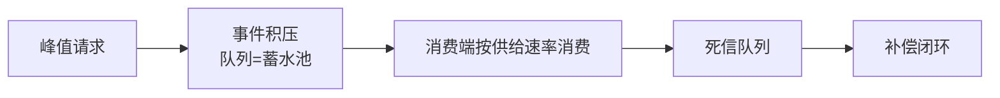
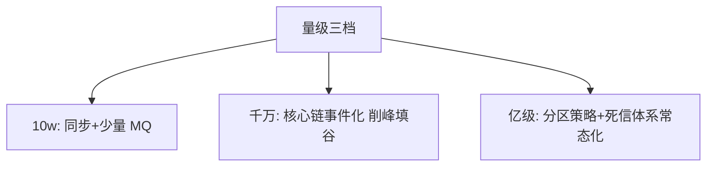
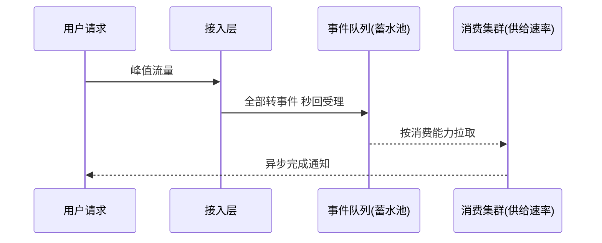
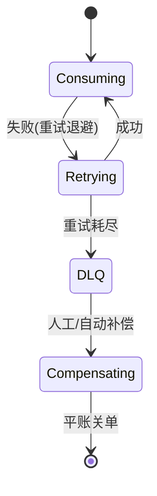

# EDA 亿级实战

> 事件驱动在亿级流量下的实战专题：削峰全景、顺序策略、死信与补偿体系。

## 一句话摘要

亿级 EDA 的三大实战命题：削峰（事件化把同步峰值转为异步积水）、顺序（分区有序的边界与热点打散）、死信（消费失败的兜底与补偿闭环）——每题给参数、代码与三档形态。

## 篇目规划（L1-L4，ADR-0012 方向=子目录）

| 篇目/层 |
|---|
| 专题篇 1 · 事件驱动的大促削峰全景 |
| 专题篇 2 · 事件顺序与分区策略（热点打散） |
| 专题篇 3 · 死信与补偿体系（DLQ 治理） |
## 篇目状态

| 篇目 | 状态 |
|---|---|
| 全部 3 篇 | ⏳ 待写（按 ADR-0012 工程级） |

**机制定位与取舍**：本方向的每个机制（原理与底层实现）都在篇目里锚定了位置——规划期的取舍是「机制原理优先于操作罗列」，代价是入门读者需要更多耐心，收益是后续每篇的参数与步骤都有原理可归因；架构上各层互为上下游，边界由「机制讲透」与「操作可执行」这条线划分。

## 演进视角

削峰手段的演变：限流拒绝 → 队列蓄水 → 流式反压——取舍始终是「体验（等待/拒绝）与一致（异步补偿）」的平衡，量级越大越依赖异步。

## 📌 数据与事实声明

- 本文件为方向骨架规划（篇目标注 ⏳ 待写 / ✅ 已落地），依据 ADR-0012 工程级深度标准与 4 层架构规范；量级与参数数字均为行业认知量级，落篇时以实测替换。

## 📚 参考资料

- 本仓库 Kafka/RocketMQ 专题、稳定性系列大促保障专题。
